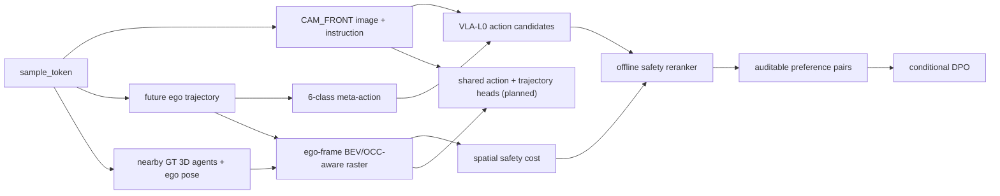

# Safety-Aware VLA for Autonomous Driving with BEV/OCC-aware Spatial Evaluation

> 融合 BEV 占用式空间评估的安全感知自动驾驶 VLA 项目：当前为基于 nuScenes `CAM_FRONT` 的 single-camera、open-loop、6 类 meta-action 路线；训练与 trajectory-level 输出均需在对应 gate 通过后实施。

## Project Overview

本项目保留 VLA 主线：模型从 `CAM_FRONT` image 和 driving instruction 学习可解释的驾驶行为语义；由 nuScenes GT 3D boxes、ego pose 和 future trajectory 派生的 BEV/OCC-aware layer 则负责空间安全评估。它不是纯 BEV/OCC 感知项目，也不是量产级一段式端到端自动驾驶系统。

固定 action schema：

```text
keep
accelerate
decelerate
stop
left_lateral
right_lateral
```

完整路线与 gate 见 [project_mvp_plan.md](project_mvp_plan.md)。

## System Pipeline



每个产物必须可回溯至 `sample_token`、`scene_token`、`split`、`label_rule_version` 与 `safety_rule_version`；空间评估产物还需记录 BEV grid 配置、坐标变换、候选行为与分项 cost。

## Why Meta-Action Remains Necessary

- 将连续 ego trajectory 转为 VLA 可学习、人工可核验的动作语义；
- 使 Phase 0 先成为低风险的 6 类分类问题，并可用 confusion matrix、per-class F1、macro-F1 与 failure cases 诊断；
- 作为 action candidates、safety reranker 和 DPO preference pairs 的稳定比较单位；
- 在后续 trajectory-level VLA 中保留为辅助监督与解释层，而不是最终系统的全部。

直接跳过 meta-action 做连续 trajectory regression 会同时扩大坐标、碰撞评测、数据噪声和可解释性风险。

## BEV/OCC-aware Spatial Evaluation

本项目**不训练完整 BEV occupancy prediction 网络**。BEV/OCC-aware layer 是由 nuScenes GT 3D boxes、ego pose、future trajectory 派生的 occupancy-style ego-frame raster，用于：

- agent occupancy mask 与 vehicle / VRU 类别通道；
- trajectory-vs-occupancy collision check；
- VRU distance / collision risk / 可选 off-road risk；
- action 或 trajectory 的分项 safety cost；
- offline reranking、preference pair construction、可视化和 failure case analysis。

`drivable` / `non-drivable` mask 仅在 map 数据链路实际可核验时加入；否则它是 optional，不作实现或能力声明。

## Phased Roadmap

| Phase | 目标 | Gate |
|---|---|---|
| Phase -1 | 数据闭环、meta-action 与人工审核；不训练模型 | 数据、审核与规则版本可信且冻结 |
| Phase 0 | majority、rule-based、zero/few-shot、LoRA/action adapter 的 6 类 action baseline | 同一 scene-level split 和固定 test 上可复现比较 |
| Phase 1 | GT-derived BEV/OCC-aware spatial safety layer | 分项 safety cost、坐标与对象可审计 |
| Phase 2 | offline reranker、preference pairs；DPO 为条件里程碑 | 同一 candidate set 风险对照和 pair audit 通过 |
| Phase 3 | shared VLM backbone 的 action head + K-waypoint trajectory head | 真实实现并验证 trajectory 与 safety 评测 |
| Phase 4 | multi-camera、map/lane topology、temporal context、BEV/OCC 预训练模型复现 | optional/stretch，不阻塞 MVP |

Phase 0 的固定顺序为：冻结数据与 `label_rule_version` → scene-level split → manifest audit → majority → rule-based → zero-shot/few-shot prompt → LoRA/action adapter → 完整分类与 failure case 报告。该阶段不直接做 DPO，也不直接做 trajectory training。

## Evaluation Protocol

Action prediction 必须报告 macro-F1、per-class F1、confusion matrix、class distribution、invalid output rate 与 action parsing success rate；accuracy 仅为辅助指标。

空间安全与 reranker 必须报告 collision / near-collision、VRU violation、off-road risk（若 map 可用）、infeasibility、harsh action / jerk、`unnecessary_stop` 和分项 penalty。reranker 只能在相同 candidate set 上比较；仅靠增加 `stop` 得到的风险下降不能视为安全能力提升。

只有数据质量、action baseline、BEV/OCC-aware scorer 和 preference pairs 全部通过验收，才考虑 DPO；若 DPO 不优于 reranker，保留 reranker 作为当前 MVP 结果，不预设 GRPO 或闭环 RL。

## Data and Versioning

原始 nuScenes、处理后数据、模型权重、checkpoint、训练日志、缓存和本地 `.env` 不进入 Git。每条样本至少保留：

```text
sample_token
scene_token
timestamp
cam_front_path
future_ego_trajectory
nearby_agents
meta_action
label_rule_version
safety_rule_version
split
```

数据划分按 scene 完成；few-shot examples 不得来自 test scene；规则或阈值变化后必须提升相应版本并重新生成受影响 manifest。`uncertain` 样本单独记录，不能计作正确标签或高置信度 training/preference 数据。

## Current Status

当前处于 **Phase -1 数据闭环与标签核验**。已完成 `CAM_FRONT`、future ego trajectory、nearby 3D agents、one-page visualization、meta-action 派生与 108 个样本的人工审核；剩余 `keep` / speed-change 和 `stop` / `keep` 规则边界仍需修订并冻结，因此 Phase 0、训练、DPO 和 trajectory-level 模型均未启动。

## Limitations

- 当前是 single-camera、open-loop 路线，不代表闭环驾驶或车辆控制能力；
- BEV/OCC-aware layer 是 GT-derived spatial evaluator，不是训练完成的 occupancy perception network；
- meta-action 是必要的语义层，不等价于连续 trajectory planning；
- waypoint-level VLA 是 Phase 3 planned upgrade，须在实际实现和验证后才报告；
- 不宣称 real-time、CARLA、实车、量产部署或完整端到端自动驾驶能力。

## Interview / Portfolio Summary

> 构建基于 nuScenes 的 Safety-Aware VLA 数据闭环，融合 CAM_FRONT、ego future trajectory 与 nearby 3D agents，派生 6 类可审计 meta-action 标签；进一步构建 BEV/OCC-aware 空间安全评估层，用于碰撞检测、VRU 风险评估、trajectory safety cost、offline reranking 与 preference pair 构造，并规划扩展至 waypoint-level trajectory prediction。

简历只保留有代码、配置和实验支撑的完成项；当前尚未实现的 BEV/OCC-aware layer、reranker、DPO 或 trajectory head 必须标为 planned，而不能写作已完成。

## License and Data

本仓库尚未声明代码许可证。nuScenes 数据受其原始许可约束，不随本仓库分发；使用者需自行申请、下载并遵守对应条款。
