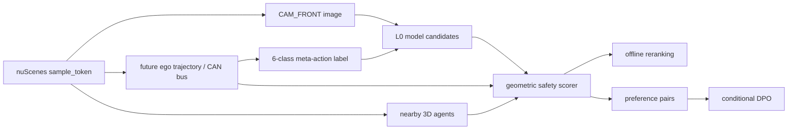

# Safety-Aware Meta-Action VLA for Autonomous Driving

> 基于 nuScenes `CAM_FRONT` 的单相机、开环、6 类驾驶 meta-action MVP。当前仓库处于项目初始化与规划阶段，尚无训练结果。

## Project Overview

本项目目标是在单卡环境中构建一个可复现、可评测、可展示的 Safety-Aware Meta-Action VLA 原型。

**输入**

- nuScenes `CAM_FRONT` image；
- driving instruction，例如：`You are the driving agent. What should the ego vehicle do next?`

**输出**

```text
keep
accelerate
decelerate
stop
left_lateral
right_lateral
```

项目不止做一次 VLM 分类，而是将以下环节串成可追溯、可审计的闭环：

```text
action label derivation
→ L0 action prediction
→ geometric safety scoring
→ offline reranking
→ auditable preference construction
→ conditional DPO
```

第一版严格限定为 **open-loop、single-camera、discrete meta-action MVP**。项目完整执行方案见 [`project_mvp_plan.md`](project_mvp_plan.md)。

## Motivation

### 为什么先做 meta-action，而不是 continuous waypoint？

离散 meta-action 将第一版问题收敛为可解释的分类任务，能够先验证数据对齐、标签质量、视觉输入价值和 safety 评测闭环。Continuous waypoint 还需要处理坐标系、future waypoint、trajectory regression、map constraints 和碰撞评测，会显著扩大首版风险。

第一版使用 `left_lateral` / `right_lateral`，不使用 `turn_left` / `turn_right`。单帧前视图和 ego motion 难以稳定区分转弯与变道，只有后续接入 map、lane topology 或 route command 后才进一步拆分类别。

### 为什么先做数据闭环和 safety scorer？

项目的首要风险是 `sample_token`、图像、future ego trajectory、CAN bus、3D agents、坐标系和时间窗口没有正确对齐。若这些输入不可信，LoRA、DPO 或 GRPO 只会放大标签和评测错误。因此 Phase -1 必须先完成可视化与人工抽检，在验收前不启动批量训练。

Safety scorer 同样先于 preference training 验证。只有 scorer 能在相同 candidate set 上给出可解释且稳定的排序，才有依据构造 preference pairs；否则 DPO 只是在学习未经验证的启发式偏差。

### 为什么同时报告 safety violation 与 `unnecessary_stop`？

若只惩罚 collision 或 near miss，模型可能通过始终输出 `stop` 降低 violation rate。这是 reward hacking，不是更好的驾驶决策。因此 safety 结论必须同时报告：

- VRU violation rate；
- near-collision rate；
- unnecessary stop rate；
- action macro-F1。

Reranker 的安全改善不能以明显增加 `unnecessary_stop` 为代价。

### 为什么 accuracy 不够？

驾驶动作类别可能高度不均衡。Majority baseline 可以获得较高 accuracy，却完全无法识别稀有动作。所有 action prediction 实验必须同时报告 macro-F1、per-class F1、confusion matrix 和 class distribution。

## MVP Scope

| Included | Not included |
|---|---|
| nuScenes `CAM_FRONT` | CARLA closed-loop |
| 6-class discrete meta-action | real vehicle control |
| scene-level train/validation/test split | continuous waypoint planning |
| majority / rule-based baseline | multi-camera fusion |
| zero-shot / few-shot prompt baseline | LiDAR input |
| LoRA / action adapter L0 baseline | map / lane topology |
| geometric safety scorer | full-scale DriveLM / NuInstruct SFT as startup item |
| offline safety reranker | unverified FP8、latency、VRAM 或 real-time claims |
| auditable preference pair construction | 未通过 reranker gate 时直接 DPO / GRPO |
| optional lightweight DPO after reranker gate | closed-loop safety 或部署能力承诺 |

## System Pipeline



Pipeline 中每个中间产物都必须能够回溯到原始 `sample_token`、规则版本和数据 split。

## Repository Structure

以下是计划中的目录结构。尚未实现的目录不会为了占位而提前创建。

```text
.
├── README.md
├── AGENTS.md
├── project_mvp_plan.md
├── configs/               # 数据、action、safety 与训练 YAML 配置
├── data/                  # 数据检查、标签派生、manifest 与质检脚本
├── src/
│   ├── baselines/         # majority、rule-based、prompt baselines
│   ├── actions/           # action schema 与短时 action rollout
│   ├── safety/            # geometric scorer 与 offline reranker
│   ├── training/          # L0 与条件式 DPO 训练入口
│   └── evaluation/        # action/safety 指标与失败案例分析
├── tests/                 # 核心模块的最小单元测试
├── demo/                  # 单样本可视化与交互式展示
├── reports/               # 数据统计、实验结果、消融与失败案例
└── assets/                # 可提交的小型文档图片与示意图
```

## Data and Versioning

原始 nuScenes、处理后数据、模型权重、checkpoint、训练日志和本地缓存不进入 Git。具体忽略规则见 [`.gitignore`](.gitignore)。

## Dataset Setup: nuScenes mini

当前 MVP 只使用 nuScenes mini 跑通数据闭环，不下载完整 trainval。下载并解压数据：

```bash
bash scripts/download_nuscenes_mini.sh
```

安装 nuScenes devkit：

```bash
pip install nuscenes-devkit
```

验证数据集：

```bash
python scripts/check_nuscenes_mini.py
```

本地 `data/` 目录已被 `.gitignore` 忽略，数据归档和解压内容不能提交到 GitHub。nuScenes mini 用于跑通自动驾驶多模态数据读取，包括 camera、LiDAR、ego pose、sample 和 annotation，并为后续离散驾驶动作标签构造做准备。

每条训练或评测样本至少保留：

```text
sample_token
scene_token
timestamp
cam_front_path
future_ego_trajectory
meta_action
nearby_agents
label_rule_version
safety_rule_version
split
```

必须遵守：

- 以 scene 为单位切分 train/validation/test，禁止相邻帧跨 split；
- `label_rule_version` 与 `safety_rule_version` 必须写入 manifest；
- action 或 safety 阈值变化后重新生成受影响数据；
- 不得静默混用不同规则版本；
- `uncertain` 样本单独记录，不强行算作正确标签；
- `cam_front_path` 使用相对数据根目录的路径，不写入个人机器绝对路径。

## Evaluation Protocol

### Action prediction

所有模型与 baseline 使用固定 test split，至少报告：

- macro-F1（主指标）；
- per-class F1；
- confusion matrix；
- class distribution；
- accuracy（辅助指标）；
- invalid output rate；
- action parsing success rate。

### Safety evaluation

Geometric safety scorer 需要分别输出：

- collision / near-collision；
- VRU violation rate；
- unnecessary stop rate；
- infeasibility；
- harsh action / jerk；
- 各 safety term 的原始测量值、penalty 和触发依据。

Reranker 必须在相同 candidate set 上比较前后结果。只有风险指标改善且未通过过量 `stop` 获得虚假收益，才能通过 reranker gate。

DPO 不是默认执行项。只有 reranker 验收通过、preference pairs 经过抽检且规则版本冻结后，才进行轻量 DPO，并比较：

- L0；
- L0 + safety reranker；
- DPO without safety terms；
- DPO with full safety terms。

若 DPO 不优于 reranker，则保留 reranker 作为 MVP 最终方案。

## Project Phases

| Phase / Week | 核心任务 | Go gate | No-Go 动作 |
|---|---|---|---|
| Phase -1 / Week 1 | 对齐 `sample_token`、图像、future trajectory、nearby agents，并完成 one-page visualization | 坐标系、时间顺序和单位通过可视化核验 | 修复数据链路，不训练 |
| Week 2 | 100 样本人工抽检；修正规则；完成 majority / rule-based baseline | 系统性标签错误已处理，规则版本可冻结 | 修改规则并重新生成 manifest |
| Week 3 | MLLM zero-shot / few-shot prompt baseline | 输出 schema 稳定，能与传统 baseline 公平比较 | 修 prompt、解析或评测协议 |
| Phase 0 / Week 4 | L0 LoRA / action adapter | 训练和评测可复现，完整报告分类指标 | 保留最佳 baseline，先做误差诊断 |
| Week 5 | Safety scorer、offline reranker 与 safety term ablation | 风险下降且 `unnecessary_stop` 未明显恶化 | 修 scorer，停止 preference training |
| Phase 1 / Week 6 | Preference pair audit；条件式轻量 DPO 或负结果分析 | Pair 可靠且 DPO 有完整对照 | 以 reranker 为最终方案 |

## Reproducibility

仓库后续将按模块补充以下运行入口：

- environment setup；
- data inspection；
- manifest building；
- meta-action derivation；
- label verification；
- majority / rule-based evaluation；
- zero-shot / few-shot evaluation；
- L0 training；
- safety scoring；
- offline reranking；
- DPO pair construction；
- conditional DPO。

当前脚本尚未实现，因此本 README 不提供虚构命令。命令会随对应脚本落地，并同时注明：

- 输入与输出路径；
- 配置文件；
- 软件与 checkpoint 版本；
- 随机种子；
- 预期产物；
- 验证方式。

## Current Status

当前处于 **project initialization / planning stage**：

- [x] 明确 MVP 范围、阶段门槛和 6 周执行计划；
- [x] 建立 Git 忽略规则；
- [ ] 完成数据闭环；
- [ ] 完成 100 样本人工抽检；
- [ ] 完成 L0 baselines；
- [ ] 完成 safety scorer / reranker；
- [ ] 决定是否进入 DPO。

下一条工程任务是实现并验证：

```text
sample_token
→ CAM_FRONT image
→ future ego trajectory
→ nearby 3D agents
→ one-page visualization
```

该链路验证前，不启动 LoRA、DPO 或 GRPO。

## Limitations

- 第一版只做 open-loop evaluation，不代表闭环驾驶能力；
- 单帧 `CAM_FRONT` 难以稳定区分 turn 与 lane change，因此首版只预测 lateral action；
- Geometric safety scorer 是启发式、可解释的离线评分器，不是闭环规划器；
- Action rollout 只用于候选动作相对比较，不代表真实车辆动力学；
- 项目不宣称 real-time、closed-loop safety、CARLA、实车或 autonomous driving deployment 能力；
- Qwen3-VL 的视觉 token、FP8、显存和 latency 只有在锁定 checkpoint 与软件版本并完成本机实测后才报告。

## Interview / Portfolio Summary

本项目计划基于 nuScenes 构建从 `CAM_FRONT` 到 6 类驾驶 meta-action 的 VLA MVP：先从 ego trajectory / CAN bus 派生并质检版本化动作标签，再建立 majority、rule-based、zero-shot、few-shot 与 LoRA/action adapter baseline；随后设计可审计的 geometric safety scorer，验证 offline reranking，并仅在 gate 通过后构造 preference pairs 和尝试轻量 DPO。当前项目处于初始化阶段，上述模型训练、safety 改善和 DPO 结果均为 planned work，不作为已完成成果陈述。

## License and Data

本仓库尚未声明代码许可证。nuScenes 数据受其原始许可约束，不随本仓库分发；使用者需自行申请、下载并遵守对应条款。
