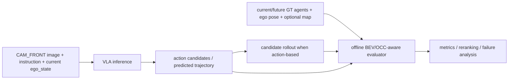

# Safety-Aware VLA for Autonomous Driving with BEV/OCC-aware Spatial Evaluation

基于 nuScenes 的安全感知自动驾驶 VLA 路线：当前完成数据闭环与 meta-action 审核，后续计划以 GT-derived BEV/OCC-aware evaluator 支持离线安全评估；项目仍是 single-camera、open-loop 起步，不是完整 occupancy prediction、闭环控制或量产系统。

## Current Status

### Completed

- `CAM_FRONT`、future ego trajectory 与 nearby 3D agents 对齐和单样本 one-page visualization；
- 6 类 meta-action derivation；
- 108 个样本的人工审核与 6 类 action 覆盖；
- 现有数据检查、审核、环境检查与 workspace cleanup 脚本及对应测试。

### Planned

- Phase 0 action baselines；
- GT-derived BEV/OCC-aware temporal safety evaluator；
- offline reranker、preference pairs 与 conditional DPO；
- shared action/trajectory head、optional pretrained BEV/OCC reproduction and other Phase 4 enhancements。

当前仍在 Phase -1 gate：`keep` / speed-change 与 `stop` / `keep` 的标签边界需要修订并冻结；未进入 Phase 0，未训练模型。

## Inference and Safety Boundaries

Inference inputs 仅为 `CAM_FRONT` image、driving instruction 与 current `ego_state`（当前速度、加速度、yaw rate 等）；future ego trajectory、GT meta-action、GT BEV/OCC raster 与未来 GT agents 不进入模型推理。

GT meta-action 与 GT future trajectory 是训练 target；current/future GT agent boxes、ego pose 与 optional map 仅进入离线 BEV/OCC-aware evaluator。collision check 比较 candidate ego rollout 或 predicted trajectory 与 temporal occupancy，不能以 GT ego trajectory 替代预测候选行为。



完整信息合同、temporal `occupancy[T,C,H,W]`、阶段 gate 和 loss 边界见 [project_mvp_plan.md](project_mvp_plan.md)。

## Why Meta-Action

固定 schema：`keep`、`accelerate`、`decelerate`、`stop`、`left_lateral`、`right_lateral`。它将连续轨迹转为可学习、可人工审核的动作语义，让 Phase 0 可先用分类指标和 failure cases 控制风险；在 Phase 3 中它是 trajectory head 的辅助监督，而不是固定轨迹模板的硬前置。

## Quickstart: Existing Commands

以下均为当前仓库已有命令；验证时使用 `codex4vla_env`：

```bash
conda run -n codex4vla_env python scripts/check_env.py
conda run -n codex4vla_env pytest tests/test_check_env.py tests/test_clean_workspace.py tests/test_inspect_nuscenes_sample.py tests/test_verify_labels.py tests/test_meta_action.py tests/test_phase_1_7_manual_audit.py
conda run -n codex4vla_env python scripts/clean_workspace.py
```

`clean_workspace.py` 默认仅输出 dry-run 候选，不删除文件。项目当前不提供 baseline、reranker、DPO 或 trajectory training 命令，因为它们尚未实现。

## Repository Entry Points

- [project_mvp_plan.md](project_mvp_plan.md)：阶段输入/输出、gate、评测表、风险与信息边界；
- [docs/progress.md](docs/progress.md)：已确认的事实、稳定 CLI、字段约定与 pending items；
- [AGENTS.md](AGENTS.md)：任务边界、固定 schema、阶段顺序和禁止事项；
- `data/inspect_nuscenes_sample.py`、`data/derive_meta_action.py`、`data/verify_labels.py`：当前数据闭环入口。

## Evaluation and Scope

Phase 0 必须比较 majority、current ego-state rule、image-only VLM、image + current ego-state VLM 和 LoRA/action adapter，并报告 macro-F1、per-class F1、confusion matrix、class distribution、invalid output rate 与 failure cases。Phase 1 之后才评估 temporal occupancy collision/near-miss、VRU、optional off-road、`unnecessary_stop` 与 reranking；DPO 只在数据、scorer 与 pair audit 通过后评估。

BEV/OCC-aware layer 是 planned GT-derived evaluator，不是已完成的 occupancy network；若 future occupancy 使用 static 或 constant-velocity fallback，必须记录 `motion_assumption`，且不得称为真实 future occupancy prediction。当前不声称 CARLA、实车、real-time、闭环驾驶或 trajectory-level 结果。

## Honest Portfolio Statement

当前可写：基于 nuScenes 完成 `CAM_FRONT`、future ego trajectory 与 nearby 3D agents 对齐，派生 6 类可审计 meta-action，并完成 108 样本人工审核。BEV/OCC-aware safety evaluator、reranker、DPO、trajectory head 与 occupancy prediction 均为 planned，直至有真实代码、配置和可核查结果。

## Data

nuScenes 数据受其原始许可约束，不随本仓库分发；原始/派生数据、模型权重、日志、缓存和 secrets 不进入 Git。
