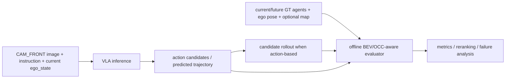

# Safety-Aware VLA for Autonomous Driving with BEV/OCC-aware Spatial Evaluation

基于 nuScenes 的安全感知自动驾驶 VLA 路线：当前以 single-camera、open-loop 的 6 类 coarse meta-action 建立可审计 MVP，长期扩展为 coarse-to-fine、共享多模态 backbone 的多任务 VLA。GT-derived BEV/OCC-aware evaluator 仍是后续离线空间评估层；项目不是完整 occupancy prediction、闭环控制或量产系统。

## Current Status

### Completed

- `CAM_FRONT`、future ego trajectory 与 nearby 3D agents 对齐和单样本 one-page visualization；
- 6 类 meta-action v0.2 derivation 与冻结；
- 108 个样本的人工审核、6 类 action 覆盖和 real-data freeze audit（108/108）；
- 现有数据检查、审核、环境检查与 workspace cleanup 脚本及对应测试。

### Planned

- Phase 0.1 manifest 协议、scene-level split 与 Majority Baseline；
- Phase 0.1b 从 nuScenes mini 扩展至 trainval，并生成正式 dataset manifest v1；
- coarse action 的 rule-based、zero-shot / few-shot 与 LoRA / action adapter baselines；
- GT-derived BEV/OCC-aware temporal safety evaluator、offline reranker 与可选 coarse-action DPO；
- short temporal input、map / route、fine-grained maneuver、continuous waypoint、optional BEV/OCC auxiliary 与闭环或 quasi-closed-loop evaluation。

Phase -1 label freeze gate 已通过，meta-action v0.2 已 frozen；Phase 0.1 ready but not started，尚未实现 baseline 或训练模型。

## Inference and Safety Boundaries

Inference inputs 仅为 `CAM_FRONT` image、driving instruction 与 current `ego_state`（当前速度、加速度、yaw rate 等）；future ego trajectory、GT meta-action、GT BEV/OCC raster 与未来 GT agents 不进入模型推理。

GT meta-action 与 GT future trajectory 是训练 target；current/future GT agent boxes、ego pose 与 optional map 仅进入离线 BEV/OCC-aware evaluator。collision check 比较 candidate ego rollout 或 predicted trajectory 与 temporal occupancy，不能以 GT ego trajectory 替代预测候选行为。



完整信息合同、temporal `occupancy[T,C,H,W]`、阶段 gate 和 loss 边界见 [project_mvp_plan.md](project_mvp_plan.md)。

## Why Coarse Meta-Action

当前固定 coarse schema：`keep`、`accelerate`、`decelerate`、`stop`、`left_lateral`、`right_lateral`。它将连续轨迹转为可学习、可人工审核的行为语义，作为当前 MVP 的 coarse target、可解释输出、辅助监督和长期 baseline，而不是最终固定动作空间。

`left_lateral` / `right_lateral` 仅表示未来轨迹中稳定的左右横向运动；当前版本不区分 lane change、turn、follow-road-curve 或横向运动原因，因此不得解释为左/右变道或左/右转。只有接入 map、lane topology、intersection topology、route command 或 short temporal context 的至少一部分后，才会新增并重新审核 fine-grained maneuver labels。

长期模型采用共享多模态 backbone 加多任务 head：coarse meta-action、longitudinal action、lateral direction、maneuver type、continuous waypoint，以及 optional BEV / occupancy auxiliary。当前只实现 coarse meta-action head；其他 head 均为 planned。真实驾驶行为可组合（如左转+减速），因此长期路线采用层级/多头表示，不把 6 类直接硬改成更多互斥类别。

## Quickstart: Existing Commands

以下均为当前仓库已有命令；验证时使用 `codex4vla_env`：

```bash
conda run -n codex4vla_env python scripts/check_env.py
conda run -n codex4vla_env pytest tests/test_check_env.py tests/test_clean_workspace.py tests/test_inspect_nuscenes_sample.py tests/test_verify_labels.py tests/test_meta_action.py tests/test_phase_1_7_manual_audit.py
conda run -n codex4vla_env python data/validate_label_freeze.py --dataroot data/nuscenes
conda run -n codex4vla_env python scripts/clean_workspace.py
```

`clean_workspace.py` 默认仅输出 dry-run 候选，不删除文件。项目当前不提供 baseline、reranker、DPO 或 trajectory training 命令，因为它们尚未实现。

## Repository Entry Points

- [project_mvp_plan.md](project_mvp_plan.md)：阶段输入/输出、gate、评测表、风险与信息边界；
- [docs/progress.md](docs/progress.md)：已确认的事实、稳定 CLI、字段约定与 pending items；
- [AGENTS.md](AGENTS.md)：任务边界、固定 schema、阶段顺序和禁止事项；
- `data/inspect_nuscenes_sample.py`、`data/derive_meta_action.py`、`data/verify_labels.py`：当前数据闭环入口。

## Roadmap and Scope

当前顺序为：Phase -1 数据闭环与 coarse 标签冻结 → Phase 0.1 manifest 协议、scene-level split 与 Majority Baseline → Phase 0.1b trainval scale-up → Phase 0.2 ego-motion rule baseline → Phase 0.3 Qwen3-VL zero-shot / few-shot → Phase 0.4 coarse LoRA / action adapter → Phase 0.5 geometric safety scorer 与 offline reranker → Phase 0.6 可选 coarse-action DPO。mini 只用于数据链路 smoke test、快速回归、人工审核和小规模调试；正式 LoRA、action adapter 与 DPO 必须基于 trainval manifest，mini 上仅允许 smoke run。

后续扩展为：short temporal input → map / route / lane topology → hierarchical fine-grained maneuver → continuous waypoint head → BEV / occupancy auxiliary supervision → closed-loop or quasi-closed-loop evaluation。Phase 0 的 action experiments 仍须报告 macro-F1、per-class F1、confusion matrix、class distribution、invalid output rate 与 failure cases；safety 结果同时监控 collision/near-miss、VRU、`unnecessary_stop` 与 macro-F1。

DPO 是第一版 MVP 的可选终点，而不是整个项目的最终终点：只有输出协议稳定、trainval 数据完成、scorer 与 reranker gate、preference pair audit 均通过后才进入。若动作空间扩展为 fine maneuver 或 continuous waypoint，preference pairs 需要重建；coarse checkpoint 可作为初始化或对照，旧分类 head 不保证直接适用于新 target。

BEV/OCC-aware layer 是 planned GT-derived evaluator，不是已完成的 occupancy network；若 future occupancy 使用 static 或 constant-velocity fallback，必须记录 `motion_assumption`，且不得称为真实 future occupancy prediction。当前不声称 CARLA、实车、real-time、闭环驾驶或 trajectory-level 结果。

## Honest Portfolio Statement

当前可写：基于 nuScenes 完成 `CAM_FRONT`、future ego trajectory 与 nearby 3D agents 对齐，派生 6 类可审计 meta-action，并完成 108 样本人工审核。BEV/OCC-aware safety evaluator、reranker、DPO、trajectory head 与 occupancy prediction 均为 planned，直至有真实代码、配置和可核查结果。

## Data

nuScenes 数据受其原始许可约束，不随本仓库分发；原始/派生数据、模型权重、日志、缓存和 secrets 不进入 Git。
