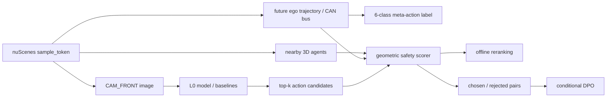

# 面向自动驾驶场景的 Safety-Aware Meta-Action VLA：6 周 MVP 项目计划

> **For agentic workers:** REQUIRED SUB-SKILL: 使用 `superpowers:executing-plans` 按阶段门控执行；未经用户明确要求，不启用 subagent。

**Goal：** 在单卡环境中完成可复现、可评测、可展示的 Safety-Aware Meta-Action VLA MVP。

**Architecture：** 以 nuScenes `CAM_FRONT` 为视觉输入，先建立可追溯的 meta-action 数据闭环，再依次构建 L0 baseline、几何 safety scorer、offline reranker 和条件式 DPO。每个阶段通过验收门槛后才能进入下一阶段。

**Tech Stack：** Python、PyTorch、nuScenes devkit、Qwen3-VL/LLaVA-style MLLM、LoRA/action adapter、DPO（均以实施时锁定的实际版本为准）。

---

> **执行原则**：先数据闭环，再训练；先 VLA-L0，再 preference learning；先证明 safety scorer 与 reranker 有效，再考虑 DPO / GRPO。

## 1. 项目启动版结论

原规划的长期方向不推翻，但第一版必须降维启动：不从全量 DriveLM / NuInstruct SFT 开始，也不直接做 DPO、GRPO 或连续 waypoint。

第一版最小可交付目标是：

> 给定 nuScenes `CAM_FRONT` 图像和驾驶指令，模型输出 6 类驾驶 meta-action；基于 future ego trajectory 与 nearby 3D agents 构建几何 safety scorer，用于离线评估、action reranking 和高置信度 preference pair 构造。

6 类动作固定为：

```text
keep
accelerate
decelerate
stop
left_lateral
right_lateral
```

第一版不使用 `turn_left` / `turn_right`。仅凭单帧前视图和 ego motion，难以稳定区分转弯与变道；只有接入 map、lane topology 和 route command 后，才扩展为：

```text
left_lane_change
right_lane_change
left_turn
right_turn
```

### 1.1 第一版核心贡献

项目区分度不在训练框架，而在以下四项自建工作：

1. 从 nuScenes ego trajectory / CAN bus 派生 6 类 meta-action 标签，并通过轨迹与动作投影进行人工质检；
2. 从 3D boxes 和开环 action rollout 构造 `collision_or_near_miss`、`vru_distance_violation`、`infeasibility`、`unnecessary_stop` 和 `harsh_action_or_jerk`；
3. 将 safety score 用于 action reranking，并构造满足 margin 条件的 safety-aware preference pairs；
4. 用消融证明 safety scorer / preference 是否降低 VRU violation，同时监控 `unnecessary_stop`，避免模型退化为“永远停车”。

训练框架、LoRA 和公开数据是工具；项目需要证明的是“喂什么数据、优化什么目标、如何验证有效”。

### 1.2 第一版范围边界

| 维度 | 第一版包含 | 第一版不包含 |
|---|---|---|
| 传感器 | nuScenes `CAM_FRONT` | 多相机融合、LiDAR 输入 |
| 决策形式 | 6 类离散 meta-action | 连续 waypoint、控制量回归 |
| 评测形式 | 离线、开环 | CARLA 闭环、实车 |
| 数据规模 | mini 跑通后再扩展 trainval | 一开始清洗 80–120K QA |
| 模型路线 | prompt baseline → 小样本 LoRA/action adapter | 一开始重训练大模型 |
| 安全优化 | scorer → reranker → 条件式 DPO | 未验证 scorer 时直接 RL |
| 性能结论 | 本机实测结果 | 未核验的 token、FP8、显存或延迟结论 |

### 1.3 MVP 成功标准

MVP 完成不等于“模型达到某个预设高分”，而是同时满足：

- 数据闭环可追溯：任意 `sample_token` 可定位图像、future ego trajectory、action label 与 nearby agents；
- 标签质量可核查：至少 100 个样本有人工抽检记录和错误分类；
- baseline 完整：majority、rule-based、zero-shot、few-shot、LoRA/action adapter 至少完成到可比较阶段；
- 评测不掩盖类别不平衡：报告 macro-F1、per-class F1、confusion matrix 和 class distribution；
- safety scorer 可解释：每项 penalty 可单独输出，并能定位触发对象和触发原因；
- reranker 有证据：安全指标改善不能以 `unnecessary_stop` 明显恶化为代价；
- preference 数据可审计：每个 pair 保留 chosen/rejected 分数、margin 和 violation 明细；
- 项目可展示：README、实验表、失败案例和可视化 demo 能复现核心结论。

---

## 2. 最小系统与数据流



每条训练或评测样本至少保留以下可追溯字段：

```text
sample_token
scene_token
timestamp
cam_front_path
ego_state
future_ego_trajectory
meta_action
nearby_agents
label_rule_version
safety_rule_version
split
```

`label_rule_version` 与 `safety_rule_version` 必须进入产物元数据。阈值调整后重新生成的数据不能与旧版本静默混用。

---

## 3. 推荐工程结构

```text
codex4vla/
├── .gitignore
├── README.md
├── project_mvp_plan.md
├── configs/
│   ├── data.yaml
│   ├── action_rules.yaml
│   ├── safety_rules.yaml
│   └── train_l0.yaml
├── data/
│   ├── inspect_nuscenes_sample.py
│   ├── derive_meta_action.py
│   ├── evaluate_action.py
│   ├── verify_labels.py
│   ├── build_manifest.py
│   ├── build_dpo_pairs.py
│   └── data_debug_report.md
├── src/
│   ├── baselines/
│   │   ├── majority.py
│   │   ├── rule_based.py
│   │   └── prompt_baseline.py
│   ├── actions/
│   │   ├── schema.py
│   │   └── rollout.py
│   ├── safety/
│   │   ├── scorer.py
│   │   └── reranker.py
│   ├── training/
│   │   ├── train_l0.py
│   │   └── train_dpo.py
│   └── evaluation/
│       ├── evaluate_l0.py
│       ├── evaluate_safety.py
│       └── failure_cases.py
├── tests/
│   ├── test_meta_action.py
│   ├── test_action_rollout.py
│   ├── test_safety_scorer.py
│   ├── test_reranker.py
│   └── test_dpo_pairs.py
├── demo/
│   └── app.py
└── reports/
    ├── data_statistics.md
    ├── l0_results.md
    ├── safety_ablation.md
    ├── failure_cases.md
    └── efficiency.md
```

本地数据、模型权重和生成产物由 `.gitignore` 排除；代码、配置、测试、人工抽检记录和结论性报告必须纳入版本控制。

---

## 4. Phase -1：数据闭环验证，不训练模型

### 4.1 目标

在 nuScenes mini 上跑通以下闭环：

```text
sample_token
→ CAM_FRONT image
→ future ego trajectory
→ 6-class meta-action
→ nearby 3D agents
→ candidate action rollout
→ safety score
→ visualization and manual review
```

在本阶段验收前，不启动 LoRA、DPO 或 GRPO。第一版的主要风险来自坐标系、时间对齐、标签规则和安全规则，而不是训练命令。

### 4.2 输入

- nuScenes mini；
- CAN bus expansion（是否覆盖所需 scene，需在本地数据上核验）；
- `sample_token`、`sample_data`、ego pose、calibrated sensor 与 annotation；
- meta-action 和 safety 规则配置。

### 4.3 输出

- `sample_token → CAM_FRONT image` 映射；
- 固定 horizon 的 future ego trajectory；
- 6 类 meta-action label；
- ego 坐标系下的 nearby 3D agents；
- 每个 candidate action 的分项 safety score；
- 轨迹、动作、agent 和 violation 可视化；
- 至少 100 个样本的人工抽检记录；
- action distribution 与基础运动学统计。

### 4.4 脚本职责

| 脚本 | 单一职责 | 核心输出 |
|---|---|---|
| `data/inspect_nuscenes_sample.py` | 展示单个 sample 的原始数据对齐关系 | 图像、ego pose、future trajectory、3D agents |
| `data/derive_meta_action.py` | future ego trajectory / CAN bus → meta-action | 标签、规则版本、派生特征 |
| `data/evaluate_action.py` | candidate action → rollout → safety score | 总分、分项 penalty、触发对象 |
| `data/verify_labels.py` | 将轨迹、动作和 agent 投影或叠加可视化 | 抽检图与结构化审核记录 |
| `data/build_manifest.py` | 汇总可训练、可评测的样本 manifest | JSONL/Parquet manifest |
| `data/data_debug_report.md` | 记录抽检、错误类型、规则变更 | 可审计的质检证据 |

### 4.5 Meta-action 派生原则

先从 future window 提取纵向位移、横向位移、速度变化、停止持续时间、yaw 变化等特征，再按配置化阈值映射动作。禁止把一帧瞬时噪声直接作为标签。

建议的判定优先级是：

1. `stop`：未来窗口持续低速，且位移低于阈值；
2. `left_lateral` / `right_lateral`：ego 坐标系下横向位移稳定超过阈值；
3. `accelerate` / `decelerate`：速度变化超过阈值；
4. `keep`：其余稳定行驶样本。

这里的优先级和阈值是待验证规则，不是数据集事实。需要通过类别分布、可视化抽检和阈值敏感性分析确定。

### 4.6 人工抽检协议

抽检集至少 100 个样本，并覆盖：

- 每个动作类别；
- 有/无 VRU；
- 低速、停车、直行和明显横向运动；
- 白天/夜间、拥挤/稀疏等可用场景属性；
- scorer 判为 safe/unsafe 的样本；
- 规则边界附近样本。

每条抽检记录包含：

```text
sample_token
derived_action
reviewed_action
label_correct: yes/no/uncertain
trajectory_alignment_correct: yes/no
agent_alignment_correct: yes/no
safety_score_reasonable: yes/no/uncertain
error_type
review_note
```

`uncertain` 样本不能强行算作正确，应单独统计并给出二次核验路径。

### 4.7 验收标准

Phase -1 只有满足以下条件才通过：

- 随机 sample 可由 token 稳定定位到 `CAM_FRONT` 图像；
- future trajectory 的时间顺序、坐标系和单位经过可视化核验；
- nearby agents 与 ego 使用统一评测坐标系；
- 100 个样本完成审核，错误类型和规则修订有记录；
- 6 类分布不存在由明显 bug 导致的异常塌缩；
- safety scorer 能输出分项 penalty，而非只有不可解释总分；
- 至少构造并通过单元测试的安全、near-miss、VRU、不可行和 unnecessary stop 合成案例。

### 4.8 失败定位与降级

| 失败现象 | 优先定位 | 降级方式 |
|---|---|---|
| future trajectory 错位 | timestamp、sample 链、坐标变换方向 | 先只用 ego pose 链，不混入 CAN bus |
| lateral 标签大量反转 | ego 坐标轴定义、左/右手系 | 用人工构造轨迹测试坐标约定 |
| 类别严重失衡 | 阈值、判定优先级、窗口长度 | 先合并稀有类做诊断，不立即训练 |
| nearby agents 投影错位 | global/ego/sensor frame 转换 | 先在 BEV 核验，再做前视图投影 |
| scorer 与直觉冲突 | rollout 模型、距离定义、agent 尺寸 | 缩短 horizon，逐项关闭 penalty 排查 |
| mini 缺少必要 CAN 数据 | scene 覆盖与扩展包完整性 | 用 ego pose 差分派生运动，标注数据来源 |

---

## 5. Phase 0：VLA-L0 行为克隆——先做 6 类 meta-action

### 5.1 目标

建立从简单到复杂的完整 baseline 链，证明视觉语言模型是否为 action prediction 提供增益，并识别数据标签、类别不平衡和模型输出格式问题。

### 5.2 输入与输出

```text
Input:
- CAM_FRONT image
- prompt: You are the driving agent. What should the ego vehicle do next?

Output:
- Action: keep / accelerate / decelerate / stop / left_lateral / right_lateral
- Optional reason: one short sentence
```

评测时 action 必须是结构化字段。reason text 不参与主指标，避免把自然语言流畅度与动作正确性混为一谈。

### 5.3 Baseline 顺序

严格按以下顺序执行：

1. Majority class baseline；
2. Rule-based baseline：仅使用可明确获得的当前速度、加速度、yaw rate 等 ego state；
3. Qwen3-VL zero-shot prompt；
4. Qwen3-VL few-shot prompt；
5. LoRA / action adapter 小样本训练；
6. 根据学习曲线决定是否扩展到全量 L0 SFT。

Qwen3-VL 仅代表当前候选底座。其模型配置、图像处理、视觉 token 数、FP8 支持与显存占用必须基于所用 checkpoint 的官方配置和本机实测，不从旧文档直接继承。

### 5.4 数据切分要求

- 按 scene 切分 train/validation/test，禁止相邻帧跨 split；
- 同一 scene 的 prompt 示例不能同时进入 few-shot context 与 test；
- 记录各 split 的 action、VRU 和 safe/unsafe 分布；
- 固定 test split，阈值和 prompt 调整只使用 train/validation；
- 训练样本保留 `label_rule_version`，规则更新后重新生成并记录差异。

### 5.5 评测指标

主指标：

- macro-F1；
- per-class F1；
- confusion matrix；
- class distribution。

辅助指标：

- accuracy；
- invalid output rate；
- action parsing success rate；
- 按 VRU 场景、低速场景和 lateral 场景分组的 macro-F1；
- 典型成功与失败案例可视化。

macro-F1 优先于 accuracy。若 majority class 占比很高，只报告 accuracy 会掩盖稀有动作完全不可用的问题。

### 5.6 脚本

| 脚本 | 作用 |
|---|---|
| `src/baselines/majority.py` | 从 train split 估计多数类，在 test 上评测 |
| `src/baselines/rule_based.py` | 使用 ego-state 特征输出动作 |
| `src/baselines/prompt_baseline.py` | 统一 zero-shot/few-shot prompt、解析和缓存 |
| `src/training/train_l0.py` | 小样本 LoRA/action adapter 与全量 L0 训练入口 |
| `src/evaluation/evaluate_l0.py` | 生成分类指标、confusion matrix 和分组结果 |
| `src/evaluation/failure_cases.py` | 输出可追溯的失败案例索引 |

### 5.7 验收标准

- majority 与 rule-based baseline 可重复运行；
- zero-shot 与 few-shot 使用相同 test split 和输出 schema；
- invalid output 被显式统计，不静默映射为某一动作；
- LoRA/action adapter 至少在固定小样本子集上完成训练与验证；
- 所有方案报告 macro-F1、per-class F1 和 confusion matrix；
- 保存 prompt、checkpoint 标识、图像预处理配置和推理参数；
- 结果可回溯到 sample-level prediction 文件。

### 5.8 失败定位与降级

| 失败现象 | 判断 | 降级或修正 |
|---|---|---|
| majority accuracy 高但 macro-F1 很低 | 类别失衡 | 调整采样/损失权重，保持原分布 test 不变 |
| rule-based 已显著优于视觉模型 | 标签主要由 ego state 决定 | 将其作为强 baseline，重新审视视觉输入价值 |
| zero/few-shot 输出不稳定 | prompt 或解析失败 | 强制结构化 action vocabulary，先不生成 reason |
| LoRA 不优于 prompt baseline | 数据量、噪声或视觉信号不足 | 先做标签误差分析和 learning curve，不扩大训练 |
| lateral 类持续混淆 | 单帧信息不足或标签规则不稳 | 合并诊断、加入短时序作为后续对照，但不改 test 定义 |
| 模型配置超出单卡能力 | checkpoint/分辨率/序列长度不合适 | 降分辨率、缩短序列、减小模型或只训 adapter |

---

## 6. Safety scorer：同时约束风险、模仿与过度保守

### 6.1 总体形式

```text
R = w_imit * imitation
  - w_collision * collision_or_near_miss
  - w_vru * vru_distance_violation
  - w_feas * infeasibility
  - w_lazy * unnecessary_stop
  - w_comfort * harsh_action_or_jerk
```

每项均输出原始测量值、归一化 penalty、权重和触发依据。总分不能替代分项报告。

### 6.2 分项定义

| 项 | 含义 | 最低可核查信息 |
|---|---|---|
| `imitation` | 与 GT meta-action 或 future ego behavior 一致 | GT、candidate、匹配规则 |
| `collision_or_near_miss` | rollout 后与 vehicle/VRU 的几何间距过小 | agent token/type、最小距离、发生时刻 |
| `vru_distance_violation` | 对 pedestrian/cyclist 使用更严格的安全阈值 | VRU 类型、阈值、最小距离 |
| `infeasibility` | 加速度、横向加速度或方向变化超出配置范围 | 违反的运动学量与峰值 |
| `unnecessary_stop` | 场景安全且 GT 正常行驶时错误停车 | GT 行为、前方风险、停车判定 |
| `harsh_action_or_jerk` | 动作导致过激加减速或突变 | acceleration/jerk 序列及峰值 |

阈值与权重必须从以下证据逐步确定：

1. 单位测试中的合成案例；
2. mini 数据分布；
3. 100 样本人工抽检；
4. validation sensitivity analysis；
5. 固定 test 上的最终报告。

不把任意初始阈值写成行业标准或数据集真值。

### 6.3 为什么必须有 `unnecessary_stop`

若只惩罚碰撞和近碰撞，模型可能通过始终输出 `stop` 获得较低 violation rate。这是 reward hacking，不是良好驾驶策略。

因此 safety 结果必须成对报告：

- `VRU violation rate` / `near-collision rate`；
- `unnecessary stop rate`；
- action macro-F1。

只有风险下降且过度保守未不可接受恶化，才能宣称 reranking 方向有效。

### 6.4 Candidate action rollout

第一版使用短 horizon、可解释的规则化 rollout，将 meta-action 映射为有限的纵向/横向运动假设。该 rollout 只用于候选动作相对比较，不冒充真实车辆动力学或闭环规划器。

每种 action 的 rollout 参数放在配置文件中，并通过以下测试约束：

- `keep` 不引入额外横向漂移；
- `accelerate` 的纵向速度单调增加且受上限约束；
- `decelerate` 的速度单调下降且不变为负值；
- `stop` 在 horizon 内降至低速并保持；
- lateral action 的方向与 ego 坐标系定义一致；
- 所有 rollout 输出统一时间步和坐标单位。

---

## 7. Phase 1：Safety-Aware Preference——先 reranking，再 DPO

### 7.1 第一步：offline safety reranking

```text
L0 model 生成 top-k action candidates
→ geometric safety scorer 逐项打分
→ 过滤明显 infeasible actions
→ 在安全与 imitation 偏离之间选择候选
→ 对比 rerank 前后的分类与 safety 指标
```

如果模型接口不能自然返回稳定 top-k，可以先用 6 类动作逐类打分或对每个 action 计算条件 log-probability。候选生成方式必须记录，避免不同实验的 candidate set 不一致。

#### 输入

- 固定 L0 checkpoint；
- 每个样本的 action candidates 与模型分数；
- future ego behavior 与 nearby agents；
- 固定版本的 safety scorer。

#### 输出

- rerank 前后 action；
- 模型分数、safety 总分和分项 penalty；
- VRU violation、near-collision、unnecessary stop 和 macro-F1 对比；
- scorer 误判案例。

#### 脚本

- `src/safety/reranker.py`：候选过滤、加权与决策；
- `src/evaluation/evaluate_safety.py`：统一计算前后指标；
- `reports/safety_ablation.md`：记录配置、结果和结论。

#### 验收标准

- 同一 candidate set 上比较 rerank 前后结果；
- 至少一个风险指标下降；
- `unnecessary_stop` 与 macro-F1 同步报告；
- 对每个变化样本可解释 reranker 为什么改动作；
- safety term 单项关闭实验能够运行；
- scorer 明显误判被纳入失败案例，而非从结果中删除。

#### 失败时降级

若 reranker 不能降低 violation，或主要通过增加 `stop` 降低风险：

1. 不进入 DPO；
2. 检查 rollout、坐标系、agent filtering 和 VRU 阈值；
3. 单独评测每个 penalty 的排序能力；
4. 调整 scorer 后在 validation 重试；
5. 若 scorer 仍不可靠，项目止步于 L0 + scorer 诊断报告，保留负结果。

### 7.2 第二步：构造 DPO preference pairs

```text
prompt   = CAM_FRONT image + driving instruction
chosen   = safety score 更高且不过度偏离 imitation 的动作
rejected = safety score 更低且存在明确 violation 的动作
```

只保留满足以下条件的 pair：

```text
score(chosen) - score(rejected) > margin
```

同时要求：

- chosen/rejected 不相同；
- rejected 至少有一项可解释 violation，或 chosen 在明确安全项上占优；
- pair 不由单一解析错误产生；
- chosen 不是仅凭 `stop` 规避所有风险；
- 保存 scorer 分项、规则版本和 margin。

`margin` 通过 validation 上的 pair 稳定性与人工抽检确定。低 margin、规则冲突和不确定样本进入审核集，不进入训练集。

### 7.3 第三步：条件式 DPO

DPO 是第一版 preference learning 首选，因为已有成对偏好后训练目标直接，且不需要 value network。只有满足以下门槛才启动：

- reranker 通过验收；
- preference pairs 规模和类别覆盖达到可训练水平；
- pair 人工抽检显示 chosen/rejected 方向可靠；
- L0 checkpoint、数据 split 和 scorer 版本被冻结；
- 已定义对照组和停止条件。

GRPO 只在 reward 能稳定排序多个候选、且 DPO 已形成可靠基线后考虑。PPO 不进入第一版，只用于理论比较。

### 7.4 DPO 验收与停止条件

DPO 结果必须与以下方案比较：

- L0 SFT；
- L0 + safety reranker；
- L0 + DPO without safety terms；
- L0 + DPO with full safety terms。

若 DPO 未优于 reranker，或 safety 改善伴随明显 macro-F1 下降 / unnecessary stop 上升，则保留 reranker 作为 MVP 最终方案，不继续堆叠训练。

---

## 8. 条件增强模块与 Stretch Goals

### 8.1 DriveLM / NuInstruct / safety QA SFT

大规模交通 QA SFT 不再作为启动项，只在 L0 跑通后按问题触发：

- 若 L0 action prediction 明显受交通语义理解限制，再引入 DriveLM / NuInstruct 做领域 LoRA SFT；
- 若 L0 action 已可用，QA 数据主要补充 reason text 与 safety reasoning；
- 先做小规模受控实验，再决定是否清洗和训练 80–120K QA；
- QA SFT 必须与 L0 action 指标做前后对照，不能只报告语言样例。

### 8.2 连续 waypoint：Stretch Goal

第一版不做连续 waypoint，也不报告 nuScenes planning L2 displacement error。

只有后续真正实现 waypoint decoder、坐标变换、future trajectory regression、map constraints 和 collision evaluation，才进入 VLA-L2。扩展内容包括：

- ego/global/sensor 坐标一致性；
- fixed-horizon waypoint target；
- trajectory regression loss；
- kinematic feasibility；
- map/lane constraints；
- trajectory collision 与 displacement metrics。

### 8.3 时序与地图扩展

若单帧对 lateral action 不足，可将短时序图像、ego-state history 或 map/lane topology 作为后续对照。扩展必须保留单帧 L0 baseline，才能证明额外信息带来的增益。

---

## 9. 第一版必须交付的实验表

### Table 1：数据统计

| Split | Samples | keep | accel | decel | stop | left_lat | right_lat | VRU % | Unsafe % |
|---|---:|---:|---:|---:|---:|---:|---:|---:|---:|
| Train | — | — | — | — | — | — | — | — | — |
| Val | — | — | — | — | — | — | — | — | — |
| Test | — | — | — | — | — | — | — | — | — |

该表由 Week 2 的统计脚本生成。附表必须给出每类动作的平均速度、yaw rate、acceleration 及分位数，检查标签规则是否产生可解释分组。

### Table 2：L0 动作预测

| Method | Accuracy | Macro-F1 | Per-class F1 | Invalid output | Notes |
|---|---:|---:|---|---:|---|
| Majority | — | — | — | 0 | 最低基线 |
| Rule-based | — | — | — | 0 | ego-state baseline |
| Zero-shot MLLM | — | — | — | — | 固定 checkpoint |
| Few-shot MLLM | — | — | — | — | 固定 examples |
| LoRA/action adapter | — | — | — | — | 小样本优先 |

该表由 Week 2–4 依次补齐。每个方法必须配 confusion matrix 和 sample-level prediction。

### Table 3：Safety reranker / DPO 消融

| Method | VRU violation ↓ | Near-collision ↓ | Unnecessary stop ↓ | Macro-F1 ↑ |
|---|---:|---:|---:|---:|
| L0 SFT | — | — | — | — |
| L0 + safety reranker | — | — | — | — |
| L0 + DPO without safety terms | 条件执行 | 条件执行 | 条件执行 | 条件执行 |
| L0 + DPO with full safety terms | 条件执行 | 条件执行 | 条件执行 | 条件执行 |

该表由 Week 5–6 生成；DPO 两行只有通过 reranker 门槛后才执行。除总体结果外，至少关闭 `vru`、`unnecessary_stop` 和 `infeasibility` 单项，分析其边际作用。

### Table 4：失败案例

| Error type | Count | Representative sample | Root cause | Correction / limitation |
|---|---:|---|---|---|
| 误判为 stop | — | — | — | — |
| 漏检 VRU | — | — | — | — |
| lateral action 混淆 | — | — | — | — |
| safety scorer 误判 | — | — | — | — |
| meta-action 标签错误 | — | — | — | — |

该表从 Week 2 开始持续更新；每条代表样本必须填写真实 `sample_token`，并链接对应可视化或审核记录。

### Table 5：效率

| Model/config | Resolution | Visual tokens | Peak VRAM | TTFT | Latency/sample | Demo target |
|---|---:|---:|---:|---:|---:|---|
| Zero-shot config | — | — | — | — | — | 交互式离线 demo |
| LoRA/action adapter | — | — | — | — | — | 交互式离线 demo |

该表在 Week 3–4 于 RTX 4090 本机生成。视觉 token 数由实际 processor 输出或模型输入 shape 核验；FP8 支持、显存和延迟以所用 checkpoint 和软件版本为准。

---

## 10. 6 周执行时间线

### Week 1：数据闭环

**输入**

- nuScenes mini；
- SDK 与所需扩展数据；
- 初版 action/safety 配置。

**任务**

- 跑通 `sample_token → CAM_FRONT`；
- 构建 future ego trajectory；
- 实现 meta-action 初版；
- 对齐 nearby 3D agents；
- 实现 safety scorer 初版；
- 生成单样本可视化。

**周末交付**

- 10–20 个覆盖不同场景的可视化样本；
- manifest 初版；
- scorer 合成测试；
- 已知问题清单。

**周门槛**

坐标和时间对齐未通过可视化核验，不进入批量标签生成。

### Week 2：标签质检与传统 baseline

**任务**

- 完成至少 100 个样本人工抽检；
- 统计 action distribution；
- 修正窗口、阈值和判定优先级；
- 冻结 `label_rule_version=v1`；
- 完成 majority 与 rule-based baseline；
- 建立 failure taxonomy。

**周末交付**

- `data/data_debug_report.md`；
- Table 1；
- majority/rule-based 的 Table 2 初版；
- 规则变更记录。

**周门槛**

若标签错误集中于系统性坐标或时间问题，回到 Week 1；若只是边界样本不确定，标记并排除高噪声训练样本。

### Week 3：MLLM prompt baseline

**任务**

- 固定 action vocabulary 与输出 schema；
- 完成 zero-shot 与 few-shot；
- 记录 invalid output；
- 建立 confusion matrix；
- 分析视觉模型相对传统 baseline 的增益；
- 核验 checkpoint 配置和本机推理效率。

**周末交付**

- prompt 与推理配置；
- sample-level predictions；
- Table 2 prompt 部分；
- Table 4 初版；
- Table 5 推理部分。

**决策**

若 prompt baseline 已满足 demo，但稀有类弱，优先做小样本 LoRA；若模型明显不读图，先排查 prompt、processor 和标签，而不是增加训练量。

### Week 4：L0 action adapter / LoRA

**任务**

- 构建小样本训练集；
- 运行 LoRA 或 action adapter；
- 绘制 learning curve；
- 评测 macro-F1、per-class F1；
- 完成 confusion matrix；
- 生成可视化 demo。

**周末交付**

- 固定 L0 checkpoint；
- 完整 Table 2；
- L0 demo；
- 训练配置、环境与资源记录。

**周门槛**

若小样本训练不优于 prompt baseline，先停止扩量并做标签/过拟合/类别分布诊断。

### Week 5：Safety reranker

**任务**

- 生成 top-k candidates；
- 完成 action rollout；
- 用 scorer rerank；
- 对比前后 violation；
- 计算 `unnecessary_stop`；
- 运行 safety term 单项消融；
- 审核 scorer 误判。

**周末交付**

- Table 3 的 L0 与 reranker 两行；
- scorer/reranker 配置；
- safety 可视化；
- 是否进入 DPO 的书面决策。

**周门槛**

若 reranker 不能在不过度增加 stop 的前提下降低风险，不构造大规模 DPO 数据。

### Week 6：DPO 准备或轻量 DPO

**路径 A：reranker 通过**

- 构造 chosen/rejected pairs；
- 进行 pair 抽检与 margin 分析；
- 运行小规模 DPO；
- 完成无 safety/full safety 对照；
- 更新 Table 3。

**路径 B：reranker 未通过**

- 修正 scorer；
- 完成负结果与失败分析；
- 将 L0 + scorer diagnostic 作为最终 MVP；
- 不为了“做过 DPO”强行训练。

**共同交付**

- README；
- 五张实验表；
- demo；
- 复现说明；
- 简历描述；
- 局限与下一步。

---

## 11. 里程碑与 Go/No-Go 决策

| 里程碑 | 时间 | Go 条件 | No-Go 后动作 |
|---|---|---|---|
| M1 数据闭环 | Week 1 | 坐标/时间/单位可视化正确 | 修数据，不训练 |
| M2 标签冻结 v1 | Week 2 | 100 样本抽检完成，系统性错误已处理 | 改规则并重生成 |
| M3 L0 baseline | Week 3 | prompt 与传统 baseline 可公平比较 | 修输出/评测协议 |
| M4 L0 checkpoint | Week 4 | 训练结果可复现并有完整分类指标 | 保留最佳 baseline |
| M5 reranker | Week 5 | 风险下降且不过度停车 | 修 scorer，停止 DPO |
| M6 preference | Week 6 | pair 可靠且轻量 DPO 有对照 | 以 reranker 为最终方案 |

---

## 12. 风险登记与验证路径

| 风险 | 影响 | 早期信号 | 验证路径 | 预案 |
|---|---|---|---|---|
| CAN bus 与 scene 覆盖不足 | 无法稳定派生动作 | token/scene 缺记录 | 枚举覆盖率 | 使用 ego pose 差分 |
| 坐标系错误 | 标签与 scorer 全部失真 | lateral 反转、投影漂移 | 合成轨迹 + BEV 可视化 | 统一 transform API |
| 类别失衡 | accuracy 虚高 | majority baseline 高 | class distribution + macro-F1 | 重采样/加权，仅用于 train |
| 单帧不能判断 lateral | 稀有类混淆 | lateral F1 持续低 | 失败案例 + 时序对照 | 明确局限，后续加短时序 |
| scorer 奖励停车 | 虚假安全提升 | stop rate 快速上升 | unnecessary stop 消融 | 增加/校准 `w_lazy` |
| rollout 过于简化 | scorer 排序不可信 | 人工审查冲突 | 合成案例 + sensitivity | 缩短 horizon、限制结论 |
| MLLM 单卡 OOM | 无法训练 | 加载或首步失败 | 记录 peak VRAM | 降分辨率/模型/序列 |
| DPO pair 噪声 | preference 训练退化 | margin 小、抽检冲突 | pair audit | 提高 margin 或停止 DPO |
| 数据泄漏 | 指标虚高 | 相邻帧跨 split | scene-level split audit | 重建 split |

---

## 13. Git 与复现规范

### 13.1 纳入版本控制

- 源代码与测试；
- YAML 配置；
- prompt 模板；
- 数据 manifest schema；
- 少量脱敏/许可允许的测试 fixture；
- 人工抽检报告；
- 实验表与结论；
- 环境锁定文件；
- README 与 demo 代码。

### 13.2 不纳入版本控制

- nuScenes 原始或处理后数据；
- CAN bus / map 数据；
- 模型权重、checkpoint；
- 训练输出、W&B/TensorBoard 文件；
- 生成 demo 媒体；
- secrets、本地 `.env` 和虚拟环境；
- 缓存、日志与临时文件。

### 13.3 推荐提交粒度

```text
docs: define MVP scope and acceptance gates
feat(data): inspect and align nuScenes samples
feat(data): derive versioned meta-action labels
feat(safety): add geometric action scorer
test(safety): cover collision and lazy-stop cases
feat(baseline): add majority and rule-based baselines
feat(model): add structured prompt baseline
feat(train): add L0 adapter training
feat(safety): add offline action reranking
feat(pref): build auditable preference pairs
docs: report experiments and limitations
```

每次提交只包含一个可解释改动；不得提交数据集、权重或 secrets。

---

## 14. 最终展示与面试证据链

### 14.1 README 首页必须回答

1. 为什么先做 meta-action，而不是连续轨迹？
2. meta-action 标签如何从 trajectory / CAN bus 派生？
3. 如何证明标签不是“拍脑袋规则”？
4. safety scorer 如何计算，每一项解决什么退化？
5. 为什么必须报告 `unnecessary_stop`？
6. reranker 是否真的改善安全，代价是什么？
7. 为什么有/没有进入 DPO？
8. 第一版能力边界是什么？

### 14.2 Demo 最小功能

给定一个 test sample，展示：

- `CAM_FRONT` 图像；
- GT 与预测 action；
- top-k candidates；
- future ego trajectory 与 nearby agents；
- 各 candidate 的 safety 分项；
- rerank 前后动作；
- violation 触发原因。

### 14.3 面试时的核心表达

> 框架负责训练循环，但项目的关键决策不由框架提供：我从 ego trajectory 派生并质检动作标签，把碰撞、VRU 距离、物理可行性和过度停车形式化成可审计的几何指标，再用同一 scorer 做 reranking 和 preference pair 构造。最终通过 macro-F1、VRU violation 与 unnecessary stop 的联合消融判断安全优化是否真实有效。

---

## 15. 稳健版简历项目描述

### 面向自动驾驶场景的 Safety-Aware Meta-Action VLA

- 基于 nuScenes 构建从前视图到驾驶 meta-action 的 VLA 原型，从 ego trajectory / CAN bus 自动派生 `keep`、`accelerate`、`decelerate`、`stop`、`left_lateral`、`right_lateral` 6 类动作标签，并通过轨迹投影进行人工抽检；
- 设计几何 safety scorer，基于 3D boxes 和开环 rollout 计算 VRU distance violation、near-collision、physical infeasibility、unnecessary stop 与 harsh action；
- 在 Qwen3-VL / LLaVA-style MLLM 上依次完成 zero-shot、few-shot、LoRA/action adapter baseline，对比 majority 与 rule-based baseline，报告 macro-F1、per-class F1 和 confusion matrix；
- 构造 safety-aware preference pairs，先验证 offline safety reranking，再按验收结果决定是否进行 DPO / GRPO，并消融分析 safety terms 对 VRU violation 和 unnecessary stop 的影响；
- 明确项目边界：第一版为单相机 `CAM_FRONT`、开环 meta-action 决策，不宣称闭环 CARLA、实车控制或连续轨迹规划能力。

简历中只保留实际完成并有实验支撑的条目。若 DPO 未执行，则删除相应表述，改为“完成可审计 preference 数据构造与 reranking 验证”。

---

## 16. 启动检查清单

- [ ] nuScenes mini 与 SDK 可读取；
- [ ] 数据许可和本地目录确认；
- [ ] scene-level split 方案确定；
- [ ] ego/global/sensor 坐标定义写入文档；
- [ ] prediction horizon 与采样间隔配置化；
- [ ] 6 类 action schema 固定；
- [ ] label/safety rule version 字段加入 manifest；
- [ ] 100 样本抽检模板建立；
- [ ] majority/rule-based 评测接口确定；
- [ ] MLLM 输出 schema 固定；
- [ ] safety scorer 合成测试定义；
- [ ] `unnecessary_stop` 纳入所有 safety 对照；
- [ ] reranker Go/No-Go 门槛写入实验记录；
- [ ] 数据、权重、输出和 secrets 已被 `.gitignore` 排除；
- [ ] README、实验表、demo 和简历描述均有明确交付周次。

## 17. 项目启动后的第一条任务

第一条任务不是下载大规模 QA 或启动 LoRA，而是实现并验证：

```text
sample_token
→ CAM_FRONT image
→ future ego trajectory
→ nearby 3D agents
→ one-page visualization
```

只有这条链路在 nuScenes mini 上可复现，meta-action label 与 safety scorer 才有可信输入。
