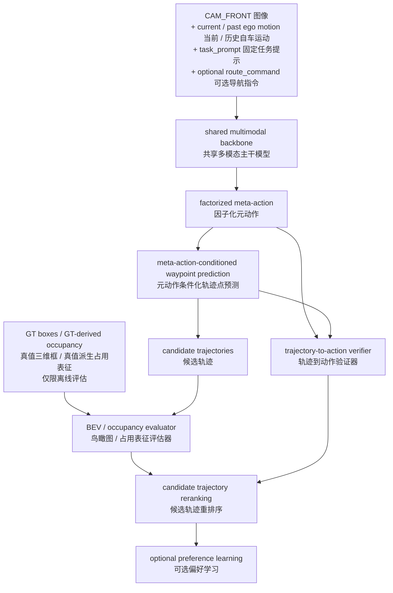
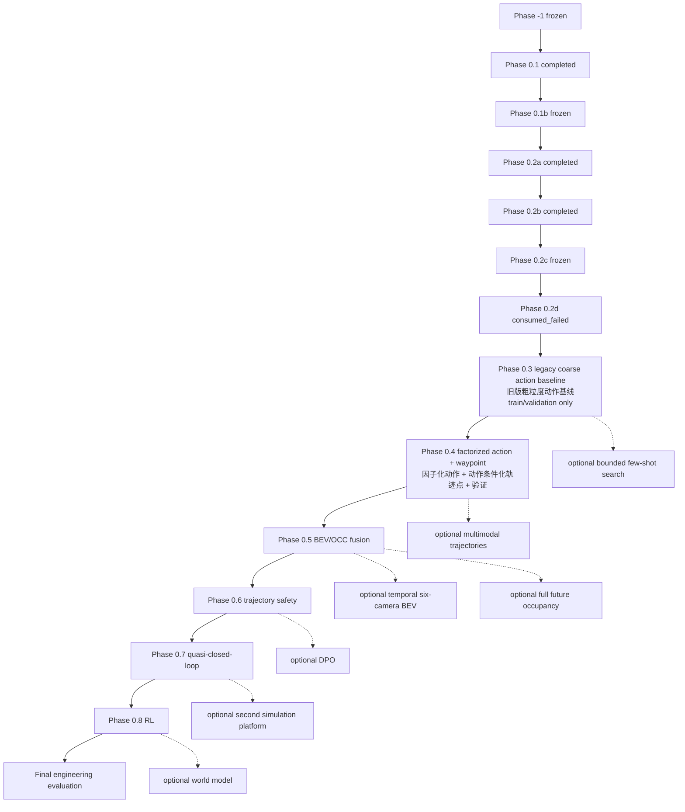

# Safety-Aware VLA（安全感知视觉-语言-动作模型）for Autonomous Driving（面向自动驾驶）：融合 BEV（鸟瞰图）/ OCC（占用表征）空间评估的面试导向最终项目规划

本项目以可复现、可核查的工程证据服务于多模态与自动驾驶算法岗位面试，而不是以追求 SOTA（当前最优水平）或完整复现单篇论文为目标。主线用于展示 nuScenes（自动驾驶数据集）数据处理、VLM（视觉语言模型）与 VLA（视觉-语言-动作模型）建模、动作空间设计、连续轨迹规划、BEV（鸟瞰图）/ occupancy（占用表征）几何评估，以及信息泄漏控制、工程测试、错误分析和系统集成能力；所有尚未由代码、测试和真实结果支持的能力继续标为 `planned`（计划中）。

## 0. 文档说明与维护规则

### 0.1 文档职责

本文是项目阶段规格、依赖关系、信息合同与执行 Gate 的唯一主来源。其他长期文档各自只承担一种职责：

- `docs/progress.md`：记录已经确认的实际状态、指标、artifact 与 open questions；
- `AGENTS.md`：记录 agent 和开发者不得违反的仓库规则；
- `README.md`：负责外部项目介绍、能力边界和复现入口；
- `project_mvp_plan.md`：定义项目要做什么、按什么顺序做、满足什么条件才能继续。

实际进度变化时，先用真实执行证据更新 `docs/progress.md`，再同步本文的阶段状态。禁止在多个文件中维护互相冲突的阶段事实；若出现冲突，已核验的实际状态以 `docs/progress.md` 为准，阶段目标、Gate 和依赖以本文为准。

### 0.2 维护规则

- 只有代码、配置、测试、真实数据 smoke test、人工审核和持久化 artifact 共同支持的能力，才可标为 `completed` 或 `frozen`。
- 论文结果、模型官方能力和外部 benchmark 不得写成本项目结果。
- 尚未实现或未核验的入口、指标、资源开销和能力必须标为 `planned`、`conditional`、`stretch` 或“待验证”。
- 阶段状态、contract、rule 或 evaluation protocol 变化时，必须记录版本与 provenance；不得覆盖 frozen artifact。
- Phase 0.3 及后续阶段必须按第 5.2 节统一模板补全；尚未在本文展开的阶段只保留骨架，不得用概述冒充可执行规格。

## 1. 信息边界与总体数据流

### 1.1 项目定位与最终主线

本项目仍是 **Safety-Aware VLA（安全感知视觉-语言-动作模型）for Autonomous Driving（面向自动驾驶）**，并融合 BEV（鸟瞰图）/ OCC（占用表征）空间评估。最终主线不以六类动作分类、粗动作轨迹展开、重排序和 DPO（直接偏好优化）作为项目终点，而是逐步建立“高层动作意图 + 低层连续轨迹 + 可解释几何评估”的统一接口：高层输出说明车辆准备做什么，低层 waypoint（轨迹点）说明车辆具体如何移动，evaluator（评估器）负责在离线条件下检查空间风险和两类输出是否一致。

当前已完成的是六类 coarse meta-action（粗粒度元动作）的数据闭环、冻结标签、人工审核与早期基线基础；factorized meta-action（因子化元动作）、continuous waypoint（连续轨迹点）、trajectory-to-action verifier（轨迹到动作验证器）、BEV（鸟瞰图）/ occupancy（占用表征）几何评估、candidate trajectory reranking（候选轨迹重排序）和 preference learning（偏好学习）均为 `planned`（计划中）。不得把 Phase -1（阶段 -1）或 Phase 0.1（阶段 0.1）改写成已经实现轨迹模型、几何评估器或安全决策系统。

面试导向的核心价值是通过可运行代码、固定协议、sample-level output（样本级输出）和代表性失败案例证明以下能力：自动驾驶数据解析与坐标变换、多模态特征建模、组合动作空间设计、连续轨迹预测、BEV（鸟瞰图）/ occupancy（占用表征）几何评估、future / GT leakage（未来信息 / 真值信息泄漏）防护，以及模型、验证器、评估器和重排序器之间的系统集成。项目不追求 SOTA（当前最优水平），不完整复现单篇论文，不进行论文级大规模消融、穷举超参数搜索或大量 backbone（主干模型）横向比较，也不证明真实道路安全、完整 closed-loop driving（闭环驾驶）或量产部署能力。

### 1.2 Inference input contract（推理输入协议）

推理输入中的 instruction（指令）拆分为三个不同概念：

- `task_prompt`：固定任务说明，例如要求模型预测驾驶动作和未来轨迹；所有样本可以使用同一模板，且模板不得包含由未来轨迹、标签或 evaluator（评估器）信息派生的内容。
- `route_command`：可选的样本级导航指令，例如直行、左转或右转；只有数据集存在可靠来源，并且训练与推理阶段都可获得同一语义时才能启用。当前 nuScenes（自动驾驶数据集）主线若不能核验可靠来源，就不得默认加入模型输入。
- `natural_language_instruction`：自然语言驾驶指令；当前项目主线暂不使用，只作为未来扩展，不能写成现有 manifest（清单）字段或当前模型能力。

经对应阶段 contract（协议）批准后，模型推理只允许使用：

```text
CAM_FRONT image
task_prompt
current ego motion
approved past ego motion
optional route_command
```

其中 `current_ego_pose` 与 `current_ego_motion` 继续沿用现有冻结字段定义、时间源和 past-only（仅使用历史）派生规则；本轮不修改 frozen manifest schema（冻结清单模式）。后续若引入历史图像或同步多相机输入，也必须由对应 Phase（阶段）单独更新输入 contract（协议）和 schema version（模式版本），不能在总体说明中提前视为当前输入。

模型推理永久禁止使用：

```text
future ego trajectory
GT meta-action
route command derived from future trajectory
GT boxes
GT occupancy
future agents
test labels
evaluator-only information
```

尤其不能先根据 `future_ego_trajectory` 判断车辆未来左转，再把“左转”写入 `route_command` 送给模型；这会把预测目标变成输入，属于 target leakage（目标泄漏）。同理，GT boxes（真值三维框）、GT occupancy（真值占用表征）和 future agents（未来交通参与者）只能进入离线 evaluator（评估器），不能通过 prompt（提示）、特征缓存、样本元数据或预处理结果间接进入 VLA（视觉-语言-动作模型）。

### 1.3 总体数据流与模块职责

最终目标数据流如下，除已有 coarse meta-action（粗粒度元动作）数据基础外均保持 `planned`（计划中）：



各模块的输入、输出和设计原因如下：

- shared multimodal backbone（共享多模态主干模型）读取允许的图像、`task_prompt`、current / past ego motion（当前 / 历史自车运动）和经过批准的 `route_command`，输出共享特征；它用于避免动作分类与轨迹规划各自维护不兼容的视觉主干。
- factorized meta-action（因子化元动作）输出纵向与横向两个可组合的高层意图；它解决旧六类互斥 schema（模式）不能同时表达“减速 + 左移”等组合的问题。
- meta-action-conditioned waypoint prediction（元动作条件化轨迹点预测）读取共享特征与高层动作 embedding（嵌入），输出当前自车坐标系中的连续 future waypoints（未来轨迹点）；它是更接近自动驾驶 planning（规划）的主要低层输出。
- trajectory-to-action verifier（轨迹到动作验证器）把预测轨迹投影回动作空间，与预测高层动作比较，输出 action-trajectory consistency（动作—轨迹一致性）结果；它用于发现语义和运动不一致的错误。
- BEV（鸟瞰图）/ occupancy evaluator（占用表征评估器）读取模型候选轨迹与 evaluator-only（仅评估器可用）的 GT geometry（真值几何），输出分解的安全代价；它提供离线空间评估，不给模型提供真值感知输入。
- candidate trajectory reranking（候选轨迹重排序）结合几何代价、一致性、进度和舒适性，在固定候选集合中选择轨迹；optional preference learning（可选偏好学习）只有在候选与偏好证据可靠时才使用，不是项目必须终点。

### 1.4 能力边界与工程可靠性

本项目的连续轨迹预测与安全评估仍属于 open-loop planning（开环规划）和 non-reactive offline evaluation（非响应式离线评估）：记录中的其他交通参与者不会根据模型输出实时响应，evaluator（评估器）也不能证明模型在真实道路或完整仿真中的安全性。后续若接入 quasi-closed-loop evaluation（准闭环评估），必须继续明确其 observation（观测）、交通参与者响应和回放限制，不得改称真实 closed-loop driving（闭环驾驶）。

工程可靠性保留数据和坐标可追溯、scene-level split（场景级数据切分）、future / GT leakage（未来信息 / 真值信息泄漏）检查、固定输入输出协议、单元测试、smoke test（冒烟测试）、sample-level output（样本级输出）、少量有代表性的人工核验和 failure case analysis（失败案例分析）。这些证据用于说明系统实现可信，不扩展为多随机种子统计、置信区间、显著性检验、大规模人工一致性实验、复杂论文式消融矩阵或穷举调参。

## 2. 为什么保留 coarse meta-action（粗粒度元动作）及最终动作空间

### 2.1 Legacy coarse action schema（旧版粗粒度动作模式）

当前冻结的六类动作继续保留，并明确命名为 **legacy coarse action schema（旧版粗粒度动作模式）**：

```text
keep
accelerate
decelerate
stop
left_lateral
right_lateral
```

该 schema（模式）及 `label_rule_version=phase-1.6-meta-action-v0.2` 不删除、不重命名、不覆盖，也不静默改变语义。它承担五个长期角色：保留 Phase -1（阶段 -1）已完成的标签成果；作为 Majority Baseline（多数类基线）和早期模型的统一比较空间；提供简单、可审核的粗粒度驾驶行为；作为后续多任务训练的辅助监督；在 failure case analysis（失败案例分析）中提供可解释语义。`left_lateral` 与 `right_lateral` 仍只表示稳定的左右横向运动，不能解释为 lane change（变道）或 turn（转弯）。

保留旧 schema（模式）不等于把它设为最终动作空间。它适合验证数据、标签、parser（解析器）和早期模型链路，却无法完整表达同时发生的纵向与横向行为，因此后续扩展必须新增版本化 target（目标）和评测合同，而不是改写已冻结字段。

### 2.2 Factorized meta-action（因子化元动作）

最终高层动作空间 `planned`（计划中）为两个可组合的 action head（动作预测头）：

```text
longitudinal_action:
- stop
- decelerate
- keep
- accelerate

lateral_action:
- left
- straight
- right
```

真实驾驶动作通常是组合行为，例如 `decelerate + left`、`keep + right` 或 `accelerate + straight`。原六类互斥动作每次只能表达一种主导语义，无法同时说明纵向速度趋势与横向方向；如果不断向单一类别集合增加组合类，类别数量、长尾问题、标签维护和错误解释都会迅速复杂化。因子化表示让两个 head（预测头）共享同一多模态特征但分别学习纵向与横向语义，更容易扩展、审核和复用。

评测时分别报告 longitudinal macro-F1（纵向宏平均 F1）和 lateral macro-F1（横向宏平均 F1），并以 joint accuracy（联合准确率）检查两个 head（预测头）是否同时正确。高层动作因此仍然可解释、可验证，但不再承担连续路径的全部信息。

第一版不直接增加 `lane_change`、`turn`、`follow_road_curve`、`overtake` 或 `yield`。仅靠单帧 `CAM_FRONT` 与 ego trajectory（自车轨迹），通常无法稳定区分 lane change（变道）、turn（转弯）和 follow-road-curve（沿弯道行驶），也无法可靠判断超车或让行意图。只有后续加入经过审核的 map（地图）、lane topology（车道拓扑）、intersection topology（路口拓扑）、route command（导航指令）或 temporal input（时序输入）中的至少一部分后，才允许定义、版本化并重新审核 fine-grained maneuver type（细粒度机动类型）。

### 2.3 Continuous waypoint action space（连续轨迹点动作空间）

低层主要输出 `planned`（计划中）为：

```text
future_waypoints shape: [B, 6, 2]
prediction horizon: 3.0 seconds
sampling interval: 0.5 seconds
coordinate frame: current ego frame
x-axis: positive forward
y-axis: positive left
unit: meter
```

`B` 是 batch size（批大小）；`6` 表示从当前时刻后 0.5 秒到 3.0 秒、每 0.5 秒预测一个轨迹点；`2` 表示每个轨迹点包含 `(x, y)`。所有点都表达在当前时刻自车坐标系中，`x` 轴向前为正，`y` 轴向左为正，单位为米。缺失或无效 future target（未来目标）仍通过版本化 valid mask（有效掩码）处理，不改变现有 `current_ego_pose`、`current_ego_motion` 或 frozen manifest schema（冻结清单模式）。

第一版不直接预测 steering（转向角）、throttle（油门）或 brake（制动）。nuScenes（自动驾驶数据集）没有与本项目一一对应的完整底层控制监督，项目也没有经过核验的真实车辆动力学模型和 closed-loop control environment（闭环控制环境）；直接输出控制量会把无法真实验证的车辆与控制假设混入模型结论。Waypoint（轨迹点）则可以与现有 `future_ego_trajectory` 对齐，并直接用于 ADE（平均位移误差）、FDE（最终位移误差）、collision check（碰撞检查）和 BEV（鸟瞰图）/ occupancy evaluation（占用表征评估），更符合当前项目可实现、可复现和可核查的能力边界。

### 2.4 Planned model interface（计划中的模型接口）

第一版主结构在后续 Phase（阶段）中按以下接口实现：

```text
shared multimodal backbone
├── longitudinal action head
├── lateral action head
└── meta-action-conditioned waypoint head
```

shared multimodal backbone（共享多模态主干模型）提取图像、`task_prompt` 和自车状态特征；longitudinal action head（纵向动作头）预测四类纵向动作；lateral action head（横向动作头）预测三类横向动作；meta-action-conditioned waypoint head（元动作条件化轨迹点头）同时接收共享特征和高层动作 embedding（嵌入），输出 `[B, 6, 2]` 连续轨迹点。高层动作回答“准备做什么”，轨迹回答“具体怎么移动”，两者共享信息但分别接受分类与几何验证。

Legacy coarse action schema（旧版粗粒度动作模式）继续作为历史基线、辅助监督和解释接口，但不替代上述三个主要输出 head（预测头）。新增 factorized target（因子化目标）和 waypoint target（轨迹点目标）时必须提升相应 schema version（模式版本）并保留旧字段兼容；具体模型代码、loss weight（损失权重）和训练超参数留给后续 Phase（阶段）规格，本节不预设。

### 2.5 Trajectory-to-action verifier（轨迹到动作验证器）

本项目借鉴 DriveMA（可验证元动作驾驶视觉-语言-动作模型）的可迁移接口思想，但不把项目写成 DriveMA（可验证元动作驾驶视觉-语言-动作模型）复现：

```text
input x
→ predicted meta-action m
→ predicted trajectory τ
→ project trajectory back to action space
→ compare implied action with predicted action
```

trajectory-to-action verifier（轨迹到动作验证器）后续根据预测轨迹的纵向位移、速度趋势和横向运动，反推出 trajectory-implied action（轨迹隐含动作），再与模型预测的 `longitudinal_action` 和 `lateral_action` 比较，输出 action-trajectory consistency（动作—轨迹一致性）及明确冲突原因。它能够识别“高层输出减速，但轨迹仍持续加速”或“高层输出向左，但轨迹终点明显向右”等错误，并把结果用于 failure case analysis（失败案例分析）、candidate trajectory reranking（候选轨迹重排序）和 optional preference learning（可选偏好学习）。

Verifier（验证器）第一版是版本化、可单元测试的规则检查工具，不承诺 DriveMA（可验证元动作驾驶视觉-语言-动作模型）的 GRPO（组相对策略优化）、turn-level credit assignment（轮次级信用分配）、全参数训练或海量数据方案，也不需要论文规模的 reinforcement learning（强化学习）。第一版先以 supervised training（监督训练）、规则验证和候选重排序展示语言—动作对齐能力；阈值、投影规则和失败原因必须通过 train / validation（训练集 / 验证集）及人工构造案例核验，不能读取已消费 test（测试集）来选择。

## 3. BEV（鸟瞰图）/ occupancy（占用表征）与 geometric safety scorer（几何安全评分器）

### 3.1 定位与职责分离

BEV（鸟瞰图）是把场景几何统一到自车中心俯视坐标系的空间表示；occupancy（占用表征）描述特定时间步和网格位置是否被车辆、VRU（弱势道路使用者）或其他已定义类别占据；geometric safety scorer（几何安全评分器）把候选自车轨迹与这些几何表示比较，输出可分解的风险、可行性、进度和舒适性代价。三者不是同一概念：occupancy（占用表征）不直接等于安全决策，scorer（评分器）也不能替代模型的轨迹输出。

本项目保留 GT-derived evaluator（由真值构造的评估器）的离线定位，同时保留 object-level（对象级）与 raster-level（栅格级）两条实现路径。对象级路径直接使用带类别、姿态、尺寸、时间和 token（标识）的 GT boxes（真值三维框）；栅格级路径把相同真值几何按冻结规则构造成 temporal occupancy（时序占用表征）。两条路径用于交叉核验几何规则、分析失败样本和校准 scorer（评分器），不构成 VLA（视觉-语言-动作模型）的推理输入。

### 3.2 最终主接口与过渡接口

最终主要评估接口为：

```text
predicted waypoint trajectory
→ ego footprint rollout
→ GT boxes or GT-derived temporal occupancy
→ decomposed safety costs
```

predicted waypoint trajectory（预测轨迹点序列）提供当前自车坐标系中的候选运动；ego footprint rollout（自车轮廓轨迹展开）沿每个时间步放置具有长度、宽度、姿态和安全边界的自车轮廓，避免把 waypoint（轨迹点）当作没有面积的点；GT boxes（真值三维框）或 GT-derived temporal occupancy（真值派生时序占用表征）提供只供 evaluator（评估器）使用的环境几何；decomposed safety costs（分解安全代价）分别记录 collision（碰撞）、near-miss（近失）、VRU（弱势道路使用者）距离违规、TTC（碰撞时间）、可行性、harsh action / jerk（激烈动作 / 加加速度）、进度和 `unnecessary_stop`，避免用单一总分掩盖“总是停车”等退化行为。Drivable-area evaluation（可行驶区域评估）只有在可靠 map（地图）与坐标 contract（协议）存在时才启用。

在 continuous waypoint head（连续轨迹点头）尚未实现前，允许使用以下临时接口完成 scorer smoke test（评分器冒烟测试）：

```text
coarse action
→ configured short-horizon rollout
```

该 coarse action rollout（粗动作轨迹展开）只是验证坐标、时间、碰撞规则、对象/栅格一致性和分项输出的过渡方案，不是最终规划输出。Predicted waypoint trajectory（预测轨迹点序列）实现后应成为主要评估对象；不得以 GT future ego trajectory（真值未来自车轨迹）替代模型候选轨迹进行碰撞评分，否则评估的是真值驾驶行为而不是模型规划能力。

### 3.3 Evaluator contract（评估器协议）

对象级和栅格级实现必须共享同一坐标、时间和版本语义：

- 所有 candidate trajectory（候选轨迹）、ego footprint（自车轮廓）、GT boxes（真值三维框）和 temporal occupancy（时序占用表征）必须转换到同一 current ego frame（当前自车坐标系），明确 `x` 向前、`y` 向左、单位为米及 transform order（变换顺序）。
- 轨迹时间步、box timestamp（三维框时间戳）和 occupancy time step（占用表征时间步）必须记录 horizon（预测时域）、sampling interval（采样间隔）、tolerance（容差）和缺帧策略，不能只按数组下标假定同步。
- 对象级 artifact（产物）必须保留 annotation token（标注标识）、sample token（样本标识）、类别、尺寸、姿态、source frame（源坐标系）和 transform provenance（变换来源）；运动假设必须显式记录为 observed（已观测）、interpolated（插值）、constant-velocity（匀速）或 unavailable（不可用），不得静默复制当前对象冒充真实未来状态。
- 栅格级 artifact（产物）必须记录 grid range（网格范围）、resolution（分辨率）、origin（原点）、轴方向、类别通道、边界规则、unknown / free semantics（未知 / 空闲语义）、rasterization policy（栅格化策略）和 `raster_config_version`。
- candidate（候选）、footprint（轮廓）、motion assumption（运动假设）、scorer（评分器）、阈值、分项权重和输出 schema（模式）都必须版本化；sample-level output（样本级输出）能够回溯模型、候选、几何来源、配置和代码版本。

GT boxes（真值三维框）、GT occupancy（真值占用表征）、future agents（未来交通参与者）和任何 evaluator-only（仅评估器可用）信息只能进入 evaluator（评估器）。当前主线不训练完整 BEVFormer（鸟瞰图视觉模型）、OccNet（占用预测网络）、SurroundOcc（环视占用预测模型）或其他大型 occupancy prediction network（占用预测网络）；若后续 Phase（阶段）实现轻量 predicted occupancy（预测占用表征）辅助分支，也必须与 GT-derived evaluator（真值派生评估器）分离，并通过真实 inference path（推理路径）证明其输入不含真值几何。

### 3.4 Candidate reranking（候选重排序）与一致性接口

Evaluator（评估器）不直接修改轨迹，只对固定候选集合输出逐项代价和版本化 reason（原因）。Candidate trajectory reranking（候选轨迹重排序）再结合 safety cost（安全代价）、action-trajectory consistency（动作—轨迹一致性）、progress（进度）、comfort（舒适性）和 fallback severity（回退严重程度）选择候选，并同时保存原始轨迹、所有候选、分项代价、选择原因和最终轨迹。这样可以区分“模型轨迹本身较好”“验证器发现语义冲突”和“几何评估迫使系统选择保守候选”三类能力。

Preference learning（偏好学习）只在候选生成、verifier（验证器）、scorer（评分器）和重排序结果经过核验后作为 optional（可选）消费者；DPO（直接偏好优化）不是项目必须终点，GRPO（组相对策略优化）也不是第一版要求。第一版通过 supervised training（监督训练）、规则化一致性检查、离线几何评分和候选重排序形成完整且可解释的工程证据链。

### 3.5 面试能力映射

| 能力 | 通过什么代码或结果证明 | 当前边界 |
|---|---|---|
| 数据工程能力 | 以现有 nuScenes（自动驾驶数据集）解析脚本、`CAM_FRONT` / future trajectory（未来轨迹）/ nearby agents（邻近交通参与者）对齐结果、坐标可视化、scene-level split（场景级切分）、manifest versioning（清单版本管理）及 validator（验证器）结果证明。 | 数据闭环、冻结标签和 manifest（清单）基础已有真实证据；不得把派生数据提交 Git（版本控制系统）。 |
| 多模态模型能力 | 后续以 Qwen3-VL（通义千问第三代视觉语言模型）数据适配、LoRA（低秩适配）训练记录、multimodal feature fusion（多模态特征融合）张量合同、custom action head（自定义动作预测头）测试及 sample-level prediction（样本级预测）证明。 | 均为 `planned`（计划中）；模型卡或论文结果不能替代本项目运行证据。 |
| 自动驾驶规划能力 | 后续以 factorized action space（因子化动作空间）分类指标、`[B, 6, 2]` waypoint prediction（轨迹点预测）、ADE（平均位移误差）/ FDE（最终位移误差）、action-conditioned planning（动作条件化规划）可视化和 action-trajectory consistency（动作—轨迹一致性）结果证明。 | 连续轨迹模型为 `planned`（计划中）；当前六类输出只是 legacy coarse action schema（旧版粗粒度动作模式）。 |
| BEV（鸟瞰图）/ occupancy（占用表征）能力 | 后续以 GT boxes（真值三维框）到 temporal occupancy rasterization（时序占用栅格化）的对象/栅格对照、ego footprint collision checking（自车轮廓碰撞检查）、TTC（碰撞时间）、VRU（弱势道路使用者）距离和条件化 drivable-area evaluation（可行驶区域评估）证明。 | Evaluator（评估器）为 `planned`（计划中）且只做离线几何评估；可行驶区域指标依赖可靠 map contract（地图协议）。 |
| 系统分析能力 | 以 inference / target / evaluator（推理 / 目标 / 评估器）隔离测试、information leakage prevention（信息泄漏防护）、trajectory-to-action verifier（轨迹到动作验证器）、failure case analysis（失败案例分析）、sample-level provenance（样本级来源追溯）和 safety-performance trade-off（安全性与行驶性能权衡）报告证明。 | 保留少量代表性人工核验与可复现输出，不扩展为论文式大规模统计或复杂消融。 |

## 4. 数据、坐标、时间、版本和 artifact 总合同

### 4.1 当前已冻结 schema contract（模式协议）

当前 `phase0_audited_seed_subset_v1` 与 `phase0_trainval_dataset_manifest_v1` 的稳定基础字段至少包括：

```text
sample_token
scene_token
timestamp
cam_front_path
current_ego_pose
current_ego_motion
coordinate_metadata
future_ego_trajectory
nearby_agents
split
manifest_schema_version
```

当前派生与追溯字段至少包括：

```text
meta_action
label_rule_version
safety_rule_version
source_audit_record
```

`source_audit_record` 用于从正式样本回溯到 Phase -1（阶段 -1）人工审核记录；已有审核样本必须保留完整来源，未匹配样本必须保持明确的未审核状态，不能伪造审核记录。

`current_ego_pose` 至少包含：

```text
frame
translation_m
rotation_wxyz
timestamp_us
timestamp_source
```

`current_ego_motion` 至少包含：

```text
speed_mps
longitudinal_acceleration_mps2
yaw_rate_radps
source
timestamp_source
availability
history_interval_sec
acceleration_interval_sec
unavailable_reason
```

两个字段的 `timestamp_source` 均固定为 `CAM_FRONT_sample_data`。`current_ego_motion` 只能由 current / past pose（当前 / 历史位姿）派生，禁止使用 future pose（未来位姿）或 future trajectory（未来轨迹）；缺失历史时必须通过 `availability` 与 `unavailable_reason` 显式表达，不能把缺失值伪装成真实零运动。

`phase0_audited_seed_subset_v1`、`phase0_trainval_dataset_manifest_v1` 与未来 temporal / factorized / waypoint schema（时序 / 因子化 / 轨迹点模式）之间是版本化扩展关系。后续 schema（模式）必须引用来源 manifest（清单）及其 SHA-256，并新增版本号；不得覆盖、改名冒充或就地改写任何当前 frozen schema（冻结模式）。

### 4.2 长期目标 schema contract（模式协议）

Manifest family（清单族）的长期基础合同为：

```text
sample_token
scene_token
timestamp
sensor_paths
current_ego_pose
current_ego_motion
coordinate_metadata
history_valid_mask
future_ego_trajectory
future_waypoints
trajectory_valid_mask
nearby_agents
map_route_metadata
split
official_split
manifest_schema_version
```

字段按阶段逐步启用：当前已实现的 `cam_front_path` 是 single-camera `sensor_paths` 的现行字段；`history_valid_mask`、`future_waypoints`、`trajectory_valid_mask` 和 `map_route_metadata` 尚未全部进入当前 frozen schema，必须在使用它们的阶段提升 schema version 后加入。不得把长期合同字段误写为当前已完成能力。

### 4.3 版本化 targets（目标）与实验字段

```text
meta_action
label_rule_version
longitudinal_action
lateral_action
factorized_action_rule_version
factorized_action_valid
factorized_action_reason
source_future_trajectory_version
source_legacy_meta_action
fine_action_rule_version
safety_rule_version
raster_config_version
prompt_version
parser_version
model_revision
checkpoint_sha256
split_mapping_sha256
evaluation_protocol_version
```

基础字段与派生 target（目标）必须分离。Schema（模式）变化必须提升 `manifest_schema_version`；rule（规则）变化必须提升对应 rule version（规则版本）并重新生成受影响 target（目标）。Legacy coarse action（旧版粗粒度动作）与 factorized action（因子化动作）可以在同一版本化扩展记录中共存，但二者不是互相覆盖关系，也不得通过无版本映射静默混用。

### 4.4 坐标与时间合同

- 坐标数据必须记录 source frame、target frame、轴方向、单位和 transform 顺序；
- 时间数据必须记录 timestamp 单位、timestamp source、采样间隔、history/future horizon、tolerance 与缺帧策略；
- 当前 `current_ego_pose` / `current_ego_motion` 的 timestamp source（时间戳来源）固定为 `CAM_FRONT_sample_data`；motion（运动状态）只由 current / past pose（当前 / 历史位姿）推导；
- future trajectory、waypoints、agents 与 occupancy 必须显式对齐离散时间步，不能只凭数组下标假设同步。

### 4.5 Split（数据切分）、provenance（来源追溯）与存储规则

- train、validation、test 必须按 scene-level split，禁止相邻帧跨 split；
- 数据、模型、配置、代码版本和结果必须具备 provenance 与必要 SHA-256；
- frozen artifact 不得覆盖、就地改写或以改名方式复用；
- 原始数据、派生数据、checkpoint、正式输出、日志和缓存不进入 Git；
- Git 只保存代码、配置模板、schema、允许公开的小型测试 fixture、测试和文档；
- 不可逆 evaluation 的 durable claim、访问状态、输出持久化状态与 rerun policy 必须单独记录。

## 5. 全局状态定义与统一执行规范

### 5.1 全局状态定义

| 状态 | 定义 |
|---|---|
| `completed` | 阶段目标和 Gate 已由可复现证据满足，但其输出仍可能在后续阶段被版本化扩展。 |
| `frozen` | 阶段已完成，关键 contract、rule、split 或 artifact 被锁定；后续不得静默修改。 |
| `active` | 当前正在执行，尚未满足全部 Gate。 |
| `blocked` | 前置条件或外部依赖未满足，当前不得继续。 |
| `planned` | 已进入路线图，但尚未开始实现或验收。 |
| `conditional` | 只有前序实验满足指定增益或质量 Gate 时才执行。 |
| `stretch` | 可选研究扩展，不阻塞核心项目完成。 |
| `retired` | 协议或方案已停止使用；保留历史证据，但不得作为当前有效方案。 |
| `consumed_failed` | 不可逆正式评估已访问 sealed evaluation data，但因执行或 artifact 持久化失败而没有形成可发布结果；该 evaluation source 仍视为已消费，永久不得重跑。 |

状态只描述证据与 Gate，不描述主观完成度。`completed` 不等于 `frozen`，`consumed_failed` 也绝不等于“未执行”。

### 5.2 Phase 0.3 及后续阶段统一模板

后续每个阶段必须严格包含：

```text
阶段状态
阶段目的
为什么需要
前置条件
本阶段不解决什么

输入
允许使用的数据
禁止使用的数据
字段和 artifact contract

详细执行步骤
涉及代码与配置
生成的本地 artifact
版本和 provenance

单元测试
contract / regression tests
真实数据 smoke test
人工审核

实验矩阵
评测指标
通过 Gate
失败分支
停止条件
不可逆操作与保护措施
进入下一阶段的条件

阶段学习目标
可形成的代码、图表、Demo 和简历证据
```

测试数量不能替代真实 producer artifact → consumer intake 的 shape 核验。不可逆操作前必须完成不访问 sealed data 的 full shadow execution，并验证 adapter、输出持久化与 rerun guard。

## 6. 完整项目阶段总览和依赖关系

### 6.1 阶段状态总表

| 阶段 | 目标 | 状态 | 主要输出 |
|---|---|---|---|
| Phase -1 | 数据闭环与 coarse label freeze | `frozen` | 数据对齐、标签、108-sample 人工审核、freeze gate |
| Phase 0.1 | manifest、split、metrics、Majority | `completed` | audited seed subset 与统一评测协议 |
| Phase 0.1b | trainval scale-up | `frozen` | 正式 manifest v1 与 scene mapping |
| Phase 0.2a | past-only ego-motion audit | `completed` | inference input audit |
| Phase 0.2b | rule candidate search | `completed` | validation candidate selection |
| Phase 0.2c | failure analysis 与 rule freeze | `frozen` | `phase0.2-ego-motion-rule-v0.1` |
| Phase 0.2d | sealed one-shot evaluation | `consumed_failed` | 无正式 test metrics；原 test 永久消费 |
| Phase 0.3 | Qwen3-VL 数据接口与 legacy coarse action baseline（旧版粗粒度动作基线） | `planned` | 可复用视觉/多模态特征接口与六类历史兼容基线 |
| Phase 0.4 | factorized meta-action（因子化元动作）+ action-conditioned waypoint（动作条件化轨迹点）+ verification（验证） | `planned` | `[B,4]` / `[B,3]` 动作头、`[B,6,2]` 轨迹点头与一致性验证器 |
| Phase 0.5 | BEV/OCC-aware semantic-geometric fusion | `planned` | multi-camera/calibration adapter、current occupancy、融合与 trajectory ablation |
| Phase 0.6 | trajectory safety scorer 与 safety-aware selection | `planned` | deterministic candidate bank、oracle/deployable scorer 与可审计 selector |
| Phase 0.7 | quasi-closed-loop evaluation 与 planning interface | `planned` | 平台兼容性结论、rollout/reward contract 与累计规划证据 |
| Phase 0.8 | reinforcement fine-tuning | `planned` | 基于准闭环 reward 的最终策略优化 |
| Final | robustness、latency、fallback、Demo 与复现 | `planned` | 完整工程与展示证据闭环 |

### 6.2 依赖关系与 Gate



Phase 0.3 只建立 Qwen3-VL（通义千问第三代视觉语言模型）接入与 legacy coarse action baseline（旧版粗粒度动作基线）；六分类输出不限制最终动作空间。Phase 0.4 建立唯一的 factorized meta-action（因子化元动作）、meta-action-conditioned waypoint（元动作条件化轨迹点）和 trajectory-to-action verification（轨迹到动作验证）核心；Phase 0.5—0.8 必须复用其 feature（特征）、factorized action（因子化动作）、trajectory（轨迹）与 consistency（动作—轨迹一致性）协议。Optional（可选）分支只能旁路增加证据，不能阻塞主线；其中 DPO（直接偏好优化）不得替代 Phase 0.8 的 RL（强化学习），world model（世界模型）也不属于核心完成条件。

## 7. Phase -1：数据闭环与 coarse label freeze 简要回顾

**状态：`frozen`。** Phase -1 建立并核验了：

```text
sample_token → CAM_FRONT
sample_token → future ego trajectory
sample_token → nearby 3D agents
→ one-page visualization
→ meta-action derivation
→ 108-sample manual audit
→ label regression freeze
→ real-data freeze gate
```

取得的核心结果是图像、3 秒 future trajectory 与 nearby agents 可在 sample level 对齐和可视化；六类 coarse meta-action 已派生，108 个样本覆盖六类 action 并完成人工审核，alignment 为 108/108；label regression 与 real-data freeze gate 均为 108/108。

本阶段冻结了六类 action schema、`label_rule_version=phase-1.6-meta-action-v0.2`、基于 `CAM_FRONT_sample_data` 的时间源、ego-frame 坐标约定和 audit provenance。`safety_rule_version=not_available` 是历史事实；Phase -1 没有完成 safety scorer，也没有训练模型。

## 8. Phase 0.1 / 0.1b 简要回顾

### 8.1 Phase 0.1：audited seed-subset 与统一评测协议

**状态：`completed`。** Phase 0.1 将 frozen labels 转为 `phase0_audited_seed_subset_v1`，建立固定 seed 的 scene-level split、统一六类 action schema、完整 manifest validator、Majority Baseline 与 unified metrics。协议要求 sample-level predictions、macro-F1、per-class F1、confusion matrix、class distribution 和 invalid prediction 可追溯，并验证 scene split 无泄漏。

### 8.2 Phase 0.1b：正式 trainval manifest v1

**状态：`frozen`。** Phase 0.1b 已从 mini smoke 数据扩展到完整 nuScenes trainval，冻结：

- `manifest_schema_version=phase0_trainval_dataset_manifest_v1`；
- `horizon_sec=3.0`、`sample_interval_sec=0.5`、`time_tolerance_sec=0.075`；
- `label_rule_version=phase-1.6-meta-action-v0.2`；
- `split_strategy_version=official_train_scene_label_stratified_v1`、`split_seed=20260710`；
- official train 的 700 scenes 按 scene-level stratified split 为 project train/validation `560/140`；official validation 的 150 scenes 固定为当时的 project test；
- 扫描 34,149 samples，纳入 21,646 条：train 14,253、validation 3,594、test 3,799；排除 12,503 条；
- 正式 manifest、mapping sidecar、内部 mapping 与 scene histogram 均有固定 SHA-256 和 provenance，且不得覆盖。

完整 validator、rare-class constraints、排除原因诊断及 train/validation 视觉审核已通过。Mini 此后只用于 smoke test、快速回归和小规模调试，不用于正式 LoRA/action adapter/DPO 结论。这里的原 project test 后来在 Phase 0.2d 被永久消费，不能继续作为 untouched evaluation source。

## 9. Phase 0.2a—0.2d 简要回顾

### 9.1 Phase 0.2a：current/past-only ego-motion audit

**状态：`completed`。** 输入合同只包含 speed、longitudinal acceleration、yaw rate、availability 与对应 past interval；禁止 future trajectory、derived meta-action 或 test labels 作为 baseline 输入。Train/validation/test 的 `full/partial/unavailable` 分别为 `13476/392/385`、`3401/99/94`、`3594/106/99`。该审计未使用 test label 做统计或调参。

### 9.2 Phase 0.2b：deterministic rule candidate search

**状态：`completed`。** 固定 625-candidate grid 只在 validation 上选择 deterministic rule candidate。入选阈值为：

```text
stop speed              = 0.2 m/s
lateral yaw rate        = 0.05 rad/s
accelerate acceleration = 0.5 m/s²
decelerate acceleration = 0.3 m/s²
```

Validation macro-F1 / accuracy 为 `0.615681 / 0.623817`；同协议 Majority Baseline 为 `0.087186 / 0.354201`。这些是参与 candidate selection 的 validation 结果，不是无偏 test 结果。

### 9.3 Phase 0.2c：failure analysis 与 rule freeze

**状态：`frozen`。** `phase0.2-ego-motion-rule-v0.1` 冻结为 `candidate-0293`，validation predictions 复现为 `3594/3594`。主要错误为 `keep → decelerate`（260）和 `decelerate → keep`（181）。Candidate、thresholds、rule version 与 failure analysis 已冻结；不得利用后续 evaluation 反馈修改这一版本。

### 9.4 Phase 0.2d：sealed one-shot evaluation

**状态：`consumed_failed`。** Sealed one-shot formal execution 已且仅已调用一次。Durable execution claim 写入后，执行访问了 test label/motion；随后在正式 test result 持久化前，于 `build_formal_outputs → build_validation_to_test_comparison` 失败。

失败原因是跨模块 artifact schema mismatch：正式 `validation_metrics.json` 使用嵌套 `metrics` 和顶层 `predicted_class_distribution`，consumer 当时却期望顶层扁平 metrics 和 `prediction_class_distribution`。执行 exit code 为 `1`，没有生成可发布的正式 test outputs 或正式 test metrics；rule 与 thresholds 也未按 test 信息修改。

不可逆边界如下：

- execution claim 状态为 `consumed_failed`，`rerun_permitted=false`；
- 原 project test 已永久消费，禁止重跑、恢复、重算、重新切分、改名复用或以任何方式重新取得结果；
- 该 split 不得再用于 prompt、threshold、candidate、model、architecture 或 checkpoint 选择；
- 后续 validation artifact adapter 和 producer-shape regression 已修复，但只适用于未来协议，不授权重跑本次 test；
- Phase 0.3 及后续阶段只能使用 train/validation 开发与模型选择；
- 最终无偏评价必须使用新的 external held-out dataset，或新的、从未访问过的 evaluation protocol。

因此 Phase 0.2d 不能写成 test completed，也不能报告任何正式 test performance。

## 10. 面向最终 VLA 的执行阶段

### 10.1 Phase 0.3：Qwen3-VL 数据接口与 legacy coarse action baseline（旧版粗粒度动作基线）

> Phase 0.3 不是最终 VLA（视觉-语言-动作模型），也不是长时间 prompt engineering（提示工程）阶段。它只负责验证 Qwen3-VL（通义千问第三代视觉语言模型）能否正确读取项目数据并输出冻结六类 legacy coarse action（旧版粗粒度动作），同时为 Phase 0.4 冻结可复用的视觉 / 多模态特征接口；六分类输出 schema（模式）不代表最终动作空间。

#### 10.1.1 阶段状态、目的与边界

- **阶段状态：** `planned`。
- **阶段目的：** 打通 frozen manifest（冻结清单）→ image/text processor（图像 / 文本处理器）→ Qwen3-VL（通义千问第三代视觉语言模型）→ legacy action parser（旧版动作解析器）→ sample-level prediction（样本级预测）的完整链路。
- **为什么需要：** 在引入时序、factorized action head（因子化动作预测头）和 waypoint head（轨迹点头）前，先隔离数据加载、模型依赖、`task_prompt` 序列化、generation（生成）和六类输出解析问题，避免把接入错误误判为规划模型错误。
- **前置条件：** Phase 0.1b trainval manifest 与六类 schema 已冻结；Phase 0.2d 的 consumed-test 边界保持不变；开发只允许 train/validation。

本阶段验证：

- frozen manifest 中的 `CAM_FRONT` 图像能否正确加载；
- Qwen3-VL processor（处理器）、tokenizer（分词器）与 model（模型）能否在项目环境稳定运行；
- `task_prompt` 与 current / past ego-motion summary（当前 / 历史自车运动摘要）如何确定性序列化；
- 生成结果能否被 legacy action parser（旧版动作解析器）严格解析；
- zero-shot（零样本）与轻量 LoRA（低秩适配）是否能形成可复现的 legacy coarse action baseline（旧版粗粒度动作基线）；
- VLM hidden states / visual tokens（视觉语言模型隐藏状态 / 视觉 token）是否能通过稳定 visual / multimodal feature interface（视觉 / 多模态特征接口）供 Phase 0.4 复用。

本阶段不解决：

```text
continuous trajectory prediction
temporal multi-frame fusion
BEV/OCC
safety scorer
closed-loop evaluation
reinforcement learning
unbounded prompt search
large-scale DPO
```

#### 10.1.2 输入、允许数据与禁止数据

模型输入限定为：

```text
CAM_FRONT image
current/past ego-motion summary
task_prompt
```

`task_prompt` 是所有样本共享的固定任务提示，不包含 future-derived（未来派生）信息。`route_command` 与 `natural_language_instruction` 均不属于 Phase 0.3 输入。Legacy coarse meta-action target（旧版粗粒度元动作目标）只用于 supervised LoRA（监督式低秩适配）目标或离线评测；train / validation split（训练集 / 验证集切分）用于训练、模型选择和报告。必须分别运行 image-only（仅图像）与 image + ego state（图像加自车状态）两组基线，以判断 ego state（自车状态）的增益。

禁止：

- future ego trajectory 作为模型输入或 prompt 内容；
- GT nearby agents、GT boxes 或 GT occupancy 作为模型输入；
- 已消费 test 的图像、motion、label 或派生统计；
- validation label 进入 prompt；
- 任何 future-derived 数值通过 ego-state serialization 间接泄漏。

#### 10.1.3 数据样本与 artifact contract

概念样本合同如下：

```json
{
  "sample_token": "...",
  "image_path": "...",
  "task_prompt": "根据前视图像和当前车辆状态判断驾驶行为。",
  "ego_state": {
    "speed_mps": 0.0,
    "longitudinal_acceleration_mps2": 0.0,
    "yaw_rate_radps": 0.0,
    "availability": "full"
  },
  "target_action": "keep"
}
```

该 JSON 只是计划中的字段合同示例，不代表仓库当前已有对应训练文件。`image_path` 必须由 manifest（清单）相对路径和受控 data root（数据根目录）解析；`target_action` 永远不进入 inference prompt（推理提示）。`task_prompt` schema（固定任务提示模式）、ego-state serialization（自车状态序列化）与 sample adapter schema（样本适配器模式）必须分别版本化。

Model-ready record 和 sample-level prediction 至少保留：

```text
sample_token
split
source_manifest_schema_version
source_manifest_sha256
label_rule_version
input_variant
task_prompt_version
legacy_parser_version
model_revision
processor_revision
generation_config_sha256
target_action
raw_output
parsed_action
is_valid_output
```

Visual / multimodal feature interface（视觉 / 多模态特征接口）必须记录 feature source（特征来源）、tensor shape（张量形状）、dtype（数据类型）、attention / valid mask（注意力 / 有效掩码）、model / processor revision（模型 / 处理器修订版）与 extraction policy（提取策略）；不得假设未核验的 token 数或 hidden dimension（隐藏维度）。

#### 10.1.4 Task prompt（固定任务提示）、generation（生成）与输出合同

`task_prompt` 只使用少量预定义模板，不进行无边界搜索。正式实验必须选择并冻结一种 canonical output format（规范输出格式），例如：

```text
ACTION: keep
```

或：

```json
{"action": "keep"}
```

合同要求：

- 输出 action 只能是 `keep / accelerate / decelerate / stop / left_lateral / right_lateral`；
- legacy action parser（旧版动作解析器）只接受当前 `legacy_parser_version` 声明的严格格式，不通过模糊匹配猜测非法输出；
- invalid output 单独计数，并保留原始输出；
- `task_prompt`、legacy parser（旧版解析器）和 generation config（生成配置）均版本化；
- temperature、top-p、max new tokens、sampling 开关和 stop conditions 必须进入配置；
- validation 可用于从预先声明的有限模板中选择一次正式方案，但不得以反复试探形成无边界 prompt search。

#### 10.1.5 详细执行步骤

##### Phase 0.3a：环境与模型预检

1. 在 `codex4vla_env` 检查 PyTorch、Transformers、图像 processor 与目标模型依赖。
2. 确认 model/processor revision、下载来源和许可证信息。
3. 根据真实硬件执行显存、内存、dtype 与 batch-size 预检，不提前承诺资源数字。
4. 只加载少量 train/validation 样本，不扫描或访问 test。
5. 验证单图输入与 `task_prompt` 文本输入。
6. 验证 raw generation、strict parsing 与 invalid-output 路径。
7. 保存 smoke-run metadata、依赖版本、硬件摘要与失败原因。

##### Phase 0.3b：dataset adapter

1. 从 frozen trainval manifest streaming 读取 train/validation sample。
2. 解析并校验相对 `CAM_FRONT` 路径。
3. 构造 image-only（仅图像）`task_prompt`。
4. 构造 image + ego-state（图像加自车状态）`task_prompt`。
5. 为 `full / partial / unavailable` ego state 定义显式、确定性的文本格式。
6. 输出 model-ready records，不在 adapter 中执行模型推理。
7. 保留 `sample_token`、split、target、manifest 和 rule provenance。
8. 在读取入口设置 test split guard，并证明 adapter 不访问 test。

##### Phase 0.3c：zero-shot baseline

只运行有限、预定义的 prompt templates，至少比较：

```text
image-only
image + ego state
```

两组实验使用同一 model revision、generation config、parser 和 validation protocol，输出 sample-level predictions 与完整 action metrics。Zero-shot 较弱不触发无限 prompt 调参。

##### Phase 0.3d：轻量 LoRA smoke baseline

该子阶段不是最终模型训练，只验证：

- supervised conversation format 与 action target placement；
- label masking 只对 assistant target 计算监督；
- collator 和 processor 输出可组成 batch；
- LoRA injection points 与 trainable parameter report 可核验；
- loss 在小样本上下降，且少量样本可以 overfit；
- checkpoint 可以保存、加载并走通相同 parser 推理。

只使用小规模 train subset 和 validation smoke，不进行大规模超参数搜索，也不以它替代 Phase 0.4 trajectory model。

##### Phase 0.3e：failure analysis 与接口冻结

至少分析：

```text
visual ambiguity
class imbalance
output-format errors
model ignores ego state
keep / decelerate confusion
left / right lateral confusion
insufficient image evidence
```

最终冻结的主要 producer contract（生产者协议）为：

```text
model revision
processor revision
task_prompt schema
ego-state serialization
dataset adapter interface
visual / multimodal feature interface
legacy action parser
legacy baseline prediction format
```

其中 visual / multimodal feature interface（视觉 / 多模态特征接口）及其 model / processor revision（模型 / 处理器修订版）是 Phase 0.4 的核心输入合同；legacy action parser（旧版动作解析器）和 legacy baseline prediction format（旧版基线预测格式）只服务 Phase 0.3 基线与历史兼容，不限制 Phase 0.4 的 longitudinal / lateral action head（纵向 / 横向动作预测头）。冻结前必须以真实 adapter record（适配器记录）和真实 processor output（处理器输出）核验 shape（形状），不能手写猜测 consumer schema（消费者模式）。

#### 10.1.6 涉及实现、配置、artifact 与 provenance

本阶段计划新增 dataset adapter（数据集适配器）、`task_prompt` / output contract（固定任务提示 / 输出协议）、legacy strict parser（旧版严格解析器）、Qwen inference / LoRA smoke entrypoint（通义千问推理 / 低秩适配冒烟入口）及对应测试；具体文件名在实施子任务中确定，本文不把 planned（计划中）文件写成已存在入口。参数必须进入版本化配置，不散落在代码中。

本地 artifact 至少包括：environment preflight、model/processor metadata、adapter summary、prompt/parser/generation config、zero-shot predictions/metrics、LoRA smoke metadata/checkpoint provenance、failure cases 和 frozen interface receipt。模型权重、checkpoint、派生 records 和正式输出不进入 Git。

每个 artifact 至少记录 Git commit、manifest/schema/rule version、split mapping SHA-256、model/processor revision、prompt/parser version、config SHA-256、sample count、input variant 与生成时间。

#### 10.1.7 测试、真实数据 smoke test 与人工审核

自动测试至少覆盖：

- 相对图像路径解析和绝对路径泄漏拒绝；
- 六类合法 action 的 parser；
- 非法、额外文本和缺字段输出显式失败；
- test split guard；
- `partial / unavailable` ego-state serialization；
- sample-level prediction 字段完整性；
- processor input keys 与 tensor shape；
- `task_prompt` schema 与 deterministic generation config（确定性生成配置）序列化；
- assistant target label masking；
- VLM feature interface contract。

真实数据 smoke test（冒烟测试）只从 train / validation（训练集 / 验证集）各取少量样本，验证图像可读、`task_prompt` 可见、processor / model（处理器 / 模型）可运行、输出可解析、结果可落盘和 rerun provenance（重运行来源）稳定。人工审核随机查看 image（图像）、`task_prompt`、GT action（真值动作）与 prediction（预测），确认提示无 future leakage（未来信息泄漏）、ego state（自车状态）单位正确、左右方向未在文本中写反。

#### 10.1.8 实验矩阵与指标

| 实验 | 输入 | 训练 | 作用 |
|---|---|---|---|
| Zero-shot A | image-only | 无 | 纯视觉快速参考 |
| Zero-shot B | image + ego state | 无 | 检查 ego state 增益 |
| LoRA smoke | image + ego state | 小规模 train subset | 验证 supervised 接口，不作最终性能结论 |

Zero-shot（零样本）legacy coarse action baseline（旧版粗粒度动作基线）至少报告：

```text
macro-F1
per-class F1
accuracy
confusion matrix
invalid-output rate
action parsing success rate
target and predicted class distribution
sample-level predictions
```

LoRA smoke 额外报告训练/验证 sample count、loss 曲线、trainable parameter summary、overfit 结果和 checkpoint save/load 结果，但不得用 smoke 指标冒充正式训练结论。

#### 10.1.9 Gate、失败分支与停止条件

Phase 0.3 通过条件：

- Qwen 数据与模型链路可复现；
- legacy action parser（旧版动作解析器）稳定，invalid output（无效输出）可审计；
- image-only 和 image + ego-state zero-shot baseline 完成；
- 轻量 LoRA smoke run 完成；
- dataset adapter 与 VLM feature interface 可供 Phase 0.4 使用；
- 所有 artifact 具有版本与 provenance；
- 没有访问已消费 test。

Zero-shot 不要求超过 frozen ego-motion rule；较弱结果不阻塞 Phase 0.4，但必须保留并分析。若 processor shape、图像路径、parser 或 label masking 未通过，停止模型扩展并先修复相应 contract。若硬件不支持目标配置，先缩小 batch、分辨率或可训练范围并重新做 resource preflight，不静默改用未经记录的模型。

本阶段没有不可逆 test 操作。任何脚本都必须默认拒绝原 project test；Phase 0.2d 的 claim、preflight 和 consumed artifact 不得读取、恢复或修改。

#### 10.1.10 阶段学习目标与证据

本阶段可展示：多模态数据适配、`task_prompt` / output protocol（固定任务提示 / 输出协议）、VLM inference（视觉语言模型推理）、LoRA（低秩适配）基础训练、invalid output handling（无效输出处理）、传统 rule（规则）与 VLM（视觉语言模型）对照，以及 sample-level failure analysis（样本级失败分析）。可交付的 Demo（演示）是 `CAM_FRONT + optional ego-state text → task_prompt → raw output → legacy parsed coarse action`，并展示输入边界、版本和代表性失败案例；该 Demo（演示）不代表最终 VLA（视觉-语言-动作模型）动作空间。

### 10.2 Phase 0.4：最终 VLA 核心——factorized meta-action（因子化元动作）、meta-action-conditioned waypoint（元动作条件化轨迹点）与 trajectory-to-action verification（轨迹到动作验证）

> Phase 0.4 不是新的临时版本，而是后续 BEV / OCC（鸟瞰图 / 占用表征）、safety scorer（安全评分器）、准闭环环境和 RL（强化学习）共用的最终核心模型骨架。核心链路固定为 factorized meta-action（因子化元动作）→ meta-action-conditioned waypoint prediction（元动作条件化轨迹点预测）→ trajectory-to-action verification（轨迹到动作验证）。

#### 可迁移技术来源与项目化取舍

- DriveMA（可验证元动作驾驶视觉-语言-动作模型）：迁移 `x → m → τ` 的高层动作到低层轨迹接口，以及 trajectory-to-action verification（轨迹到动作验证）；不复现全参数训练、海量数据或 GRPO（组相对策略优化）。
- TransFuser（基于 Transformer 的传感器融合驾驶模型）：迁移 waypoint prediction（轨迹点预测）作为低层规划输出的思想；本项目不直接预测 steering / throttle / brake（转向角 / 油门 / 制动）。
- Ego-status shortcut analysis（自车状态捷径分析）：迁移 ego-only baseline（仅自车状态基线）与 shuffled-image diagnostic（图像打乱诊断），用于核验模型是否真实利用视觉，而不是只依赖自车运动状态。

以上仅说明可迁移的工程接口和诊断方法；论文结果数字、训练规模和外部模型能力不得写成本项目已完成结果。

#### 10.2.1 阶段状态、目的与边界

- **阶段状态：** `planned`。
- **阶段目的：** 从 Phase 0.3 的 legacy six-class baseline（旧六分类基线）升级为同时输出 longitudinal action（纵向动作）、lateral action（横向动作）与连续 future waypoints（未来轨迹点）的 planning model（规划模型），并用规则化 verifier（验证器）检查动作与轨迹是否一致。
- **为什么需要：** 单帧六分类不能表达纵向与横向动作组合，也不能描述未来路径；factorized action（因子化动作）提供可解释高层意图，action-conditioned waypoint（动作条件化轨迹点）提供可评估低层运动，verifier（验证器）把两者连接成可核查证据链。
- **前置条件：** Phase 0.3 的 dataset adapter interface（数据集适配器接口）、model / processor revision（模型 / 处理器修订版）、visual / multimodal feature interface（视觉 / 多模态特征接口）、`task_prompt` schema（固定任务提示模式）与 ego-state serialization（自车状态序列化）已冻结。Legacy action parser（旧版动作解析器）只用于历史兼容，不是本阶段 action head（动作预测头）的 consumer contract（消费者协议）。

本阶段解决：

- 使用历史图像理解动态变化；
- 使用 current/past ego motion 提供运动状态；
- 派生并版本化 longitudinal / lateral factorized targets（纵向 / 横向因子化目标）；
- 输出固定 3 秒、6 个时间步的 continuous future waypoints（连续未来轨迹点）；
- 使用模型自身预测的 soft action embedding（软动作嵌入）条件化 waypoint head（轨迹点头）；
- 以 trajectory-to-action verifier（轨迹到动作验证器）生成纵向、横向和联合一致性证据；
- 建立 Phase 0.5 的 BEV token（鸟瞰图 token）、Phase 0.6 的 scorer（评分器）、Phase 0.7 的 environment（环境）和 Phase 0.8 的 RL（强化学习）可复用的 model / policy interface（模型 / 策略接口）。

本阶段暂不要求：

```text
full multi-camera BEV
full occupancy prediction
complex map / route
learned multimodal candidate trajectories
DPO
world model
closed-loop RL
fine-grained turn / lane-change taxonomy
```

Learned multimodal candidate trajectories（学习式多模态候选轨迹）是 optional（可选）；第一版以可靠单轨迹输出为主。Legacy six-class head（旧六分类头）只允许作为 optional compatibility auxiliary head（可选兼容辅助头），默认主线不依赖它，也不得用它替代 longitudinal / lateral action heads（纵向 / 横向动作预测头）。模型 contract（协议）可预留 geometry token（几何 token）和 policy optimization（策略优化）接口，但不得把它们写成已经实现。

#### 10.2.2 最终核心架构

```text
historical CAM_FRONT frames
+ current / past ego motion
        ↓
Qwen3-VL visual / semantic features
        ↓
temporal fusion
        ↓
shared driving representation h
        ├── longitudinal action head → [B, 4]
        ├── lateral action head      → [B, 3]
        └── meta-action-conditioned waypoint head → [B, 6, 2]
```

Longitudinal action head（纵向动作头）输出四类 logits（逻辑值），lateral action head（横向动作头）输出三类 logits（逻辑值），两个动作 head（预测头）共享同一 driving representation（驾驶表征）`h`。Waypoint head（轨迹点头）不只读取 `h`，还必须读取纵向和横向动作 embedding（嵌入）：高层动作回答“准备怎么驾驶”，waypoint（轨迹点）负责输出“具体怎么移动”。

动作条件化采用可微的 soft embedding（软嵌入）：

```text
p_long = softmax(longitudinal_logits)  # [B, 4]
p_lat  = softmax(lateral_logits)       # [B, 3]

e_long = p_long @ E_long
e_lat  = p_lat  @ E_lat

trajectory_input = concat(h, e_long, e_lat)
trajectory_head(trajectory_input) → [B, 6, 2]
```

`E_long` 是可训练纵向动作 embedding table（嵌入表），`E_lat` 是可训练横向动作 embedding table（嵌入表）。概率加权的 soft embedding（软嵌入）使梯度可以从 waypoint loss（轨迹点损失）回到两个动作 head（预测头）。Inference（推理）只能使用模型自身预测的 `p_long` 与 `p_lat`；禁止使用 GT action（真值动作）或由 future trajectory（未来轨迹）派生的动作作为推理条件。

Phase 0.5 在 shared fusion（共享融合）前或内部接入 BEV / OCC geometry tokens（鸟瞰图 / 占用表征几何 token），但继续输出相同的 longitudinal action（纵向动作）、lateral action（横向动作）、waypoint（轨迹点）和 consistency（动作—轨迹一致性）协议。Phase 0.6 消费 predicted waypoints（预测轨迹点）及其 mask（掩码）；Phase 0.7 通过稳定 inference / planning interface（推理 / 规划接口）调用模型；Phase 0.8 在同一 policy / model（策略 / 模型）上执行 reinforcement fine-tuning（强化微调）。不得为这些阶段分别重建不兼容的 backbone（主干模型）或 trajectory schema（轨迹模式）。

#### 10.2.3 输入、target 与张量合同

模块边界固定为：

```text
historical_images:           [B, T_hist, 3, H, W]
ego_motion_history:          [B, T_hist, E]
history_valid_mask:          [B, T_hist]
longitudinal_action_target:  [B]
lateral_action_target:       [B]
future_waypoints:            [B, 6, 2]
trajectory_valid_mask:       [B, 6]

longitudinal_logits:         [B, 4]
lateral_logits:              [B, 3]
predicted_waypoints:         [B, 6, 2]
```

- `B`：batch size；
- `T_hist`：历史帧数；
- `E`：版本化 ego-motion feature dimension；
- `H, W`：processor 接收的图像尺寸。

`T_hist`、`H/W` 与 batch size（批大小）允许根据数据可用性和 resource preflight（资源预检）配置；`K=6`、prediction horizon（预测时域）`=3.0 s` 与 sampling interval（采样间隔）`=0.5 s` 是当前主线固定合同，不得由资源预检改变。六个轨迹点依次对应当前时刻后的 `0.5 / 1.0 / 1.5 / 2.0 / 2.5 / 3.0 s`，全部位于 current ego frame（当前自车坐标系），`x` 轴向前为正，`y` 轴向左为正，单位为米。任何其他 horizon（预测时域）或采样间隔只能作为 optional extension（可选扩展）使用独立 schema version（模式版本），不得替换当前主线。

Future waypoints（未来轨迹点）与 factorized actions（因子化动作）只作为 target（目标）；模型输入只允许 current / past（当前 / 历史）图像、ego motion（自车运动状态）与固定 `task_prompt`。缺失历史帧与 future target（未来目标）分别由 `history_valid_mask` 和 `trajectory_valid_mask` 显式处理，loss（损失）不得在 invalid position（无效位置）上计算；`factorized_action_valid=false` 的样本不得强行参与动作分类或动作条件化训练。

#### 10.2.4 Factorized target + temporal dataset contract（因子化目标与时序数据合同）

Phase 0.4a 不新建独立大阶段，而是在同一版本化数据扩展中同时生成 factorized target（因子化目标）与 temporal record（时序记录）。每条训练样本新增：

```text
longitudinal_action
lateral_action
factorized_action_rule_version
factorized_action_valid
factorized_action_reason
source_future_trajectory_version
source_legacy_meta_action
source_audit_record
```

旧六类 `meta_action` 与新因子化标签可以同时存在：`source_legacy_meta_action` 保存来源兼容关系，`source_audit_record` 继续回溯 Phase -1（阶段 -1）人工审核；新字段不得覆盖 `meta_action`、`label_rule_version` 或 frozen manifest（冻结清单）。

Factorized target derivation（因子化目标派生）按固定顺序执行：

```text
frozen future ego trajectory
→ trajectory validity check
→ longitudinal motion statistics
→ longitudinal_action
→ lateral displacement / heading statistics
→ lateral_action
→ factorized target record
```

纵向标签复用现有 `stop / decelerate / keep / accelerate` 的轨迹规则思想，但不静默修改六类 legacy rule（旧版规则）。Factorized longitudinal rule（因子化纵向规则）使用独立的 `factorized_action_rule_version`；具体速度、位移或趋势阈值必须用 train / validation（训练集 / 验证集）与已有人工审核样本确认，本计划不猜测新数值。

横向标签根据 final lateral displacement（最终横向位移）、maximum lateral displacement（最大横向位移）和 heading change（航向变化）联合判定 `left / straight / right`。第一版不区分 turn（转弯）、lane change（变道）和 follow-road-curve（沿弯道行驶）；轨迹缺失、时间不完整、数值非法、统计相互冲突或处于规则边界时必须设为 `invalid / uncertain`，记录 `factorized_action_valid=false` 与明确 `factorized_action_reason`，不能强行分配标签。

Temporal record（时序记录）构建依次执行：

1. 以当前 sample（样本）为 anchor（锚点），沿同一 scene（场景）的历史链查找 past samples（历史样本）。
2. 读取 historical `CAM_FRONT`，不跨 scene（场景）补帧。
3. 记录每帧 sensor timestamp（传感器时间戳）与相对当前时刻的 time offset（时间偏移）。
4. 将历史 ego motion（自车运动状态）对齐到对应图像的 `CAM_FRONT_sample_data` timestamp（时间戳）。
5. 检查 history（历史序列）中是否存在 future timestamp（未来时间戳）、重复 token（标识）或顺序反转。
6. 对历史不足样本应用单一、版本化策略并生成 `history_valid_mask`。
7. 复用 frozen future trajectory producer（冻结未来轨迹生产者）生成 `[6, 2]` waypoint target（轨迹点目标），不另写猜测式轨迹解析器。
8. 依据 0.5 秒间隔和 3.0 秒时域生成 `[6]` `trajectory_valid_mask`，不得更改 `K=6`。
9. 从同一 frozen future trajectory（冻结未来轨迹）派生 factorized target（因子化目标），并保存其规则版本、有效性、原因与来源字段。
10. 保持现有 scene-level（场景级）train / validation mapping（训练集 / 验证集映射）；原 test（测试集）永久拒绝读取。
11. 构建新的 temporal / factorized / waypoint schema version（时序 / 因子化 / 轨迹点模式版本），引用 `phase0_trainval_dataset_manifest_v1` 及其 SHA-256，不覆盖原 manifest（清单）。
12. 对少量代表性 train / validation（训练集 / 验证集）样本生成时序、factorized action（因子化动作）与 waypoint（轨迹点）联合可视化并人工审核。

历史不足策略只能从 `exclude sample`、`repeat earliest valid frame` 或 `zero / learned padding + valid mask` 中选择一种并版本化；选择依据是有效样本保留率、时间一致性、mask（掩码）正确性和 validation baseline（验证集基线），不得使用 test（测试集）。

人工审核不进行论文级大规模重新标注或标注者一致性实验，只核验少量代表性样本，至少覆盖四类 `longitudinal_action`、三类 `lateral_action`、典型组合动作、纵向边界、横向边界和无效 future trajectory（未来轨迹）。发现系统性问题时先修复派生规则与版本，再重新审核受影响的代表性样本。

Temporal / factorized manifest（时序 / 因子化清单）至少追溯：anchor token（锚点标识）、ordered history tokens / paths / timestamps（有序历史标识 / 路径 / 时间戳）、ego-motion values / availability（自车运动值 / 可用性）、history mask（历史掩码）、future waypoint source（未来轨迹点来源）、trajectory mask（轨迹掩码）、全部 factorized target fields（因子化目标字段）、coordinate metadata（坐标元数据）、split（数据切分）、schema version（模式版本）、source manifest SHA-256 与 split mapping SHA-256。

#### 10.2.5 必做 baseline

| Baseline | 作用 |
|---|---|
| constant-velocity baseline（匀速外推基线） | 检查主模型是否超过简单运动学外推 |
| ego-history MLP baseline（仅自车历史状态基线） | 隔离 ego motion（自车运动状态）的预测能力，判断视觉是否提供额外信息 |
| direct waypoint model without action conditioning（不使用动作条件化的直接轨迹模型） | 检验动作条件化是否改善可解释性或轨迹结果 |
| factorized meta-action-conditioned VLA（因子化元动作条件化视觉-语言-动作模型） | Phase 0.4 主模型 |
| shuffled-image diagnostic（图像打乱诊断） | 保持 ego motion（自车运动状态）不变并打乱图像对应关系，检查模型是否真实使用视觉 |

所有 baseline（基线）与 diagnostic（诊断）共享相同 waypoint target（轨迹点目标）、mask（掩码）、坐标、train / validation split（训练集 / 验证集切分）和 metrics（指标）。不再要求同时完成 single-frame image（单帧图像）、single-frame image + ego（单帧图像加自车状态）、temporal image（时序图像）、temporal image + ego（时序图像加自车状态）和 temporal image + ego + auxiliary（时序图像加自车状态与辅助头）的完整论文式矩阵；这些额外组合只能作为 optional（可选）诊断，不属于 Phase 0.4 Gate（门槛）。

#### 10.2.6 模型模块合同

##### Visual semantic encoder

```text
historical images
→ shared Qwen3-VL visual encoder
→ per-frame visual tokens
```

第一版复用 Phase 0.3 的 model/processor revision，优先冻结大部分 VLM，通过 LoRA 或上层 adapter 控制可训练范围，不从零训练视觉 backbone。每帧使用同一 encoder 和 extraction policy。

##### Temporal fusion

候选模块包括 temporal transformer、temporal attention pooling、GRU / lightweight sequence encoder。模块接口必须统一接收 per-frame features、relative timestamps 与 `history_valid_mask`。第一版默认优先实现结构简单、便于 shape/mask 调试的 lightweight temporal attention pooling；其他方案只作为后续消融，不同时并行实现全部候选。若 resource preflight 或 smoke evidence 否定默认方案，必须记录替换原因并提升 config/version。

##### Ego-state encoder

```text
speed
longitudinal acceleration
yaw rate
availability / valid mask
→ MLP projection
→ ego token / ego embedding
```

输入 normalization statistics 只从 train 计算并持久化；validation 只用于评估。Missing values 不得被无记录地替换为真实零运动。

##### Shared fusion

```text
temporal visual representation
+ ego representation
→ shared driving feature
```

Shared fusion 输出稳定 feature contract，包括 shape、dtype、mask、normalization 与 feature version。Phase 0.5 可将 geometry tokens 作为额外输入接入该模块，而不改写 Phase 0.4 trajectory target/output contract。

##### Output heads

```text
longitudinal action head:
h → 4 logits

lateral action head:
h → 3 logits

meta-action-conditioned waypoint head:
concat(h, e_long, e_lat) → 6 × 2 waypoint coordinates
```

两个 factorized action heads（因子化动作预测头）共享 `h`，但分别预测纵向与横向语义。Meta-action-conditioned waypoint head（元动作条件化轨迹点头）读取 `h` 以及由动作概率和可训练 embedding table（嵌入表）产生的 `e_long / e_lat`。主线输出固定为 `[B,4]` longitudinal logits（纵向逻辑值）、`[B,3]` lateral logits（横向逻辑值）与 `[B,6,2]` predicted waypoints（预测轨迹点）。

Legacy six-class head（旧六分类头）不再是 Phase 0.4 主输出；若历史兼容确有需要，可配置为 optional compatibility auxiliary head（可选兼容辅助头），但默认关闭、单独标记版本，且不得替代两个 factorized action heads（因子化动作预测头）或影响正式推理协议。

#### 10.2.7 Training target（训练目标）、conditioning（条件化）、loss（损失）与 consistency（动作—轨迹一致性）

基础训练目标为：

```text
L_total
= lambda_traj * L_trajectory
+ lambda_long * L_longitudinal
+ lambda_lat * L_lateral
```

其中：

```text
L_trajectory:
masked SmoothL1 / Huber waypoint regression

L_longitudinal:
4-class cross entropy

L_lateral:
3-class cross entropy
```

统一 training target（训练目标）为：

```text
longitudinal_action_target: [B]
lateral_action_target:      [B]
future_waypoints:           [B, 6, 2]
trajectory_valid_mask:      [B, 6]
```

正式实现时在 SmoothL1 / Huber（平滑 L1 / Huber）等价配置中选择并版本化一个方案。`L_trajectory` 只在 `trajectory_valid_mask` 为真处计算；`L_longitudinal` 与 `L_lateral` 只使用 `factorized_action_valid=true` 的样本。具体 loss weight（损失权重）只在 validation（验证集）上从少量预定义配置中选择，不进行大规模网格搜索。

训练只分两个简单步骤：

**Stage A：GT-action conditioning warmup（阶段 A：真值动作条件化预热）。** 对有效 factorized action target（因子化动作目标）使用 one-hot embedding（独热嵌入）查询 `E_long / E_lat`，先让 waypoint head（轨迹点头）学习“给定正确高层动作时如何生成轨迹”。该阶段只用于检查 target（目标）、conditioning（条件化）和 waypoint capacity（轨迹点头容量），其结果必须标为 `GT-action-conditioned warmup result`，不得作为正式 inference（推理）结果。

**Stage B：predicted-action joint training（阶段 B：预测动作联合训练）。** 使用两个 action head（动作预测头）产生的 `p_long / p_lat` 计算 soft action embedding（软动作嵌入），联合训练 longitudinal action head（纵向动作头）、lateral action head（横向动作头）与 waypoint head（轨迹点头）。正式 inference（推理）使用相同 predicted-action conditioning（预测动作条件化）路径，禁止注入 GT action（真值动作）。

第一版不引入复杂 scheduled sampling（计划采样）、GRPO（组相对策略优化）、不可微 safety loss（安全损失）或复杂 consistency loss（一致性损失）。Action-trajectory consistency（动作—轨迹一致性）首先作为规则化评测指标和 failure signal（失败信号），不进入梯度路径。Verifier（验证器）遵循以下语义：

```text
stop
→ terminal displacement should be small

accelerate
→ longitudinal progress / speed trend should increase

decelerate
→ longitudinal progress / speed trend should decrease

keep
→ longitudinal progress / speed trend should remain stable

left / straight / right
→ lateral displacement and heading trend should agree
```

具体投影阈值必须由 train / validation protocol（训练集 / 验证集协议）版本化，不在计划中猜测。Action（动作）与 trajectory（轨迹）冲突时保留 sample-level failure case（样本级失败案例），不修改 GT label（真值标签）迁就模型输出。`L_consistency`、`L_occupancy` 和 RL objective（强化学习目标）均不得标为本阶段已实现。

#### 10.2.8 详细训练步骤

##### Phase 0.4a：factorized target + temporal dataset contract（因子化目标与时序数据合同）

1. 读取真实 frozen future trajectory producer artifact（冻结未来轨迹生产者产物），核对字段层级、版本、坐标、时间和 SHA-256。
2. 实现并版本化 longitudinal / lateral target derivation（纵向 / 横向目标派生），保留 `source_legacy_meta_action` 与 `source_audit_record`。
3. 对 invalid / uncertain（无效 / 不确定）轨迹 fail closed（失败即关闭），不强行派生动作。
4. 构建 historical `CAM_FRONT`、ego-motion history（自车运动历史）、history mask（历史掩码）、`[6,2]` waypoint target（轨迹点目标）与 `[6]` trajectory mask（轨迹掩码）。
5. 运行 schema validator（模式验证器）、scene-level split guard（场景级切分保护）和 future leakage check（未来信息泄漏检查）。
6. 用少量代表性 train / validation（训练集 / 验证集）样本完成联合可视化与人工审核。

该子阶段未通过，不得开始模型训练。

##### Phase 0.4b：minimal baselines and model smoke（最小基线与模型冒烟）

1. 运行 constant-velocity baseline（匀速外推基线）与 ego-history MLP baseline（仅自车历史状态基线）。
2. 训练 direct waypoint model without action conditioning（不使用动作条件化的直接轨迹模型）。
3. 对主模型检查 forward（前向传播）、全部 tensor shape（张量形状）、history / trajectory mask（历史 / 轨迹掩码）和有限值。
4. 检查 longitudinal / lateral / waypoint 三项 loss（损失）、梯度路径和 trainable parameter report（可训练参数报告）。
5. 检查少量样本 overfit（过拟合）、checkpoint save / load（检查点保存 / 加载）和坐标反归一化。

##### Phase 0.4c：Stage A GT-action conditioning warmup（阶段 A：真值动作条件化预热）

1. 只使用 `factorized_action_valid=true` 且 waypoint target（轨迹点目标）有效的 train（训练集）样本。
2. 用 GT factorized action（真值因子化动作）的 one-hot embedding（独热嵌入）条件化 waypoint head（轨迹点头）。
3. 核对正确动作条件下 waypoint loss（轨迹点损失）能下降，并完成小样本 overfit（过拟合）。
4. 在 validation（验证集）保存 `GT-action-conditioned warmup result` 与 sample-level prediction（样本级预测）。
5. 明确该结果只诊断 waypoint head（轨迹点头），不参与正式推理能力结论。

##### Phase 0.4d：Stage B predicted-action joint training（阶段 B：预测动作联合训练）

1. 使用正式 train split（训练集切分）和模型预测的 soft action embedding（软动作嵌入）。
2. 联合训练 longitudinal action head（纵向动作头）、lateral action head（横向动作头）与 waypoint head（轨迹点头）。
3. 只根据 validation（验证集）从少量预定义配置中选择 loss weight（损失权重）、checkpoint（检查点）和必要超参数。
4. 保存 model（模型）、optimizer（优化器）、scheduler（调度器）、normalization（归一化）与 training config（训练配置）。
5. 记录 manifest（清单）、split（切分）、代码 commit（提交）、model / processor revision（模型 / 处理器修订版）与 checkpoint SHA-256。
6. 正式结果必须标为 `predicted-action-conditioned inference result`，推理时禁止使用 GT action（真值动作）。
7. 运行 shuffled-image diagnostic（图像打乱诊断），并保存视觉是否产生增益的证据。
8. 不访问、恢复或重跑原 project test（项目测试集）。

##### Phase 0.4e：trajectory-to-action verifier and failure analysis（轨迹到动作验证器与失败分析）

Verifier（验证器）输入固定为：

```text
predicted_waypoints [B, 6, 2]
predicted longitudinal action
predicted lateral action
trajectory_valid_mask
factorized_action_rule_version
verifier_version
```

输出至少包括：

```text
trajectory_implied_longitudinal_action
trajectory_implied_lateral_action
longitudinal_consistent
lateral_consistent
joint_consistent
consistency_reason
verifier_version
```

Verifier（验证器）依次执行：

1. 检查轨迹点数量、`trajectory_valid_mask`、有限值和固定 0.5 秒时间间隔。
2. 从预测轨迹计算纵向 / 横向位移、路径长度、分段速度和速度趋势。
3. 按版本化 factorized action rule（因子化动作规则）投影为 `stop / decelerate / keep / accelerate`。
4. 根据横向位移与航向变化投影为 `left / straight / right`。
5. 分别比较 trajectory-implied action（轨迹隐含动作）与模型预测的纵向 / 横向动作。
6. 输出 longitudinal / lateral / joint consistency（纵向 / 横向 / 联合一致性）与有限 reason taxonomy（原因分类）。
7. 保存 sample-level failure case（样本级失败案例），不修改预测轨迹或 GT target（真值目标）。

Synthetic tests（合成测试）至少覆盖 `stop + straight`、`accelerate + straight`、`decelerate + straight`、`keep + left`、`keep + right`、预测动作与轨迹冲突、无效轨迹和边界轨迹。Verifier（验证器）首先是诊断和评估工具，不进入第一版梯度路径。

##### Phase 0.4f：接口冻结与 handoff（交接）

冻结 factorized target（因子化目标）、`[B,6,2]` waypoint（轨迹点）、conditioning（条件化）、model output（模型输出）、verifier（验证器）与 prediction artifact（预测产物）协议。以真实 model output（模型输出）完成 producer artifact → Phase 0.5 consumer intake（生产者产物到 Phase 0.5 消费者接入）核验，不手写猜测下游 shape（形状）。

#### 10.2.9 配置、artifact 与 provenance

本阶段计划新增 temporal / factorized data builder and validator（时序 / 因子化数据构建器与验证器）、最小 trajectory baselines（轨迹基线）、模块化 VLA core（视觉-语言-动作模型核心）、factorized action heads（因子化动作预测头）、meta-action-conditioned waypoint head（元动作条件化轨迹点头）、masked losses（带掩码损失）、trajectory-to-action verifier（轨迹到动作验证器）、metrics（指标）、visualization（可视化）与 tests（测试）；具体文件名和 CLI（命令行入口）由实施子任务确定，本文不声称它们已经存在。

本地 artifact（产物）至少包括：temporal / factorized manifest and sidecar（时序 / 因子化清单及边车文件）、target derivation audit（目标派生审计）、representative manual review（代表性人工审核）、contract validation receipt（协议验证回执）、normalization statistics（归一化统计）、最小 baseline predictions / metrics（基线预测 / 指标）、Stage A warmup（阶段 A 预热）结果、Stage B predicted-action inference（阶段 B 预测动作推理）结果、training configs / curves（训练配置 / 曲线）、checkpoint provenance（检查点来源）、sample-level factorized action / trajectory predictions（样本级因子化动作 / 轨迹预测）、verifier outputs（验证器输出）、visualizations（可视化）和 failure cases（失败案例）。派生数据、checkpoint（检查点）、日志和正式输出不进入 Git（版本控制系统），frozen manifest（冻结清单）不得覆盖。

Artifact（产物）至少记录 temporal / factorized schema version（时序 / 因子化模式版本）、`factorized_action_rule_version`、`verifier_version`、history policy（历史策略）、固定 waypoint coordinate / time contract（轨迹点坐标 / 时间协议）、source manifest / split SHA-256（来源清单 / 切分哈希）、model / processor / feature revision（模型 / 处理器 / 特征修订版）、conditioning stage（条件化阶段）、config / Git SHA（配置 / 版本控制哈希）、checkpoint SHA-256、train / validation sample count（训练集 / 验证集样本数）与 metric protocol version（指标协议版本）。不要求用多随机种子统计替代上述可追溯性。

#### 10.2.10 指标、自动测试与人工审核

至少报告：

```text
longitudinal macro-F1
lateral macro-F1
joint action accuracy

ADE@1s / 2s / 3s
FDE@1s / 2s / 3s

longitudinal consistency rate
lateral consistency rate
joint consistency rate

trajectory valid rate
invalid output rate
```

可选报告 legacy six-class compatibility metric（旧六分类兼容指标），但六分类 macro-F1（宏平均 F1）不再是 Phase 0.4 的主要动作指标。所有轨迹表必须明确区分 `GT-action-conditioned warmup result` 与 `predicted-action-conditioned inference result`：前者只诊断 waypoint head（轨迹点头）在正确动作条件下的能力，后者才代表正式 inference（推理）。本阶段不要求置信区间、多随机种子统计、显著性检验或论文级复杂消融。

VRU presence（弱势道路使用者存在性）只作为 offline stratification metadata（离线分组元数据），不得进入模型输入。若本阶段尚无经过验证的 collision evaluator（碰撞评估器），不报告或推断 collision / safety（碰撞 / 安全）结果；正式 safety metrics（安全指标）在 Phase 0.6 建立。

自动测试至少覆盖：

- historical sample retrieval 与禁止跨 scene；
- past/current/future 时间顺序；
- history mask 与 trajectory mask；
- 当前 frozen schema（冻结模式）的 `current_ego_pose` / `current_ego_motion` 最低子字段与 `source_audit_record` 追溯；
- factorized target derivation（因子化目标派生）的四类纵向、三类横向、invalid / uncertain（无效 / 不确定）和 rule version（规则版本）；
- current ego frame transform 和左右轴方向；
- 固定 `[B,6,2]` waypoint（轨迹点）、`[B,6]` mask（掩码）、3.0 秒时域、0.5 秒间隔、单位与 collator batch（批处理整理）；
- `[B,4]` longitudinal logits（纵向逻辑值）、`[B,3]` lateral logits（横向逻辑值）与 model forward shape（模型前向形状）；
- soft embedding（软嵌入）的概率加权、梯度路径，以及 inference（推理）不接受 GT action（真值动作）；
- masked loss 忽略 invalid positions；
- normalization 只由 train 生成；
- checkpoint save/load 与 deterministic small fixture；
- Stage A / Stage B（阶段 A / 阶段 B）conditioning path（条件化路径）分离；
- trajectory-to-action verifier（轨迹到动作验证器）的输入、输出和八类 synthetic case（合成案例）；
- legacy compatibility head（旧版兼容头）默认关闭且不替代因子化动作头；
- test split guard。

真实数据 smoke test（冒烟测试）只用 train / validation（训练集 / 验证集），覆盖 factorized / temporal record（因子化 / 时序记录）→ batch（批次）→ forward（前向传播）→ conditioning（条件化）→ loss（损失）→ action / waypoint prediction（动作 / 轨迹点预测）→ verifier（验证器）→ metrics（指标）→ persistence（持久化）全链路。人工审核查看历史图像排列、当前帧、GT / predicted factorized actions（真值 / 预测因子化动作）、GT / predicted trajectory（真值 / 预测轨迹）与 consistency reason（一致性原因），覆盖已规定的四类纵向、三类横向、典型组合、边界和无效轨迹。

#### 10.2.11 Gate、失败分支、停止条件与下一阶段

Phase 0.4 通过条件：

- factorized target（因子化目标）的派生、版本、invalid / uncertain（无效 / 不确定）处理和代表性人工审核通过；
- temporal dataset（时序数据集）、固定 `[B,6,2]` waypoint（轨迹点）、`[B,6]` mask（掩码）、坐标与时间 contract（协议）完整且审核通过；
- 模型可稳定训练、保存、加载和推理；
- longitudinal / lateral action head（纵向 / 横向动作头）分别输出 `[B,4]` / `[B,3]`，waypoint head（轨迹点头）使用模型预测的 soft action embedding（软动作嵌入）输出 `[B,6,2]`；
- predicted trajectory（预测轨迹）的 current ego frame（当前自车坐标系）、轴方向、单位和 0.5 秒间隔正确；
- constant-velocity（匀速外推）、ego-history MLP（仅自车历史状态）、direct waypoint（直接轨迹点）与 factorized conditioned VLA（因子化条件视觉-语言-动作模型）完成同协议比较；
- shuffled-image diagnostic（图像打乱诊断）能够回答视觉是否真实发挥作用，结果无论正负均保留；
- longitudinal / lateral / joint consistency（纵向 / 横向 / 联合一致性）可由 verifier（验证器）稳定复现并回溯到 sample-level reason（样本级原因）；
- 正式结论使用 predicted-action-conditioned inference result（预测动作条件化推理结果），不把 GT-action warmup（真值动作预热）冒充推理结果；
- 所有结果只来自 train / validation（训练集 / 验证集），没有访问已消费 test（测试集）；
- model / feature / factorized-action / trajectory / consistency interface（模型 / 特征 / 因子化动作 / 轨迹 / 一致性接口）可供 Phase 0.5—0.8 复用。

如果主模型未超过 constant-velocity baseline（匀速外推基线）或 ego-history MLP baseline（仅自车历史状态基线），不得直接扩大模型或训练预算；先审计坐标、normalization（归一化）、mask（掩码）、factorized target（因子化目标）、视觉 feature（特征）和 conditioning path（条件化路径），并保留负结果。若 shuffled-image diagnostic（图像打乱诊断）几乎不改变结果，必须记录 ego-status shortcut（自车状态捷径）风险，不能宣称视觉规划能力已建立。

若 action conditioning（动作条件化）相对 direct waypoint model（直接轨迹点模型）明显损害 trajectory metrics（轨迹指标），先检查 factorized label（因子化标签）、embedding（嵌入）、Stage A / B（阶段 A / B）差异与 loss balance（损失平衡）；不得退回 legacy six-class head（旧六分类头）冒充最终输出。任何未来独立 evaluation（评估）都必须使用新的 untouched protocol（未访问协议）；本阶段没有访问、恢复或重跑 Phase 0.2d test（阶段 0.2d 测试集）的权限。

#### 10.2.12 阶段学习目标与可交付证据

本阶段可展示：factorized target derivation（因子化目标派生）、时序多模态数据构建、VLM feature extraction（视觉语言模型特征提取）、ego-state fusion（自车状态融合）、differentiable action conditioning（可微动作条件化）、waypoint regression（轨迹点回归）、trajectory verification（轨迹验证）、mask / 坐标处理、最小 baseline（基线）设计和 failure analysis（失败分析）。面试证据重点回答：模型是否超过简单运动学外推、视觉是否比 ego-only（仅自车状态）提供增益、动作条件化是否比直接 waypoint regression（轨迹点回归）更可解释、预测动作与预测轨迹是否一致。

核心 Demo：

```text
historical CAM_FRONT sequence
+ current/past ego state
→ longitudinal action [B, 4]
+ lateral action [B, 3]
→ predicted soft action embeddings
→ 3-second waypoints [B, 6, 2]
→ trajectory-implied actions
→ longitudinal / lateral / joint consistency
```

Demo（演示）必须并列展示 GT-action-conditioned warmup（真值动作条件化预热）与 predicted-action-conditioned inference（预测动作条件化推理），但只把后者标为正式结果；同时展示模型真实输入、target（目标）与 offline metadata（离线元数据）的边界，并附带 config（配置）、checkpoint（检查点）和 sample provenance（样本来源）。

### 10.3 Phase 0.5：BEV/OCC-aware semantic-geometric fusion

> 本阶段不是为了单独复现一个大型 BEVFormer 或完整 occupancy network，而是为 Phase 0.4 的时序 VLA 加入 calibration-aware 多相机空间表示，使模型同时具有 VLM 语义特征和 BEV 几何特征，并验证这些几何特征是否改善连续轨迹规划。

#### 10.3.1 阶段状态、目的、必要性与边界

- **阶段状态：** `planned`。
- **阶段目的：** 在不改变 Phase 0.4 factorized meta-action target（因子化元动作目标）、meta-action-conditioned waypoint head（元动作条件化轨迹点头）、verifier output（验证器输出）和固定张量合同的前提下，加入 current synchronized multi-camera geometry branch（当前同步多相机几何分支）、current occupancy auxiliary supervision（当前占用辅助监督）与 semantic-geometric fusion（语义—几何融合）。
- **核心成果：** `multi-camera/calibration adapter + BEV geometry representation + current occupancy auxiliary supervision + semantic-geometric fusion + trajectory ablation evidence`。
- **后续消费者：** Phase 0.6 只消费本阶段冻结的 predicted longitudinal / lateral actions（预测纵向 / 横向动作）、`[B,6,2]` predicted waypoints（预测轨迹点）、`[B,6]` valid mask（有效掩码）、action-trajectory consistency output（动作—轨迹一致性输出）、predicted occupancy probabilities（预测占用概率）、BEV grid metadata（鸟瞰图网格元数据）与模型 provenance（来源追溯）；不得直接消费训练期 GT occupancy（真值占用表征）。

本阶段解决以下问题：

- 单前视相机视野有限，不能完整观察侧后方环境；
- VLM feature 擅长语义，但缺少显式、统一的 ego-centric 空间结构；
- 图像平面 feature 不便直接表达车辆、VRU 与 ego 的相对位置；
- Phase 0.6 safety scorer 需要稳定的 predicted geometry interface；
- 必须通过消融证明 BEV/OCC 对 planning 的实际作用，而不是只增加一个可视化模块。

本项目中各概念职责严格分离：

```text
BEV:
multi-camera visual features
→ unified ego-centric top-down spatial representation

Occupancy:
BEV feature map
→ per-class occupied probability on the current BEV grid

Meta-action-conditioned waypoint head:
semantic-geometric representation
→ Phase 0.4 longitudinal/lateral action embeddings
→ [B, 6, 2] continuous future waypoints

Safety scorer:
predicted trajectory + predicted/oracle geometry
→ Phase 0.6 risk terms and selection evidence
```

BEV、occupancy、trajectory 与 safety score 不是同一概念。Occupancy 只是空间概率表示，不直接等于安全判断；Phase 0.5 不删除 longitudinal / lateral action heads（纵向 / 横向动作头）、meta-action-conditioned waypoint head（元动作条件化轨迹点头）或 trajectory-to-action verifier（轨迹到动作验证器），也不提前实现 Phase 0.6 scorer（评分器）。

本阶段不解决：

```text
full future occupancy prediction
large-scale from-scratch BEVFormer reproduction
SurroundOcc-scale 3D occupancy
map / route conditioning
fine-grained maneuver taxonomy
learned multi-candidate trajectory generation
closed-loop simulation
reinforcement learning
world model
```

这些能力不得成为 Phase 0.5 Gate。Temporal six-camera BEV、full future occupancy 和大型 pretrained BEVFormer-style integration 只可在核心 current-BEV 路径稳定后作为 optional。

#### 10.3.2 前置条件与双路径最终架构

进入 Phase 0.5 前要求：

- Phase 0.4 factorized target + temporal dataset contract（因子化目标与时序数据合同）已稳定；
- Phase 0.4 longitudinal / lateral targets（纵向 / 横向目标）、`[B,6,2]` waypoint target（轨迹点目标）、current ego coordinate frame（当前自车坐标系）、0.5 秒 sampling interval（采样间隔）、3.0 秒 horizon（预测时域）、`[B,6]` valid mask（有效掩码）与 metrics（指标）已通过自动测试和人工审核；
- Phase 0.4 模型已走通 forward、training、checkpoint save/load 与 inference；
- Phase 0.4 semantic feature interface 已定义 shape、dtype、mask、normalization 与 feature version；
- Phase 0.4 factorized action heads（因子化动作预测头）、meta-action-conditioned waypoint head（元动作条件化轨迹点头）与 verifier contract（验证器协议）不再随意变化；
- 原 project test 继续永久禁止访问；
- frozen train/validation scene mapping 保持不变。

若 Phase 0.4 尚未超过 constant-velocity 或 ego-history 等简单 baseline，可以继续做 geometry interface 与轻量增益验证，但必须保留这一负结果，不能写成 Phase 0.4 或 trajectory VLA success 已通过。

核心架构采用 historical semantic input + synchronized multi-camera geometry input：

```text
historical CAM_FRONT
→ Phase 0.4 semantic branch
→ temporal semantic tokens
                         \
                          → semantic-geometric fusion
                         /             │
current multi-camera                  ├── longitudinal action head
+ calibration                        ├── lateral action head
→ geometry encoder                   └── meta-action-conditioned waypoint head
→ BEV feature map
├── geometry tokens
└── current occupancy auxiliary head
```

Phase 0.4 已负责 historical `CAM_FRONT` 与 ego history（自车历史）的时序语义建模；Phase 0.5 的核心新增范围是当前 anchor（锚点）附近的同步多相机 geometry input（几何输入）。Phase 0.5 必须复用 Phase 0.4 的 semantic feature（语义特征）、longitudinal / lateral action heads（纵向 / 横向动作头）、meta-action-conditioned waypoint head（元动作条件化轨迹点头）、trajectory-to-action verifier（轨迹到动作验证器）和完整 trajectory output contract（轨迹输出协议），不得另起独立 BEV（鸟瞰图）产品或重写 Qwen / trajectory pipeline（通义千问 / 轨迹管线）。Legacy coarse action（旧版粗粒度动作）仅可作为历史基线或可选兼容输出。

#### 10.3.3 输入、training target 与信息边界

模型推理可以使用：

```text
historical CAM_FRONT frames
current/past ego state
current multi-camera images
camera intrinsics
camera extrinsics
camera timestamps
camera availability mask
```

建议预检的 nuScenes camera set 为：

```text
CAM_FRONT
CAM_FRONT_LEFT
CAM_FRONT_RIGHT
CAM_BACK
CAM_BACK_LEFT
CAM_BACK_RIGHT
```

正式 camera set 必须由 nuScenes 实际记录、时间对齐质量、资源和缺失率预检确定，不得假定每个样本六相机始终完整。任何降级 camera set 或 missing-camera policy 都必须显式配置、版本化并通过 validation；不能按样本静默改变 camera order。

Training-only targets 可以包括：

```text
future_waypoints [B, 6, 2]
trajectory_valid_mask [B, 6]
longitudinal_action
lateral_action
GT current 3D annotations
GT-derived current BEV occupancy
```

Future waypoints（未来轨迹点）、trajectory valid mask（轨迹有效掩码）与 factorized meta-action target（因子化元动作目标）继续沿用 Phase 0.4 contract（协议）。GT current 3D annotations（当前真值三维标注）只用于生成 occupancy target（占用目标）、offline geometry audit（离线几何审计）与 evaluation reference（评估参考）；GT occupancy（真值占用表征）是 training-only target（仅训练目标）和 offline evaluation reference（离线评估参考），只进入 occupancy loss（占用损失）和离线指标，不进入模型 inference input（推理输入）或 fusion feature（融合特征）。

永久禁止：

- GT boxes、GT occupancy raster、future agents 或 future occupancy 作为模型输入；
- future ego trajectory 或 future waypoints 作为模型输入；
- `nearby_agents` 字段直接输入 geometry branch；
- 已消费 test 的图像、calibration、ego state、label、target 或统计；
- validation GT occupancy 进入训练或 train-derived class statistics；
- 用 future annotation 填充 current occupancy；
- 将 GT-derived occupancy 写成 camera-only prediction；
- 将 oracle geometry 指标写成本阶段在线能力。

#### 10.3.4 Multi-camera、anchor frame 与 calibration contract

正式协议必须选择单一 anchor：

```text
anchor timestamp:
current CAM_FRONT sample_data timestamp

anchor frame:
current ego frame at anchor timestamp
```

该选择是第一版建议；实施时仍需通过实际数据预检冻结版本。所有相机图像、camera ray、annotation box、BEV target 与 trajectory visualization 最终必须通过明确的 camera-to-anchor-ego transform 对齐到同一 anchor ego frame。

nuScenes 各相机的 `sample_data` timestamp 可能存在细微差异。每个相机必须保留自身 timestamp 与 offset，并显式执行：

```text
camera sensor frame
→ ego frame at camera timestamp
→ global frame
→ anchor ego frame
```

概念变换链为：

```text
T_anchor_ego_from_camera
=
T_anchor_ego_from_global
× T_global_from_ego_at_camera_time
× T_ego_from_camera
```

实现时必须依据仓库统一 quaternion convention 核对矩阵方向，不得只复制 calibrated sensor extrinsic 并假定全部相机同一时刻。Translation 单位为米；rotation convention、矩阵乘法方向、source/target frame、camera timestamp offset 和 interpolation/nearest-pose policy 必须写入 contract。超过正式 tolerance 的 camera 必须设为 invalid 或按冻结策略排除，不能静默使用；不得跨 scene 寻找替代图像。

建议张量合同：

```text
multi_camera_images:       [B, N_cam, 3, H_img, W_img]
camera_intrinsics:         [B, N_cam, 3, 3]
camera_to_anchor_ego:      [B, N_cam, 4, 4]
camera_valid_mask:         [B, N_cam]
camera_time_offsets_sec:   [B, N_cam]
bev_features:              [B, D_bev, H_bev, W_bev]
occupancy_target:          [B, C_occ, H_bev, W_bev]
occupancy_valid_mask:      [B, H_bev, W_bev]
geometry_tokens:           [B, N_bev, D_fusion]
```

- `N_cam`：正式 camera 数量与固定顺序；
- `H_img/W_img`：processor 后图像尺寸；
- `H_bev/W_bev`：BEV grid 尺寸；
- `C_occ`：occupancy 类别通道数；
- `N_bev`：保留或压缩后的 geometry token 数；
- `D_fusion`：投影到 fusion space 后的维度。

图像分辨率、BEV resolution、depth bins、feature dimension、batch size 和 dtype 必须经过 compatibility/resource preflight 再进入配置；本文不硬编码未经实测的数值。

#### 10.3.5 BEV grid 与 GT current occupancy contract

所有 BEV artifact 必须记录：

```text
x_range_m
y_range_m
resolution_m_per_cell
H_bev
W_bev
origin
x_axis_direction
y_axis_direction
anchor_frame
rasterization_policy
class_mapping_version
raster_config_version
```

Contract 必须明确前后/左右轴方向、ego 在网格中的位置、cell 边界的 inclusive/exclusive 规则、超出范围对象的处理、oriented box 与 grid 相交的 rasterization 规则、类别重叠时的 channel 语义，以及 unknown/ignored 区域的处理。任何 BEV 配置变化必须提升 `raster_config_version`，不得覆盖旧 target、cache 或评测结果。

核心 occupancy target 只描述当前 anchor 时刻的动态对象占用，第一版建议通道为：

```text
vehicle
VRU
```

VRU 至少覆盖可核验的 pedestrian 与 bicycle/cyclist 类别映射。Future occupancy、static obstacle、drivable area 和 lane topology 不作为本阶段核心 target；零背景也不得自动解释为已确认 free space，除非后续 contract 对可观测区域与 free/unknown 语义另有严格定义。

GT current occupancy producer 依次执行：

1. 读取 current sample annotations，并核验 annotation 与 anchor 的时间语义。
2. 将 global oriented 3D boxes 转换到 anchor ego frame。
3. 按 frozen class mapping 归入 vehicle、VRU 或 ignored。
4. 过滤正式 BEV range 外对象，同时记录过滤统计。
5. 将 box ground footprint 按 frozen policy rasterize 到独立通道。
6. 生成 `occupancy_valid_mask`，明确 unknown/ignored cell 语义。
7. 记录类别映射、ignored 类别、object count 与 occupied-cell statistics。
8. 输出 GT occupancy visualization，并与相机投影和原始 boxes 交叉核验。
9. 对真实 train/validation 样本进行人工审核。
10. 冻结 class mapping、grid metadata 与 `raster_config_version`。

Producer 不得用 future annotation、prediction 或 CAM_FRONT 可见性修改 current GT raster；不得忽略相机视野外但处于 BEV range 内的对象；不得在没有 map contract 时生成 drivable-area target。

#### 10.3.6 Geometry encoder 选择与资源控制

正式实现只选择一个主线 geometry encoder，不同时大规模实现多个方案。

**Candidate A：lightweight calibration-aware view transformer。** LSS-style 或等价方法将 multi-camera image features 与 intrinsics/extrinsics 经 depth-aware/calibration-aware view transform 投影到 BEV。优点是几何链条清晰、易于解释并可深度整合；风险是 depth、voxel pooling、显存和 custom CUDA 依赖。

**Candidate B：compatible pretrained BEV encoder。** 使用 compatible pretrained multi-camera BEV model，经 frozen 或 partially frozen feature extractor 与 project adapter 输出 BEV feature。优点是降低从零训练成本并快速验证 fusion；风险是许可证、依赖、preprocessing、checkpoint 与坐标定义不兼容，且外部模型结果不能冒充本项目训练结果。

正式选择前只做有限 compatibility spike，核对：

```text
license and redistribution limits
repository maintenance
nuScenes compatibility
Python / PyTorch / CUDA compatibility
custom operator requirements
memory requirement
checkpoint availability
feature extraction stability
output tensor shape
output coordinate definition
```

Selection gate 只允许冻结一个主线 encoder 与选择理由；另一个保留为 optional。不得为迁就外部代码修改 Phase 0.4 frozen trajectory contract。若 Mac 本地不能完成训练，可将正式训练标记为需要受控 GPU 环境，但 multi-camera/calibration、raster、tensor 和 consumer contracts 及其测试仍必须能在本地核验。

资源友好的训练顺序为：

1. 冻结 Phase 0.4 VLM 大部分参数并复用 semantic feature interface。
2. 首先冻结或轻量训练 geometry image backbone。
3. 优先训练 BEV adapter、occupancy head、fusion module 与既有 output heads。
4. 完成 synthetic tests、real-data smoke 和 small-subset overfit 后再决定有限解冻。
5. 允许缓存 frozen image/BEV features，但 cache 必须版本化。
6. 降低 image/BEV resolution、batch size 或 dtype 必须作为显式配置和 artifact provenance，不能静默发生。
7. 不以从零训练大型 backbone 作为 Gate。

Feature cache 至少记录：

```text
source sample_token
camera set and order
camera timestamps
camera/calibration version
model and processor revision
preprocessing version
feature extraction policy
feature shape and dtype
cache schema version
```

#### 10.3.7 模型模块与 semantic-geometric fusion

**Semantic branch** 直接复用 Phase 0.4：

```text
historical CAM_FRONT
+ current/past ego state
→ temporal semantic representation
```

Phase 0.5 不重新设计 factorized action / waypoint target（因子化动作 / 轨迹点目标）、不重写完整 Qwen pipeline（通义千问管线），也不改变 Phase 0.4 longitudinal / lateral action、`[B,6,2]` waypoint、`[B,6]` mask（掩码）或 verifier output（验证器输出）schema（模式）。

**Geometry branch：**

```text
current multi-camera images
+ intrinsics/extrinsics/timestamps
+ camera valid mask
→ geometry encoder
→ bev_features [B, D_bev, H_bev, W_bev]
```

**Current occupancy auxiliary head：**

```text
BEV feature map
→ lightweight occupancy decoder
→ occupancy_logits [B, C_occ, H_bev, W_bev]
```

GT occupancy 只进入 masked occupancy loss，不进入 semantic-geometric fusion。Inference 输出 occupancy probabilities，并保留 threshold/config provenance；threshold 只由 validation 选择。

**Geometry tokenization：**

```text
BEV feature map
→ flatten / pooling / token reduction
→ geometry tokens
→ projection to D_fusion
```

Token reduction 必须保留 BEV positional information。第一版只选择一种 2D learned、coordinate-aware 或 fixed sinusoidal grid embedding；不得同时实现全部方案，也不得把全局平均池化作为唯一正式 geometry representation。

**Semantic-geometric fusion：** 第一版优先采用便于 shape、mask 与 attention 调试的轻量 fusion transformer：

```text
temporal semantic token(s)
+ ego token
+ projected geometry tokens
+ camera/BEV masks
+ positional embeddings
→ 1–2 layer fusion transformer
→ shared driving representation
```

具体 layer（层）数、token 数和 hidden dimension（隐藏维度）由资源预检与真实 feature intake（特征接入）冻结。简单 concat / pooling（拼接 / 池化）可作为 baseline（基线），但正式模型必须保留可定位的空间结构。Fusion（融合）输出继续接入 Phase 0.4 的 longitudinal action head（纵向动作头）、lateral action head（横向动作头）与 meta-action-conditioned waypoint head（元动作条件化轨迹点头）；动作条件化公式、trajectory output contract（轨迹输出协议）、坐标、3.0 秒 horizon（预测时域）、0.5 秒间隔、mask（掩码）与 serialization（序列化）保持不变。Phase 0.5 的 predicted waypoints（预测轨迹点）仍须经过同一 trajectory-to-action verifier（轨迹到动作验证器）。

#### 10.3.8 Training objective 与梯度边界

基础 joint loss 为：

```text
L_total
= lambda_traj * L_trajectory
+ lambda_long * L_longitudinal
+ lambda_lat * L_lateral
+ lambda_occ * L_occupancy
```

其中：

```text
L_trajectory:
Phase 0.4 masked waypoint regression

L_longitudinal:
Phase 0.4 4-class longitudinal cross entropy

L_lateral:
Phase 0.4 3-class lateral cross entropy

L_occupancy:
current vehicle/VRU occupancy supervision
```

第一版独立多通道 occupancy（占用表征）可以使用 class-balanced `BCEWithLogits`（类别平衡二元交叉熵），并将 Dice / overlap-oriented term（Dice / 重叠项）保留为 validation-controlled optional（验证集控制的可选项）。`occupancy_valid_mask` 外不计算 loss（损失）；class weights（类别权重）和 normalization（归一化）只由 train（训练集）统计；occupancy threshold（占用阈值）、`lambda_occ`、checkpoint（检查点）与 optional overlap term（可选重叠项）只由 validation（验证集）选择；validation target（验证目标）不参与梯度；GT occupancy（真值占用表征）不进入 inference（推理）。Phase 0.4 的 `lambda_traj / lambda_long / lambda_lat` 及 predicted-action conditioning（预测动作条件化）继续生效，不恢复六分类损失。

本阶段不加入 safety loss、collision penalty、RL objective 或 DPO loss。若 occupancy 指标提升但 trajectory 明显退化，不得仅按 occupancy 选择 checkpoint，也不得把 occupancy improvement 写成 planning improvement。

#### 10.3.9 详细子阶段

##### Phase 0.5a：范围、依赖与资源预检

1. 核对 Phase 0.4 semantic feature（语义特征）、predicted longitudinal / lateral actions（预测纵向 / 横向动作）、`[B,6,2]` predicted waypoints（预测轨迹点）、`[B,6]` mask（掩码）、consistency output（一致性输出）与 checkpoint contract（检查点协议）。
2. 核对正式 camera set、calibration、timestamp 与 ego-pose 数据可用性。
3. 核对本地验证环境和受控训练环境资源。
4. 对 Candidate A/B 做有限 compatibility spike。
5. 选择一个正式 geometry encoder 并记录理由。
6. 冻结 camera set/order、anchor、timestamp tolerance、BEV grid 与资源策略。
7. 只输出计划内 contract/provenance，不训练正式模型。

##### Phase 0.5b：multi-camera adapter 与 calibration audit

1. 从 manifest/nuScenes tables 读取 current multi-camera records。
2. 读取各 camera timestamp、intrinsics、calibrated sensor extrinsics 与对应 ego pose。
3. 构造 `camera_to_anchor_ego` 变换和 `camera_time_offsets_sec`。
4. 生成固定 camera order 与 `camera_valid_mask`。
5. 检查 timestamp tolerance、scene boundary 和 missing-camera policy。
6. 输出 multi-camera/calibration audit artifact。
7. 用人工构造 3D point、identity transform 与真实 box 做投影检查。
8. 人工审核 multi-camera 图像、camera order、timestamp offsets 与 anchor-BEV 对齐。

##### Phase 0.5c：GT current occupancy producer

1. 定义 vehicle/VRU/ignored class mapping。
2. 定义 BEV grid、axis、origin、boundary 与 rasterization semantics。
3. 将 current annotations 转换到 anchor ego frame。
4. Rasterize oriented footprints，生成 channels 与 valid mask。
5. 统计 object/class/occupied-cell distribution。
6. 编写 synthetic geometry/raster tests。
7. 生成真实 train/validation GT occupancy visualization。
8. 完成人工审核并冻结 `raster_config_version`。

##### Phase 0.5d：geometry-only 与 occupancy baseline

先隔离 geometry branch：

```text
multi-camera
→ BEV encoder
→ occupancy head
```

同时建立 occupancy class-prior/all-background reference 与 geometry + ego trajectory baseline。验证 BEV feature shape、occupancy loss 下降、小样本 overfit、current occupancy prediction 超过 trivial reference、geometry-only trajectory 正常训练，以及 geometry branch 脱离 semantic branch 时仍可独立测试。

##### Phase 0.5e：semantic-geometric fusion smoke training

1. 加载并冻结或受控训练 Phase 0.4 semantic branch。
2. 接入 geometry tokens、positional embedding 与 mask。
3. 核对 projection、token scale、normalization 和 fusion attention。
4. 核对 longitudinal action（纵向动作）、lateral action（横向动作）、meta-action-conditioned waypoint（元动作条件化轨迹点）、consistency（动作—轨迹一致性）与 occupancy（占用表征）输出合同。
5. 核对 `L_trajectory / L_longitudinal / L_lateral / L_occupancy` 四项 loss（损失）与各模块梯度路径。
6. 核对 checkpoint save/load 与相同输入下的 inference。
7. 完成 small-subset overfit。
8. 证明 inference path 不读取 GT occupancy、GT boxes 或 `nearby_agents`。

##### Phase 0.5f：正式 train/validation training

- 只使用正式 train 训练；
- 只用 validation 选择 checkpoint、loss weights、threshold 和有限超参数；
- 记录 geometry encoder、VLM、fusion 与 heads 的 frozen/trainable 参数；
- 保存 model/config、normalization、raster config、camera contract 与 checkpoint provenance；
- 不访问原 project test；
- 不以 occupancy 指标单独选择严重损害 trajectory 的 checkpoint。

##### Phase 0.5g：消融、failure analysis 与接口冻结

必须比较：

```text
Phase 0.4 temporal semantic + ego
multi-camera image pooling + ego
BEV geometry + ego
semantic + BEV geometry
semantic + BEV geometry + occupancy auxiliary
```

`multi-camera image pooling` 是非几何多相机对照；`BEV geometry + ego` 隔离 geometry branch；`semantic + BEV` 检验融合增益；`+ occupancy auxiliary` 检验 occupancy supervision 是否改善 geometry representation 或 trajectory。每项消融只改变声明的模块，复用同一 data contract、trajectory head、training budget 与 validation protocol。

最终冻结供 Phase 0.6 使用的接口：

```text
predicted longitudinal action
predicted lateral action
predicted_waypoints [B, 6, 2]
trajectory_valid_mask [B, 6]
action-trajectory consistency output
predicted occupancy probabilities
BEV grid metadata
geometry feature version
occupancy threshold/config
model/checkpoint provenance
```

#### 10.3.10 Artifact、版本与 provenance

本阶段计划实现 multi-camera/calibration adapter、occupancy target producer、geometry encoder adapter、occupancy head、fusion module、loss/metrics、visualization 与 tests；具体文件名和 CLI 在实施子任务中确定，本文不把 planned 入口写成已经存在。

本地 artifact（产物）至少包括：camera / calibration audit（相机 / 标定审计）、anchor / timestamp receipt（锚点 / 时间戳回执）、BEV grid / raster config（鸟瞰图网格 / 栅格配置）、GT occupancy statistics / visualizations（真值占用统计 / 可视化）、encoder compatibility report（编码器兼容报告）、feature-cache manifest（特征缓存清单，如启用）、training config / curves（训练配置 / 曲线）、checkpoint provenance（检查点来源）、sample-level longitudinal / lateral action、waypoint、consistency 与 occupancy predictions（样本级纵向 / 横向动作、轨迹点、一致性和占用预测）、ablation matrix（消融矩阵）与 failure cases（失败案例）。派生数据、cache（缓存）、checkpoint（检查点）、日志和正式输出不进入 Git（版本控制系统）。

Artifact 至少记录 Git/config SHA、source manifest/schema/split mapping SHA、camera set/order、anchor/tolerance/calibration version、raster config/class mapping version、model/processor/geometry encoder revision、feature/fusion version、checkpoint SHA、random seed、train/validation sample count 与 metric protocol version。

#### 10.3.11 实验指标、分组分析与资源证据

Trajectory 继续报告：

```text
ADE@1s / 2s / 3s
FDE@1s / 2s / 3s
trajectory valid rate
longitudinal consistency rate
lateral consistency rate
joint consistency rate
```

Action 继续报告：

```text
longitudinal macro-F1
lateral macro-F1
joint action accuracy
```

Occupancy 至少报告：

```text
vehicle IoU
VRU IoU
macro occupancy IoU
per-channel precision / recall / F1
occupied-cell rate
false-positive occupancy rate
```

不能只报告总体 accuracy（准确率），因为背景 grid（网格）占比可能很高。Trajectory（轨迹）和 occupancy（占用表征）至少按 `VRU present/absent`、nearby-agent density（邻近交通参与者密度）、camera availability（相机可用性）、ego speed range（自车速度范围）、longitudinal / lateral action combination（纵向 / 横向动作组合）分组；day / night（白天 / 夜间）仅在字段可靠且经过审计时使用。Legacy six-class metric（旧六分类指标）只可作为可选兼容结果。

资源指标记录 trainable parameters、peak memory、training step time、inference latency 与 feature-cache size（如使用）。所有数字必须真实测量后填写，本文不预设性能、显存或 latency。

#### 10.3.12 自动测试、真实数据 smoke 与人工审核

Calibration tests 至少覆盖：

- intrinsics shape、有限值和 camera order；
- quaternion/rotation matrix 合法性；
- camera → ego-at-camera-time → global → anchor ego transform；
- identity/synthetic transform 与 known 3D point projection；
- 左右 camera 方向不反转；
- timestamp offset、tolerance 与 `camera_valid_mask`；
- scene boundary guard。

Raster tests 至少覆盖：

- axis-aligned 与 rotated box；
- grid boundary、partially outside 与 empty scene；
- vehicle/VRU channel mapping、overlap 和 ignored class；
- deterministic raster output 与 `occupancy_valid_mask`。

Model/contract tests 至少覆盖：

- multi-camera batch、BEV feature、geometry-token 与 occupancy-logit shape；
- camera/BEV mask 和 positional information；
- masked occupancy loss；
- semantic-geometric fusion forward 与梯度；
- Phase 0.4 `[B,4]` / `[B,3]` action head（动作头）、soft embedding conditioning（软嵌入条件化）、`[B,6,2]` waypoint（轨迹点）、`[B,6]` mask（掩码）与 verifier output（验证器输出）合同不变；
- checkpoint save/load；
- inference path 不要求 GT occupancy；
- test split guard。

真实数据 smoke 只使用 train/validation，必须走通：

```text
multi-camera records
→ calibration transforms
→ GT current occupancy target
→ geometry encoder
→ occupancy prediction
→ semantic-geometric fusion
→ longitudinal/lateral action prediction
→ meta-action-conditioned waypoint prediction
→ trajectory-to-action verification
→ metrics and artifact persistence
```

人工审核至少检查六相机是否属于同一 anchor 附近、camera order 与 timestamp offsets、3D box 到图像投影、GT/predicted occupancy、GT trajectory、Phase 0.4 prediction、Phase 0.5 fused prediction，以及 VRU、密集车辆和左右横向运动场景。GT occupancy 与 GT trajectory 必须在可视化中明确标为 training/evaluation target。

#### 10.3.13 Gate、失败分支与停止条件

Phase 0.5 通过条件：

- multi-camera/calibration contract 通过自动测试和人工审核；
- anchor、BEV grid 与 current occupancy target 正确且版本化；
- geometry encoder 稳定输出 BEV features；
- occupancy model 超过 trivial all-background/class-prior reference；
- fusion model 可稳定训练、保存、加载和推理；
- fused trajectory 不出现坐标、方向、mask 或数值异常；
- 所有训练、checkpoint selection、ablation 与报告只使用 train/validation；
- Phase 0.6 可消费稳定的 predicted trajectory、predicted occupancy 与 BEV metadata；
- inference 不读取 GT occupancy、GT boxes、future agents 或已消费 test。

理想增益是 `semantic + BEV` 在整体或关键安全场景上优于 Phase 0.4，且 occupancy auxiliary 对 geometry 或 trajectory 有可解释帮助；这不是预设事实，必须由 validation ablation 证明。

失败分支：

- **Calibration/raster 错误：** 停止训练，先修复坐标、时间、class mapping 与 target producer。
- **Occupancy 不超过 trivial baseline：** 停止 joint training，审计背景不平衡、raster、mask、loss 与 encoder。
- **Occupancy 有效但 trajectory 无提升：** 允许进入 Phase 0.6，但必须保留“BEV 未改善当前 open-loop trajectory”的负结果，以 Phase 0.4 trajectory 为对照，并只把 predicted occupancy 表述为候选 safety geometry interface。
- **Fusion 导致 trajectory 明显退化：** 回退到简单 fusion baseline，检查 token scale、normalization、mask 与 loss weighting；不得删除不利对照。
- **Phase 0.4 未超过简单 baseline：** 只可报告 geometry interface 与增量消融，不得宣称 final trajectory core 已成功。
- **资源不足：** 依次尝试 freeze backbone、cache frozen features、降低 image/BEV resolution、减小 batch、gradient accumulation 与受控外部 GPU；不得静默改变数据、坐标或 target contract。

任何使用新 untouched evaluation protocol 的不可逆评估必须单独建立 contract、shadow execution、durable claim 与 rerun guard；Phase 0.5 本身不授权访问、恢复或重跑 Phase 0.2d consumed test。

#### 10.3.14 阶段学习目标、Demo 与面试证据

本阶段可证明：nuScenes multi-camera 数据理解、camera calibration、异步多相机 ego-motion compensation、camera-to-BEV geometry、occupancy target construction、BEV feature learning、VLM semantic 与 geometry feature fusion、multi-task learning、资源控制、消融和 failure analysis。

阶段 Demo：

```text
historical CAM_FRONT
+ current six-camera images
+ current/past ego state
→ temporal semantic features
+ BEV geometry
→ current occupancy prediction
→ longitudinal action [B, 4]
+ lateral action [B, 3]
→ 3-second waypoints [B, 6, 2]
→ action-trajectory consistency
```

Demo 至少显示六相机缩略图、current GT occupancy（明确为 training/evaluation target）、predicted occupancy、GT trajectory（明确为 target）、Phase 0.4 trajectory、Phase 0.5 fused trajectory、action prediction 与输入/输出版本信息。GT occupancy 或 GT boxes 不得显示为模型在线输入。

### 10.4 Phase 0.6：trajectory safety scorer 与 safety-aware selection

> Phase 0.6 不是另起一个 safety model 项目，而是在 Phase 0.4/0.5 同一 VLA policy 的真实预测轨迹之后增加确定性候选、双 scorer 与可审计 selector：oracle scorer 只用于离线校准和上界，deployable scorer 才代表可部署信息边界。

#### 10.4.1 阶段状态、目的、前置条件与主链路

- **阶段状态：** `planned`。
- **阶段目的：** 对 Phase 0.4/0.5 生成的 raw trajectory 及其确定性 fallback candidates 分解风险、进度、舒适性和 policy deviation，在不改写候选轨迹的前提下选择一条输出，并验证风险下降是否以过度停车或明显进度损失为代价。
- **前置条件：** Phase 0.4 trajectory coordinate/time/mask contract 已冻结；Phase 0.5 predicted occupancy probabilities、BEV grid metadata、threshold/config 与 model/checkpoint provenance 已通过 Gate；oracle 与 deployable 信息边界已冻结。
- **后续消费者：** Phase 0.7 必须调用同一 policy、candidate generator、deployable scorer 和 selector；Phase 0.8 在 Phase 0.7 冻结的 rollout/reward contract 上 fine-tune 同一 policy，不重建另一套 safety pipeline。

完整顺序固定为：

```text
Phase 0.4 / 0.5 policy raw trajectory
→ Phase 0.6 raw + deterministic fallback candidate bank
→ oracle offline scorer calibration and deployable predicted-geometry scoring
→ deterministic safety-aware selection
→ Phase 0.7 same policy + same selector quasi-closed-loop rollout
→ Phase 0.8 same policy reinforcement fine-tuning
```

本阶段不训练新的端到端 safety model，不生成 learned multimodal trajectories，不把 GT future geometry 送入在线选择，不实现 controller/simulator，也不展开 DPO 或 RL。DPO 继续为 optional；核心交付是可审计的 trajectory-level safety layer。

#### 10.4.2 Candidate bank 与张量合同

每个 raw trajectory 至少确定性派生以下候选类型：

```text
raw policy trajectory
mild speed reduction
strong speed reduction
controlled braking
stationary / emergency fallback
```

候选数量、速度缩放比例、制动 profile、stationary 判定和 emergency margin 必须进入版本化配置，不在计划中硬编码最终数值。候选生成器只能使用 raw trajectory、其 valid mask、current ego state 和已冻结的 kinematic config；不得读取 GT future trajectory、GT future agents、oracle score 或 test feedback。所有候选必须保持 raw trajectory 的 current ego frame、单位、horizon 和 waypoint sampling contract。

批量接口为：

```text
candidate_trajectories: [B, M, K, 2]
candidate_valid_masks:  [B, M, K]
candidate_types:        [B, M]
candidate_metadata:     [B, M]
selected_index:         [B]
selected_trajectory:    [B, K, 2]
selected_valid_mask:    [B, K]
```

- `M` 是配置决定的固定 candidate bank 大小，必须包含 raw candidate 和至少一种可停止 fallback；
- `candidate_metadata` 至少记录 source raw prediction、生成参数、fallback severity、generator version 与 rejection reason；
- 候选顺序固定并版本化，`selected_index` 必须能唯一回溯到 candidate type 和全部 component score；
- selector 只能选择候选，不能在 scoring 后再次平滑、裁剪、插值或修改轨迹；任何轨迹变换都必须发生在 candidate generation 阶段并留下 provenance。

#### 10.4.3 Kinematic validation 与 invalid candidate policy

每条候选在评分前必须验证：

- waypoint、导出速度、加速度、jerk 与 curvature 均为 finite；
- timestamp、sampling interval、horizon 和 valid mask 一致；
- 速度、加速度、jerk、curvature、lateral acceleration 与 reverse motion 满足版本化 feasibility bounds；
- 有效点数量足以计算所需项，invalid tail 不得作为零坐标参与评分；
- raw trajectory 与派生候选均没有坐标系、轴方向或单位漂移。

Invalid candidate 必须被拒绝或赋予确定性高代价，并保存具体原因；不得 clamp、修正或推断非法值。若 raw candidate invalid，selector 只能从通过验证的 fallback 中选择；若所有候选 invalid，必须返回显式 failure/fallback state，不能伪造正常 selected trajectory。

#### 10.4.4 Ego footprint 与几何冲突语义

风险计算必须使用沿候选轨迹 rollout 的 oriented ego footprint，而不是把 waypoint 当作无面积的点。Footprint contract 至少记录 vehicle length/width、reference point、front/rear offset、safety margin、heading derivation、orientation convention 与 footprint version。若 waypoint 不直接提供 heading，必须采用单一、经 synthetic test 验证的导出策略，并对低速或重复点定义稳定行为。

车辆与 VRU 使用独立 margin；VRU margin 可以更保守，但必须由 validation 与安全审计选择并版本化。Oriented overlap、clearance 和 near-miss 都必须尊重同一 BEV axis、cell boundary 和时间对齐合同。没有 map/route contract 时，不得凭空报告 off-road、lane 或 traffic-rule violation。

#### 10.4.5 Oracle temporal-geometry scorer

Oracle scorer 是 offline evaluator 和校准上界，只允许使用 validation 上的 GT current/future boxes 或由其构建的 temporal occupancy；它不属于模型 inference path，也不能写成 camera-only 安全能力。建议的 temporal geometry 形状为：

```text
oracle_temporal_geometry: [B, T_score, C, H_bev, W_bev]
```

Oracle contract 必须版本化：score horizon、time interval/tolerance、vehicle/VRU class mapping、box interpolation 或 nearest-time policy、missing-frame policy、BEV grid/raster config、unknown/ignored semantics 与 source provenance。时间不满足 tolerance、future annotation 缺失或 transform 不可靠时必须标为 unavailable，不能用当前 box 静态复制冒充真实 future geometry。

Oracle risk decomposition 至少包括：

```text
vehicle collision / overlap
VRU collision / overlap
vehicle minimum clearance
VRU minimum clearance
near-miss indicator / severity
time-to-collision or time-to-conflict
```

Collision、clearance、near-miss 与 TTC 的阈值、聚合和 invalid behavior 只由 train/validation synthetic/real audit 确认。Oracle selected result 只能作为 upper-bound reference，不得进入 deployable result 或 Phase 0.7 online selection。

#### 10.4.6 Deployable predicted-geometry scorer

Deployable scorer 的输入严格限制为：

```text
current predicted occupancy probabilities
BEV grid metadata
candidate trajectories and masks
current ego state
ego footprint contract
```

它不读取 GT boxes、GT occupancy、future agents、future occupancy、future ego trajectory 或 test labels。由于 Phase 0.5 核心只预测 current occupancy，本阶段不得将其描述为未来 occupancy prediction；正式做法是在候选时间轴上采用版本化、保守且随时间增长的 uncertainty inflation / occupancy dilation，表达感知与运动未知性，而不是伪造未来对象轨迹。

Predicted occupancy 的概率必须保留，不能先硬阈值化后丢失概率信息。Deployable risk 至少包括沿 oriented footprint 的 integrated occupancy probability、maximum footprint risk、predicted clearance、time-weighted risk、VRU-weighted risk 与 inflation 后 conflict indicator。Occupancy threshold 可以服务离散审计指标，但 total cost 应保留概率风险项；dilation radius、time weighting、VRU weighting 与 aggregation 全部只用 validation 选择并进入 scorer version。

如果 Phase 0.5 predicted occupancy artifact 缺失、字段/版本不符、概率非法或 BEV metadata 不匹配，deployable selection 必须 fail closed；允许独立完成 oracle scorer 开发和审计，但不得以 GT geometry 替代 deployable input 后继续宣称在线 selector 可用。

#### 10.4.7 Oracle 与 deployable scorer 校准

同一 validation candidate bank 上必须比较：

```text
candidate rank agreement
unsafe-candidate recall
safe-candidate precision
vehicle-conflict recall
VRU-conflict recall
false-alarm rate
final selection agreement
```

校准优先保证 unsafe recall，尤其是 VRU conflict recall，同时显式报告 false alarm、过度保守和 rank disagreement。不得只报告平均相关性，也不得用 oracle-selected trajectory 代替 predicted-selected trajectory 形成项目最终结论。阈值、权重和 inflation policy 只能在 validation 上冻结；新的 untouched evaluation protocol 需另行建立后才能用于最终泛化结论。

#### 10.4.8 Risk、comfort、progress、deviation 与 fallback cost

每条候选保存以下独立 component，不得只持久化 total score：

```text
J_risk
J_comfort
J_progress
J_policy_deviation
J_fallback_severity
```

- `J_risk`：由 oracle 或 deployable backend 产生的 collision、VRU、clearance、near-miss、TTC 与 occupancy probability 风险分解；
- `J_comfort`：速度、加速度、jerk、curvature 与 lateral acceleration 的平滑性/边界代价；
- `J_progress`：terminal progress、path progress、低速和 stopped duration，防止总是停车获得伪安全；
- `J_policy_deviation`：候选相对 raw policy 的 waypoint、terminal position、heading 与 progress reduction；
- `J_fallback_severity`：对 mild reduction、strong reduction、controlled braking 与 emergency/stationary 的有序惩罚。

`unnecessary_stop` 必须定义为：selector 选择最终导致停车的 controlled-braking、stationary 或 emergency fallback，但同一样本的 raw candidate 在 oracle temporal geometry 下没有超过冻结冲突阈值。具体停车速度、持续时间和冲突阈值只用 validation 冻结。该指标仅用于 validation/offline audit；它不要求推断 reason 与 action 的对应关系，也不得在 deployable inference 时读取 oracle。若 oracle geometry unavailable，该样本的 `unnecessary_stop` 必须标为 unavailable，不能推断为 false。

#### 10.4.9 Total cost 与确定性 selection

正式选择目标为：

```text
J_total = w_risk      * J_risk
        + w_comfort   * J_comfort
        + w_progress  * J_progress
        + w_deviation * J_policy_deviation
        + w_fallback  * J_fallback_severity
```

权重、component normalization、阈值和 backend version 只用 train-derived statistics 与 validation 选择；不得根据 test 或未来正式 evaluation 调整。Selector 取有限候选中的最小可行 `J_total`，使用冻结的 deterministic tie-break order；risk/feasibility 优先级、浮点 tolerance 与完全相同分数时的候选顺序必须进入 selector version。

输出至少包括 selected index/trajectory/mask、candidate types、所有 component/total scores、oracle/deployable backend 标识、selection reason、fallback state、invalid/rejected candidates、scorer/selector/candidate-generator version 和完整 provenance。`selection reason` 必须来自有限、版本化 reason taxonomy，不能由自由文本覆盖真实分项。

#### 10.4.10 详细子阶段

##### Phase 0.6a：contract 与 synthetic geometry

冻结 candidate、mask、footprint、score decomposition、selector output 与 version contract；用直行、横向、制动、静止、旋转 box、VRU、边界相切、空场景、invalid candidate 等人工案例验证几何和确定性。

##### Phase 0.6b：oracle temporal geometry

建立 GT boxes → temporal geometry producer，核对时间、坐标、类别、插值/缺帧与 BEV grid，完成真实 train/validation 可视化和人工审核；oracle artifact 与 inference artifact 必须物理和语义分离。

##### Phase 0.6c：oracle scorer baseline

在固定 candidate bank 上完成 oracle risk decomposition、raw-vs-fallback 比较、threshold audit 与 oracle-selected upper bound，报告 collision、near-miss、VRU、clearance、TTC、progress、comfort 与 unnecessary-stop。

##### Phase 0.6d：deployable scorer

接入 Phase 0.5 current predicted occupancy probabilities，冻结 uncertainty inflation 与概率风险聚合；比较 oracle/deployable rank、unsafe recall、false alarm 与 selection agreement。

##### Phase 0.6e：safety-aware selector

加入 progress、comfort、policy deviation 与 fallback severity，冻结 normalization、weights、tie-break 和 invalid policy；完成同输入重复运行一致性与 sample-level selection reason 审核。

##### Phase 0.6f：消融、failure analysis 与接口冻结

至少比较：

```text
Phase 0.4 raw trajectory
Phase 0.5 raw fused trajectory
oracle-selected candidates (upper bound only)
deployable predicted-geometry selected candidates
risk-only selection
risk + progress selection
risk + progress + comfort + policy-deviation selection
```

每项消融共享相同 candidate bank、footprint、validation samples 和 metric protocol。最终冻结供 Phase 0.7 使用的 raw trajectory、candidate bank、selected trajectory、fallback state、risk decomposition、candidate-generator version、deployable scorer version 与 selector version。

#### 10.4.11 指标、分组与 baseline

Planning quality 继续报告 ADE、FDE、per-horizon error、valid rate、terminal progress 与 action-trajectory consistency。Oracle safety 至少报告 collision/near-miss、vehicle/VRU violation、minimum clearance、TTC 和 oracle unsafe rate。Deployable scorer 至少报告 unsafe recall、safe precision、vehicle/VRU recall、false alarm、rank/selection agreement 与 calibration by risk bin。

Selector behavior 至少报告 risk reduction、selected candidate distribution、raw retention rate、fallback rate/severity、unnecessary-stop rate、progress loss、comfort/jerk、policy deviation、invalid/rejected rate 和 reason distribution。所有指标必须按 VRU presence、nearby-agent density、speed range、coarse action、occupancy quality 与 raw/fallback candidate type 分组；安全提升若主要来自 stationary/emergency 增加，必须明确判为失败模式。

#### 10.4.12 自动测试、真实数据 smoke 与人工审核

自动测试至少覆盖：candidate shape/order/version、速度缩放与制动终点、mask 传播、finite/kinematic validation、oriented footprint、vehicle/VRU overlap、clearance、TTC、时间对齐、probability-preserving risk、uncertainty inflation、component normalization、deterministic tie-break、invalid/all-invalid behavior、selector 不修改候选、GT 信息隔离和 test guard。

真实数据 smoke 只使用 train/validation，必须走通：

```text
Phase 0.4 / 0.5 prediction artifact
→ contract validation
→ deterministic candidate bank
→ oracle and deployable scoring
→ safety-aware selection
→ component metrics and sample-level persistence
```

人工审核至少覆盖 raw safe/raw unsafe、车辆/VRU conflict、near miss、低速拥堵、横向运动、急刹、stationary fallback、predicted/oracle disagreement、false alarm、unnecessary stop 与 all-invalid failure。可视化必须区分 raw/selected trajectory、GT oracle geometry 与 predicted occupancy，不能把 oracle 图层画成在线输入。

#### 10.4.13 Gate、失败分支与停止条件

Phase 0.6 通过条件：

- candidate/footprint/time/coordinate contract 通过 synthetic、real-data smoke 和人工审核；
- oracle scorer 对人工构造冲突与真实抽检表现正确；
- deployable scorer 在 validation 达到冻结的 unsafe/VRU recall Gate，且 false alarm 有明确上限；
- predicted-selected trajectory 相对 Phase 0.5 raw trajectory 降低风险，同时没有超过 Gate 的 unnecessary stop、progress loss、comfort degradation 或 invalid rate；
- selector 确定性、可复现，且每次选择都能回溯到 component scores、reason 与版本；
- inference path 不读取 GT geometry、future agents、future occupancy 或 test；
- Phase 0.7 handoff contract 已冻结。

失败分支：

- **Candidate/kinematic contract 错误：** 停止 scoring，先修复坐标、时间、mask、footprint 或 feasibility。
- **Oracle scorer 错误：** 停止 deployable calibration，先修复 temporal geometry、class mapping 与 synthetic cases。
- **Predicted occupancy 无效或缺失：** 阻塞 deployable selector；oracle audit 可以继续，但不能用 GT 替代在线输入。
- **Unsafe recall 不足：** 回到 Phase 0.5 occupancy quality、inflation 或 scorer calibration；不得降低安全 Gate 以换取通过。
- **风险下降依赖过度停车：** 调整 validation-only progress/deviation/fallback cost，重新报告全量 trade-off；若仍失败，保留 raw policy 并阻塞 Phase 0.7 selected rollout。
- **Comfort/feasibility 退化：** 修复 candidate generator 或 selector weights；不得让 scorer 在选择后修改轨迹。

本阶段不访问或恢复 Phase 0.2d consumed test；任何未来不可逆 evaluation 必须另建 untouched protocol、shadow execution、durable claim 和 rerun guard。

#### 10.4.14 阶段学习目标、Demo 与面试证据

本阶段可证明：trajectory rollout geometry、oriented footprint collision checking、oracle/deployable information boundary、probabilistic occupancy risk、deterministic fallback generation、多目标 selection、calibration、safety-progress-comfort trade-off、failure analysis 与可追溯 artifact 设计。

阶段 Demo：

```text
raw VLA trajectory
→ deterministic candidate bank
→ predicted occupancy risk heatmap
→ per-candidate risk / progress / comfort / deviation
→ selected trajectory and fallback reason
→ oracle overlay for offline audit only
```

Demo 必须同时展示 raw 与 selected trajectory、候选类型、component scores、predicted/oracle disagreement 和 unnecessary-stop 案例，不得只展示成功样本或把 oracle-selected upper bound 当成 deployable 结果。

### 10.5 Phase 0.7：quasi-closed-loop evaluation 与 planning interface

> 本阶段不声称真实 closed-loop 或完全 reactive simulation；它将 Phase 0.4—0.6 的同一 policy 与 selector 放入可复现的 quasi-closed-loop protocol，观察滚动执行、累计误差、安全、fallback 和进度，并冻结 Phase 0.8 可直接消费的 environment/reward/baseline/rollback contract。

#### 10.5.1 阶段状态、目的、边界与核心流程

- **阶段状态：** `planned`。
- **阶段目的：** 将同一 VLA policy、Phase 0.5 perception/geometry 输出和 Phase 0.6 deployable selector 接入一个版本化环境与 planning adapter，比较 raw policy 和 safety-selected policy 在相同 scenarios 下的滚动表现。
- **前置条件：** Phase 0.6 candidate、deployable scorer、selector、fallback 和 output contract 通过 Gate；Phase 0.4/0.5 model checkpoint 与 inference interface 已冻结。
- **核心边界：** 本阶段不把 logged replay 写成 fully reactive closed loop，不要求实现低层车辆控制，不同时建设两个平台，不使用 GT future geometry 驱动在线 selector，也不展开 Phase 0.8 的 RL 算法。

核心流程为：

```text
environment observation
→ sensor / dataset adapter
→ Phase 0.5 VLA policy
→ raw trajectory
→ Phase 0.6 candidate bank + deployable scorer + selector
→ selected trajectory
→ planning interface
→ rollout state + reward components + metrics
→ next observation
```

Raw rollout 与 selected rollout 必须使用相同 model checkpoint、observation history、scenario、initial state、step budget、timeout 和 environment version；唯一允许的差异是 Phase 0.6 selection 是否启用。

#### 10.5.2 平台选择、compatibility spike 与唯一 fallback

主平台优先级为 **NAVSIM-compatible quasi-closed-loop protocol**，但必须先完成有限 compatibility spike，不能因名称相近而预设兼容。Spike 必须检查：

```text
license and data access
camera set and temporal history
ego-state fields
trajectory coordinate frame
horizon and sampling interval
map / route availability
metric and submission API
runtime and hardware requirements
official split semantics
reproducible scenario reset
```

结论只能是 `compatible`、`compatible_with_adapter` 或 `blocked`。若 NAVSIM-compatible 路径满足许可证、数据、sensor、trajectory、metric API 和资源 Gate，则冻结它为唯一主平台；若被阻塞，则冻结 **controlled logged-replay quasi-closed-loop** 为唯一 fallback。Fallback 必须使用独立名称、版本与限制说明，不能称为 NAVSIM，也不能声称环境会对 ego action 做完全 reactive response。

同一轮只允许选择一个主 protocol。Bench2Drive/CARLA 作为 optional second platform，不是本阶段 Gate；若未来接入，必须独立记录 simulator、map、controller 与 scenario version，不能与主平台结果混算。

#### 10.5.3 Cross-domain dataset 与 adaptation contract

若主平台不是 nuScenes domain，必须把 source-domain 与 platform-domain 数据明确分离：

```text
source train / source validation
platform train / platform dev
platform official test (sealed or unavailable until separately authorized)
```

不得复用含义不同的 `train/validation/test` 名称假装同一 split，也不得用 platform dev 结果回写 nuScenes split。Adapter artifact 至少记录 source/platform dataset version、scene/scenario IDs、split mapping、sensor availability、camera order、history policy、ego-state mapping、trajectory transform、coordinate/time contract 与 provenance。

跨域仍使用同一 Phase 0.4/0.5 model architecture。Sensor adapter 负责缺失/额外相机、图像预处理、timestamps 与 history mask；trajectory adapter 负责 source/target frame、axis、unit、horizon 和 sampling interval。Normalization statistics 只从 platform train 计算，platform dev 只用于选择 adapter/checkpoint；official test 在单独 sealed protocol 前继续禁止。

若 zero-transfer 明显失败，可以在 platform train 上进行可选的 supervised LoRA、adapter 或 trajectory-head adaptation，再用 platform dev 选择 checkpoint。必须同时保存 source checkpoint、adapted checkpoint、训练数据版本和 domain-drop evidence；不得把 adaptation 结果描述为原 nuScenes model 的直接泛化能力。

#### 10.5.4 Planning interface

核心 planning interface 只消费本次实验启用的 trajectory 与 valid mask（raw baseline 或 Phase 0.6 selected trajectory），并输出平台要求的 trajectory/planning representation；两者必须经过同一个 adapter。它负责：

- source → target coordinate transform 与 axis/unit conversion；
- horizon 检查、时间重采样和 interpolation policy；
- valid mask、minimum valid horizon 与 invalid fallback；
- speed/acceleration/jerk/curvature feasibility validation；
- 平台 submission/rollout schema serialization；
- source/target frame、time interval、interpolation、heading/velocity derivation、validity rule 与 adapter version 的持久化。

若平台原生接受 trajectory，本阶段不实现核心 PID/MPC 或 steering/throttle controller。PID/MPC 只在未来 CARLA/Bench2Drive 等要求低层控制的平台作为 optional adapter，并须独立测试；不得让 controller 误差污染当前 trajectory-policy 结论。

#### 10.5.5 Rollout contract 与可复现协议

每个 rollout 至少保存：

```text
environment and dataset version
scenario / route identifier
initial state and random seed
observation and history references
raw trajectory and mask
candidate bank and selected trajectory
fallback / invalid state
planning-adapter output
next state / observation reference
per-step reward components
per-step and episode metrics
termination / timeout / failure reason
model, scorer, selector and adapter provenance
```

正式 protocol 必须冻结 rollout horizon、planning frequency、observation history、random seed policy、scenario subset、episode step limit、timeout、failure handling、reset semantics 和 metric version。Raw/selected/baseline 方法使用相同 scenarios、初始状态、seeds、timeouts、retries 与 failure accounting；不得只对失败方法重跑或过滤失败 episode。

Logged-replay fallback 必须明确哪些 observation 来自固定日志、ego rollout 如何传播、其他 agents 是否不响应以及何时因偏离日志支持域而终止。它只能证明受控 quasi-closed-loop 下的累计行为，不代表 fully reactive traffic interaction。

#### 10.5.6 必做 baseline 与公平对照

至少比较：

| Baseline | 作用 |
|---|---|
| stop / constant-position | 检查安全或 reward 是否偏好不动 |
| constant-velocity | 检查环境、坐标与 progress metric 是否合理 |
| Phase 0.4 raw policy | 时序语义 trajectory core 对照 |
| Phase 0.5 raw policy | semantic-geometric fusion 对照 |
| Phase 0.5 raw without selector | 隔离 Phase 0.6 selection 增益 |
| Phase 0.6 deployable-selected policy | 主 safety-aware rollout |

若存在 platform-domain supervised adaptation，raw 与 selected 对照必须共享同一 adapted checkpoint；source-only 与 adapted checkpoint 另作 cross-domain 消融，不能混入 selector 消融。

#### 10.5.7 Quasi-closed-loop 指标与报告

指标至少包括：

```text
route / longitudinal progress
time-to-collision or time-to-conflict
collision and near-collision
VRU conflict
drivable-area / route adherence (only when map contract exists)
speed, acceleration, jerk and lateral acceleration
kinematic feasibility
planning frequency / latency / throughput
fallback and emergency-stop rate
invalid prediction / adapter failure rate
timeout and early-termination rate
scenario success rate
```

ADE/FDE 继续作为 trajectory diagnostic，但不能作为唯一 planning metric。每项指标至少报告 mean、median、tail/quantile、scenario category 与 failure-reason breakdown；collision、drivable-area、route 或 success 等指标只有在平台 contract 和实现经过审核后才能报告。任何安全结论必须同时报告 progress、comfort、fallback 和 timeout，不能用静止或提前终止换取表面安全。

#### 10.5.8 Reward decomposition 与 metric separation

Phase 0.7 reward 只用于准闭环分析并为 Phase 0.8 冻结接口，基础分解为：

```text
R_total = R_progress
        + R_safety
        + R_comfort
        + R_route
        + R_invalid
        + R_fallback
```

- `R_progress`：有效前进、route completion 或平台正式 progress；
- `R_safety`：collision、near-conflict、TTC/clearance 与 VRU 风险；
- `R_comfort`：速度、加速度、jerk、curvature/lateral acceleration；
- `R_route`：仅在可靠 map/route contract 存在时使用；
- `R_invalid`：invalid prediction、planning adapter failure、out-of-support 和 timeout；
- `R_fallback`：fallback severity、repeated fallback 与 emergency/stationary 使用。

所有原始 component、归一化值、权重与 total reward 必须逐 step 保存。Reward scale、clip/normalization、discount、aggregation 与 terminal reward 只用 platform train/dev 审核和冻结；official metrics 必须与自定义 reward 分开保存和报告，不能用调过的 reward 取代平台原始指标。

#### 10.5.9 Reward-hacking 与退化行为审计

必须主动检查：

- always stop 或长期低速换取低风险；
- 主动触发 early termination 缩短风险暴露；
- 重复 fallback/emergency 避免正常规划；
- 偏离 route 或驶出日志支持域逃避冲突；
- 产生 invalid prediction 触发过于宽松的 safe default；
- 利用 timeout、reset、missing metric 或 reward clipping 漏洞。

每种模式必须有检测指标、sample/episode-level 证据、稳定 failure label，以及修正后的 reward/Gate 或明确阻塞结论。修正 reward 时必须提升 reward version，并在同一 baseline matrix 上重跑 train/dev；不得删除原始失败结果。Always-stop baseline 若接近或超过主模型 total reward，reward contract 直接判定失败。

#### 10.5.10 详细子阶段

##### Phase 0.7a：platform compatibility 与 protocol selection

完成 NAVSIM-compatible spike，输出逐项 `compatible/with_adapter/blocked` 结论；只冻结 NAVSIM-compatible 主路径或 controlled logged-replay fallback 之一，以及 environment/dataset/scenario/metric version。

##### Phase 0.7b：dataset、sensor 与 cross-domain adapter

建立 sensor/history/ego-state/split contract；若跨域，先做 zero-transfer，再按 Gate 决定是否进行 platform-train supervised adaptation，完整保存 source/adapted provenance 与 domain-drop。

##### Phase 0.7c：planning interface

完成 trajectory coordinate/time/resampling/validity/feasibility adapter、invalid fallback 与 deterministic serialization；用 synthetic trajectory 和平台最小 fixture 验证 round-trip。

##### Phase 0.7d：raw-policy rollout baseline

在固定 scenarios 上运行 stop、constant-velocity、Phase 0.4 raw 与 Phase 0.5 raw，冻结 episode execution、failure accounting、metrics、latency 和 artifact persistence。

##### Phase 0.7e：selected-policy rollout

接入 Phase 0.6 candidate/scorer/selector，使用与 raw rollout 完全相同的 scenarios、seeds、timeouts 和 checkpoint，比较累计风险、progress、comfort、fallback 与 invalid behavior。

##### Phase 0.7f：reward、failure 与 hacking audit

审计 component scale、always-stop/slow/early-termination/repeated-fallback 等退化行为；冻结 reward version、weights、termination、failure taxonomy 和 rollback threshold。

##### Phase 0.7g：Phase 0.8 readiness 与接口冻结

冻结 environment、dataset/sensor、planning adapter、rollout、scenario suite、reward、supervised-fine-tuning（SFT）baseline、selector baseline、rollback 和 metric contracts；生成不访问 sealed official test 的 readiness receipt。Phase 0.8 未通过该 receipt 不得开始。

#### 10.5.11 自动测试、integration smoke 与人工审核

自动测试至少覆盖：sensor/history mapping、source/target coordinates、resampling、mask、heading/velocity derivation、invalid fallback、environment reset、seed determinism、episode timeout、termination/failure reason、raw-vs-selected fairness、reward components/aggregation、always-stop penalty、repeated fallback、artifact serialization、GT inference isolation 与 official-test guard。

Integration smoke 只使用允许的 platform train/dev 或 controlled replay scenarios，必须走通：

```text
observation
→ sensor adapter
→ same VLA policy
→ raw / selected trajectory
→ planning adapter
→ rollout transition
→ reward components + metrics
→ next observation / termination
→ episode artifact persistence
```

人工审核至少覆盖坐标/重采样、累计 drift、raw/selected divergence、vehicle/VRU conflict、进度不足、comfort 退化、fallback chain、invalid prediction、timeout、early termination、route deviation（若可用）与 domain-shift failure。审核界面必须区分模型输入、平台 observation、offline GT/metric 信息和 reward-only signals。

#### 10.5.12 Gate、失败分支与 rollback

Phase 0.7 通过条件：

- 唯一主 platform/protocol 已通过兼容性、许可证、资源和 split audit；
- sensor/dataset/planning/rollout contract 通过自动测试与人工审核；
- raw 与 selected rollout 在同一 scenarios、seeds、timeouts 和 checkpoint 上可复现；
- Phase 0.6 selected policy 相对 Phase 0.5 raw baseline 改善冻结的 safety metrics，且没有超过 Gate 的 progress、comfort、fallback、invalid 或 timeout 退化；
- reward component scale 合理，always-stop、长期低速、early termination 和 repeated fallback 均不能获得虚假优势；
- failure taxonomy、rollback threshold 与 baseline artifacts 完整；
- official test 未被访问，Phase 0.8 readiness receipt 通过。

失败分支与 rollback：

- **NAVSIM compatibility blocked：** 冻结 controlled logged-replay fallback，诚实限制结论，不同时启动第二主平台。
- **Cross-domain collapse：** 保留 source-only 负结果；只在 platform train 做受控 supervised adaptation，若 dev 仍失败则阻塞正式 rollout。
- **Planning adapter 错误：** 停止环境比较，先修复坐标、时间、resampling、mask 与 feasibility。
- **Selector 累计退化：** 回滚到冻结的 Phase 0.5 raw policy baseline，保留 Phase 0.6 offline evidence，不以新权重覆盖失败 artifact。
- **Reward hacking：** 判定 reward contract 失败，提升版本并重跑全部 baseline 后再评估 Gate。
- **环境不稳定或不可复现：** 阻塞 Phase 0.8，不以更多 seeds 掩盖 protocol bug。

#### 10.5.13 Phase 0.8 handoff contract

Phase 0.7 必须为 Phase 0.8 冻结：

```text
environment / platform version
dataset and sensor-adapter version
planning-interface version
rollout horizon, frequency and reset semantics
scenario suite and seed policy
reward definition, component weights and normalization
termination, timeout and failure taxonomy
fallback and invalid-action policy
supervised VLA checkpoint / baseline
Phase 0.6 selector checkpoint/config baseline
rollback checkpoint and thresholds
offline and quasi-closed-loop metric protocol
readiness receipt and provenance
```

任何 reward、termination、fallback、scenario 或 metric 变化都必须提升对应版本，并在同一 train/dev baseline matrix 上重新验证。Phase 0.8 只能消费这一稳定 contract；本节不预先选择 policy-gradient、actor-critic、offline RL 或其他算法，也不把 planned RL 指标写成事实。

#### 10.5.14 阶段学习目标、Demo 与面试证据

本阶段可证明：simulation/platform compatibility analysis、cross-domain sensor adaptation、trajectory planning interface、reproducible rollout protocol、baseline fairness、reward engineering、reward-hacking audit、fallback/rollback 和从 supervised VLA 到 RL 的稳定接口设计。

阶段 Demo：

```text
same scenario and observation history
→ Phase 0.5 raw trajectory rollout
versus
→ Phase 0.6 selected trajectory rollout
→ cumulative progress / safety / comfort / fallback timeline
```

Demo 必须展示平台与 protocol 名称、是否 reactive、scenario/seed、raw/selected checkpoint、planning adapter version、per-step reward/metrics、termination reason 和失败案例。不得把 controlled logged replay 或非响应交通参与者称为真实 closed-loop。

### 10.6 Phase 0.8：reinforcement fine-tuning

- **阶段目标：** 使用 Phase 0.7 的准闭环 reward 和 safety feedback 优化 Phase 0.4 起建立的同一最终 VLA policy。
- **状态：** `planned`，属于核心主线而非 `optional` 或 `stretch`。
- **前置阶段：** Phase 0.7 environment、reward、fallback、offline/online metric 与 rollback contract 通过 Gate。
- **后续补充：** 详细执行规格将在后续子任务补充；world model 仍为 optional。

### 10.7 Final：robustness、latency、fallback、Demo 与复现证据

- **阶段目标：** 汇总核心路线的 robustness、latency、fallback、完整 Demo、复现实验矩阵和诚实 portfolio statement。
- **状态：** `planned`。
- **前置阶段：** Phase 0.8 完成并具有可核查的训练、准闭环与安全证据。
- **后续补充：** 详细执行规格将在后续子任务补充；实车和量产部署不属于项目目标。

## 11. Optional 项目清单

Optional 项目只能在对应主线模块稳定后评估，不得挤占核心 Gate，也不得把未完成的 optional 能力写入主线结论。

| Optional 项目 | 何时考虑 | 为什么不是主线必做 |
|---|---|---|
| few-shot prompt 深度搜索 | zero-shot 输出格式仍不稳定时 | 面试与工程价值低于 trajectory core |
| DPO | safety pairs 已稳定时 | Phase 0.8 RL 已是主线 |
| learned multi-candidate trajectory generation | deterministic fallback bank 已稳定后 | Phase 0.6 核心只要求可审计的 deterministic candidates；learned diversity 训练与评测成本更高 |
| fine-grained maneuver taxonomy | map/route 数据稳定后 | 标注与协议成本高 |
| temporal six-camera BEV | current synchronized multi-camera BEV 稳定后 | 核心路线已由 historical semantic branch 提供时序信息 |
| full future occupancy | current occupancy 与 Phase 0.6 safety interface 有效后 | 算力、时序标注和评测成本高 |
| large pretrained BEVFormer-style model | lightweight/formal geometry encoder 完成后 | 外部依赖与兼容成本高，不阻塞核心 fusion |
| from-scratch large occupancy model | 核心 Phase 0.5 完成后仍有明确研究需求时 | 非面试主线，不阻塞项目完成 |
| drivable-area/map occupancy | map/route contract 建立后 | 当前阶段没有 map/route target contract |
| map/route safety terms 与 traffic-rule scorer | map/route 与规则 contract 通过审核后 | 无可靠 map/route 时不能定义这些安全项 |
| CARLA / Bench2Drive second platform | NAVSIM-compatible 或 controlled replay 主协议完成后 | 双平台、仿真依赖和结果对齐成本高 |
| PID / MPC low-level controller | 选定平台明确要求 control command 时 | trajectory-native 主接口不需要低层控制 |
| fully reactive simulation | quasi-closed-loop protocol 稳定后 | 环境、agent response 与 scenario 成本显著更高 |
| world model | RL 与准闭环 policy 稳定后 | 研究扩展，不是核心 Gate |
| 实车部署 | 不在本项目范围 | 风险与资源不匹配 |
