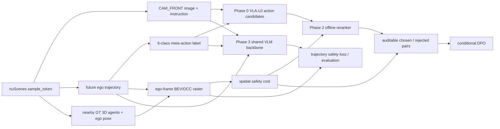

# 融合 BEV/OCC-aware 空间评估的 Safety-Aware VLA：分阶段项目计划

> **For agentic workers:** 按阶段门控执行；未经用户明确要求，不启用 subagent，不得跳过当前 gate。

**项目定位：** 融合 BEV 占用式空间评估的安全感知自动驾驶 VLA 项目（**Safety-Aware VLA for Autonomous Driving with BEV/OCC-aware Spatial Evaluation**）。

**目标：** 在 nuScenes 上建立一个可复现、可审计、可评测的 open-loop 自动驾驶 VLA：从 `CAM_FRONT`、驾驶指令和可追溯数据闭环出发，先学习 6 类 meta-action，再用由 nuScenes GT 派生的 BEV/OCC-aware 空间安全层评估候选行为，最后按验收结果扩展至 waypoint-level trajectory prediction。

**执行原则：** 先完成数据可信度，再证明动作语义可学；先建立空间安全评估与 offline reranker，再决定是否构造 DPO；trajectory-level 输出是完整版本的后续升级目标，不是当前数据阶段或 Phase 0 的替代品。

---

## 1. 技术定位与边界

本项目保留 VLA 主线，不改为纯 BEV、Occupancy 感知或传统规划项目。`CAM_FRONT` 图像和 instruction 是模型输入，6 类 meta-action 是第一层可解释的 VLA 输出；BEV/OCC-aware layer 是从 nuScenes 标注派生的空间评估模块，用来给候选 action 或 trajectory 提供可计算的安全代价。

固定 action schema：

```text
keep
accelerate
decelerate
stop
left_lateral
right_lateral
```

| 维度 | 当前 MVP / 后续确定路线 | 不作出的承诺 |
|---|---|---|
| 感知输入 | 当前为 single-camera `CAM_FRONT`；后续可扩展 multi-camera | 不训练完整 BEV occupancy prediction 网络 |
| 决策输出 | Phase 0 为 6 类 meta-action；Phase 3 规划为 K 个 future waypoints | 不把固定轨迹模板伪装成 trajectory planner |
| 空间安全 | 由 GT 3D boxes、ego pose、future trajectory 派生 BEV/OCC-aware evaluator | 不声称具备量产级一段式端到端自动驾驶能力 |
| 评测 | open-loop、固定 split、可回溯 sample-level 结果 | 不声称闭环控制、CARLA、实车或 real-time 能力 |
| preference learning | offline reranker 先行；DPO 为条件里程碑 | 不预先承诺 GRPO、RL 或 DPO 一定执行 |

以下表述必须保持准确：

> 本项目不训练完整 BEV occupancy prediction 网络；BEV/OCC-aware layer 是由 nuScenes 标注派生的空间评估层，用于安全评估、碰撞检测、偏好构造和面试解释。

`left_lateral` / `right_lateral` 不等价于 `turn_left` / `turn_right`。只有在实际引入 map、lane topology 或 route command 并修订规格后，才讨论更细的转弯或变道语义。

这条路线同时对齐两类技术能力：VLA 侧通过视觉语言表征、可解释 action supervision 与后续 shared trajectory head 对齐端到端规划趋势；BEV/OCC 侧通过 ego-frame raster、occupancy collision check、VRU / off-road safety cost 与空间评估证据链对齐岗位关键词。两者通过同一组可回溯的 nuScenes 样本和 safety interface 连接，而不是把项目拆成互不相关的分类器与 BEV 可视化。

---

## 2. 总体系统与数据流



每条训练、评测或审计样本至少保留：

```text
sample_token
scene_token
timestamp
cam_front_path
future_ego_trajectory
nearby_agents
meta_action
label_rule_version
safety_rule_version
split
```

空间评估或 preference 产物还必须保留 BEV raster 的生成配置、坐标约定、agent 类别映射、候选动作/轨迹、分项 safety cost 和触发对象。不同 `label_rule_version`、`safety_rule_version` 或 raster 配置不得静默混用。

---

## 3. 为什么必须保留 meta-action

meta-action 不是最终系统能力的全部，而是贯穿项目的必要语义层：

1. 它将连续的 ego future trajectory 转换为 VLA 可以学习、人工可读的驾驶动作语义。
2. 它使 Phase 0 成为受控的 6 类分类任务，先降低数据、训练和评测工程风险。
3. 它让人工抽检、confusion matrix、per-class F1 与 failure case analysis 有清晰的对象。
4. 它为 safety reranker 提供固定候选集合，也为 chosen/rejected preference pairs 提供可审计的比较单位。
5. 它在 Phase 3 中作为 trajectory head 的辅助监督和一致性约束，而非 trajectory 的硬规则前置。
6. 若跳过 meta-action 直接做连续 trajectory regression，将同时增加坐标对齐、标签噪声、碰撞评测、可解释性与调试难度，无法建立第一版可核查证据链。

因此，Phase 3 的正确关系是“共享 backbone，同时预测 action 与 trajectory”，而不是“先预测 action，再套固定轨迹模板”。

---

## 4. Phase -1：数据闭环与标签核验（训练前）

### 4.1 目标与当前状态

目标是确认 `CAM_FRONT`、future ego trajectory、nearby 3D agents、meta-action 与 manual review 之间的对齐可信，使后续训练数据可追溯、可审计。此阶段不训练模型，不进入 Phase 0。

截至已记录的 Phase -1.7 人工审核，108 个样本完成审核，trajectory 与 agent alignment 均为 `yes`；6 类 action 覆盖已补足，但 `keep` 与 speed-change、`stop` 与 `keep` 的边界规则仍需根据审核结论完成修订与版本冻结。因此 Phase -1 为“接近完成”，尚未自动授权进入 Phase 0。

### 4.2 必需输入与输出

```text
sample_token
→ CAM_FRONT image
→ future ego trajectory
→ nearby 3D agents
→ 6-class meta-action
→ one-page visualization
→ structured manual review
```

输出包括版本化 manifest、坐标/时间对齐证据、动作派生特征、人工审核记录、类别分布和可定位的错误样本。`uncertain` 不得视为正确标签，必须单独保留并排除出高置信度训练与 preference 数据。

### 4.3 Gate

只有满足以下条件才可开始 Phase 0：

- 任意抽样 `sample_token` 能定位图像、future trajectory、agents 与 meta-action；
- ego/global/sensor transform 顺序、轴方向、单位和时间窗口已经可视化核验；
- 至少 100 个样本的人工审核覆盖 6 类 action、VRU、有/无风险及规则边界；
- 系统性标签错误已修复，`label_rule_version` 与可训练 manifest 已冻结；
- review 状态、split 和规则版本可在 sample level 回溯。

未通过时只修复数据、标签、审核或评测协议；不得以 LoRA、DPO、GRPO 或扩大训练规模掩盖问题。

---

## 5. Phase 0：VLA-L0 meta-action baseline

### 5.1 目标

建立可复现的 6 类 meta-action prediction baseline，证明动作语义是否可学，并分离标签质量、类别不平衡、视觉输入价值和输出解析问题。Phase 0 不直接做 DPO，不直接训练 trajectory head。

### 5.2 严格执行顺序

1. 冻结 Phase -1 通过后的数据版本、`label_rule_version` 和可训练样本规则；
2. 建立 scene-level train/validation/test split，禁止同一 scene 或相邻帧跨 split；
3. 执行 manifest audit，核验 image、trajectory、agents、meta-action、review status、版本字段与 split；
4. majority baseline；
5. rule-based baseline；
6. zero-shot VLM prompt baseline；
7. few-shot VLM prompt baseline，示例不得来自 test scene；
8. LoRA 或 action adapter baseline；
9. 统一输出 confusion matrix、per-class F1、macro-F1、class distribution、invalid output rate、action parsing success rate 与 failure case analysis。

模型输入为 `CAM_FRONT image + instruction`；输出必须为受控 action vocabulary。可选 reason 不参与主指标，避免把自然语言流畅度误作驾驶正确性。

### 5.3 Gate 与失败定位

Phase 0 的 gate 是所有 baseline 在相同固定 test split 和相同输出 schema 下可复现比较，且结果可回溯到 sample-level prediction。majority accuracy 高而 macro-F1 低时，先报告类别失衡；rule-based 优于 VLM 时，先审视视觉增益；LoRA 不优于 prompt baseline 时，先检查标签、过拟合与数据量，不直接扩容。

---

## 6. Phase 1：BEV/OCC-aware spatial safety layer

### 6.1 目标

构建由 nuScenes GT 派生的 occupancy-style BEV raster 表征和可计算的空间安全代价。它服务于 trajectory safety evaluation、action safety scoring、offline reranker、DPO preference pair construction、可视化与 failure case analysis，而不是独立的完整感知网络训练项目。

当前不直接训练完整 occupancy network，原因是其需要单独定义并验证感知标签、时空输入、网络结构、感知指标和训练资源；这会掩盖当前“数据可信度 → action semantics → spatial safety evaluation”的主证据链，并超出 single-camera、open-loop MVP 的可控范围。先使用可审计的 GT-derived layer，可以在不虚构感知能力的前提下验证空间风险是否真的能改善候选 action 或 trajectory 的选择；完整 BEV/OCC prediction 仅在 Phase 4 作为受控复现方向考虑。

### 6.2 最小实现表征

在 ego frame 中定义固定范围、分辨率与时间语义明确的 BEV grid：

- `agent_occupancy_mask`：将 nearby GT 3D boxes rasterize 为 agent 占用区域；
- agent 类别通道：至少区分 vehicle 与 VRU，pedestrian / cyclist 能力取决于实际标注映射与样本覆盖；
- ego future trajectory / candidate rollout：以与 raster 一致的坐标和时间步写入或采样；
- trajectory-vs-occupancy collision check：输出碰撞对象、最小距离、发生时刻和 raster/几何证据；
- `vru_risk`、`off_road_risk`、`infeasibility`、`unnecessary_stop`、`harsh_action_or_jerk` 与可组合的 `safety_cost`；
- `drivable_mask` / `non_drivable_mask`：当可验证的 map 或 drivable-area 数据链路可用时加入；短期不可行时明确为 optional，不以猜测填充。

每项输出须写明 source frame、target frame、轴方向、单位、transform 顺序、raster 范围、分辨率、时间窗口、缺帧策略、规则版本和触发依据。

### 6.3 做什么，不做什么

| 做什么 | 不做什么 |
|---|---|
| 从 GT boxes、ego pose 与 future trajectory 派生可审计 BEV/OCC 表征 | 训练 BEVFormer、OccNet、SurroundOcc 或完整 occupancy predictor |
| 对 candidate action rollout 或 future waypoints 计算碰撞、VRU 距离与可选 off-road 风险 | 将 GT-derived evaluator 表述为在线感知能力 |
| 用合成确定性案例、人工审核与固定 split 验证安全代价 | 把 BEV-lite 降格为仅用于展示的可视化 |
| 为 reranker、pair construction 与 trajectory loss 提供统一空间接口 | 声称已经完成闭环规划或车辆控制 |

### 6.4 Gate

BEV/OCC-aware layer 必须在人工构造的 collision、near miss、VRU、off-road（若有 map）和 safe 案例上通过最小单元测试；在真实样本上可回溯对象与坐标；并能输出分项 cost，而非只有不可解释总分。若 drivable area 暂不可验证，冻结该项为 optional，仍可先完成 agent occupancy、collision 与 VRU 风险评估。

---

## 7. Phase 2：Safety reranker 与 preference learning

### 7.1 Offline reranker 先行

输入为 Phase 0 的固定 action candidates 与模型分数，以及 Phase 1 的 BEV/OCC-aware `safety_cost`。reranker 在相同 candidate set 内比较候选，选择更安全且更符合 trajectory/scene 约束的 action。

```text
L0 action candidates
→ BEV/OCC-aware safety cost
→ filter / rerank
→ action and safety metrics before vs. after
```

必须同时报告 action macro-F1、collision / near-collision、VRU violation、off-road risk（若可用）、infeasibility、harsh action / jerk 和 `unnecessary_stop`。风险下降若主要来自过量 `stop`，不得称为安全能力提升。

### 7.2 Preference pair construction

```text
chosen   = 更安全，且符合 GT trajectory / scene constraints 的 action
rejected = 具有 collision、VRU、off-road、infeasibility 或明显不合理风险的 action
```

每个 pair 必须保留 chosen/rejected、模型分数、完整分项 cost、margin、候选集定义、`sample_token`、split、label/safety/raster 版本和审核状态。仅因 `stop` 规避风险的 candidate 不可自动成为 chosen；`uncertain`、解析错误或低 margin 样本进入审核，不进入训练。

### 7.3 Conditional DPO

DPO 不是默认工作。只有同时满足数据质量已冻结、Phase 0 action baseline 可复现、Phase 1 scorer 的排序可解释且通过验收、preference pairs 完成人工审计、候选集合与版本冻结、对照组和停止条件明确时，才进入小规模 DPO。

对照至少包括 L0、L0 + reranker、DPO without safety terms、DPO with full safety terms。若 DPO 不优于 reranker，或伴随明显 macro-F1 下降 / `unnecessary_stop` 上升，则保留 reranker 为当前 MVP 结果；GRPO 和闭环 RL 不作为此路线的预设承诺。

---

## 8. Phase 3：Waypoint-level / trajectory-level VLA（完整版升级）

### 8.1 模型关系

Phase 3 使用共享 VLM backbone，同时输出 action 与 trajectory：

```text
VLM / Qwen-VL features
  ├── action head: 6-class meta-action
  └── trajectory head: K future waypoints
```

action head 为可解释辅助监督，trajectory head 才是更接近 planning 的输出。action 不是 trajectory head 的硬规则前置；两个 head 共享视觉语言表征，并由一致性目标约束。

### 8.2 训练目标

```text
L_total = L_action + lambda * L_traj + beta * L_safety + gamma * L_consistency
```

- `L_action`：6 类 meta-action 分类损失；
- `L_traj`：future K waypoints 的回归损失；
- `L_safety`：基于 Phase 1 BEV/OCC-aware layer 的空间安全代价；
- `L_consistency`：动作语义与轨迹行为的一致性，例如 `stop` 不应对应明显持续前进的 trajectory。

这是一条 planned 路线。只有在 waypoint target、坐标变换、time horizon、碰撞评测、数据 split、loss 权重和对照实验真实实现并验证后，才能报告 trajectory-level 结果。

---

## 9. Phase 4：可选增强（非当前 MVP gate）

- multi-camera；
- map / lane topology / route command；
- temporal context 与 ego-state history；
- 预训练 BEVFormer、OccNet、SurroundOcc 的受控复现实验；
- 在 Phase 3 已有可靠 open-loop 证据后，评估更高保真 planner 或其他研究方向。

这些均为 optional/stretch，不得阻塞 Phase -1 至 Phase 2 的闭环验收，也不得写成当前已完成能力。

---

## 10. 验收链与交付物

| 阶段 | 核心交付 | 进入下一阶段的条件 |
|---|---|---|
| Phase -1 | 可追溯数据闭环、版本化 meta-action、one-page visualization、人工审核 | 数据与标签规则冻结，未解决问题明确隔离 |
| Phase 0 | 统一 split、manifest audit、majority/rule/prompt/LoRA baselines、分类与失败分析 | 动作语义可在固定协议下复现评测 |
| Phase 1 | GT-derived BEV/OCC raster、分项 safety cost、确定性测试与可视化 | scorer 能解释和排序候选，optional map 项不伪造 |
| Phase 2 | 相同 candidate set 上的 reranker 对照、可审计 preference pairs | 仅在 reranker 与 pair audit 均通过后评估 DPO |
| Phase 3 | shared action/trajectory heads、K-waypoint 评测与安全代价 | trajectory 结果必须有真实实验与边界说明 |
| Phase 4 | 可选输入、时序、地图或预训练 BEV/OCC 对照 | 不影响前述 MVP 是否成立 |

所有实验均需报告实际配置、data split、`label_rule_version`、`safety_rule_version`、raster 配置、checkpoint 标识（如有）、sample-level 输出与失败案例。planned 的脚本、指标或模型能力不可写作已完成事实。

---

## 11. 最终简历与面试表述

推荐表述：

> 构建基于 nuScenes 的 Safety-Aware VLA 数据闭环，融合 CAM_FRONT、ego future trajectory 与 nearby 3D agents，派生 6 类可审计 meta-action 标签；进一步构建 BEV/OCC-aware 空间安全评估层，用于碰撞检测、VRU 风险评估、trajectory safety cost、offline reranking 与 preference pair 构造，并规划扩展至 waypoint-level trajectory prediction。

使用这段表述时必须按真实完成度删减：若 BEV/OCC-aware layer 或 reranker 尚未实现，只能表述为 planned；不得写“训练了完整 BEV occupancy network”“实现量产级一段式端到端自动驾驶”或“闭环自动驾驶控制”。

面试时可用的证据链为：meta-action 将连续轨迹转成可审核语义；Phase 0 先验证动作可学；Phase 1 将 GT-derived occupancy-style BEV 用作空间安全 evaluator；Phase 2 通过固定 candidate set 证明 reranker 是否真的降低风险；Phase 3 才将 action 作为 trajectory head 的辅助监督。

---

## 12. 当前下一步

当前仍在 Phase -1 gate：先根据已完成的人工审核修订并冻结标签规则、完成 manifest audit 的前置数据检查，再由 gate 决定是否开始 Phase 0。此次计划修订本身不授权训练、LoRA、DPO、GRPO、完整 occupancy network 或 waypoint-level 训练。
