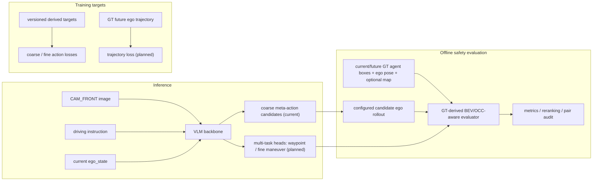

# 融合 BEV/OCC-aware 空间评估的 Safety-Aware VLA：分阶段项目计划

**项目定位：** Safety-Aware VLA for Autonomous Driving with BEV/OCC-aware Spatial Evaluation。项目从 single-camera、open-loop、6 类 coarse meta-action MVP 起步，长期扩展为 coarse-to-fine、共享多模态 backbone 的多任务 VLA；BEV/OCC-aware layer 是 GT-derived 的离线空间评估层，不是完整 occupancy prediction 网络，也不代表闭环控制或量产部署。

当前固定 coarse action schema：

```text
keep
accelerate
decelerate
stop
left_lateral
right_lateral
```

当前 6 类是第一阶段的 coarse behavior representation、baseline 和辅助监督，不是最终固定动作空间。`left_lateral` / `right_lateral` 只表示未来轨迹中稳定的左右横向运动；当前不区分 lane change、turn、follow-road-curve 或其他横向运动原因，不能直接解释为左/右变道或左/右转。

## 1. 信息边界与总体数据流

### 1.1 Inference inputs

推理时模型只可使用：

- `CAM_FRONT` image；
- driving instruction；
- current `ego_state`，可包含当前速度、加速度、yaw rate。

推理时不得使用 future ego trajectory、GT meta-action、GT BEV/OCC raster、未来 GT agents 或 test labels。



`GT meta-action` 与 GT future trajectory 仅是训练 target；GT agents、ego pose 和 optional map 仅进入离线 evaluator。模型 backbone、action candidate generator 和推理输入之间不接收任何 future 或 GT safety 信息。

### 1.2 Sample-level reproducibility contract

基础数据提取结果应长期稳定并可复用：

```text
sample_token
scene_token
timestamp
cam_front_path
current_ego_pose
current_ego_motion
future_ego_trajectory
nearby_agents
split
```

动作、轨迹和其他监督信号是可版本化的派生 targets：

```yaml
targets:
  meta_action_coarse: current coarse target role; formal manifest v1 field planned
  meta_action_rule_version: current coarse rule-version role; formal manifest v1 field planned
  future_waypoints: planned
  trajectory_valid_mask: planned
  longitudinal_action: planned
  lateral_direction: planned
  maneuver_type: planned
  fine_action_rule_version: planned
```

基础字段不因 action 规则扩展而重写；当前冻结产物的 `meta_action` / `label_rule_version` 分别承载上述 coarse target 与 rule-version 角色，正式 manifest v1 不得静默改变其语义。动作规则变化必须提升对应 rule version，不同 label version、coarse 与 fine 标签不得静默混用。新增输出 head 时优先扩展 `targets`，并继续使用固定的 scene-level train/validation/test split；test split 不因标签、prompt 或模型结果反复调整。安全评估、rollout 或 preference 产物还必须记录 `raster_config_version`、坐标系/单位/transform 顺序、候选 action 或 trajectory、时间步、`motion_assumption`（如有）、分项 safety cost 与触发对象。

## 2. 为什么保留 coarse meta-action

coarse meta-action 将连续 ego trajectory 转换成 VLA 可学习、人工可审核的行为语义，使首版先成为可控的 6 类分类任务；它支持 class distribution、confusion matrix、per-class F1 和 failure case analysis，也是 action reranker 与 chosen/rejected preference pairs 的固定比较单位。它保留为长期 baseline、可解释输出和后续多任务模型的辅助监督，而非不断扩展的互斥类别集合。

真实驾驶动作可组合，例如“左转+减速”“右变道+保持速度”“直行+加速”。长期方案因此采用层级/多头表示：

```text
shared multimodal backbone
├── coarse meta-action head                 (current)
├── longitudinal action head                (planned)
├── lateral direction head                  (planned)
├── maneuver type head                      (planned)
├── continuous waypoint head                (planned)
└── optional BEV / occupancy auxiliary head (planned)
```

后续 `longitudinal_action` 可为 `keep / accelerate / decelerate / stop`，`lateral_direction` 可为 `none / left / right`；引入必要上下文后，`maneuver_type` 才可为 `lane_change / turn / follow_road_curve / other`。只有引入 map、lane topology、intersection topology、route command 或 short temporal context 的至少一部分后，才能可靠区分 turn 与 lane change；届时保留 coarse lateral label，新增并重新抽检 fine-grained maneuver label。原有基础数据管线、轨迹、scene split 与 backbone 可复用，但 fine-grained classification head 和相关 preference data 需要重建。

## 3. BEV/OCC-aware temporal spatial evaluation

### 3.1 表征与信息来源

计划中的 evaluator 使用 ego-frame temporal occupancy：

```text
occupancy[T, C, H, W]
```

- `T`：离散时间步，与 candidate rollout 或 predicted trajectory 的 horizon 对齐；
- `C`：至少 vehicle 与 VRU 类别通道；可验证时再细分 pedestrian/cyclist，并可加入 drivable/non-drivable channel；
- `H, W`：配置化的 BEV 网格大小与分辨率。

当前 agent boxes 只能构造 current occupancy。future occupancy 优先由后续 nuScenes annotations 在对应未来时间步构造；若暂时只能使用 constant-velocity 或 static-agent fallback，必须在产物中记录 `motion_assumption`、参数和版本。static occupancy 只是评估近似，不能描述为真实 future occupancy prediction。

### 3.2 Candidate rollout 与 collision check

```text
meta-action
→ configured short-horizon ego rollout
→ temporal occupancy collision / near-miss evaluation
```

candidate rollout 只用于 offline 候选动作比较，不冒充真实车辆动力学、在线规划器或闭环控制。每个 rollout 必须记录 action 参数、时间步、source/target frame、轴方向、单位、horizon 与规则版本；collision/near-miss check 必须使用 candidate ego rollout 或模型 predicted trajectory，不能直接用 GT ego trajectory 代替候选行为。

### 3.3 能力边界

Phase 0.5 不训练 BEVFormer、OccNet、SurroundOcc 或完整 occupancy network。GT-derived evaluator 只负责 offline metrics、reranking、preference pair construction、failure analysis 和可视化；这使项目既保留 VLA 的输入/输出主线，也能以可验证的 occupancy-style 空间接口对齐 BEV/OCC 岗位关键词。

## 4. Phase -1：数据闭环与 coarse 标签核验（当前）

| 项目 | 定义 |
|---|---|
| 输入 | nuScenes `sample_token`、`CAM_FRONT`、future ego trajectory、nearby 3D agents、人工审核记录 |
| 输出 | one-page visualization、版本化 coarse meta-action、审核证据、待冻结 manifest 前置检查 |
| 核心脚本（已存在） | `data/inspect_nuscenes_sample.py`、`data/derive_meta_action.py`、`data/verify_labels.py`、`data/select_manual_review_samples.py` |
| 核心测试（已存在） | `tests/test_inspect_nuscenes_sample.py`、`tests/test_verify_labels.py`、`tests/test_meta_action.py`、`tests/test_phase_1_7_manual_audit.py` |

已确认事实：`CAM_FRONT`、future ego trajectory 与 nearby agents 已可读取并可视化；已派生 6 类 coarse meta-action；108 个样本已人工审核，且 6 类 action 已有审核覆盖。VRU presence 是本阶段 gate 的必需覆盖维度，需与规则冻结一并核验。当前 `safety_rule_version=not_available`，因此本阶段不把 collision、near miss、safe/unsafe 或 `safety_score_reasonable` 作为审核完成条件。

**Gate：** 图像、future trajectory 与 nearby agents 对齐；6 类 coarse meta-action、VRU presence 和 action boundary cases 已覆盖；`meta_action_rule_version` 已修订并冻结；manifest audit 前置检查可核验。未通过前不进入 Phase 0.1，也不训练模型。

## 5. Phase 0.1：manifest 协议、scene-level split 与 Majority Baseline（planned）

| 项目 | 定义 |
|---|---|
| 输入 | 冻结后的 coarse label、稳定基础字段、scene-level split |
| 输出 | sample-level predictions、macro-F1、per-class F1、confusion matrix、class distribution、invalid output rate、failure cases |
| 核心脚本/测试 | planned：manifest audit、baseline runner、action parser、split-leakage test 与 baseline metric test |

严格顺序：冻结数据版本与 `meta_action_rule_version` → scene-level train/val/test split → manifest audit（image / trajectory / agents / meta-action / review status）→ Majority Baseline。所有方案共享同一固定 test split 与 action vocabulary；few-shot examples 不得来自 test scene。

**Gate：** manifest 与 sample-level 输出可追溯，scene split 无泄漏，Majority Baseline 在统一协议下可复现。majority accuracy 高但 macro-F1 低时先诊断类别失衡。

## 6. Phase 0.1b：nuScenes mini → trainval scale-up（planned）

mini 用于数据链路 smoke test、快速回归、人工审核和小规模调试，不作为正式 LoRA、DPO 或最终性能结论的数据规模。本阶段在任何正式 LoRA、action adapter 或 DPO 前发生：扩展到 trainval，生成正式 dataset manifest v1，重新统计类别分布并抽检边界样本。

**Gate：** trainval manifest v1、scene-level split、类别统计与边界样本审核均可追溯。完成前只允许 mini smoke run，不进入正式训练或 DPO。

## 7. Phase 0.2：ego-motion rule baseline（planned）

rule-based baseline 只可使用 inference-time current/past ego state，禁止读取 future ego trajectory、derived meta-action 或任何 test label。它与后续视觉模型共享 Phase 0.1b 固定 test split、action vocabulary 和指标协议。

**Gate：** current/past ego-state 输入字段经过审计，sample-level 输出可复现；若 rule baseline 优于视觉模型，先评估视觉增益。

## 8. Phase 0.3：Qwen3-VL zero-shot / few-shot baseline（planned）

评估 image-only 与 image + current ego-state 的 zero-shot / few-shot VLM；few-shot examples 不得来自 test scene。所有输出必须经过同一 action parser，并报告 invalid output rate。

**Gate：** 与 Phase 0.1b/0.2 在相同固定 test split 和指标协议下比较，不以 prompt 或模型结果调整 test split。

## 9. Phase 0.4：coarse meta-action LoRA / action adapter（planned）

正式训练必须基于 trainval manifest；mini 上只允许 smoke run。coarse checkpoint 可作为未来多任务模型的初始化或对照，但旧分类 head 不保证直接适用于扩展后的 target 空间。

**Gate：** 相同数据协议下的 LoRA/action adapter 对照可复现；若无提升，先复核数据与标签，不扩容训练。

## 10. Phase 0.5：BEV/OCC-aware safety scorer 与 offline reranker（planned）

| 项目 | 定义 |
|---|---|
| 输入 | current/future GT agent boxes、ego pose、optional map、candidate action rollout 或 predicted trajectory |
| 输出 | `occupancy[T,C,H,W]`、collision/near-miss、VRU risk、optional off-road risk、分项 safety cost、可视化 |
| 核心脚本/测试 | planned：BEV raster builder、temporal collision evaluator、rollout module；合成 collision/near-miss/VRU/off-road test |

**Gate：** scorer/evaluator 在确定性合成案例上可复现；真实样本的对象、时间步和坐标可回溯；future occupancy 的 annotation 或 fallback 假设完整记录；collision、near-miss、safe/unsafe 与 scorer reasonableness 的人工审核从本阶段开始。若 map 数据链路不可验证，off-road 项保持 optional。

reranker 以 candidate rollout 的 temporal occupancy 比较同一 candidate set；所有风险结果同时报告 action macro-F1、collision/near-miss、VRU violation、optional off-road、infeasibility、harsh action/jerk 和 `unnecessary_stop`。若 violation 下降主要来自 `stop` 增加，不得写成安全能力提升。

## 11. Phase 0.6：可选 coarse-action DPO（planned）

在输出协议稳定、trainval 数据完成、scorer 与 reranker gate 通过后，才可构建 chosen/rejected preference pairs；chosen 必须更安全且符合场景/轨迹约束，rejected 必须存在可解释风险。每个 pair 记录 margin、完整 cost、版本与审核状态，并通过 pair audit。

DPO 是 conditional milestone 和第一版 MVP 的可选终点，不是整个项目的最终终点。若 DPO 不优于 reranker，则保留 reranker；GRPO 与闭环 RL 不作预设承诺。若后续扩展为 fine maneuver 或 continuous waypoint，相关 preference pairs 需要重新构造，六类 DPO checkpoint 仅可作为初始化或对照。

## 12. 后续扩展：分层多任务 VLA 与评测（planned）

后续路线为：short temporal input → map / route / lane topology → hierarchical fine-grained maneuver → continuous waypoint head → BEV / occupancy auxiliary supervision → closed-loop or quasi-closed-loop evaluation。共享 VLM backbone 在相同 inference inputs 上输出 coarse meta-action 与后续多任务 head；coarse action 是辅助监督与语义解释层，continuous waypoint 才是更接近 planning 的输出。

默认训练目标为：

```text
L_total = L_action + lambda * L_traj + gamma * L_consistency
```

`L_consistency` 约束动作与轨迹语义，例如 `stop` 不应对应明显持续前进的 trajectory。Phase 0.5 的 safety scorer 默认只用于 offline metrics、reranking、pair construction 与 failure analysis；只有真实实现并验证 differentiable soft occupancy 或 distance-field surrogate 后，才可额外引入可反向传播的 `beta * L_safety`，并必须单独报告其实现、梯度路径和消融。

| 项目 | 定义 |
|---|---|
| 输入 | 与 Phase 0.1 相同的 inference-time image / instruction / current ego state，并在相应扩展阶段引入经批准的 temporal / map / route 输入 |
| target | coarse meta-action、fine-grained targets（planned）、GT future ego trajectory |
| 输出 | coarse action、fine-grained heads（planned）、K predicted waypoints（planned）、trajectory metrics 与 consistency analysis |
| 核心脚本/测试 | planned：shared-head model、trajectory metric evaluator、action-trajectory consistency test |

**Gate：** waypoint target、坐标变换、horizon、轨迹 metrics、collision evaluation 与对照实验均真实实现并验证后，才能报告 trajectory-level 结果。

multi-camera、预训练 BEVFormer/OccNet/SurroundOcc 的受控复现均为 optional/stretch，不阻塞前述 MVP gate，也不得写作已完成能力。

## 13. 实验表模板

### Data statistics

| Split | Samples | Six-action distribution | VRU presence | Boundary cases | Rule version |
|---|---:|---|---:|---:|---|
| Train / Val / Test | — | — | — | — | — |

### Action baseline

| Method | Inputs | Macro-F1 | Per-class F1 | Invalid output | Notes |
|---|---|---:|---|---:|---|
| Majority / ego-state rule / image-only VLM / image+ego VLM / LoRA | — | — | — | — | — |

### Safety / reranker

| Method | Candidate set | Collision | VRU | Off-road | Unnecessary stop | Macro-F1 |
|---|---|---:|---:|---:|---:|---:|
| Base / reranked / DPO conditional | — | — | — | — | — | — |

### Trajectory metrics

| Method | ADE/FDE or configured metric | Collision / near-miss | Consistency | Notes |
|---|---:|---:|---:|---|
| Trajectory head (planned) | — | — | — | — |

### Failure cases

| Error type | Representative `sample_token` | Root cause | Evidence / limitation |
|---|---|---|---|
| label / action / safety / trajectory | — | — | — |

## 14. 风险、Demo 与简历边界

| 风险 | 验证与处置 |
|---|---|
| future/GT leakage | 固定 inference contract；对 baseline 输入做字段审计 |
| future occupancy 不可得 | 优先 annotations；fallback 记录 `motion_assumption`，不冒充预测 |
| safety 偏向 `stop` | reranker 同时报 `unnecessary_stop` 与 macro-F1 |
| 单帧 lateral 不足 | 保留 coarse lateral baseline；后续引入时序/地图/route 前不生成 turn 或 lane-change 标签 |

最小 demo（Phase 0.5 后）展示 `CAM_FRONT`、inference inputs、GT action/trajectory（明确为 target）、候选 action rollout、temporal occupancy、碰撞触发对象、rerank 前后行为与版本信息；不得把 GT target 显示为模型推理输入。

简历中当前只能写已完成的 `CAM_FRONT` / future ego trajectory / nearby agents 对齐、meta-action derivation、108 样本人工审核及已存在脚本和测试。BEV/OCC-aware evaluator、reranker、DPO、trajectory head 与 occupancy prediction 必须标为 planned，直至有对应代码、配置和可核查结果。

## 15. 当前下一步

当前已通过 Phase -1 label freeze gate，下一步是 Phase 0.1 的 scene-level split、正式 manifest audit 与 Majority Baseline。随后必须先完成 Phase 0.1b trainval scale-up，才可进入正式 rule-based、VLM、LoRA、safety、reranker 或可选 DPO 阶段。本计划修订不授权 trainval scale-up 实施、训练、DPO、完整 occupancy network 或 trajectory-level 模型实施。
