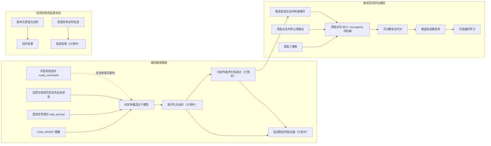

# 融合 BEV（鸟瞰图）/ OCC（占用表征）空间评估的 Safety-Aware VLA（安全感知视觉-语言-动作模型）：面试导向项目计划

**项目定位：** 本项目仍然是面向自动驾驶的 Safety-Aware VLA（安全感知视觉-语言-动作模型），并融合 BEV（鸟瞰图）/ OCC（占用表征）几何评估。项目以面试展示和可核查的系统能力为主线：展示自动驾驶数据解析与坐标处理、VLM（视觉语言模型）与 VLA（视觉-语言-动作模型）建模、动作空间设计、连续轨迹规划、BEV（鸟瞰图）/ occupancy（占用表征）离线几何评估，以及信息泄漏控制、工程测试、错误分析和系统集成能力。

本项目不以追求 SOTA（当前最优水平）、完整复现单篇论文、论文级大规模消融或穷举 backbone（主干模型）为目标，也不证明模型达到真实道路安全要求。当前能力边界是 single-camera（单相机）、open-loop planning（开环规划）与 non-reactive offline evaluation（非响应式离线评估）；项目不宣称 closed-loop driving（闭环驾驶）、量产部署或完整 occupancy prediction network（占用预测网络）能力。

最终主线为：

```text
CAM_FRONT image（前视相机图像）
+ current / past ego motion（当前 / 历史自车运动状态）
+ fixed task prompt（固定任务提示）
+ optional route command（可选导航指令）
→ shared multimodal backbone（共享多模态主干模型）
→ factorized meta-action（因子化元动作）
→ meta-action-conditioned waypoint prediction（元动作条件化轨迹点预测）
→ action-trajectory consistency verification（动作—轨迹一致性验证）
→ GT-derived BEV / occupancy evaluator（真值派生鸟瞰图 / 占用表征评估器）
→ candidate trajectory reranking（候选轨迹重排序）
→ optional preference learning（可选偏好学习）
```

当前固定的 legacy coarse action schema（历史粗粒度动作模式）为：

```text
keep
accelerate
decelerate
stop
left_lateral
right_lateral
```

这 6 类是已经完成的数据闭环成果、统一 baseline（基线）、可解释输出和后续多任务训练的辅助监督，不是最终动作空间。`left_lateral` / `right_lateral` 只表示未来轨迹中稳定的左右横向运动；当前不区分 lane change（变道）、turn（转弯）、follow-road-curve（沿弯道行驶）或其他横向运动原因，不能直接解释为左/右变道或左/右转。后续 planned（计划中）的连续 future waypoint（未来轨迹点）是更接近自动驾驶 planning（规划）的主要低层输出，但不能把尚未实现的轨迹模型改写为 Phase -1（阶段 -1）或 Phase 0.1（阶段 0.1）的已完成能力。

## 1. 信息边界与总体数据流

### 1.1 推理输入协议

推理输入必须按用途拆分，不能再用含义模糊的 driving instruction（驾驶指令）统称：

- `task_prompt`：固定任务说明，例如要求模型预测高层驾驶动作或未来轨迹；所有样本可使用同一模板，不包含由未来轨迹派生的信息。
- `route_command`：可选的样本级导航指令，例如直行、左转或右转；只有数据集提供可靠来源，且训练和推理阶段都能获得时才允许使用。当前 nuScenes（自动驾驶数据集）主线若没有可靠来源，不得默认把它加入模型输入。
- `natural_language_instruction`：自然语言驾驶指令；当前项目主线暂不使用，仅作为 future extension（未来扩展），不得写成现有数据字段。

推理时模型只允许使用：

- `CAM_FRONT` 图像；
- `task_prompt`；
- 当前自车运动状态；
- 经输入审计批准的历史自车运动状态；
- 可选的 `route_command`，但必须满足上述来源与可用性条件。

推理时明确禁止使用：

- future ego trajectory（未来自车轨迹）；
- GT meta-action（真值元动作）；
- 由 future ego trajectory（未来自车轨迹）派生的 `route_command`；
- GT boxes（真值三维框）或 GT occupancy（真值占用表征）；
- future agents（未来交通参与者状态）；
- test labels（测试标签）；
- 任何 evaluator-only information（仅供评估器使用的信息）。

不能先根据 future ego trajectory（未来自车轨迹）判断车辆未来左转，再把“左转”作为模型输入；这种做法把 target（目标）转换成输入，属于 target leakage（目标泄漏）。`current_ego_pose` 与 `current_ego_motion` 的既有字段定义和时间戳来源保持不变，本轮不修改已冻结的 manifest schema（清单模式）。

### 1.2 总体数据流与职责边界



shared multimodal backbone（共享多模态主干模型）提取图像、固定任务提示和自车状态特征；factorized meta-action（因子化元动作）表达高层纵向与横向意图；meta-action-conditioned waypoint prediction（元动作条件化轨迹点预测）把高层意图落实为连续轨迹。trajectory-to-action verifier（轨迹到动作验证器）检查动作与轨迹是否一致，GT-derived BEV / occupancy evaluator（由真值构造的鸟瞰图 / 占用表征评估器）则只在模型外部评估候选轨迹的空间风险。重排序后的候选可用于 sample-level output（样本级输出）、failure case analysis（失败案例分析）和 optional preference learning（可选偏好学习），但偏好学习不是项目必须终点。

GT meta-action（真值元动作）与 GT future ego trajectory（真值未来自车轨迹）只作为训练 target（目标）；GT boxes（真值三维框）、GT-derived occupancy（真值派生占用表征）、ego pose（自车位姿）与 optional map（可选地图）只进入 oracle offline evaluator（真值离线评估器）。模型推理路径不接收任何 future information（未来信息）或 GT safety information（真值安全信息）。当前已实现的是 coarse label/data protocol（粗粒度标签与数据协议）；因子化动作预测头、连续轨迹点预测、轨迹到动作验证器、LoRA（低秩适配）和候选轨迹重排序均为 planned（计划中）。

### 1.3 样本级可复现协议

基础数据提取结果应长期稳定并可复用：

```text
sample_token
scene_token
timestamp
cam_front_path
current_ego_pose
current_ego_motion
coordinate_metadata
future_ego_trajectory
nearby_agents
split
manifest_schema_version
```

当前 audited seed-subset schema（已审核种子子集模式）的派生与追溯字段为：

```text
meta_action
label_rule_version
safety_rule_version
source_audit_record
```

当前 schema version（模式版本）为 `phase0_audited_seed_subset_v1`，`label_rule_version=phase-1.6-meta-action-v0.2`。`current_ego_pose` 至少包含 `frame`、`translation_m`、`rotation_wxyz`、`timestamp_us` 与 `timestamp_source`；`current_ego_motion` 至少包含 `speed_mps`、`longitudinal_acceleration_mps2`、`yaw_rate_radps`、`source`、`timestamp_source`、`availability`、`history_interval_sec`、`acceleration_interval_sec` 与 `unavailable_reason`。两者的 timestamp source（时间戳来源）均为 `CAM_FRONT_sample_data`，motion（运动状态）只使用当前和历史 pose（位姿），不使用 future pose（未来位姿）或 future trajectory（未来轨迹）。当前 `meta_action` / `label_rule_version` 分别承担 coarse action（粗粒度动作）与其 rule version（规则版本）角色；不得提前重命名为 `meta_action_coarse` / `meta_action_rule_version`。该 schema（模式）是 audited seed-subset schema（已审核种子子集模式），不是正式 trainval manifest v1（训练验证清单第一版）；后续动作空间扩展必须新增可版本化 target（目标），不能覆盖或静默修改现有字段。

动作规则变化必须提升对应 rule version（规则版本），不同 label version（标签版本）、legacy coarse action（历史粗粒度动作）与新因子化标签不得静默混用。新增 action head（动作预测头）时优先扩展 targets（目标），并继续使用固定的 scene-level train/validation/test split（场景级训练/验证/测试切分）；test split（测试切分）不因标签、prompt（提示）或模型结果反复调整。安全评估、rollout（轨迹展开）或 preference（偏好）产物还必须记录 `raster_config_version`、坐标系、单位、transform order（变换顺序）、候选动作或轨迹、时间步、`motion_assumption`（如有）、分项安全代价与触发对象，以支持 sample-level reproducibility（样本级复现）。

## 2. 为什么保留 coarse meta-action（粗粒度元动作）

### 2.1 Legacy coarse action schema（历史粗粒度动作模式）

现有六类动作必须作为 legacy coarse action schema（历史粗粒度动作模式）继续保留：

```text
keep
accelerate
decelerate
stop
left_lateral
right_lateral
```

它将连续 ego trajectory（自车轨迹）转换为 VLA（视觉-语言-动作模型）可学习、人工可审核的行为语义，承担五项稳定职责：保留 Phase -1（阶段 -1）的标签成果；作为 Majority Baseline（多数类基线）和早期模型的统一比较空间；提供简单且可审核的粗粒度驾驶行为；作为后续多任务训练的辅助监督；为 failure case analysis（失败案例分析）提供可解释语义。现有六类标签及 `label_rule_version=phase-1.6-meta-action-v0.2` 不删除、不重命名，也不因新增动作空间而静默改变。

这套模式适合验证 class distribution（类别分布）、confusion matrix（混淆矩阵）、per-class F1（各类别 F1）和 macro-F1（宏平均 F1），但不适合作为最终动作空间。原因是六类互斥标签不能完整表达同时发生的横向与纵向行为，例如“减速并向左”“保持速度并向右”或“加速直行”。

### 2.2 Factorized meta-action（因子化元动作）

最终高层动作空间采用两个可组合的 action head（动作预测头）：

```text
longitudinal_action:
  - stop
  - decelerate
  - keep
  - accelerate

lateral_action:
  - left
  - straight
  - right
```

因子化设计让 longitudinal action（纵向动作）与 lateral action（横向动作）自由组合，例如 `decelerate + left`、`keep + right` 和 `accelerate + straight`。与持续扩展单一互斥类别集合相比，它更贴近真实驾驶动作的组合性，也更容易维护标签、预测头和评测协议。两个预测头可分别报告 longitudinal macro-F1（纵向宏平均 F1）和 lateral macro-F1（横向宏平均 F1），组合结果再报告 joint accuracy（联合准确率）；这样既保留高层动作的可解释性，也能对两个方向的错误分别定位。

第一版不直接增加 `lane_change`、`turn`、`follow_road_curve`、`overtake` 或 `yield`。仅凭单帧 `CAM_FRONT` 和 ego trajectory（自车轨迹），通常无法稳定区分 lane change（变道）、turn（转弯）与 follow-road-curve（沿弯道行驶）。只有后续加入 map（地图）、lane topology（车道拓扑）、intersection topology（路口拓扑）、可靠的 route command（导航指令）或 temporal input（时序输入）中的至少一部分后，才允许新增细粒度 maneuver type（机动类型），并为新标签建立独立版本与审核记录。

### 2.3 Continuous waypoint action space（连续轨迹点动作空间）

planned（计划中）的主要低层输出定义为：

```text
future_waypoints shape: [B, 6, 2]
prediction horizon: 3.0 seconds
sampling interval: 0.5 seconds
coordinate frame: current ego frame
x-axis: positive forward
y-axis: positive left
unit: meter
```

`B` 表示 batch size（批大小）；`6` 表示未来 3.0 秒内每隔 0.5 秒预测一个轨迹点；`2` 表示每个轨迹点包含 `(x, y)`。全部轨迹点位于当前时刻的 ego frame（自车坐标系），其中 x 轴正方向向前、y 轴正方向向左，单位为米。第一版不直接预测 steering（转向角）、throttle（油门）或 brake（制动）。

选择 waypoint（轨迹点）而不是底层控制量，是因为 nuScenes（自动驾驶数据集）没有与本项目一一对应的完整底层控制监督，项目也没有真实车辆动力学模型和 closed-loop control environment（闭环控制环境）。waypoint（轨迹点）可以与现有 future ego trajectory（未来自车轨迹）直接对齐，并可计算 ADE（平均位移误差）、FDE（最终位移误差）、collision check（碰撞检查）以及 BEV（鸟瞰图）/ occupancy evaluation（占用表征评估）；这与当前项目能够真实实现和核查的能力边界一致。

第一版 planned model structure（计划中的模型结构）为：

```text
shared multimodal backbone（共享多模态主干模型）
├── longitudinal action head（纵向动作预测头）
├── lateral action head（横向动作预测头）
└── meta-action-conditioned waypoint head（元动作条件化轨迹点预测头）
```

shared multimodal backbone（共享多模态主干模型）提取图像、任务提示和自车状态特征；longitudinal action head（纵向动作预测头）输出四类纵向动作；lateral action head（横向动作预测头）输出三类横向动作。meta-action-conditioned waypoint head（元动作条件化轨迹点预测头）同时接收共享特征和高层动作 embedding（嵌入），输出 `[B, 6, 2]` 连续轨迹点。高层动作回答“准备做什么”，连续轨迹回答“具体怎么移动”。本轮只定义接口，不提前规定 model code（模型代码）、loss weight（损失权重）或 training hyperparameter（训练超参数）。

### 2.4 Trajectory-to-action verifier（轨迹到动作验证器）

本项目借鉴 DriveMA（可验证元动作驾驶视觉-语言-动作模型）的可迁移接口思想，但不复现其完整训练方案：

```text
input x
→ predicted meta-action m
→ predicted trajectory τ
→ project trajectory back to action space
→ compare implied action with predicted action
```

planned trajectory-to-action verifier（计划中的轨迹到动作验证器）根据预测轨迹的位移、速度趋势和横向运动，反推出 trajectory-implied action（轨迹隐含动作），再与模型预测的 longitudinal action（纵向动作）和 lateral action（横向动作）比较，计算 action-trajectory consistency（动作—轨迹一致性）。它可以识别“高层动作预测减速，但轨迹仍持续加速”这类语言—动作不一致问题，并为 failure case analysis（失败案例分析）、reranker（重排序器）和 optional preference learning（可选偏好学习）提供可解释信号。

第一版 verifier（验证器）首先是规则化检查工具，不承诺实现 DriveMA（可验证元动作驾驶视觉-语言-动作模型）的 GRPO（组相对策略优化）、turn-level credit assignment（轮次级信用分配）、全参数训练或海量数据方案。项目先通过 supervised training（监督训练）、规则验证和候选轨迹重排序展示语言—动作对齐能力，不需要论文规模的 reinforcement learning（强化学习）。

## 3. BEV（鸟瞰图）/ occupancy（占用表征）与 geometric safety scorer（几何安全评分器）

### 3.1 对象级与栅格级表征

BEV（鸟瞰图）/ occupancy（占用表征）是场景空间表示，不直接等于 safety decision（安全决策）。geometric safety scorer（几何安全评分器）必须同时保留 candidate trajectory（候选轨迹）、自车几何轮廓和场景几何关系，不能把占用表征本身当成最终安全分数。

object-level representation（对象级表征）以时间对齐的 GT 3D boxes（真值三维框）保留对象 token（标识）、类别、位置、朝向、尺寸和时间步，适合追溯具体碰撞对象。raster-level representation（栅格级表征）将相同几何信息转换为 ego-centric temporal occupancy（自车中心时序占用表征）：

```text
occupancy[T, C, H, W]
```

- `T`：离散时间步，与 candidate trajectory（候选轨迹）的 horizon（预测时域）对齐；
- `C`：至少包含 vehicle（车辆）与 VRU（弱势道路使用者）通道；数据链路可验证时再细分 pedestrian（行人）/ cyclist（骑行者），并可加入 drivable area（可行驶区域）通道；
- `H, W`：配置化的 BEV grid（鸟瞰图网格）大小与分辨率。

两种表征共享坐标系、时间步、对象 token（标识）、motion assumption（运动假设）与版本记录。current agent boxes（当前交通参与者框）只能构造当前占用；future occupancy（未来占用表征）优先由对应未来 annotation（标注）构造。若只能使用 constant-velocity assumption（恒速假设）或 static-agent assumption（静态交通参与者假设），必须显式记录假设、参数和版本。

### 3.2 以预测轨迹为主的评估器接口

最终主接口为：

```text
predicted waypoint trajectory（预测轨迹点序列）
→ ego footprint rollout（自车轮廓展开）
→ GT boxes or GT-derived temporal occupancy（真值三维框或真值派生时序占用表征）
→ decomposed safety costs（可分解安全代价）
```

predicted waypoint trajectory（预测轨迹点序列）是最终主要评估对象。评估器先把轨迹点转换为带尺寸和朝向的 ego footprint rollout（自车轮廓展开），再与 GT boxes（真值三维框）或 GT-derived temporal occupancy（真值派生时序占用表征）进行逐时间步几何比较，输出可追溯的 decomposed safety costs（可分解安全代价）。这种接口让轨迹预测、碰撞检查和风险解释共享同一坐标与时间协议，也使评估结果可以定位到具体 `sample_token`、候选轨迹、时间步和触发对象。

在 continuous waypoint head（连续轨迹点预测头）尚未实现前，允许使用以下临时接口做 scorer smoke test（评分器冒烟测试）：

```text
coarse action（粗粒度动作）
→ configured short-horizon rollout（配置化短时域轨迹展开）
→ ego footprint rollout（自车轮廓展开）
→ GT-derived evaluator（真值派生评估器）
```

coarse action rollout（粗粒度动作轨迹展开）只是过渡方案，用于先验证几何规则、坐标变换和可分解代价；它不是最终主要评估对象，也不冒充真实车辆动力学、在线规划器或 closed-loop control（闭环控制）。每个 rollout（轨迹展开）必须记录动作参数、时间步、source frame（源坐标系）、target frame（目标坐标系）、轴方向、单位、horizon（预测时域）和规则版本。

GT future ego trajectory（真值未来自车轨迹）不得替代模型候选轨迹进行碰撞评分，否则评估到的是数据集中的真实未来行为，而不是模型计划的安全性。GT boxes（真值三维框）、future GT agents（未来真值交通参与者）和 GT occupancy（真值占用表征）只能进入 evaluator（评估器），不能进入 VLA（视觉-语言-动作模型）的推理输入。

### 3.3 安全代价、重排序与能力边界

geometric safety scorer（几何安全评分器）应输出 collision（碰撞）、near-miss（近失碰撞）、VRU distance violation（弱势道路使用者距离违规）、TTC（碰撞时间）、infeasibility（不可行性）、unnecessary stop（不必要停车）和 harsh action / jerk（激烈动作 / 加加速度）等分项代价。drivable-area evaluation（可行驶区域评估）只有在 map（地图）数据来源和坐标对齐可验证时才启用。分项输出而非单一总分，便于核查 safety-performance trade-off（安全性与行驶性能权衡），也能避免仅靠增加 `stop` 获得表面风险下降。

candidate trajectory reranking（候选轨迹重排序）必须在固定候选集合上比较模型分数、动作—轨迹一致性和几何安全代价。每条候选仍遵循 `[6, 2]` 的单轨迹接口；候选生成方式和候选数量留待后续 Phase（阶段）定义，不改变 `future_waypoints` 的 `[B, 6, 2]` 批量输出协议。重排序结果应保留候选轨迹、原始顺序、代价分解、触发对象与最终选择，形成可复现的 sample-level output（样本级输出）。optional preference learning（可选偏好学习）只能使用通过审核的候选比较信号；它是后续可选模块，不是项目必须终点。

当前不训练完整的 BEVFormer（鸟瞰图特征学习模型）、OccNet（占用网络）、SurroundOcc（环视占用预测模型）或其他 occupancy prediction network（占用预测网络）。GT-derived evaluator（真值派生评估器）只负责 offline spatial evaluation（离线空间评估）、candidate trajectory reranking（候选轨迹重排序）、preference pair construction（偏好对构造）、failure case analysis（失败案例分析）和可视化。项目仍是 open-loop planning（开环规划）与 non-reactive offline evaluation（非响应式离线评估），不能写成真实 closed-loop driving（闭环驾驶）。

### 3.4 面试能力映射

| 能力 | 通过什么代码或结果证明 |
|---|---|
| 数据工程能力 | 通过 `data/inspect_nuscenes_sample.py` 的 nuScenes（自动驾驶数据集）解析与坐标变换、manifest versioning（清单版本管理）、scene-level split（场景级切分）验证，以及可追溯的样本级清单和审核结果证明。 |
| 多模态模型能力 | 后续通过 planned（计划中的）Qwen3-VL（通义千问第三代视觉语言模型）接入、LoRA（低秩适配）配置、multimodal feature fusion（多模态特征融合）实现和 custom action head（自定义动作预测头）测试证明；在对应代码和结果出现前不写成已完成。 |
| 自动驾驶规划能力 | 后续通过 factorized action space（因子化动作空间）协议、waypoint prediction（轨迹点预测）样本级输出、ADE（平均位移误差）/ FDE（最终位移误差）以及 action-conditioned planning（动作条件化规划）的一致性报告证明。 |
| BEV（鸟瞰图）/ occupancy（占用表征）能力 | 后续通过 temporal occupancy rasterization（时序占用栅格化）代码、确定性 collision checking（碰撞检查）测试、TTC（碰撞时间）结果、可选 drivable-area evaluation（可行驶区域评估）和触发对象可视化证明。 |
| 系统分析能力 | 通过 information leakage prevention（信息泄漏防护）的输入字段审计、action-trajectory consistency（动作—轨迹一致性）检查、failure case analysis（失败案例分析）样本和 safety-performance trade-off（安全性与行驶性能权衡）对比结果证明。 |

## 4. Phase -1：数据闭环与 coarse 标签核验（当前）

| 项目 | 定义 |
|---|---|
| 输入 | nuScenes `sample_token`、`CAM_FRONT`、future ego trajectory、nearby 3D agents、人工审核记录 |
| 输出 | one-page visualization、版本化 coarse meta-action、审核证据、待冻结 manifest 前置检查 |
| 核心脚本（已存在） | `data/inspect_nuscenes_sample.py`、`data/derive_meta_action.py`、`data/verify_labels.py`、`data/select_manual_review_samples.py` |
| 核心测试（已存在） | `tests/test_inspect_nuscenes_sample.py`、`tests/test_verify_labels.py`、`tests/test_meta_action.py`、`tests/test_phase_1_7_manual_audit.py` |

已确认事实：`CAM_FRONT`、future ego trajectory 与 nearby agents 已可读取并可视化；已派生 6 类 coarse meta-action；108 个样本已人工审核，且 6 类 action 已有审核覆盖。VRU presence 是本阶段 gate 的必需覆盖维度，需与规则冻结一并核验。当前 `safety_rule_version=not_available`，因此本阶段不把 collision、near miss、safe/unsafe 或 `safety_score_reasonable` 作为审核完成条件。

**Gate：** 图像、future trajectory 与 nearby agents 对齐；6 类 coarse meta-action、VRU presence 和 action boundary cases 已覆盖；`label_rule_version=phase-1.6-meta-action-v0.2` 已冻结；manifest audit 前置检查可核验。该 gate 已通过。

## 5. Phase 0.1：manifest 协议、scene-level split 与 Majority Baseline（completed）

| 项目 | 定义 |
|---|---|
| 输入 | 冻结后的 coarse label、audited seed-subset manifest、固定 seed 的 scene-level split |
| 输出 | sample-level predictions、macro-F1、per-class F1、confusion matrix、class distribution、invalid prediction 指标、failure cases |
| 核心脚本/测试 | `data/build_phase0_manifest.py`、`src/phase0/protocol.py`、`src/baselines/majority.py` 与对应 manifest/protocol/majority tests |

Phase 0.1 已完成：冻结数据版本与 coarse rule version → 固定 seed 的 scene-level train/val/test split → 完整 manifest contract validation → 六类统一指标与 invalid prediction 处理 → Majority Baseline。所有方案共享同一固定 test split 与 action vocabulary；few-shot examples 不得来自 test scene。

**Gate：** Phase -1 freeze gate 已通过；manifest 与 sample-level 输出可追溯，scene split 无泄漏，Majority Baseline 在统一协议下可复现。majority accuracy 高但 macro-F1 低时先诊断类别失衡。

## 6. Phase 0.1b：nuScenes mini → trainval scale-up（planned）

mini 用于数据链路 smoke test、快速回归、人工审核和小规模调试，不作为正式 LoRA、DPO 或最终性能结论的数据规模。本阶段在任何正式 LoRA、action adapter 或 DPO 前发生：扩展到 trainval，生成正式 dataset manifest v1，重新统计类别分布并抽检边界样本。

**Gate：** trainval manifest v1、scene-level split、类别统计与边界样本审核均可追溯。完成前只允许 mini smoke run，不进入正式训练或 DPO。

## 7. Phase 0.2：ego-motion rule baseline（planned）

rule-based baseline 只可使用 inference-time current/past ego state，禁止读取 future ego trajectory、derived meta-action 或任何 test label。它与后续视觉模型共享 Phase 0.1b 固定 test split、action vocabulary 和指标协议。

**Gate：** current/past ego-state 输入字段经过审计，sample-level 输出可复现；若 rule baseline 优于视觉模型，先评估视觉增益。

## 8. Phase 0.3：Qwen3-VL zero-shot / few-shot baseline（planned）

评估 image-only 与 image + current ego-state 的 zero-shot / few-shot VLM；few-shot examples 不得来自 test scene。所有输出必须经过同一 action parser，并报告 invalid output rate。

**Gate：** 与 Phase 0.1b/0.2 在相同固定 test split 和指标协议下比较，不以 prompt 或模型结果调整 test split。

## 9. Phase 0.4：coarse meta-action LoRA / action adapter（planned）

正式训练必须基于 trainval manifest；mini 上只允许 smoke run。coarse checkpoint 可作为未来多任务模型的初始化或对照，但旧分类 head 不保证直接适用于扩展后的 target 空间。

**Gate：** 相同数据协议下的 LoRA/action adapter 对照可复现；若无提升，先复核数据与标签，不扩容训练。

## 10. Phase 0.5a：GT-derived geometric safety scorer（planned）

| 项目 | 定义 |
|---|---|
| 输入 | candidate action rollout 或 predicted trajectory；GT 3D boxes 或 GT-derived temporal BEV occupancy；ego pose、optional map |
| 输出 | collision / near-miss、VRU distance violation、infeasibility、unnecessary stop、harsh action / jerk、分项 safety cost、可视化 |
| 核心脚本/测试 | planned：candidate rollout、geometric scorer、optional BEV raster backend；scorer synthetic tests 与 scorer audit |

**Gate：** scorer 在确定性合成案例上可复现；真实样本的对象、时间步和坐标可回溯；future occupancy 的 annotation 或 fallback 假设完整记录；collision、near-miss、safe/unsafe 与 scorer reasonableness 的人工审核通过。若 map 数据链路不可验证，off-road 项保持 optional。未通过 scorer gate，不进入 Phase 0.5b。

## 11. Phase 0.5b：offline safety reranker（planned）

| 项目 | 定义 |
|---|---|
| 输入 | 固定 candidate set、模型分数与通过 Phase 0.5a 的分项 safety costs |
| 输出 | rerank 前后 action macro-F1、VRU / near-collision、unnecessary stop、scorer failure cases 与可追溯的 chosen/rejected 候选 |
| 核心脚本/测试 | planned：reranker、candidate-set consistency test、rerank metric test、scorer failure-case audit |

reranker 以 candidate rollout 与已验证 scorer backend 比较同一固定 candidate set。若风险改善主要来自 `stop` 增加，不得写成安全能力提升。reranker 未证明风险改善且不过度增加 stop，不构造 DPO pairs。

## 12. Phase 0.6：preference pair audit 与可选 coarse-action DPO（planned）

在输出协议稳定、trainval 数据完成、scorer 与 reranker gate 通过后，才可构建 chosen/rejected preference pairs；chosen 必须更安全且符合场景/轨迹约束，rejected 必须存在可解释风险。每个 pair 记录 margin、完整 cost、版本与审核状态，并先通过 preference pair audit。

DPO 是 conditional milestone 和第一版 MVP 的可选终点，不是整个项目的最终终点。若 DPO 不优于 reranker，则保留 reranker；GRPO 与闭环 RL 不作预设承诺。若后续扩展为 fine maneuver 或 continuous waypoint，相关 preference pairs 需要重新构造，六类 DPO checkpoint 仅可作为初始化或对照。

## 13. 后续扩展：分层多任务 VLA 与评测（planned）

后续路线为：short temporal input → map / route / lane topology → hierarchical fine-grained maneuver → continuous waypoint head → BEV / occupancy auxiliary supervision → closed-loop or quasi-closed-loop evaluation。共享 VLM backbone 在相同 inference inputs 上输出 coarse meta-action 与后续多任务 head；coarse action 是辅助监督与语义解释层，continuous waypoint 才是更接近 planning 的输出。

默认训练目标为：

```text
L_total = L_action + lambda * L_traj + gamma * L_consistency
```

`L_consistency` 约束动作与轨迹语义，例如 `stop` 不应对应明显持续前进的 trajectory。Phase 0.5 的 safety scorer 默认只用于 offline metrics、reranking、pair construction 与 failure analysis；只有真实实现并验证 differentiable soft occupancy 或 distance-field surrogate 后，才可额外引入可反向传播的 `beta * L_safety`，并必须单独报告其实现、梯度路径和消融。

| 项目 | 定义 |
|---|---|
| 输入 | 与 Phase 0.1 相同的 inference-time image / instruction / current ego state，并在相应扩展阶段引入经批准的 temporal / map / route 输入 |
| target | coarse meta-action、fine-grained targets（planned）、GT future ego trajectory |
| 输出 | coarse action、fine-grained heads（planned）、K predicted waypoints（planned）、trajectory metrics 与 consistency analysis |
| 核心脚本/测试 | planned：shared-head model、trajectory metric evaluator、action-trajectory consistency test |

**Gate：** waypoint target、坐标变换、horizon、轨迹 metrics、collision evaluation 与对照实验均真实实现并验证后，才能报告 trajectory-level 结果。

multi-camera、预训练 BEVFormer/OccNet/SurroundOcc 的受控复现均为 optional/stretch，不阻塞前述 MVP gate，也不得写作已完成能力。

## 14. 实验表模板

### Data statistics

| Split | Samples | Six-action distribution | VRU presence | Boundary cases | Rule version |
|---|---:|---|---:|---:|---|
| Train / Val / Test | — | — | — | — | — |

### Action baseline

| Method | Inputs | Macro-F1 | Per-class F1 | Invalid output | Notes |
|---|---|---:|---|---:|---|
| Majority / ego-state rule / image-only VLM / image+ego VLM / LoRA | — | — | — | — | — |

### Safety / reranker

| Method | Candidate set | Collision | VRU | Off-road | Unnecessary stop | Macro-F1 |
|---|---|---:|---:|---:|---:|---:|
| Base / reranked / DPO conditional | — | — | — | — | — | — |

### Trajectory metrics

| Method | ADE/FDE or configured metric | Collision / near-miss | Consistency | Notes |
|---|---:|---:|---:|---|
| Trajectory head (planned) | — | — | — | — |

### Failure cases

| Error type | Representative `sample_token` | Root cause | Evidence / limitation |
|---|---|---|---|
| label / action / safety / trajectory | — | — | — |

## 15. 风险、Demo 与简历边界

| 风险 | 验证与处置 |
|---|---|
| future/GT leakage | 固定 inference contract；对 baseline 输入做字段审计 |
| future occupancy 不可得 | 优先 annotations；fallback 记录 `motion_assumption`，不冒充预测 |
| safety 偏向 `stop` | reranker 同时报 `unnecessary_stop` 与 macro-F1 |
| 单帧 lateral 不足 | 保留 coarse lateral baseline；后续引入时序/地图/route 前不生成 turn 或 lane-change 标签 |

最小 demo（Phase 0.5b 后）展示 `CAM_FRONT`、inference inputs、GT action/trajectory（明确为 target）、候选 action rollout、scorer backend、碰撞触发对象、rerank 前后行为与版本信息；不得把 GT target、GT boxes 或 GT occupancy 显示为模型推理输入。

简历中当前只能写已完成的 `CAM_FRONT` / future ego trajectory / nearby agents 对齐、meta-action derivation、108 样本人工审核及已存在脚本和测试。BEV/OCC-aware evaluator、reranker、DPO、trajectory head 与 occupancy prediction 必须标为 planned，直至有对应代码、配置和可核查结果。

## 16. 当前下一步

Phase -1 freeze gate 与 Phase 0.1 均已完成。下一步是 Phase 0.1b trainval scale-up；之后才可进入 Phase 0.2 rule-based、Phase 0.3 Qwen3-VL、Phase 0.4 LoRA/action adapter、Phase 0.5a scorer、Phase 0.5b reranker 或 Phase 0.6 optional DPO。本计划修订不授权 trainval scale-up 实施、训练、DPO、完整 occupancy network 或 trajectory-level 模型实施。
