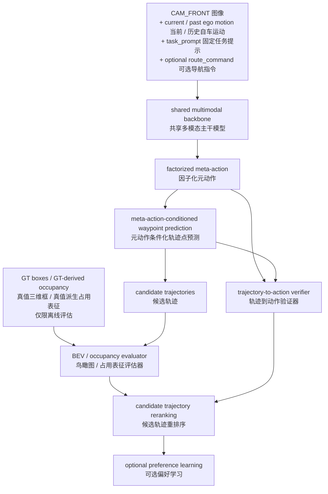
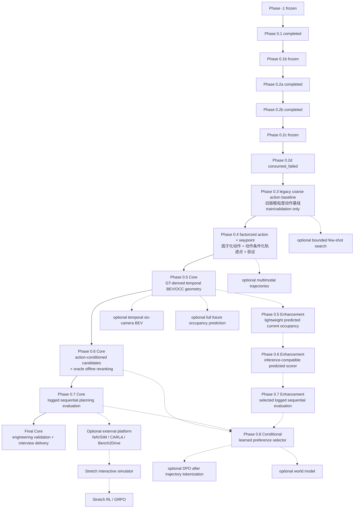

# Safety-Aware VLA（安全感知视觉-语言-动作模型）for Autonomous Driving（面向自动驾驶）：融合 BEV（鸟瞰图）/ OCC（占用表征）空间评估的面试导向最终项目规划

本项目以可复现、可核查的工程证据服务于多模态与自动驾驶算法岗位面试，而不是以追求 SOTA（当前最优水平）或完整复现单篇论文为目标。主线用于展示 nuScenes（自动驾驶数据集）数据处理、VLM（视觉语言模型）与 VLA（视觉-语言-动作模型）建模、动作空间设计、连续轨迹规划、BEV（鸟瞰图）/ occupancy（占用表征）几何评估，以及信息泄漏控制、工程测试、错误分析和系统集成能力；所有尚未由代码、测试和真实结果支持的能力继续标为 `planned`（计划中）。

## 0. 文档说明与维护规则

### 0.1 文档职责

本文是项目阶段规格、依赖关系、信息合同与执行 Gate 的唯一主来源。其他长期文档各自只承担一种职责：

- `docs/progress.md`：记录已经确认的实际状态、指标、artifact 与 open questions；
- `AGENTS.md`：记录 agent 和开发者不得违反的仓库规则；
- `README.md`：负责外部项目介绍、能力边界和复现入口；
- `project_mvp_plan.md`：定义项目要做什么、按什么顺序做、满足什么条件才能继续。

实际进度变化时，先用真实执行证据更新 `docs/progress.md`，再同步本文的阶段状态。禁止在多个文件中维护互相冲突的阶段事实；若出现冲突，已核验的实际状态以 `docs/progress.md` 为准，阶段目标、Gate 和依赖以本文为准。

### 0.2 维护规则

- 只有代码、配置、测试、真实数据 smoke test、人工审核和持久化 artifact 共同支持的能力，才可标为 `completed` 或 `frozen`。
- 论文结果、模型官方能力和外部 benchmark 不得写成本项目结果。
- 尚未实现或未核验的入口、指标、资源开销和能力必须标为 `planned`、`conditional`、`stretch` 或“待验证”。
- 阶段状态、contract、rule 或 evaluation protocol 变化时，必须记录版本与 provenance；不得覆盖 frozen artifact。
- Phase 0.3 及后续阶段必须按第 5.2 节统一模板补全；尚未在本文展开的阶段只保留骨架，不得用概述冒充可执行规格。

## 1. 信息边界与总体数据流

### 1.1 项目定位与最终主线

本项目仍是 **Safety-Aware VLA（安全感知视觉-语言-动作模型）for Autonomous Driving（面向自动驾驶）**，并融合 BEV（鸟瞰图）/ OCC（占用表征）空间评估。最终主线不以六类动作分类、粗动作轨迹展开、重排序和 DPO（直接偏好优化）作为项目终点，而是逐步建立“高层动作意图 + 低层连续轨迹 + 可解释几何评估”的统一接口：高层输出说明车辆准备做什么，低层 waypoint（轨迹点）说明车辆具体如何移动，evaluator（评估器）负责在离线条件下检查空间风险和两类输出是否一致。

当前已完成的是六类 coarse meta-action（粗粒度元动作）的数据闭环、冻结标签、人工审核与早期基线基础；factorized meta-action（因子化元动作）、continuous waypoint（连续轨迹点）、trajectory-to-action verifier（轨迹到动作验证器）、BEV（鸟瞰图）/ occupancy（占用表征）几何评估、candidate trajectory reranking（候选轨迹重排序）和 preference learning（偏好学习）均为 `planned`（计划中）。不得把 Phase -1（阶段 -1）或 Phase 0.1（阶段 0.1）改写成已经实现轨迹模型、几何评估器或安全决策系统。

面试导向的核心价值是通过可运行代码、固定协议、sample-level output（样本级输出）和代表性失败案例证明以下能力：自动驾驶数据解析与坐标变换、多模态特征建模、组合动作空间设计、连续轨迹预测、BEV（鸟瞰图）/ occupancy（占用表征）几何评估、future / GT leakage（未来信息 / 真值信息泄漏）防护，以及模型、验证器、评估器和重排序器之间的系统集成。项目不追求 SOTA（当前最优水平），不完整复现单篇论文，不进行论文级大规模消融、穷举超参数搜索或大量 backbone（主干模型）横向比较，也不证明真实道路安全、完整 closed-loop driving（闭环驾驶）或量产部署能力。

### 1.2 Inference input contract（推理输入协议）

推理输入中的 instruction（指令）拆分为三个不同概念：

- `task_prompt`：固定任务说明，例如要求模型预测驾驶动作和未来轨迹；所有样本可以使用同一模板，且模板不得包含由未来轨迹、标签或 evaluator（评估器）信息派生的内容。
- `route_command`：可选的样本级导航指令，例如直行、左转或右转；只有数据集存在可靠来源，并且训练与推理阶段都可获得同一语义时才能启用。当前 nuScenes（自动驾驶数据集）主线若不能核验可靠来源，就不得默认加入模型输入。
- `natural_language_instruction`：自然语言驾驶指令；当前项目主线暂不使用，只作为未来扩展，不能写成现有 manifest（清单）字段或当前模型能力。

经对应阶段 contract（协议）批准后，模型推理只允许使用：

```text
CAM_FRONT image
task_prompt
current ego motion
approved past ego motion
optional route_command
```

其中 `current_ego_pose` 与 `current_ego_motion` 继续沿用现有冻结字段定义、时间源和 past-only（仅使用历史）派生规则；本轮不修改 frozen manifest schema（冻结清单模式）。后续若引入历史图像或同步多相机输入，也必须由对应 Phase（阶段）单独更新输入 contract（协议）和 schema version（模式版本），不能在总体说明中提前视为当前输入。

模型推理永久禁止使用：

```text
future ego trajectory
GT meta-action
route command derived from future trajectory
GT boxes
GT occupancy
future agents
test labels
evaluator-only information
```

尤其不能先根据 `future_ego_trajectory` 判断车辆未来左转，再把“左转”写入 `route_command` 送给模型；这会把预测目标变成输入，属于 target leakage（目标泄漏）。同理，GT boxes（真值三维框）、GT occupancy（真值占用表征）和 future agents（未来交通参与者）只能进入离线 evaluator（评估器），不能通过 prompt（提示）、特征缓存、样本元数据或预处理结果间接进入 VLA（视觉-语言-动作模型）。

### 1.3 总体数据流与模块职责

最终目标数据流如下，除已有 coarse meta-action（粗粒度元动作）数据基础外均保持 `planned`（计划中）：



各模块的输入、输出和设计原因如下：

- shared multimodal backbone（共享多模态主干模型）读取允许的图像、`task_prompt`、current / past ego motion（当前 / 历史自车运动）和经过批准的 `route_command`，输出共享特征；它用于避免动作分类与轨迹规划各自维护不兼容的视觉主干。
- factorized meta-action（因子化元动作）输出纵向与横向两个可组合的高层意图；它解决旧六类互斥 schema（模式）不能同时表达“减速 + 左移”等组合的问题。
- meta-action-conditioned waypoint prediction（元动作条件化轨迹点预测）读取共享特征与高层动作 embedding（嵌入），输出当前自车坐标系中的连续 future waypoints（未来轨迹点）；它是更接近自动驾驶 planning（规划）的主要低层输出。
- trajectory-to-action verifier（轨迹到动作验证器）把预测轨迹投影回动作空间，与预测高层动作比较，输出 action-trajectory consistency（动作—轨迹一致性）结果；它用于发现语义和运动不一致的错误。
- BEV（鸟瞰图）/ occupancy evaluator（占用表征评估器）读取模型候选轨迹与 evaluator-only（仅评估器可用）的 GT geometry（真值几何），输出分解的安全代价；它提供离线空间评估，不给模型提供真值感知输入。
- candidate trajectory reranking（候选轨迹重排序）结合几何代价、一致性、进度和舒适性，在固定候选集合中选择轨迹；optional preference learning（可选偏好学习）只有在候选与偏好证据可靠时才使用，不是项目必须终点。

### 1.4 能力边界与工程可靠性

本项目的连续轨迹预测与安全评估仍属于 open-loop planning（开环规划）和 non-reactive offline evaluation（非响应式离线评估）：记录中的其他交通参与者不会根据模型输出实时响应，evaluator（评估器）也不能证明模型在真实道路或完整仿真中的安全性。Phase 0.7 的 logged sequential evaluation（日志序列评估）只在固定真实日志上检查跨锚点稳定性，下一 observation（观测）不由模型动作产生，因此既不是 closed-loop driving（闭环驾驶），也不是 quasi-closed-loop simulation（准闭环仿真）；真正交互式环境只属于后续 Stretch（扩展项）。

工程可靠性保留数据和坐标可追溯、scene-level split（场景级数据切分）、future / GT leakage（未来信息 / 真值信息泄漏）检查、固定输入输出协议、单元测试、smoke test（冒烟测试）、sample-level output（样本级输出）、少量有代表性的人工核验和 failure case analysis（失败案例分析）。这些证据用于说明系统实现可信，不扩展为多随机种子统计、置信区间、显著性检验、大规模人工一致性实验、复杂论文式消融矩阵或穷举调参。

## 2. 为什么保留 coarse meta-action（粗粒度元动作）及最终动作空间

### 2.1 Legacy coarse action schema（旧版粗粒度动作模式）

当前冻结的六类动作继续保留，并明确命名为 **legacy coarse action schema（旧版粗粒度动作模式）**：

```text
keep
accelerate
decelerate
stop
left_lateral
right_lateral
```

该 schema（模式）及 `label_rule_version=phase-1.6-meta-action-v0.2` 不删除、不重命名、不覆盖，也不静默改变语义。它承担五个长期角色：保留 Phase -1（阶段 -1）已完成的标签成果；作为 Majority Baseline（多数类基线）和早期模型的统一比较空间；提供简单、可审核的粗粒度驾驶行为；作为后续多任务训练的辅助监督；在 failure case analysis（失败案例分析）中提供可解释语义。`left_lateral` 与 `right_lateral` 仍只表示稳定的左右横向运动，不能解释为 lane change（变道）或 turn（转弯）。

保留旧 schema（模式）不等于把它设为最终动作空间。它适合验证数据、标签、parser（解析器）和早期模型链路，却无法完整表达同时发生的纵向与横向行为，因此后续扩展必须新增版本化 target（目标）和评测合同，而不是改写已冻结字段。

### 2.2 Factorized meta-action（因子化元动作）

最终高层动作空间 `planned`（计划中）为两个可组合的 action head（动作预测头）：

```text
longitudinal_action:
- stop
- decelerate
- keep
- accelerate

lateral_action:
- left
- straight
- right
```

真实驾驶动作通常是组合行为，例如 `decelerate + left`、`keep + right` 或 `accelerate + straight`。原六类互斥动作每次只能表达一种主导语义，无法同时说明纵向速度趋势与横向方向；如果不断向单一类别集合增加组合类，类别数量、长尾问题、标签维护和错误解释都会迅速复杂化。因子化表示让两个 head（预测头）共享同一多模态特征但分别学习纵向与横向语义，更容易扩展、审核和复用。

评测时分别报告 longitudinal macro-F1（纵向宏平均 F1）和 lateral macro-F1（横向宏平均 F1），并以 joint accuracy（联合准确率）检查两个 head（预测头）是否同时正确。高层动作因此仍然可解释、可验证，但不再承担连续路径的全部信息。

第一版不直接增加 `lane_change`、`turn`、`follow_road_curve`、`overtake` 或 `yield`。仅靠单帧 `CAM_FRONT` 与 ego trajectory（自车轨迹），通常无法稳定区分 lane change（变道）、turn（转弯）和 follow-road-curve（沿弯道行驶），也无法可靠判断超车或让行意图。只有后续加入经过审核的 map（地图）、lane topology（车道拓扑）、intersection topology（路口拓扑）、route command（导航指令）或 temporal input（时序输入）中的至少一部分后，才允许定义、版本化并重新审核 fine-grained maneuver type（细粒度机动类型）。

### 2.3 Continuous waypoint action space（连续轨迹点动作空间）

低层主要输出 `planned`（计划中）为：

```text
future_waypoints shape: [B, 6, 2]
prediction horizon: 3.0 seconds
sampling interval: 0.5 seconds
coordinate frame: current ego frame
x-axis: positive forward
y-axis: positive left
unit: meter
```

`B` 是 batch size（批大小）；`6` 表示从当前时刻后 0.5 秒到 3.0 秒、每 0.5 秒预测一个轨迹点；`2` 表示每个轨迹点包含 `(x, y)`。所有点都表达在当前时刻自车坐标系中，`x` 轴向前为正，`y` 轴向左为正，单位为米。缺失或无效 future target（未来目标）仍通过版本化 valid mask（有效掩码）处理，不改变现有 `current_ego_pose`、`current_ego_motion` 或 frozen manifest schema（冻结清单模式）。

第一版不直接预测 steering（转向角）、throttle（油门）或 brake（制动）。nuScenes（自动驾驶数据集）没有与本项目一一对应的完整底层控制监督，项目也没有经过核验的真实车辆动力学模型和 closed-loop control environment（闭环控制环境）；直接输出控制量会把无法真实验证的车辆与控制假设混入模型结论。Waypoint（轨迹点）则可以与现有 `future_ego_trajectory` 对齐，并直接用于 ADE（平均位移误差）、FDE（最终位移误差）、collision check（碰撞检查）和 BEV（鸟瞰图）/ occupancy evaluation（占用表征评估），更符合当前项目可实现、可复现和可核查的能力边界。

### 2.4 Planned model interface（计划中的模型接口）

第一版主结构在后续 Phase（阶段）中按以下接口实现：

```text
shared multimodal backbone
├── longitudinal action head
├── lateral action head
└── meta-action-conditioned waypoint head
```

shared multimodal backbone（共享多模态主干模型）提取图像、`task_prompt` 和自车状态特征；longitudinal action head（纵向动作头）预测四类纵向动作；lateral action head（横向动作头）预测三类横向动作；meta-action-conditioned waypoint head（元动作条件化轨迹点头）同时接收共享特征和高层动作 embedding（嵌入），输出 `[B, 6, 2]` 连续轨迹点。高层动作回答“准备做什么”，轨迹回答“具体怎么移动”，两者共享信息但分别接受分类与几何验证。

Legacy coarse action schema（旧版粗粒度动作模式）继续作为历史基线、辅助监督和解释接口，但不替代上述三个主要输出 head（预测头）。新增 factorized target（因子化目标）和 waypoint target（轨迹点目标）时必须提升相应 schema version（模式版本）并保留旧字段兼容；具体模型代码、loss weight（损失权重）和训练超参数留给后续 Phase（阶段）规格，本节不预设。

### 2.5 Trajectory-to-action verifier（轨迹到动作验证器）

本项目借鉴 DriveMA（可验证元动作驾驶视觉-语言-动作模型）的可迁移接口思想，但不把项目写成 DriveMA（可验证元动作驾驶视觉-语言-动作模型）复现：

```text
input x
→ predicted meta-action m
→ predicted trajectory τ
→ project trajectory back to action space
→ compare implied action with predicted action
```

trajectory-to-action verifier（轨迹到动作验证器）后续根据预测轨迹的纵向位移、速度趋势和横向运动，反推出 trajectory-implied action（轨迹隐含动作），再与模型预测的 `longitudinal_action` 和 `lateral_action` 比较，输出 action-trajectory consistency（动作—轨迹一致性）及明确冲突原因。它能够识别“高层输出减速，但轨迹仍持续加速”或“高层输出向左，但轨迹终点明显向右”等错误，并把结果用于 failure case analysis（失败案例分析）、candidate trajectory reranking（候选轨迹重排序）和 optional preference learning（可选偏好学习）。

Verifier（验证器）第一版是版本化、可单元测试的规则检查工具，不承诺 DriveMA（可验证元动作驾驶视觉-语言-动作模型）的 GRPO（组相对策略优化）、turn-level credit assignment（轮次级信用分配）、全参数训练或海量数据方案，也不需要论文规模的 reinforcement learning（强化学习）。第一版先以 supervised training（监督训练）、规则验证和候选重排序展示语言—动作对齐能力；阈值、投影规则和失败原因必须通过 train / validation（训练集 / 验证集）及人工构造案例核验，不能读取已消费 test（测试集）来选择。

## 3. BEV（鸟瞰图）/ occupancy（占用表征）与 geometric safety scorer（几何安全评分器）

### 3.1 定位与职责分离

BEV（鸟瞰图）是把场景几何统一到自车中心俯视坐标系的空间表示；occupancy（占用表征）描述特定时间步和网格位置是否被车辆、VRU（弱势道路使用者）或其他已定义类别占据；geometric safety scorer（几何安全评分器）把候选自车轨迹与这些几何表示比较，输出可分解的风险、可行性、进度和舒适性代价。三者不是同一概念：occupancy（占用表征）不直接等于安全决策，scorer（评分器）也不能替代模型的轨迹输出。

本项目保留 GT-derived evaluator（由真值构造的评估器）的离线定位，同时保留 object-level（对象级）与 raster-level（栅格级）两条实现路径。对象级路径直接使用带类别、姿态、尺寸、时间和 token（标识）的 GT boxes（真值三维框）；栅格级路径把相同真值几何按冻结规则构造成 temporal occupancy（时序占用表征）。两条路径用于交叉核验几何规则、分析失败样本和校准 scorer（评分器），不构成 VLA（视觉-语言-动作模型）的推理输入。

### 3.2 最终主接口与过渡接口

最终主要评估接口为：

```text
predicted waypoint trajectory
→ ego footprint rollout
→ GT boxes or GT-derived temporal occupancy
→ decomposed safety costs
```

predicted waypoint trajectory（预测轨迹点序列）提供当前自车坐标系中的候选运动；ego footprint rollout（自车轮廓轨迹展开）沿每个时间步放置具有长度、宽度、姿态和安全边界的自车轮廓，避免把 waypoint（轨迹点）当作没有面积的点；GT boxes（真值三维框）或 GT-derived temporal occupancy（真值派生时序占用表征）提供只供 evaluator（评估器）使用的环境几何；decomposed safety costs（分解安全代价）分别记录 collision（碰撞）、near-miss（近失）、VRU（弱势道路使用者）距离违规、TTC（碰撞时间）、可行性、harsh action / jerk（激烈动作 / 加加速度）、进度和 `unnecessary_stop`，避免用单一总分掩盖“总是停车”等退化行为。Drivable-area evaluation（可行驶区域评估）只有在可靠 map（地图）与坐标 contract（协议）存在时才启用。

在 continuous waypoint head（连续轨迹点头）尚未实现前，允许使用以下临时接口完成 scorer smoke test（评分器冒烟测试）：

```text
coarse action
→ configured short-horizon rollout
```

该 coarse action rollout（粗动作轨迹展开）只是验证坐标、时间、碰撞规则、对象/栅格一致性和分项输出的过渡方案，不是最终规划输出。Predicted waypoint trajectory（预测轨迹点序列）实现后应成为主要评估对象；不得以 GT future ego trajectory（真值未来自车轨迹）替代模型候选轨迹进行碰撞评分，否则评估的是真值驾驶行为而不是模型规划能力。

### 3.3 Evaluator contract（评估器协议）

对象级和栅格级实现必须共享同一坐标、时间和版本语义：

- 所有 candidate trajectory（候选轨迹）、ego footprint（自车轮廓）、GT boxes（真值三维框）和 temporal occupancy（时序占用表征）必须转换到同一 current ego frame（当前自车坐标系），明确 `x` 向前、`y` 向左、单位为米及 transform order（变换顺序）。
- 轨迹时间步、box timestamp（三维框时间戳）和 occupancy time step（占用表征时间步）必须记录 horizon（预测时域）、sampling interval（采样间隔）、tolerance（容差）和缺帧策略，不能只按数组下标假定同步。
- 对象级 artifact（产物）必须保留 annotation token（标注标识）、sample token（样本标识）、类别、尺寸、姿态、source frame（源坐标系）和 transform provenance（变换来源）；运动假设必须显式记录为 observed（已观测）、interpolated（插值）、constant-velocity（匀速）或 unavailable（不可用），不得静默复制当前对象冒充真实未来状态。
- 栅格级 artifact（产物）必须记录 grid range（网格范围）、resolution（分辨率）、origin（原点）、轴方向、类别通道、边界规则、unknown / free semantics（未知 / 空闲语义）、rasterization policy（栅格化策略）和 `raster_config_version`。
- candidate（候选）、footprint（轮廓）、motion assumption（运动假设）、scorer（评分器）、阈值、分项权重和输出 schema（模式）都必须版本化；sample-level output（样本级输出）能够回溯模型、候选、几何来源、配置和代码版本。

GT boxes（真值三维框）、GT occupancy（真值占用表征）、future agents（未来交通参与者）和任何 evaluator-only（仅评估器可用）信息只能进入 evaluator（评估器）。当前主线不训练完整 BEVFormer（鸟瞰图视觉模型）、OccNet（占用预测网络）、SurroundOcc（环视占用预测模型）或其他大型 occupancy prediction network（占用预测网络）；若后续 Phase（阶段）实现轻量 predicted occupancy（预测占用表征）辅助分支，也必须与 GT-derived evaluator（真值派生评估器）分离，并通过真实 inference path（推理路径）证明其输入不含真值几何。

### 3.4 Candidate reranking（候选重排序）与一致性接口

Evaluator（评估器）不直接修改轨迹，只对固定候选集合输出逐项代价和版本化 reason（原因）。Candidate trajectory reranking（候选轨迹重排序）再结合 safety cost（安全代价）、action-trajectory consistency（动作—轨迹一致性）、progress（进度）、comfort（舒适性）和 fallback severity（回退严重程度）选择候选，并同时保存原始轨迹、所有候选、分项代价、选择原因和最终轨迹。这样可以区分“模型轨迹本身较好”“验证器发现语义冲突”和“几何评估迫使系统选择保守候选”三类能力。

Preference learning（偏好学习）只在候选生成、verifier（验证器）、scorer（评分器）和重排序结果经过核验后作为 optional（可选）消费者；DPO（直接偏好优化）不是项目必须终点，GRPO（组相对策略优化）也不是第一版要求。第一版通过 supervised training（监督训练）、规则化一致性检查、离线几何评分和候选重排序形成完整且可解释的工程证据链。

### 3.5 面试能力映射

| 能力 | 通过什么代码或结果证明 | 当前边界 |
|---|---|---|
| 数据工程能力 | 以现有 nuScenes（自动驾驶数据集）解析脚本、`CAM_FRONT` / future trajectory（未来轨迹）/ nearby agents（邻近交通参与者）对齐结果、坐标可视化、scene-level split（场景级切分）、manifest versioning（清单版本管理）及 validator（验证器）结果证明。 | 数据闭环、冻结标签和 manifest（清单）基础已有真实证据；不得把派生数据提交 Git（版本控制系统）。 |
| 多模态模型能力 | 后续以 Qwen3-VL（通义千问第三代视觉语言模型）数据适配、LoRA（低秩适配）训练记录、multimodal feature fusion（多模态特征融合）张量合同、custom action head（自定义动作预测头）测试及 sample-level prediction（样本级预测）证明。 | 均为 `planned`（计划中）；模型卡或论文结果不能替代本项目运行证据。 |
| 自动驾驶规划能力 | 后续以 factorized action space（因子化动作空间）分类指标、`[B, 6, 2]` waypoint prediction（轨迹点预测）、ADE（平均位移误差）/ FDE（最终位移误差）、action-conditioned planning（动作条件化规划）可视化和 action-trajectory consistency（动作—轨迹一致性）结果证明。 | 连续轨迹模型为 `planned`（计划中）；当前六类输出只是 legacy coarse action schema（旧版粗粒度动作模式）。 |
| BEV（鸟瞰图）/ occupancy（占用表征）能力 | 后续以 GT boxes（真值三维框）到 temporal occupancy rasterization（时序占用栅格化）的对象/栅格对照、ego footprint collision checking（自车轮廓碰撞检查）、TTC（碰撞时间）、VRU（弱势道路使用者）距离和条件化 drivable-area evaluation（可行驶区域评估）证明。 | Evaluator（评估器）为 `planned`（计划中）且只做离线几何评估；可行驶区域指标依赖可靠 map contract（地图协议）。 |
| 系统分析能力 | 以 inference / target / evaluator（推理 / 目标 / 评估器）隔离测试、information leakage prevention（信息泄漏防护）、trajectory-to-action verifier（轨迹到动作验证器）、failure case analysis（失败案例分析）、sample-level provenance（样本级来源追溯）和 safety-performance trade-off（安全性与行驶性能权衡）报告证明。 | 保留少量代表性人工核验与可复现输出，不扩展为论文式大规模统计或复杂消融。 |

## 4. 数据、坐标、时间、版本和 artifact 总合同

### 4.1 当前已冻结 schema contract（模式协议）

当前 `phase0_audited_seed_subset_v1` 与 `phase0_trainval_dataset_manifest_v1` 的稳定基础字段至少包括：

```text
sample_token
scene_token
timestamp
cam_front_path
current_ego_pose
current_ego_motion
coordinate_metadata
future_ego_trajectory
nearby_agents
split
manifest_schema_version
```

当前派生与追溯字段至少包括：

```text
meta_action
label_rule_version
safety_rule_version
source_audit_record
```

`source_audit_record` 用于从正式样本回溯到 Phase -1（阶段 -1）人工审核记录；已有审核样本必须保留完整来源，未匹配样本必须保持明确的未审核状态，不能伪造审核记录。

`current_ego_pose` 至少包含：

```text
frame
translation_m
rotation_wxyz
timestamp_us
timestamp_source
```

`current_ego_motion` 至少包含：

```text
speed_mps
longitudinal_acceleration_mps2
yaw_rate_radps
source
timestamp_source
availability
history_interval_sec
acceleration_interval_sec
unavailable_reason
```

两个字段的 `timestamp_source` 均固定为 `CAM_FRONT_sample_data`。`current_ego_motion` 只能由 current / past pose（当前 / 历史位姿）派生，禁止使用 future pose（未来位姿）或 future trajectory（未来轨迹）；缺失历史时必须通过 `availability` 与 `unavailable_reason` 显式表达，不能把缺失值伪装成真实零运动。

`phase0_audited_seed_subset_v1`、`phase0_trainval_dataset_manifest_v1` 与未来 temporal / factorized / waypoint schema（时序 / 因子化 / 轨迹点模式）之间是版本化扩展关系。后续 schema（模式）必须引用来源 manifest（清单）及其 SHA-256，并新增版本号；不得覆盖、改名冒充或就地改写任何当前 frozen schema（冻结模式）。

### 4.2 长期目标 schema contract（模式协议）

Manifest family（清单族）的长期基础合同为：

```text
sample_token
scene_token
timestamp
sensor_paths
current_ego_pose
current_ego_motion
coordinate_metadata
history_valid_mask
future_ego_trajectory
future_waypoints
trajectory_valid_mask
nearby_agents
map_route_metadata
split
official_split
manifest_schema_version
```

字段按阶段逐步启用：当前已实现的 `cam_front_path` 是 single-camera `sensor_paths` 的现行字段；`history_valid_mask`、`future_waypoints`、`trajectory_valid_mask` 和 `map_route_metadata` 尚未全部进入当前 frozen schema，必须在使用它们的阶段提升 schema version 后加入。不得把长期合同字段误写为当前已完成能力。

### 4.3 版本化 targets（目标）与实验字段

```text
meta_action
label_rule_version
longitudinal_action
lateral_action
factorized_action_rule_version
longitudinal_action_valid
longitudinal_action_reason
lateral_action_valid
lateral_action_reason
factorized_action_joint_valid
source_future_trajectory_version
source_legacy_meta_action
fine_action_rule_version
safety_rule_version
raster_config_version
prompt_version
parser_version
model_revision
checkpoint_sha256
split_mapping_sha256
evaluation_protocol_version
```

基础字段与派生 target（目标）必须分离。Schema（模式）变化必须提升 `manifest_schema_version`；rule（规则）变化必须提升对应 rule version（规则版本）并重新生成受影响 target（目标）。Legacy coarse action（旧版粗粒度动作）与 factorized action（因子化动作）可以在同一版本化扩展记录中共存，但二者不是互相覆盖关系，也不得通过无版本映射静默混用。

### 4.4 坐标与时间合同

- 坐标数据必须记录 source frame、target frame、轴方向、单位和 transform 顺序；
- 时间数据必须记录 timestamp 单位、timestamp source、采样间隔、history/future horizon、tolerance 与缺帧策略；
- 当前 `current_ego_pose` / `current_ego_motion` 的 timestamp source（时间戳来源）固定为 `CAM_FRONT_sample_data`；motion（运动状态）只由 current / past pose（当前 / 历史位姿）推导；
- future trajectory、waypoints、agents 与 occupancy 必须显式对齐离散时间步，不能只凭数组下标假设同步。

### 4.5 Split（数据切分）、provenance（来源追溯）与存储规则

- train、validation、test 必须按 scene-level split，禁止相邻帧跨 split；
- 数据、模型、配置、代码版本和结果必须具备 provenance 与必要 SHA-256；
- frozen artifact 不得覆盖、就地改写或以改名方式复用；
- 原始数据、派生数据、checkpoint、正式输出、日志和缓存不进入 Git；
- Git 只保存代码、配置模板、schema、允许公开的小型测试 fixture、测试和文档；
- 不可逆 evaluation 的 durable claim、访问状态、输出持久化状态与 rerun policy 必须单独记录。

## 5. 全局状态定义与统一执行规范

### 5.1 全局状态定义

| 状态 | 定义 |
|---|---|
| `completed` | 阶段目标和 Gate 已由可复现证据满足，但其输出仍可能在后续阶段被版本化扩展。 |
| `frozen` | 阶段已完成，关键 contract、rule、split 或 artifact 被锁定；后续不得静默修改。 |
| `active` | 当前正在执行，尚未满足全部 Gate。 |
| `blocked` | 前置条件或外部依赖未满足，当前不得继续。 |
| `planned` | 已进入路线图，但尚未开始实现或验收。 |
| `conditional` | 只有前序实验满足指定增益或质量 Gate 时才执行。 |
| `stretch` | 可选研究扩展，不阻塞核心项目完成。 |
| `retired` | 协议或方案已停止使用；保留历史证据，但不得作为当前有效方案。 |
| `consumed_failed` | 不可逆正式评估已访问 sealed evaluation data，但因执行或 artifact 持久化失败而没有形成可发布结果；该 evaluation source 仍视为已消费，永久不得重跑。 |

状态只描述证据与 Gate，不描述主观完成度。`completed` 不等于 `frozen`，`consumed_failed` 也绝不等于“未执行”。

### 5.2 Phase 0.3 及后续阶段统一模板

后续每个阶段必须严格包含：

```text
阶段状态
阶段目的
为什么需要
前置条件
本阶段不解决什么

输入
允许使用的数据
禁止使用的数据
字段和 artifact contract

详细执行步骤
涉及代码与配置
生成的本地 artifact
版本和 provenance

单元测试
contract / regression tests
真实数据 smoke test
人工审核

实验矩阵
评测指标
通过 Gate
失败分支
停止条件
不可逆操作与保护措施
进入下一阶段的条件

阶段学习目标
可形成的代码、图表、Demo 和简历证据
```

测试数量不能替代真实 producer artifact → consumer intake 的 shape 核验。不可逆操作前必须完成不访问 sealed data 的 full shadow execution，并验证 adapter、输出持久化与 rerun guard。

## 6. 完整项目阶段总览和依赖关系

### 6.1 阶段状态总表

| 阶段 | 目标 | 状态 | 主要输出 |
|---|---|---|---|
| Phase -1 | 数据闭环与 coarse label freeze | `frozen` | 数据对齐、标签、108-sample 人工审核、freeze gate |
| Phase 0.1 | manifest、split、metrics、Majority | `completed` | audited seed subset 与统一评测协议 |
| Phase 0.1b | trainval scale-up | `frozen` | 正式 manifest v1 与 scene mapping |
| Phase 0.2a | past-only ego-motion audit | `completed` | inference input audit |
| Phase 0.2b | rule candidate search | `completed` | validation candidate selection |
| Phase 0.2c | failure analysis 与 rule freeze | `frozen` | `phase0.2-ego-motion-rule-v0.1` |
| Phase 0.2d | sealed one-shot evaluation | `consumed_failed` | 无正式 test metrics；原 test 永久消费 |
| Phase 0.3 | Qwen3-VL 数据接口与 legacy coarse action baseline（旧版粗粒度动作基线） | `planned` | 可复用视觉/多模态特征接口与六类历史兼容基线 |
| Phase 0.4 | factorized meta-action（因子化元动作）+ action-conditioned waypoint（动作条件化轨迹点）+ verification（验证） | `planned` | `[B,4]` / `[B,3]` 动作头、`[B,6,2]` 轨迹点头与一致性验证器 |
| Phase 0.5 | BEV/OCC（鸟瞰图 / 占用表征）几何表示与离线空间评估，以及条件式轻量预测分支 | `planned` | Core：类型明确的时序对象张量与元数据、temporal occupancy 与对象—栅格一致性；Enhancement：可选当前占用预测 |
| Phase 0.6 | factorized-action-conditioned candidates（因子化动作条件化候选）+ GT-derived safety reranking（真值派生安全重排序） | `planned` | `[B,6,6,2]` 固定候选库、双几何后端、configured oracle reranker（配置化真值重排序器）与独立 candidate-set ceiling（候选库上限） |
| Phase 0.7 | receding-horizon logged sequential evaluation（滚动时域日志序列评估）与 planning interface（规划接口） | `planned` | 跨锚点轨迹一致性、动作稳定性、接口、无效 / 回退与真实硬件延迟证据 |
| Phase 0.8 | conditional safety preference learning（条件式安全偏好学习） | `conditional` | 可选推理兼容 candidate preference head（候选偏好头）与负结果记录 |
| Final | engineering validation, reproducibility and interview delivery（工程验收、可复现性与面试交付） | `planned` | 不依赖 Phase 0.8 的 Core 工程与展示证据闭环 |

### 6.2 依赖关系与 Gate



Phase 0.3 只建立 Qwen3-VL（通义千问第三代视觉语言模型）接入与 legacy coarse action baseline（旧版粗粒度动作基线）；六分类输出不限制最终动作空间。Phase 0.4 建立 factorized meta-action（因子化元动作）、meta-action-conditioned waypoint（元动作条件化轨迹点）和 trajectory-to-action verification（轨迹到动作验证）核心；Phase 0.5 Core 将 GT annotation（真值标注）转换为类型明确的对象 / 栅格几何；Phase 0.6 Core 使用因子化动作组合生成候选并完成 configured oracle reranking（配置化真值重排序）与独立 candidate ceiling（候选上限）诊断；Phase 0.7 Core 在固定日志连续锚点上验证轨迹与接口，不让模型动作改变下一 observation（观测）；随后可直接进入 Final Core。Phase 0.8 Conditional（条件阶段）的核心启动依赖为 Phase 0.6 Core 提供的 train preference pairs（训练集偏好对）与 oracle evaluator（真值评估器），以及 Phase 0.7 Core 提供的 logged sequential validation protocol（日志序列验证协议）；Phase 0.5—0.7 Enhancement（增强）不是启动前置，predicted occupancy（预测占用表征）或 predicted-geometry selector（预测几何选择器）失败也不单独阻塞 Phase 0.8。Phase 0.5—0.7 Enhancement 与 Phase 0.8 失败都不阻塞核心项目完成。NAVSIM / CARLA / Bench2Drive、interactive simulator（交互式仿真器）、RL / GRPO、DPO 与 world model（世界模型）均为 Optional / Stretch（可选 / 扩展），不能替代主线 Gate。

## 7. Phase -1：数据闭环与 coarse label freeze 简要回顾

**状态：`frozen`。** Phase -1 建立并核验了：

```text
sample_token → CAM_FRONT
sample_token → future ego trajectory
sample_token → nearby 3D agents
→ one-page visualization
→ meta-action derivation
→ 108-sample manual audit
→ label regression freeze
→ real-data freeze gate
```

取得的核心结果是图像、3 秒 future trajectory 与 nearby agents 可在 sample level 对齐和可视化；六类 coarse meta-action 已派生，108 个样本覆盖六类 action 并完成人工审核，alignment 为 108/108；label regression 与 real-data freeze gate 均为 108/108。

本阶段冻结了六类 action schema、`label_rule_version=phase-1.6-meta-action-v0.2`、基于 `CAM_FRONT_sample_data` 的时间源、ego-frame 坐标约定和 audit provenance。`safety_rule_version=not_available` 是历史事实；Phase -1 没有完成 safety scorer，也没有训练模型。

## 8. Phase 0.1 / 0.1b 简要回顾

### 8.1 Phase 0.1：audited seed-subset 与统一评测协议

**状态：`completed`。** Phase 0.1 将 frozen labels 转为 `phase0_audited_seed_subset_v1`，建立固定 seed 的 scene-level split、统一六类 action schema、完整 manifest validator、Majority Baseline 与 unified metrics。协议要求 sample-level predictions、macro-F1、per-class F1、confusion matrix、class distribution 和 invalid prediction 可追溯，并验证 scene split 无泄漏。

### 8.2 Phase 0.1b：正式 trainval manifest v1

**状态：`frozen`。** Phase 0.1b 已从 mini smoke 数据扩展到完整 nuScenes trainval，冻结：

- `manifest_schema_version=phase0_trainval_dataset_manifest_v1`；
- `horizon_sec=3.0`、`sample_interval_sec=0.5`、`time_tolerance_sec=0.075`；
- `label_rule_version=phase-1.6-meta-action-v0.2`；
- `split_strategy_version=official_train_scene_label_stratified_v1`、`split_seed=20260710`；
- official train 的 700 scenes 按 scene-level stratified split 为 project train/validation `560/140`；official validation 的 150 scenes 固定为当时的 project test；
- 扫描 34,149 samples，纳入 21,646 条：train 14,253、validation 3,594、test 3,799；排除 12,503 条；
- 正式 manifest、mapping sidecar、内部 mapping 与 scene histogram 均有固定 SHA-256 和 provenance，且不得覆盖。

完整 validator、rare-class constraints、排除原因诊断及 train/validation 视觉审核已通过。Mini 此后只用于 smoke test、快速回归和小规模调试，不用于正式 LoRA/action adapter/DPO 结论。这里的原 project test 后来在 Phase 0.2d 被永久消费，不能继续作为 untouched evaluation source。

## 9. Phase 0.2a—0.2d 简要回顾

### 9.1 Phase 0.2a：current/past-only ego-motion audit

**状态：`completed`。** 输入合同只包含 speed、longitudinal acceleration、yaw rate、availability 与对应 past interval；禁止 future trajectory、derived meta-action 或 test labels 作为 baseline 输入。Train/validation/test 的 `full/partial/unavailable` 分别为 `13476/392/385`、`3401/99/94`、`3594/106/99`。该审计未使用 test label 做统计或调参。

### 9.2 Phase 0.2b：deterministic rule candidate search

**状态：`completed`。** 固定 625-candidate grid 只在 validation 上选择 deterministic rule candidate。入选阈值为：

```text
stop speed              = 0.2 m/s
lateral yaw rate        = 0.05 rad/s
accelerate acceleration = 0.5 m/s²
decelerate acceleration = 0.3 m/s²
```

Validation macro-F1 / accuracy 为 `0.615681 / 0.623817`；同协议 Majority Baseline 为 `0.087186 / 0.354201`。这些是参与 candidate selection 的 validation 结果，不是无偏 test 结果。

### 9.3 Phase 0.2c：failure analysis 与 rule freeze

**状态：`frozen`。** `phase0.2-ego-motion-rule-v0.1` 冻结为 `candidate-0293`，validation predictions 复现为 `3594/3594`。主要错误为 `keep → decelerate`（260）和 `decelerate → keep`（181）。Candidate、thresholds、rule version 与 failure analysis 已冻结；不得利用后续 evaluation 反馈修改这一版本。

### 9.4 Phase 0.2d：sealed one-shot evaluation

**状态：`consumed_failed`。** Sealed one-shot formal execution 已且仅已调用一次。Durable execution claim 写入后，执行访问了 test label/motion；随后在正式 test result 持久化前，于 `build_formal_outputs → build_validation_to_test_comparison` 失败。

失败原因是跨模块 artifact schema mismatch：正式 `validation_metrics.json` 使用嵌套 `metrics` 和顶层 `predicted_class_distribution`，consumer 当时却期望顶层扁平 metrics 和 `prediction_class_distribution`。执行 exit code 为 `1`，没有生成可发布的正式 test outputs 或正式 test metrics；rule 与 thresholds 也未按 test 信息修改。

不可逆边界如下：

- execution claim 状态为 `consumed_failed`，`rerun_permitted=false`；
- 原 project test 已永久消费，禁止重跑、恢复、重算、重新切分、改名复用或以任何方式重新取得结果；
- 该 split 不得再用于 prompt、threshold、candidate、model、architecture 或 checkpoint 选择；
- 后续 validation artifact adapter 和 producer-shape regression 已修复，但只适用于未来协议，不授权重跑本次 test；
- Phase 0.3 及后续阶段只能使用 train/validation 开发与模型选择；
- 最终无偏评价必须使用新的 external held-out dataset，或新的、从未访问过的 evaluation protocol。

因此 Phase 0.2d 不能写成 test completed，也不能报告任何正式 test performance。

## 10. 面向最终 VLA 的执行阶段

### 10.1 Phase 0.3：Qwen3-VL 数据接口与 legacy coarse action baseline（旧版粗粒度动作基线）

> Phase 0.3 不是最终 VLA（视觉-语言-动作模型），也不是长时间 prompt engineering（提示工程）阶段。它只负责验证 Qwen3-VL（通义千问第三代视觉语言模型）能否正确读取项目数据并输出冻结六类 legacy coarse action（旧版粗粒度动作），同时为 Phase 0.4 冻结可复用的视觉 / 多模态特征接口；六分类输出 schema（模式）不代表最终动作空间。

#### 10.1.1 阶段状态、目的与边界

- **阶段状态：** `planned`。
- **阶段目的：** 打通 frozen manifest（冻结清单）→ image/text processor（图像 / 文本处理器）→ Qwen3-VL（通义千问第三代视觉语言模型）→ legacy action parser（旧版动作解析器）→ sample-level prediction（样本级预测）的完整链路。
- **为什么需要：** 在引入时序、factorized action head（因子化动作预测头）和 waypoint head（轨迹点头）前，先隔离数据加载、模型依赖、`task_prompt` 序列化、generation（生成）和六类输出解析问题，避免把接入错误误判为规划模型错误。
- **前置条件：** Phase 0.1b trainval manifest 与六类 schema 已冻结；Phase 0.2d 的 consumed-test 边界保持不变；开发只允许 train/validation。

本阶段验证：

- frozen manifest 中的 `CAM_FRONT` 图像能否正确加载；
- Qwen3-VL processor（处理器）、tokenizer（分词器）与 model（模型）能否在项目环境稳定运行；
- `task_prompt` 与 current / past ego-motion summary（当前 / 历史自车运动摘要）如何确定性序列化；
- 生成结果能否被 legacy action parser（旧版动作解析器）严格解析；
- zero-shot（零样本）与轻量 LoRA（低秩适配）是否能形成可复现的 legacy coarse action baseline（旧版粗粒度动作基线）；
- VLM hidden states / visual tokens（视觉语言模型隐藏状态 / 视觉 token）是否能通过稳定 visual / multimodal feature interface（视觉 / 多模态特征接口）供 Phase 0.4 复用。

本阶段不解决：

```text
continuous trajectory prediction
temporal multi-frame fusion
BEV/OCC
safety scorer
closed-loop evaluation
reinforcement learning
unbounded prompt search
large-scale DPO
```

#### 10.1.2 输入、允许数据与禁止数据

模型输入限定为：

```text
CAM_FRONT image
current/past ego-motion summary
task_prompt
```

`task_prompt` 是所有样本共享的固定任务提示，不包含 future-derived（未来派生）信息。`route_command` 与 `natural_language_instruction` 均不属于 Phase 0.3 输入。Legacy coarse meta-action target（旧版粗粒度元动作目标）只用于 supervised LoRA（监督式低秩适配）目标或离线评测；train / validation split（训练集 / 验证集切分）用于训练、模型选择和报告。必须分别运行 image-only（仅图像）与 image + ego state（图像加自车状态）两组基线，以判断 ego state（自车状态）的增益。

禁止：

- future ego trajectory 作为模型输入或 prompt 内容；
- GT nearby agents、GT boxes 或 GT occupancy 作为模型输入；
- 已消费 test 的图像、motion、label 或派生统计；
- validation label 进入 prompt；
- 任何 future-derived 数值通过 ego-state serialization 间接泄漏。

#### 10.1.3 数据样本与 artifact contract

概念样本合同如下：

```json
{
  "sample_token": "...",
  "image_path": "...",
  "task_prompt": "根据前视图像和当前车辆状态判断驾驶行为。",
  "ego_state": {
    "speed_mps": 0.0,
    "longitudinal_acceleration_mps2": 0.0,
    "yaw_rate_radps": 0.0,
    "availability": "full"
  },
  "target_action": "keep"
}
```

该 JSON 只是计划中的字段合同示例，不代表仓库当前已有对应训练文件。`image_path` 必须由 manifest（清单）相对路径和受控 data root（数据根目录）解析；`target_action` 永远不进入 inference prompt（推理提示）。`task_prompt` schema（固定任务提示模式）、ego-state serialization（自车状态序列化）与 sample adapter schema（样本适配器模式）必须分别版本化。

Model-ready record 和 sample-level prediction 至少保留：

```text
sample_token
split
source_manifest_schema_version
source_manifest_sha256
label_rule_version
input_variant
task_prompt_version
legacy_parser_version
model_revision
processor_revision
generation_config_sha256
target_action
raw_output
parsed_action
is_valid_output
```

Visual / multimodal feature interface（视觉 / 多模态特征接口）必须记录 feature source（特征来源）、tensor shape（张量形状）、dtype（数据类型）、attention / valid mask（注意力 / 有效掩码）、model / processor revision（模型 / 处理器修订版）与 extraction policy（提取策略）；不得假设未核验的 token 数或 hidden dimension（隐藏维度）。

#### 10.1.4 Task prompt（固定任务提示）、generation（生成）与输出合同

`task_prompt` 只使用少量预定义模板，不进行无边界搜索。正式实验必须选择并冻结一种 canonical output format（规范输出格式），例如：

```text
ACTION: keep
```

或：

```json
{"action": "keep"}
```

合同要求：

- 输出 action 只能是 `keep / accelerate / decelerate / stop / left_lateral / right_lateral`；
- legacy action parser（旧版动作解析器）只接受当前 `legacy_parser_version` 声明的严格格式，不通过模糊匹配猜测非法输出；
- invalid output 单独计数，并保留原始输出；
- `task_prompt`、legacy parser（旧版解析器）和 generation config（生成配置）均版本化；
- temperature、top-p、max new tokens、sampling 开关和 stop conditions 必须进入配置；
- validation 可用于从预先声明的有限模板中选择一次正式方案，但不得以反复试探形成无边界 prompt search。

#### 10.1.5 详细执行步骤

##### Phase 0.3a：环境与模型预检

1. 在 `codex4vla_env` 检查 PyTorch、Transformers、图像 processor 与目标模型依赖。
2. 确认 model/processor revision、下载来源和许可证信息。
3. 根据真实硬件执行显存、内存、dtype 与 batch-size 预检，不提前承诺资源数字。
4. 只加载少量 train/validation 样本，不扫描或访问 test。
5. 验证单图输入与 `task_prompt` 文本输入。
6. 验证 raw generation、strict parsing 与 invalid-output 路径。
7. 保存 smoke-run metadata、依赖版本、硬件摘要与失败原因。

##### Phase 0.3b：dataset adapter

1. 从 frozen trainval manifest streaming 读取 train/validation sample。
2. 解析并校验相对 `CAM_FRONT` 路径。
3. 构造 image-only（仅图像）`task_prompt`。
4. 构造 image + ego-state（图像加自车状态）`task_prompt`。
5. 为 `full / partial / unavailable` ego state 定义显式、确定性的文本格式。
6. 输出 model-ready records，不在 adapter 中执行模型推理。
7. 保留 `sample_token`、split、target、manifest 和 rule provenance。
8. 在读取入口设置 test split guard，并证明 adapter 不访问 test。

##### Phase 0.3c：zero-shot baseline

只运行有限、预定义的 prompt templates，至少比较：

```text
image-only
image + ego state
```

两组实验使用同一 model revision、generation config、parser 和 validation protocol，输出 sample-level predictions 与完整 action metrics。Zero-shot 较弱不触发无限 prompt 调参。

##### Phase 0.3d：轻量 LoRA smoke baseline

该子阶段不是最终模型训练，只验证：

- supervised conversation format 与 action target placement；
- label masking 只对 assistant target 计算监督；
- collator 和 processor 输出可组成 batch；
- LoRA injection points 与 trainable parameter report 可核验；
- loss 在小样本上下降，且少量样本可以 overfit；
- checkpoint 可以保存、加载并走通相同 parser 推理。

只使用小规模 train subset 和 validation smoke，不进行大规模超参数搜索，也不以它替代 Phase 0.4 trajectory model。

##### Phase 0.3e：failure analysis 与接口冻结

至少分析：

```text
visual ambiguity
class imbalance
output-format errors
model ignores ego state
keep / decelerate confusion
left / right lateral confusion
insufficient image evidence
```

最终冻结的主要 producer contract（生产者协议）为：

```text
model revision
processor revision
task_prompt schema
ego-state serialization
dataset adapter interface
visual / multimodal feature interface
legacy action parser
legacy baseline prediction format
```

其中 visual / multimodal feature interface（视觉 / 多模态特征接口）及其 model / processor revision（模型 / 处理器修订版）是 Phase 0.4 的核心输入合同；legacy action parser（旧版动作解析器）和 legacy baseline prediction format（旧版基线预测格式）只服务 Phase 0.3 基线与历史兼容，不限制 Phase 0.4 的 longitudinal / lateral action head（纵向 / 横向动作预测头）。冻结前必须以真实 adapter record（适配器记录）和真实 processor output（处理器输出）核验 shape（形状），不能手写猜测 consumer schema（消费者模式）。

#### 10.1.6 涉及实现、配置、artifact 与 provenance

本阶段计划新增 dataset adapter（数据集适配器）、`task_prompt` / output contract（固定任务提示 / 输出协议）、legacy strict parser（旧版严格解析器）、Qwen inference / LoRA smoke entrypoint（通义千问推理 / 低秩适配冒烟入口）及对应测试；具体文件名在实施子任务中确定，本文不把 planned（计划中）文件写成已存在入口。参数必须进入版本化配置，不散落在代码中。

本地 artifact 至少包括：environment preflight、model/processor metadata、adapter summary、prompt/parser/generation config、zero-shot predictions/metrics、LoRA smoke metadata/checkpoint provenance、failure cases 和 frozen interface receipt。模型权重、checkpoint、派生 records 和正式输出不进入 Git。

每个 artifact 至少记录 Git commit、manifest/schema/rule version、split mapping SHA-256、model/processor revision、prompt/parser version、config SHA-256、sample count、input variant 与生成时间。

#### 10.1.7 测试、真实数据 smoke test 与人工审核

自动测试至少覆盖：

- 相对图像路径解析和绝对路径泄漏拒绝；
- 六类合法 action 的 parser；
- 非法、额外文本和缺字段输出显式失败；
- test split guard；
- `partial / unavailable` ego-state serialization；
- sample-level prediction 字段完整性；
- processor input keys 与 tensor shape；
- `task_prompt` schema 与 deterministic generation config（确定性生成配置）序列化；
- assistant target label masking；
- VLM feature interface contract。

真实数据 smoke test（冒烟测试）只从 train / validation（训练集 / 验证集）各取少量样本，验证图像可读、`task_prompt` 可见、processor / model（处理器 / 模型）可运行、输出可解析、结果可落盘和 rerun provenance（重运行来源）稳定。人工审核随机查看 image（图像）、`task_prompt`、GT action（真值动作）与 prediction（预测），确认提示无 future leakage（未来信息泄漏）、ego state（自车状态）单位正确、左右方向未在文本中写反。

#### 10.1.8 实验矩阵与指标

| 实验 | 输入 | 训练 | 作用 |
|---|---|---|---|
| Zero-shot A | image-only | 无 | 纯视觉快速参考 |
| Zero-shot B | image + ego state | 无 | 检查 ego state 增益 |
| LoRA smoke | image + ego state | 小规模 train subset | 验证 supervised 接口，不作最终性能结论 |

Zero-shot（零样本）legacy coarse action baseline（旧版粗粒度动作基线）至少报告：

```text
macro-F1
per-class F1
accuracy
confusion matrix
invalid-output rate
action parsing success rate
target and predicted class distribution
sample-level predictions
```

LoRA smoke 额外报告训练/验证 sample count、loss 曲线、trainable parameter summary、overfit 结果和 checkpoint save/load 结果，但不得用 smoke 指标冒充正式训练结论。

#### 10.1.9 Gate、失败分支与停止条件

Phase 0.3 通过条件：

- Qwen 数据与模型链路可复现；
- legacy action parser（旧版动作解析器）稳定，invalid output（无效输出）可审计；
- image-only 和 image + ego-state zero-shot baseline 完成；
- 轻量 LoRA smoke run 完成；
- dataset adapter 与 VLM feature interface 可供 Phase 0.4 使用；
- 所有 artifact 具有版本与 provenance；
- 没有访问已消费 test。

Zero-shot 不要求超过 frozen ego-motion rule；较弱结果不阻塞 Phase 0.4，但必须保留并分析。若 processor shape、图像路径、parser 或 label masking 未通过，停止模型扩展并先修复相应 contract。若硬件不支持目标配置，先缩小 batch、分辨率或可训练范围并重新做 resource preflight，不静默改用未经记录的模型。

本阶段没有不可逆 test 操作。任何脚本都必须默认拒绝原 project test；Phase 0.2d 的 claim、preflight 和 consumed artifact 不得读取、恢复或修改。

#### 10.1.10 阶段学习目标与证据

本阶段可展示：多模态数据适配、`task_prompt` / output protocol（固定任务提示 / 输出协议）、VLM inference（视觉语言模型推理）、LoRA（低秩适配）基础训练、invalid output handling（无效输出处理）、传统 rule（规则）与 VLM（视觉语言模型）对照，以及 sample-level failure analysis（样本级失败分析）。可交付的 Demo（演示）是 `CAM_FRONT + optional ego-state text → task_prompt → raw output → legacy parsed coarse action`，并展示输入边界、版本和代表性失败案例；该 Demo（演示）不代表最终 VLA（视觉-语言-动作模型）动作空间。

### 10.2 Phase 0.4：最终 VLA 核心——factorized meta-action（因子化元动作）、meta-action-conditioned waypoint（元动作条件化轨迹点）与 trajectory-to-action verification（轨迹到动作验证）

> Phase 0.4 不是新的临时版本，而是后续 BEV / OCC（鸟瞰图 / 占用表征）离线评估、safety scorer（安全评分器）、logged sequential evaluation（日志序列评估）和条件式 preference learning（偏好学习）共用的最终核心模型骨架。核心链路固定为 factorized meta-action（因子化元动作）→ meta-action-conditioned waypoint prediction（元动作条件化轨迹点预测）→ trajectory-to-action verification（轨迹到动作验证）。

#### 可迁移技术来源与项目化取舍

- DriveMA（可验证元动作驾驶视觉-语言-动作模型）：迁移 `x → m → τ` 的高层动作到低层轨迹接口，以及 trajectory-to-action verification（轨迹到动作验证）；不复现全参数训练、海量数据或 GRPO（组相对策略优化）。
- TransFuser（基于 Transformer 的传感器融合驾驶模型）：迁移 waypoint prediction（轨迹点预测）作为低层规划输出的思想；本项目不直接预测 steering / throttle / brake（转向角 / 油门 / 制动）。
- Ego-status shortcut analysis（自车状态捷径分析）：迁移 ego-only baseline（仅自车状态基线）与 shuffled-image diagnostic（图像打乱诊断），用于核验模型是否真实利用视觉，而不是只依赖自车运动状态。

以上仅说明可迁移的工程接口和诊断方法；论文结果数字、训练规模和外部模型能力不得写成本项目已完成结果。

#### 10.2.1 阶段状态、目的与边界

- **阶段状态：** `planned`。
- **阶段目的：** 从 Phase 0.3 的 legacy six-class baseline（旧六分类基线）升级为同时输出 longitudinal action（纵向动作）、lateral action（横向动作）与连续 future waypoints（未来轨迹点）的 planning model（规划模型），并用规则化 verifier（验证器）检查动作与轨迹是否一致。
- **为什么需要：** 单帧六分类不能表达纵向与横向动作组合，也不能描述未来路径；factorized action（因子化动作）提供可解释高层意图，action-conditioned waypoint（动作条件化轨迹点）提供可评估低层运动，verifier（验证器）把两者连接成可核查证据链。
- **前置条件：** Phase 0.3 的 dataset adapter interface（数据集适配器接口）、model / processor revision（模型 / 处理器修订版）、visual / multimodal feature interface（视觉 / 多模态特征接口）、`task_prompt` schema（固定任务提示模式）与 ego-state serialization（自车状态序列化）已冻结。Legacy action parser（旧版动作解析器）只用于历史兼容，不是本阶段 action head（动作预测头）的 consumer contract（消费者协议）。

本阶段解决：

- 使用历史图像理解动态变化；
- 使用 current/past ego motion 提供运动状态；
- 派生并版本化 longitudinal / lateral factorized targets（纵向 / 横向因子化目标）；
- 输出固定 3 秒、6 个时间步的 continuous future waypoints（连续未来轨迹点）；
- 使用模型自身预测的 soft action embedding（软动作嵌入）条件化 waypoint head（轨迹点头）；
- 以 trajectory-to-action verifier（轨迹到动作验证器）生成纵向、横向和联合一致性证据；
- 建立 Phase 0.5 的离线 geometry evaluator（几何评估器）、Phase 0.6 的 scorer / candidate（评分器 / 候选）、Phase 0.7 的 logged sequential interface（日志序列接口）和 Phase 0.8 条件式 preference head（偏好头）可复用的 model / policy interface（模型 / 策略接口）。

本阶段暂不要求：

```text
full multi-camera BEV
full occupancy prediction
complex map / route
learned multimodal candidate trajectories
DPO
world model
closed-loop RL
fine-grained turn / lane-change taxonomy
```

Learned multimodal candidate trajectories（学习式多模态候选轨迹）是 optional（可选）；第一版以可靠单轨迹输出为主。Legacy six-class head（旧六分类头）只允许作为 optional compatibility auxiliary head（可选兼容辅助头），默认主线不依赖它，也不得用它替代 longitudinal / lateral action heads（纵向 / 横向动作预测头）。模型 contract（协议）可预留 geometry token（几何 token）和 policy optimization（策略优化）接口，但不得把它们写成已经实现。

#### 10.2.2 最终核心架构

```text
historical CAM_FRONT frames
+ current / past ego motion
        ↓
Qwen3-VL visual / semantic features
        ↓
temporal fusion
        ↓
shared driving representation h
        ├── longitudinal action head → logits/probabilities [B,4] → predicted class [B]
        ├── lateral action head      → logits/probabilities [B,3] → predicted class [B]
        └── meta-action-conditioned waypoint head → predicted_waypoints [B,6,2]
```

Longitudinal action head（纵向动作头）输出 `[B,4]` logits / probabilities（逻辑值 / 概率）和 `[B]` predicted class（预测类别），lateral action head（横向动作头）输出 `[B,3]` logits / probabilities（逻辑值 / 概率）和 `[B]` predicted class（预测类别），两个动作 head（预测头）共享同一 driving representation（驾驶表征）`h`。Waypoint head（轨迹点头）不只读取 `h`，还必须读取纵向和横向动作 embedding（嵌入）：高层动作回答“准备怎么驾驶”，waypoint（轨迹点）负责输出“具体怎么移动”。

动作条件化采用可微的 soft embedding（软嵌入）：

```text
p_long = softmax(longitudinal_logits)  # [B, 4]
p_lat  = softmax(lateral_logits)       # [B, 3]

e_long = p_long @ E_long
e_lat  = p_lat  @ E_lat

trajectory_input = concat(h, e_long, e_lat)
trajectory_head(trajectory_input) → [B, 6, 2]
```

`E_long` 是可训练纵向动作 embedding table（嵌入表），`E_lat` 是可训练横向动作 embedding table（嵌入表）。概率加权的 soft embedding（软嵌入）使梯度可以从 waypoint loss（轨迹点损失）回到两个动作 head（预测头）。Inference（推理）只能使用模型自身预测的 `p_long` 与 `p_lat`；禁止使用 GT action（真值动作）或由 future trajectory（未来轨迹）派生的动作作为推理条件。

Phase 0.5 Core（核心）只构造 evaluator-only geometry（仅评估器几何），不得接入 shared fusion（共享融合）；只有条件式 Enhancement（增强）成功时，才可把 predicted BEV / OCC feature（预测鸟瞰图 / 占用表征特征）作为推理兼容输入，同时继续输出相同的 longitudinal action（纵向动作）、lateral action（横向动作）、waypoint（轨迹点）和 consistency（动作—轨迹一致性）协议。Phase 0.6 消费 predicted waypoints（预测轨迹点）及其 mask（掩码）；Phase 0.7 通过稳定 inference / planning interface（推理 / 规划接口）重复调用模型；Phase 0.8 若启动，只在候选层训练 inference-compatible preference head（推理兼容偏好头）。不得为这些阶段分别重建不兼容的 backbone（主干模型）或 trajectory schema（轨迹模式）。

#### 10.2.3 输入、target 与张量合同

模块边界固定为：

```text
historical_images:           [B, T_hist, 3, H, W]
ego_motion_history:          [B, T_hist, E]
history_valid_mask:          [B, T_hist]
longitudinal_action_target:  [B]
longitudinal_action_valid:   [B]
lateral_action_target:       [B]
lateral_action_valid:        [B]
factorized_action_joint_valid: [B]
future_waypoints:            [B, 6, 2]
trajectory_valid_mask:       [B, 6]

longitudinal logits/probabilities: [B,4]
longitudinal predicted class:      [B]
lateral logits/probabilities:      [B,3]
lateral predicted class:           [B]
predicted_waypoints:               [B,6,2]
```

- `B`：batch size；
- `T_hist`：历史帧数；
- `E`：版本化 ego-motion feature dimension；
- `H, W`：processor 接收的图像尺寸。

`T_hist`、`H/W` 与 batch size（批大小）允许根据数据可用性和 resource preflight（资源预检）配置；`K=6`、prediction horizon（预测时域）`=3.0 s` 与 sampling interval（采样间隔）`=0.5 s` 是当前主线固定合同，不得由资源预检改变。六个轨迹点依次对应当前时刻后的 `0.5 / 1.0 / 1.5 / 2.0 / 2.5 / 3.0 s`，全部位于 current ego frame（当前自车坐标系），`x` 轴向前为正，`y` 轴向左为正，单位为米。任何其他 horizon（预测时域）或采样间隔只能作为 optional extension（可选扩展）使用独立 schema version（模式版本），不得替换当前主线。

Future waypoints（未来轨迹点）与 factorized actions（因子化动作）只作为 target（目标）；模型输入只允许 current / past（当前 / 历史）图像、ego motion（自车运动状态）与固定 `task_prompt`。缺失历史帧与 future target（未来目标）分别由 `history_valid_mask` 和 `trajectory_valid_mask` 显式处理，loss（损失）不得在 invalid position（无效位置）上计算。`longitudinal_action_valid` 与 `lateral_action_valid` 分别控制对应动作监督；任一方向无效都不得自动丢弃另一方向仍然有效的监督。`factorized_action_joint_valid` 只表示完整动作对是否可用于联合动作条件化，不替代两个独立有效性字段。

#### 10.2.4 Factorized target + temporal dataset contract（因子化目标与时序数据合同）

Phase 0.4a 不新建独立大阶段，而是在同一版本化数据扩展中同时生成 factorized target（因子化目标）与 temporal record（时序记录）。每条训练样本新增：

```text
longitudinal_action
lateral_action
factorized_action_rule_version
longitudinal_action_valid
longitudinal_action_reason
lateral_action_valid
lateral_action_reason
factorized_action_joint_valid
source_future_trajectory_version
source_legacy_meta_action
source_audit_record
```

旧六类 `meta_action` 与新因子化标签可以同时存在：`source_legacy_meta_action` 只用于追溯、兼容检查和 failure analysis（失败分析），`source_audit_record` 继续回溯 Phase -1（阶段 -1）人工审核；新字段不得覆盖 `meta_action`、`label_rule_version` 或 frozen manifest（冻结清单）。纵向与横向标签必须从同一条 frozen future trajectory（冻结未来轨迹）独立计算，不得根据 legacy six-class action（旧六分类动作）直接映射，也不得继承旧六类标签的互斥优先级。例如，原 `left_lateral` 样本仍可从轨迹独立派生为 `decelerate + left`、`keep + left` 或其他符合新规则的组合。

Factorized target derivation（因子化目标派生）按固定顺序执行：

```text
frozen future ego trajectory
→ trajectory validity check
├── longitudinal motion statistics
│   → longitudinal_action + longitudinal validity/reason
└── lateral displacement / heading statistics
    → lateral_action + lateral validity/reason
→ factorized_action_joint_valid
→ factorized target record
```

纵向标签复用现有 `stop / decelerate / keep / accelerate` 的轨迹规则思想，但不静默修改六类 legacy rule（旧版规则）。Factorized longitudinal rule（因子化纵向规则）使用独立的 `factorized_action_rule_version`；具体速度、位移或趋势阈值必须用 train / validation（训练集 / 验证集）与已有人工审核样本确认，本计划不猜测新数值。纵向统计能够可靠判定时设置 `longitudinal_action_valid=true`；否则保留无效或不确定状态，并在 `longitudinal_action_reason` 中记录原因，而不受横向标签是否有效影响。

横向标签根据 final lateral displacement（最终横向位移）、maximum lateral displacement（最大横向位移）和 heading change（航向变化）联合判定 `left / straight / right`。第一版不区分 turn（转弯）、lane change（变道）和 follow-road-curve（沿弯道行驶）；横向统计相互冲突或处于规则边界时必须设置 `lateral_action_valid=false`，并在 `lateral_action_reason` 中记录 `invalid / uncertain`（无效 / 不确定）原因，不能强行分配标签，也不能因此删除仍然有效的纵向监督。反之，纵向标签无效时仍须保留可靠的横向监督。

`factorized_action_joint_valid` 由两个独立有效性字段确定，仅当 `longitudinal_action_valid=true` 且 `lateral_action_valid=true` 时为真。轨迹整体缺失、时间不完整或数值非法时可以使两个方向都无效；单方向规则边界只使对应方向无效。该联合字段服务完整动作对条件化、联合指标与审核，不得反向覆盖独立标签及其原因。

Temporal record（时序记录）构建依次执行：

1. 以当前 sample（样本）为 anchor（锚点），沿同一 scene（场景）的历史链查找 past samples（历史样本）。
2. 读取 historical `CAM_FRONT`，不跨 scene（场景）补帧。
3. 记录每帧 sensor timestamp（传感器时间戳）与相对当前时刻的 time offset（时间偏移）。
4. 将历史 ego motion（自车运动状态）对齐到对应图像的 `CAM_FRONT_sample_data` timestamp（时间戳）。
5. 检查 history（历史序列）中是否存在 future timestamp（未来时间戳）、重复 token（标识）或顺序反转。
6. 对历史不足样本应用单一、版本化策略并生成 `history_valid_mask`。
7. 复用 frozen future trajectory producer（冻结未来轨迹生产者）生成 `[6, 2]` waypoint target（轨迹点目标），不另写猜测式轨迹解析器。
8. 依据 0.5 秒间隔和 3.0 秒时域生成 `[6]` `trajectory_valid_mask`，不得更改 `K=6`。
9. 从同一 frozen future trajectory（冻结未来轨迹）独立派生纵向与横向 target（目标），分别保存有效性和原因，再计算 `factorized_action_joint_valid`，并保留规则版本与来源字段。
10. 保持现有 scene-level（场景级）train / validation mapping（训练集 / 验证集映射）；原 test（测试集）永久拒绝读取。
11. 构建新的 temporal / factorized / waypoint schema version（时序 / 因子化 / 轨迹点模式版本），引用 `phase0_trainval_dataset_manifest_v1` 及其 SHA-256，不覆盖原 manifest（清单）。
12. 对少量代表性 train / validation（训练集 / 验证集）样本生成时序、factorized action（因子化动作）与 waypoint（轨迹点）联合可视化并人工审核。

历史不足策略只能从 `exclude sample`、`repeat earliest valid frame` 或 `zero / learned padding + valid mask` 中选择一种并版本化；选择依据是有效样本保留率、时间一致性、mask（掩码）正确性和 validation baseline（验证集基线），不得使用 test（测试集）。

人工审核不进行论文级大规模重新标注或标注者一致性实验，只核验少量代表性样本，至少覆盖四类 `longitudinal_action`、三类 `lateral_action`、典型组合动作、纵向边界、横向边界和无效 future trajectory（未来轨迹）。发现系统性问题时先修复派生规则与版本，再重新审核受影响的代表性样本。

Temporal / factorized manifest（时序 / 因子化清单）至少追溯：anchor token（锚点标识）、ordered history tokens / paths / timestamps（有序历史标识 / 路径 / 时间戳）、ego-motion values / availability（自车运动值 / 可用性）、history mask（历史掩码）、future waypoint source（未来轨迹点来源）、trajectory mask（轨迹掩码）、全部 factorized target fields（因子化目标字段）、coordinate metadata（坐标元数据）、split（数据切分）、schema version（模式版本）、source manifest SHA-256 与 split mapping SHA-256。

#### 10.2.5 必做 baseline

| Baseline | 作用 |
|---|---|
| constant-velocity baseline（匀速外推基线） | 检查主模型是否超过简单运动学外推 |
| ego-history MLP baseline（仅自车历史状态基线） | 隔离 ego motion（自车运动状态）的预测能力，判断视觉是否提供额外信息 |
| direct waypoint model without action conditioning（不使用动作条件化的直接轨迹模型） | 检验动作条件化是否改善可解释性或轨迹结果 |
| factorized meta-action-conditioned VLA（因子化元动作条件化视觉-语言-动作模型） | Phase 0.4 主模型 |
| shuffled-image diagnostic（图像打乱诊断） | 保持 ego motion（自车运动状态）不变并打乱图像对应关系，检查模型是否真实使用视觉 |

所有 baseline（基线）与 diagnostic（诊断）共享相同 waypoint target（轨迹点目标）、mask（掩码）、坐标、train / validation split（训练集 / 验证集切分）和 metrics（指标）。不再要求同时完成 single-frame image（单帧图像）、single-frame image + ego（单帧图像加自车状态）、temporal image（时序图像）、temporal image + ego（时序图像加自车状态）和 temporal image + ego + auxiliary（时序图像加自车状态与辅助头）的完整论文式矩阵；这些额外组合只能作为 optional（可选）诊断，不属于 Phase 0.4 Gate（门槛）。

#### 10.2.6 模型模块合同

##### Visual semantic encoder

```text
historical images
→ shared Qwen3-VL visual encoder
→ per-frame visual tokens
```

第一版复用 Phase 0.3 的 model/processor revision，优先冻结大部分 VLM，通过 LoRA 或上层 adapter 控制可训练范围，不从零训练视觉 backbone。每帧使用同一 encoder 和 extraction policy。

##### Temporal fusion

候选模块包括 temporal transformer、temporal attention pooling、GRU / lightweight sequence encoder。模块接口必须统一接收 per-frame features、relative timestamps 与 `history_valid_mask`。第一版默认优先实现结构简单、便于 shape/mask 调试的 lightweight temporal attention pooling；其他方案只作为后续消融，不同时并行实现全部候选。若 resource preflight 或 smoke evidence 否定默认方案，必须记录替换原因并提升 config/version。

##### Ego-state encoder

```text
speed
longitudinal acceleration
yaw rate
availability / valid mask
→ MLP projection
→ ego token / ego embedding
```

输入 normalization statistics 只从 train 计算并持久化；validation 只用于评估。Missing values 不得被无记录地替换为真实零运动。

##### Shared fusion

```text
temporal visual representation
+ ego representation
→ shared driving feature
```

Shared fusion 输出稳定 feature contract，包括 shape、dtype、mask、normalization 与 feature version。Phase 0.5 可将 geometry tokens 作为额外输入接入该模块，而不改写 Phase 0.4 trajectory target/output contract。

##### Output heads

```text
longitudinal action head:
h → logits/probabilities [B,4] → predicted class [B]

lateral action head:
h → logits/probabilities [B,3] → predicted class [B]

meta-action-conditioned waypoint head:
concat(h, e_long, e_lat) → predicted_waypoints [B,6,2]
```

两个 factorized action heads（因子化动作预测头）共享 `h`，但分别预测纵向与横向语义。Meta-action-conditioned waypoint head（元动作条件化轨迹点头）读取 `h` 以及由动作概率和可训练 embedding table（嵌入表）产生的 `e_long / e_lat`。主线输出固定为 longitudinal logits / probabilities（纵向逻辑值 / 概率）`[B,4]`、longitudinal predicted class（纵向预测类别）`[B]`、lateral logits / probabilities（横向逻辑值 / 概率）`[B,3]`、lateral predicted class（横向预测类别）`[B]` 与 `predicted_waypoints [B,6,2]`。

Legacy six-class head（旧六分类头）不再是 Phase 0.4 主输出；若历史兼容确有需要，可配置为 optional compatibility auxiliary head（可选兼容辅助头），但默认关闭、单独标记版本，且不得替代两个 factorized action heads（因子化动作预测头）或影响正式推理协议。

#### 10.2.7 Training target（训练目标）、conditioning（条件化）、loss（损失）与 consistency（动作—轨迹一致性）

基础训练目标为：

```text
L_total
= lambda_traj * L_trajectory
+ lambda_long * L_longitudinal
+ lambda_lat * L_lateral
```

其中：

```text
L_trajectory:
masked SmoothL1 / Huber waypoint regression

L_longitudinal:
4-class cross entropy

L_lateral:
3-class cross entropy
```

统一 training target（训练目标）为：

```text
longitudinal_action_target: [B]
longitudinal_action_valid:  [B]
lateral_action_target:      [B]
lateral_action_valid:       [B]
factorized_action_joint_valid: [B]
future_waypoints:           [B, 6, 2]
trajectory_valid_mask:      [B, 6]
```

正式实现时在 SmoothL1 / Huber（平滑 L1 / Huber）等价配置中选择并版本化一个方案。`L_trajectory` 只在 `trajectory_valid_mask` 为真处计算；`L_longitudinal` 只由 `longitudinal_action_valid` 控制，`L_lateral` 只由 `lateral_action_valid` 控制。横向无效不得屏蔽有效的纵向交叉熵，纵向无效也不得屏蔽有效的横向交叉熵；`factorized_action_joint_valid` 不作为两个分类 loss（损失）的统一掩码。具体 loss weight（损失权重）只在 validation（验证集）上从少量预定义配置中选择，不进行大规模网格搜索。

训练只分两个简单步骤：

**Stage A：GT-action conditioning warmup（阶段 A：真值动作条件化预热）。** 完整 GT action pair conditioning（真值动作对条件化）只能使用 `factorized_action_joint_valid=true` 且 waypoint target（轨迹点目标）有效的样本，以纵向与横向 GT action（真值动作）的 one-hot embedding（独热嵌入）查询 `E_long / E_lat`，先让 waypoint head（轨迹点头）学习“给定完整正确高层动作时如何生成轨迹”。联合无效的样本不能用缺失方向伪造 GT action pair（真值动作对），但其中仍然有效的单方向标签继续训练对应 action head（动作预测头）。该阶段只用于检查 target（目标）、conditioning（条件化）和 waypoint capacity（轨迹点头容量），其结果必须保存并标为 `GT-action-conditioned warmup result` 诊断产物，不得作为正式 inference（推理）结果。

**Stage B：predicted-action joint training（阶段 B：预测动作联合训练）。** 使用两个 action head（动作预测头）产生的 `p_long / p_lat` 计算 soft action embedding（软动作嵌入），联合训练 longitudinal action head（纵向动作头）、lateral action head（横向动作头）与 waypoint head（轨迹点头）。正式 inference（推理）使用相同 predicted-action conditioning（预测动作条件化）路径，禁止注入 GT action（真值动作）。

第一版不引入复杂 scheduled sampling（计划采样）、GRPO（组相对策略优化）、不可微 safety loss（安全损失）或复杂 consistency loss（一致性损失）。Action-trajectory consistency（动作—轨迹一致性）首先作为规则化评测指标和 failure signal（失败信号），不进入梯度路径。Verifier（验证器）遵循以下语义：

```text
stop
→ terminal displacement should be small

accelerate
→ longitudinal progress / speed trend should increase

decelerate
→ longitudinal progress / speed trend should decrease

keep
→ longitudinal progress / speed trend should remain stable

left / straight / right
→ lateral displacement and heading trend should agree
```

具体投影阈值必须由 train / validation protocol（训练集 / 验证集协议）版本化，不在计划中猜测。Action（动作）与 trajectory（轨迹）冲突时保留 sample-level failure case（样本级失败案例），不修改 GT label（真值标签）迁就模型输出。`L_consistency`、`L_occupancy` 和 RL objective（强化学习目标）均不得标为本阶段已实现。

#### 10.2.8 详细训练步骤

##### Phase 0.4a：factorized target + temporal dataset contract（因子化目标与时序数据合同）

1. 读取真实 frozen future trajectory producer artifact（冻结未来轨迹生产者产物），核对字段层级、版本、坐标、时间和 SHA-256。
2. 从同一 frozen future trajectory（冻结未来轨迹）独立实现并版本化 longitudinal / lateral target derivation（纵向 / 横向目标派生），不得从 legacy 六分类标签直接映射；保留 `source_legacy_meta_action` 与 `source_audit_record` 仅作追溯和检查。
3. 分别生成 `longitudinal_action_valid/reason` 与 `lateral_action_valid/reason`，再计算 `factorized_action_joint_valid`；单方向 invalid / uncertain（无效 / 不确定）只屏蔽对应监督，不强行派生标签，也不删除另一方向的有效监督。
4. 构建 historical `CAM_FRONT`、ego-motion history（自车运动历史）、history mask（历史掩码）、`[6,2]` waypoint target（轨迹点目标）与 `[6]` trajectory mask（轨迹掩码）。
5. 运行 schema validator（模式验证器）、scene-level split guard（场景级切分保护）和 future leakage check（未来信息泄漏检查）。
6. 用少量代表性 train / validation（训练集 / 验证集）样本完成联合可视化与人工审核。

该子阶段未通过，不得开始模型训练。

##### Phase 0.4b：minimal baselines and model smoke（最小基线与模型冒烟）

1. 运行 constant-velocity baseline（匀速外推基线）与 ego-history MLP baseline（仅自车历史状态基线）。
2. 训练 direct waypoint model without action conditioning（不使用动作条件化的直接轨迹模型）。
3. 对主模型检查 forward（前向传播）、全部 tensor shape（张量形状）、history / trajectory mask（历史 / 轨迹掩码）和有限值。
4. 检查 longitudinal / lateral / waypoint 三项 loss（损失）、梯度路径和 trainable parameter report（可训练参数报告）。
5. 检查少量样本 overfit（过拟合）、checkpoint save / load（检查点保存 / 加载）和坐标反归一化。

##### Phase 0.4c：Stage A GT-action conditioning warmup（阶段 A：真值动作条件化预热）

1. 完整 GT action pair conditioning（真值动作对条件化）只能使用 `factorized_action_joint_valid=true` 且 waypoint target（轨迹点目标）有效的 train（训练集）样本；只有纵向有效的样本仍可训练纵向动作头，只有横向有效的样本仍可训练横向动作头，但单方向有效样本不得用于完整真值动作对条件化 waypoint head（轨迹点头）。
2. 用 GT factorized action（真值因子化动作）的 one-hot embedding（独热嵌入）条件化 waypoint head（轨迹点头）。
3. 核对正确动作条件下 waypoint loss（轨迹点损失）能下降，并完成小样本 overfit（过拟合）。
4. 在 validation（验证集）保存 `GT-action-conditioned warmup result` 与 sample-level prediction（样本级预测）。
5. 明确该结果只诊断 waypoint head（轨迹点头），不参与正式推理能力结论。

##### Phase 0.4d：Stage B predicted-action joint training（阶段 B：预测动作联合训练）

1. 使用正式 train split（训练集切分）和模型预测的 soft action embedding（软动作嵌入）。
2. 联合训练 longitudinal action head（纵向动作头）、lateral action head（横向动作头）与 waypoint head（轨迹点头）。
3. 只根据 validation（验证集）从少量预定义配置中选择 loss weight（损失权重）、checkpoint（检查点）和必要超参数。
4. 保存 model（模型）、optimizer（优化器）、scheduler（调度器）、normalization（归一化）与 training config（训练配置）。
5. 记录 manifest（清单）、split（切分）、代码 commit（提交）、model / processor revision（模型 / 处理器修订版）与 checkpoint SHA-256。
6. 正式结果必须标为 `predicted-action-conditioned inference result`，推理时禁止使用 GT action（真值动作）。
7. 运行 shuffled-image diagnostic（图像打乱诊断），并保存视觉是否产生增益的证据。
8. 不访问、恢复或重跑原 project test（项目测试集）。

##### Phase 0.4e：trajectory-to-action verifier and failure analysis（轨迹到动作验证器与失败分析）

Verifier（验证器）输入固定为：

```text
predicted_waypoints [B,6,2]
longitudinal_predicted_class [B]
lateral_predicted_class [B]
trajectory_valid_mask
factorized_action_rule_version
verifier_version
```

输出至少包括：

```text
trajectory_implied_longitudinal_action
trajectory_implied_lateral_action
longitudinal_consistent
lateral_consistent
joint_consistent
consistency_reason
verifier_version
```

Verifier（验证器）依次执行：

1. 检查轨迹点数量、`trajectory_valid_mask`、有限值和固定 0.5 秒时间间隔。
2. 从预测轨迹计算纵向 / 横向位移、路径长度、分段速度和速度趋势。
3. 按版本化 factorized action rule（因子化动作规则）投影为 `stop / decelerate / keep / accelerate`。
4. 根据横向位移与航向变化投影为 `left / straight / right`。
5. 分别比较 trajectory-implied action（轨迹隐含动作）与模型预测的纵向 / 横向动作。
6. 输出 longitudinal / lateral / joint consistency（纵向 / 横向 / 联合一致性）与有限 reason taxonomy（原因分类）。
7. 保存 sample-level failure case（样本级失败案例），不修改预测轨迹或 GT target（真值目标）。

Synthetic tests（合成测试）至少覆盖 `stop + straight`、`accelerate + straight`、`decelerate + straight`、`keep + left`、`keep + right`、预测动作与轨迹冲突、无效轨迹和边界轨迹。Verifier（验证器）首先是诊断和评估工具，不进入第一版梯度路径。

##### Phase 0.4f：接口冻结与 handoff（交接）

冻结 factorized target（因子化目标）、`[B,6,2]` waypoint（轨迹点）、conditioning（条件化）、model output（模型输出）、verifier（验证器）与 prediction artifact（预测产物）协议。以真实 model output（模型输出）完成 producer artifact → Phase 0.5 consumer intake（生产者产物到 Phase 0.5 消费者接入）核验，不手写猜测下游 shape（形状）。

#### 10.2.9 配置、artifact 与 provenance

本阶段计划新增 temporal / factorized data builder and validator（时序 / 因子化数据构建器与验证器）、最小 trajectory baselines（轨迹基线）、模块化 VLA core（视觉-语言-动作模型核心）、factorized action heads（因子化动作预测头）、meta-action-conditioned waypoint head（元动作条件化轨迹点头）、masked losses（带掩码损失）、trajectory-to-action verifier（轨迹到动作验证器）、metrics（指标）、visualization（可视化）与 tests（测试）；具体文件名和 CLI（命令行入口）由实施子任务确定，本文不声称它们已经存在。

本地 artifact（产物）至少包括：temporal / factorized manifest and sidecar（时序 / 因子化清单及边车文件）、逐方向 validity / reason（有效性 / 原因）与 `factorized_action_joint_valid`、target derivation audit（目标派生审计）、representative manual review（代表性人工审核）、contract validation receipt（协议验证回执）、normalization statistics（归一化统计）、最小 baseline predictions / metrics（基线预测 / 指标）、必须保存的 Stage A warmup diagnostic artifact（阶段 A 预热诊断产物）、Stage B predicted-action inference（阶段 B 预测动作推理）结果、training configs / curves（训练配置 / 曲线）、checkpoint provenance（检查点来源）、sample-level factorized action / trajectory predictions（样本级因子化动作 / 轨迹预测）、verifier outputs（验证器输出）、visualizations（可视化）和 failure cases（失败案例）。派生数据、checkpoint（检查点）、日志和正式输出不进入 Git（版本控制系统），frozen manifest（冻结清单）不得覆盖。

Artifact（产物）至少记录 temporal / factorized schema version（时序 / 因子化模式版本）、`factorized_action_rule_version`、`verifier_version`、history policy（历史策略）、固定 waypoint coordinate / time contract（轨迹点坐标 / 时间协议）、source manifest / split SHA-256（来源清单 / 切分哈希）、model / processor / feature revision（模型 / 处理器 / 特征修订版）、conditioning stage（条件化阶段）、config / Git SHA（配置 / 版本控制哈希）、checkpoint SHA-256、train / validation sample count（训练集 / 验证集样本数）与 metric protocol version（指标协议版本）。不要求用多随机种子统计替代上述可追溯性。

#### 10.2.10 指标、自动测试与人工审核

至少报告：

```text
longitudinal macro-F1
lateral macro-F1
joint action accuracy

ADE@1s / 2s / 3s
FDE@1s / 2s / 3s

longitudinal consistency rate
lateral consistency rate
joint consistency rate

trajectory valid rate
invalid prediction rate（无效预测率）
```

Phase 0.4 的 `invalid prediction rate` 统计模型张量与规划输出失败，至少包括 NaN / Inf（非数 / 无穷值）、tensor shape（张量形状）错误、有效轨迹点不足、mask（掩码）错误、坐标反归一化失败、action logits（动作逻辑值）异常，以及 verifier（验证器）无法完成动作投影。该指标不同于 Phase 0.3 基于文本 parser（解析器）的 `invalid output rate`：Phase 0.3 继续按旧六分类生成文本是否可解析统计，Phase 0.4 不得把解析失败率与张量预测失败率混为同一指标。

`longitudinal macro-F1` 只在 `longitudinal_action_valid=true` 的目标上计算，`lateral macro-F1` 只在 `lateral_action_valid=true` 的目标上计算，`joint action accuracy` 只在 `factorized_action_joint_valid=true` 的完整动作对上计算；报告必须同时给出三个指标各自的有效样本数，避免用统一过滤条件静默丢弃单方向监督。

可选报告 legacy six-class compatibility metric（旧六分类兼容指标），但六分类 macro-F1（宏平均 F1）不再是 Phase 0.4 的主要动作指标。所有轨迹表必须明确区分 `GT-action-conditioned warmup result` 与 `predicted-action-conditioned inference result`：前者是必须保存的 diagnostic artifact（诊断产物），只诊断 waypoint head（轨迹点头）在正确动作条件下的能力；后者才代表正式 inference（推理）。本阶段不要求置信区间、多随机种子统计、显著性检验或论文级复杂消融。

VRU presence（弱势道路使用者存在性）只作为 offline stratification metadata（离线分组元数据），不得进入模型输入。若本阶段尚无经过验证的 collision evaluator（碰撞评估器），不报告或推断 collision / safety（碰撞 / 安全）结果；正式 safety metrics（安全指标）在 Phase 0.6 建立。

自动测试至少覆盖：

- historical sample retrieval 与禁止跨 scene；
- past/current/future 时间顺序；
- history mask 与 trajectory mask；
- 当前 frozen schema（冻结模式）的 `current_ego_pose` / `current_ego_motion` 最低子字段与 `source_audit_record` 追溯；
- factorized target derivation（因子化目标派生）的四类纵向、三类横向、逐方向 invalid / uncertain（无效 / 不确定）、`factorized_action_joint_valid` 和 rule version（规则版本）；测试必须覆盖纵向有效而横向无效、横向有效而纵向无效，并证明有效方向的监督仍被保留；
- current ego frame transform 和左右轴方向；
- 固定 `[B,6,2]` waypoint（轨迹点）、`[B,6]` mask（掩码）、3.0 秒时域、0.5 秒间隔、单位与 collator batch（批处理整理）；
- longitudinal logits / probabilities（纵向逻辑值 / 概率）`[B,4]`、longitudinal predicted class（纵向预测类别）`[B]`、lateral logits / probabilities（横向逻辑值 / 概率）`[B,3]`、lateral predicted class（横向预测类别）`[B]`、`predicted_waypoints [B,6,2]` 与 model forward shape（模型前向形状）；
- soft embedding（软嵌入）的概率加权、梯度路径，以及 inference（推理）不接受 GT action（真值动作）；
- masked loss（带掩码损失）分别使用 `longitudinal_action_valid`、`lateral_action_valid` 与 `trajectory_valid_mask`，且一个动作方向无效时另一方向的有效分类 loss（损失）不被清零；
- `invalid prediction rate` 对 NaN / Inf、shape（形状）、有效点数量、mask（掩码）、坐标反归一化、action logits（动作逻辑值）和 verifier projection（验证器投影）失败的确定性计数；
- normalization 只由 train 生成；
- checkpoint save/load 与 deterministic small fixture；
- Stage A / Stage B（阶段 A / 阶段 B）conditioning path（条件化路径）分离；
- trajectory-to-action verifier（轨迹到动作验证器）的输入、输出和八类 synthetic case（合成案例）；
- legacy compatibility head（旧版兼容头）默认关闭且不替代因子化动作头；
- test split guard。

真实数据 smoke test（冒烟测试）只用 train / validation（训练集 / 验证集），覆盖 factorized / temporal record（因子化 / 时序记录）→ batch（批次）→ forward（前向传播）→ conditioning（条件化）→ loss（损失）→ action / waypoint prediction（动作 / 轨迹点预测）→ verifier（验证器）→ metrics（指标）→ persistence（持久化）全链路。人工审核查看历史图像排列、当前帧、GT / predicted factorized actions（真值 / 预测因子化动作）、GT / predicted trajectory（真值 / 预测轨迹）与 consistency reason（一致性原因），覆盖已规定的四类纵向、三类横向、典型组合、边界和无效轨迹。

#### 10.2.11 Gate、失败分支、停止条件与下一阶段

Phase 0.4 通过条件：

- factorized target（因子化目标）从同一 frozen future trajectory（冻结未来轨迹）独立派生；逐方向 validity / reason（有效性 / 原因）、`factorized_action_joint_valid`、版本、invalid / uncertain（无效 / 不确定）处理和代表性人工审核通过，且未由 legacy 六分类标签直接映射；
- temporal dataset（时序数据集）、固定 `[B,6,2]` waypoint（轨迹点）、`[B,6]` mask（掩码）、坐标与时间 contract（协议）完整且审核通过；
- 模型可稳定训练、保存、加载和推理；
- longitudinal action head（纵向动作头）输出 logits / probabilities（逻辑值 / 概率）`[B,4]` 与 predicted class（预测类别）`[B]`，lateral action head（横向动作头）输出 logits / probabilities（逻辑值 / 概率）`[B,3]` 与 predicted class（预测类别）`[B]`，waypoint head（轨迹点头）使用模型预测的 soft action embedding（软动作嵌入）输出 `predicted_waypoints [B,6,2]`；
- predicted trajectory（预测轨迹）的 current ego frame（当前自车坐标系）、轴方向、单位和 0.5 秒间隔正确；
- constant-velocity（匀速外推）、ego-history MLP（仅自车历史状态）、direct waypoint（直接轨迹点）与 factorized conditioned VLA（因子化条件视觉-语言-动作模型）完成同协议比较；
- shuffled-image diagnostic（图像打乱诊断）能够回答视觉是否真实发挥作用，结果无论正负均保留；
- longitudinal / lateral / joint consistency（纵向 / 横向 / 联合一致性）可由 verifier（验证器）稳定复现并回溯到 sample-level reason（样本级原因）；
- `invalid prediction rate` 能稳定覆盖张量、轨迹、掩码、反归一化、动作输出与 verifier projection（验证器投影）失败，且不与 Phase 0.3 parser-based invalid-output rate（基于解析器的无效输出率）混用；
- 正式结论使用 predicted-action-conditioned inference result（预测动作条件化推理结果），不把 GT-action warmup（真值动作预热）冒充推理结果；
- 所有结果只来自 train / validation（训练集 / 验证集），没有访问已消费 test（测试集）；
- model / feature / factorized-action / trajectory / consistency interface（模型 / 特征 / 因子化动作 / 轨迹 / 一致性接口）可供 Phase 0.5—0.8 复用。

如果主模型未超过 constant-velocity baseline（匀速外推基线）或 ego-history MLP baseline（仅自车历史状态基线），不得直接扩大模型或训练预算；先审计坐标、normalization（归一化）、mask（掩码）、factorized target（因子化目标）、视觉 feature（特征）和 conditioning path（条件化路径），并保留负结果。若 shuffled-image diagnostic（图像打乱诊断）几乎不改变结果，必须记录 ego-status shortcut（自车状态捷径）风险，不能宣称视觉规划能力已建立。

若 action conditioning（动作条件化）相对 direct waypoint model（直接轨迹点模型）明显损害 trajectory metrics（轨迹指标），先检查 factorized label（因子化标签）、embedding（嵌入）、Stage A / B（阶段 A / B）差异与 loss balance（损失平衡）；不得退回 legacy six-class head（旧六分类头）冒充最终输出。任何未来独立 evaluation（评估）都必须使用新的 untouched protocol（未访问协议）；本阶段没有访问、恢复或重跑 Phase 0.2d test（阶段 0.2d 测试集）的权限。

#### 10.2.12 阶段学习目标与可交付证据

本阶段可展示：factorized target derivation（因子化目标派生）、时序多模态数据构建、VLM feature extraction（视觉语言模型特征提取）、ego-state fusion（自车状态融合）、differentiable action conditioning（可微动作条件化）、waypoint regression（轨迹点回归）、trajectory verification（轨迹验证）、mask / 坐标处理、最小 baseline（基线）设计和 failure analysis（失败分析）。面试证据重点回答：模型是否超过简单运动学外推、视觉是否比 ego-only（仅自车状态）提供增益、动作条件化是否比直接 waypoint regression（轨迹点回归）更可解释、预测动作与预测轨迹是否一致。

核心 Demo：

```text
historical CAM_FRONT sequence
+ current/past ego state
→ longitudinal logits/probabilities [B,4]
→ longitudinal predicted class [B]
+ lateral logits/probabilities [B,3]
→ lateral predicted class [B]
→ predicted soft action embeddings
→ predicted_waypoints [B,6,2]
→ trajectory-implied actions
→ longitudinal / lateral / joint consistency
```

最终主 Demo（演示）默认只展示 Stage B predicted-action-conditioned inference（阶段 B 预测动作条件化推理），并明确动作 embedding（嵌入）来自模型自身预测，正式推理不使用 GT action（真值动作）。Stage A GT-action-conditioned warmup（阶段 A 真值动作条件化预热）结果仍必须保存为 diagnostic artifact（诊断产物），仅在分析 action error propagation（动作误差传播）时与 Stage B 对比展示；不得让主 Demo 暗示正式推理注入真值动作。Demo 同时展示模型真实输入、target（目标）与 offline metadata（离线元数据）的边界，并附带 config（配置）、checkpoint（检查点）和 sample provenance（样本来源）。

### 10.3 Phase 0.5：BEV/OCC（鸟瞰图 / 占用表征）几何表示与离线空间评估，以及条件式轻量预测分支

> 本阶段首先完成 GT-derived temporal BEV/OCC evaluator geometry（真值派生时序鸟瞰图 / 占用表征评估几何），再把 lightweight predicted current occupancy（轻量当前占用预测）保留为资源与依赖满足时的 conditional enhancement（条件增强）。核心项目完成不依赖训练 occupancy prediction network（占用预测网络），也不把真值几何接入 VLA（视觉-语言-动作模型）推理。

#### 10.3.1 阶段状态、目的与两条路径

- **阶段状态：** planned（计划中）。
- **核心目的：** 将 nuScenes GT annotations（nuScenes 真值标注）转换为与 Phase 0.4 固定六个轨迹点严格对齐的 object-level temporal geometry（对象级时序几何）和 raster-level temporal occupancy（栅格级时序占用表征），为 Phase 0.6 的 trajectory safety evaluator（轨迹安全评估器）提供可靠离线几何。
- **条件增强目的：** 在核心路径通过、资源和兼容性允许时，用一个轻量或兼容预训练 BEV encoder（鸟瞰图编码器）预测 current occupancy（当前占用表征），验证推理兼容几何近似是否有展示价值。
- **后续消费者：** Phase 0.6 Core（阶段 0.6 核心）消费类型明确的时序对象张量、sidecar metadata（边车元数据）、temporal occupancy（时序占用表征）、grid metadata（网格元数据）、valid masks（有效掩码）与 provenance（来源追溯）；条件式 predicted-geometry scorer（预测几何评分器）只能消费增强路径输出。

两条路径属于同一个 Phase 0.5，不是两个项目版本：

| 路径 | 核心输入 | 核心输出 | 是否阻塞 Phase 0.6 Core |
|---|---|---|---|
| Phase 0.5 Core（核心） | GT 3D annotations（真值三维标注）、ego pose（自车位姿）、未来样本时间戳 | 对象数值 / 类别 / 有效性 / 运动来源张量、对象身份元数据、temporal occupancy、grid metadata | 是 |
| Phase 0.5 Enhancement（条件增强） | 当前同步多相机、相机内外参、已冻结网格 | 当前 vehicle / VRU occupancy probabilities（车辆 / 弱势道路使用者占用概率） | 否 |

核心数据流固定为：

~~~text
nuScenes GT annotations
→ current ego frame
→ typed temporal object geometry + sidecar metadata
→ temporal BEV occupancy
→ Phase 0.6 trajectory safety evaluator
~~~

Phase 0.5 Core（阶段 0.5 核心）证明坐标、时间、对象轮廓与候选轨迹之间的几何关系正确，不要求先训练 camera-to-BEV network（相机到鸟瞰图网络）。GT-derived occupancy（真值派生占用表征）只能进入 offline evaluator（离线评估器）、测试和可视化，不能进入 VLA inference input（视觉-语言-动作模型推理输入）。Predicted occupancy（预测占用表征）不是 Core Gate（核心门槛）。

本阶段不以 full future occupancy prediction（完整未来占用预测）、大型 BEVFormer 复现、完整三维占用、地图 / 车道 / 信号灯建模、闭环驾驶或真实道路安全为目标。

#### 10.3.2 Core：对象级时序几何合同

对象级 producer（生产者）输入至少包括：

~~~text
sample_token
current ego pose
current CAM_FRONT_sample_data timestamp
future sample timestamps
GT 3D annotations
annotation token
instance token
object category
box translation
box size
box orientation
~~~

输出合同拆分为数值张量、离散张量和 sidecar metadata（边车元数据），不得把数值、类别、token（标识）和字符串混入一个浮点张量：

~~~text
agent_numeric_state: [B, 6, N_agent, 5]
last dimension:
  center_x_m
  center_y_m
  length_m
  width_m
  yaw_rad

agent_category_id:   [B, 6, N_agent]
agent_valid_mask:    [B, 6, N_agent]
agent_motion_source: [B, 6, N_agent]

sidecar metadata:
  instance_tokens
  annotation_tokens
  category_names
  motion_source_names
  source_sample_tokens
  source_timestamps
~~~

B 是 batch size（批大小），6 对应未来 0.5、1.0、1.5、2.0、2.5、3.0 秒，N_agent 是版本化的对象上限。`agent_numeric_state` 最后一维顺序固定为中心横纵坐标、长、宽和航向角；`agent_category_id` 与 `agent_motion_source` 使用版本化整数编码，名称映射保存在 metadata（元数据）中；padding（填充）对象只能由 `agent_valid_mask=false` 表达。Token（标识）和字符串不得强行编码进浮点 tensor（张量）。具体内存表示可以采用 tensor + sidecar metadata（张量加边车元数据），但序列化必须稳定、版本化并通过 round-trip（往返读取）验证。

`instance_token` 用于跨时间步标识同一个真实对象，`annotation_token` 用于标识某个时间点的 annotation record（标注记录）；同一 instance（实例）在不同时间点可以对应不同 annotation token（标注标识），因此不得只用 `annotation_token` 作为跨帧对象身份。`instance_tokens` 必须与 N_agent 槽位稳定对应；`annotation_tokens`、`source_sample_tokens` 与 `source_timestamps` 则按时间步和对象槽位对齐，并对 padding / unavailable（填充 / 不可用）位置使用明确空值语义。所有有效对象都必须转换到当前时刻 current ego frame（当前自车坐标系）：x 轴向前为正，y 轴向左为正，单位为米；六个时间步必须与 Phase 0.4 的 `future_waypoints [B,6,2]` 一一对齐。

motion_source 必须显式记录：

~~~text
observed
interpolated
constant_velocity_fallback
unavailable
~~~

优先使用对应未来时间步的真实 annotation（标注）；仅在正式数据合同确认真实标注不可获得时，才允许使用版本化 interpolation（插值）或 constant-velocity fallback（匀速回退）。不得静默复制 current box（当前三维框）冒充未来真实位置，也不得把回退结果标为 observed（实际观测）。

对象级实现顺序：

1. 以当前 CAM_FRONT_sample_data 时间戳冻结 anchor（锚点）与 current ego frame（当前自车坐标系）。
2. 沿同一 scene（场景）查找六个未来目标时间步，不跨 scene 补帧。
3. 读取各时间步 sample annotation（样本标注），同时保存 `instance_token`、`annotation_token`、类别、尺寸、平移、旋转、来源 sample token（样本标识）与时间戳。
4. 先按 `instance_token` 建立跨时间对象身份和稳定 N_agent 槽位，再把各时间点不同的 `annotation_token` 写入对应 metadata（元数据）位置；不得用 annotation token 串联对象轨迹。
5. 按 global frame → current ego frame（全局坐标系到当前自车坐标系）的显式变换链转换 oriented box（有方向三维框）。
6. 将类别统一映射为 vehicle（车辆）、VRU（弱势道路使用者）或 ignored（忽略）；VRU 至少覆盖可核验的 pedestrian（行人）和 bicycle / cyclist（自行车 / 骑行者）映射。
7. 分别写入 `agent_numeric_state`、`agent_category_id`、`agent_valid_mask` 与 `agent_motion_source`，并记录时间容差、缺失标注和来源；不用猜测值填补不可用对象。
8. 输出对象张量、sidecar metadata（边车元数据）、跨时间对象轨迹与自车轨迹联合可视化。
9. 对序列化结果执行 schema validation（模式验证）和 round-trip（往返读取），确认张量槽位与 metadata 对齐。
10. 用人工构造案例和少量真实 train / validation（训练集 / 验证集）样本审核对象身份、前后、左右、旋转与时间方向。

坐标变换 artifact（产物）必须记录 source frame（源坐标系）、target frame（目标坐标系）、quaternion convention（四元数约定）、矩阵乘法方向、时间戳单位、anchor timestamp（锚点时间戳）、插值 / 最近帧策略、tolerance（容差）与 transform version（变换版本）。对象级结果分别保留 `instance_tokens`、`annotation_tokens`、`source_sample_tokens`、`source_timestamps`、类别映射、有效性、运动来源和 source annotation provenance（来源标注追溯），并记录对象合同版本和各 tensor（张量）的 dtype（数据类型）。

#### 10.3.3 Core：栅格级时序 occupancy 合同

对象级时序几何通过后，才能构建 raster-level temporal occupancy（栅格级时序占用表征）：

~~~text
temporal_occupancy:            [B, 6, 2, H_bev, W_bev]
temporal_occupancy_valid_mask: [B, 6, H_bev, W_bev]

channel 0: vehicle
channel 1: VRU
~~~

第一版工程默认配置为：

~~~text
x_range_m: [-10, 50]
y_range_m: [-25, 25]
resolution_m_per_cell: 0.5
anchor_frame: current ego frame
x_axis: forward
y_axis: left
~~~

这些值是便于实现和展示的初始工程配置，不是论文结论或真实道路安全标准。实施前必须通过少量真实样本可视化确认覆盖范围合理，再冻结 raster_config_version（栅格配置版本）；网格范围、分辨率、origin（原点）、边界包含规则或类别映射有任何变化，都必须提升版本，不能在不同实验中静默修改。

栅格化步骤：

1. 接收已转换到 current ego frame（当前自车坐标系）的 oriented box（有方向三维框）。
2. 提取 vehicle（车辆）或 VRU（弱势道路使用者）的地面二维 footprint（轮廓）。
3. 根据网格原点、范围和分辨率计算候选 cell（网格单元）。
4. 对旋转框使用 polygon-cell intersection（多边形与网格相交）或等价确定性方法写入覆盖单元。
5. 按 vehicle / VRU 写入独立通道，定义重叠对象和通道内并集语义。
6. 记录 fully outside（完全超界）、partially outside（部分超界）、ignored category（忽略类别）与 missing timestep（缺失时间步）。
7. 输出 temporal_occupancy_valid_mask，并明确 invalid / unknown（无效 / 未知）不能自动解释为空闲空间。
8. 保存对象级框、栅格占用和 ego / candidate trajectory（自车 / 候选轨迹）叠加可视化。

第一版 Core 不加入 drivable-area channel（可行驶区域通道）、lane topology（车道拓扑）、traffic-light state（交通灯状态）、static map occupancy（静态地图占用）、full 3D occupancy（完整三维占用）或 future occupancy prediction network（未来占用预测网络）；这些只能作为 optional（可选）扩展。

#### 10.3.4 Core：对象—栅格一致性与信息边界

Object-raster consistency check（对象—栅格一致性检查）至少验证：

- 对象级表示中位于网格内的每个有效 vehicle / VRU，应在相同时间步与对应通道留下占用；
- 对象中心、旋转轮廓和 occupancy（占用表征）叠加后不得出现系统性前后 / 左右轴反转；
- 六个时间步不得错位或交换；
- ignored（忽略）、outside（超界）和 invalid（无效）对象必须有确定性原因；
- 相同输入、配置和版本必须产生相同 raster（栅格）。

第一版不要求论文式逐像素等价研究，但不得接受系统性轴反转、时间错位、类别通道错误或网格内有效对象完全没有对应占用。

GT future boxes（未来真值三维框）、对象级时序张量及其 metadata（元数据）与 `temporal_occupancy` 都属于 evaluator-only information（仅评估器信息）。VLA 推理仍只使用 Phase 0.4 允许的历史图像、current / past ego motion（当前 / 历史自车运动）和 task_prompt（固定任务提示）；不得把 GT geometry（真值几何）、future agents（未来交通参与者）或 GT occupancy（真值占用表征）输入模型、候选生成器或动作预测头。

#### 10.3.5 Enhancement：轻量当前占用预测

只有同时满足以下条件才启动 Phase 0.5 Enhancement（条件增强）：

- Phase 0.5 Core 已通过；
- 有可用 GPU（图形处理器）或兼容预训练模型；
- camera calibration contract（相机标定协议）已核验；
- 依赖、许可证和 checkpoint（检查点）可用且可追溯；
- 不影响 Phase 0.6 Core 的离线评估进度。

增强路径只能选择一个主方案：

~~~text
current synchronized multi-camera images
+ camera intrinsics / extrinsics
+ camera timestamps / valid mask
→ one lightweight or compatible pretrained BEV encoder
→ current vehicle / VRU occupancy probabilities
~~~

不得同时实现或横向比较多个 LSS-style encoder（基于深度提升的编码器）、BEVFormer-style encoder（基于 Transformer 的鸟瞰图编码器）或预训练 BEV 模型，也不得从零训练大型 occupancy network（占用预测网络）。增强路径只预测 current occupancy（当前占用表征），不预测未来 occupancy（未来占用表征）。

多相机 adapter（适配器）必须保留固定 camera order（相机顺序）、每相机 intrinsics（内参）、extrinsics（外参）、timestamp（时间戳）、camera_valid_mask、time offset（时间偏移）与 BEV grid metadata（鸟瞰图网格元数据）。每个相机的变换链为：

~~~text
camera sensor frame
→ ego frame at camera timestamp
→ global frame
→ current anchor ego frame
~~~

概念变换为：

~~~text
T_anchor_ego_from_camera
=
T_anchor_ego_from_global
× T_global_from_ego_at_camera_time
× T_ego_from_camera
~~~

实现必须核验 quaternion / rotation convention（四元数 / 旋转约定）、矩阵方向、相机异步时间差和 tolerance（容差），不得只复制 calibrated sensor extrinsic（标定传感器外参）并假定所有图像同时采集。超出容差的相机必须按版本化策略置为 invalid（无效）或排除，不能静默改变相机顺序。

增强输出至少包括 current vehicle / VRU occupancy probabilities（当前车辆 / 弱势道路使用者占用概率）、camera / calibration version（相机 / 标定版本）、encoder / checkpoint revision（编码器 / 检查点修订版）、grid metadata、probability threshold（概率阈值）和 provenance。GT current occupancy（当前真值占用表征）只作为训练目标或 validation reference（验证参考），不进入融合特征。

如果增强路径失败，不阻塞 Core、不阻塞 Phase 0.6 的 GT-derived evaluator（真值派生评估器）；必须保存 dependency / license / resource / accuracy failure（依赖 / 许可证 / 资源 / 准确性失败）原因，且不得声称实现 online occupancy perception（在线占用感知）。

#### 10.3.6 实施子步骤、artifact 与版本

##### Phase 0.5a：核心合同与真实数据接入

核对 Phase 0.4 的 [B,6,2] waypoint（轨迹点）、[B,6] mask（掩码）、current ego frame（当前自车坐标系）、0.5 秒间隔和 3.0 秒时域；读取真实 nuScenes annotation producer artifact（标注生产者产物），冻结时间容差、类别映射、对象字段、transform version 与 provenance。若真实字段或时间链不匹配，停止而不是手写猜测 consumer schema（消费者模式）。

##### Phase 0.5b：对象级时序几何

实现 global-to-ego transform（全局到自车坐标变换）、六步 annotation 对齐、基于 `instance_token` 的跨时间身份、类别映射、`agent_motion_source` 与 tensor + sidecar metadata（张量加边车元数据）序列化；用 synthetic geometry tests（合成几何测试）、round-trip tests（往返读取测试）、少量真实样本和对象 / 自车联合可视化核验。失败时先修复坐标、时间、对象槽位或 token（标识）追踪，不进入栅格化。

##### Phase 0.5c：时序 occupancy 栅格化

按冻结网格将 oriented footprint（有方向轮廓）写入两个通道，生成 temporal_occupancy、valid mask 与对象—栅格叠加图；测试边界、旋转、重叠、空场景和确定性。失败时提升并修复 raster_config_version，不以扩大网格隐藏轴向错误。

##### Phase 0.5d：一致性审核与 Core 接口冻结

运行 object-raster consistency（对象—栅格一致性）、真实样本人工审核和 Phase 0.6 producer → consumer intake（生产者到消费者接入），冻结四个对象张量、sidecar metadata（边车元数据）、`temporal_occupancy`、grid metadata、valid masks、object / motion / raster / class mapping version（对象 / 运动 / 栅格 / 类别映射版本）和 source SHA。Core 通过后即可进入 Phase 0.6，不等待预测分支。

##### Phase 0.5e：条件式当前占用预测

仅在增强条件满足时选择一个兼容 BEV encoder（鸟瞰图编码器），完成 multi-camera / calibration adapter（多相机 / 标定适配器）、current occupancy target（当前占用目标）、训练或特征提取 smoke（冒烟验证）和 validation 指标。任何失败都只阻塞增强路径。

##### Phase 0.5f：条件式 semantic-geometric fusion

若当前占用预测达到可解释的 validation（验证集）结果，再将 geometry feature（几何特征）接入 Phase 0.4 shared representation（共享表征），只比较 Phase 0.4 trajectory（轨迹）与 Phase 0.4 + predicted BEV feature trajectory（预测鸟瞰图特征轨迹）。动作头、动作条件化公式、[B,6,2] 输出和 verifier（验证器）保持不变；未获得增益时保留负结果，不阻塞 Core。

本阶段 artifact（产物）至少包括：

- typed temporal-agent tensors + sidecar metadata contract（类型明确的时序对象张量加边车元数据协议）、sample-level records（样本级记录）与 round-trip receipt（往返读取回执）；
- transform / timestamp / category audit（变换 / 时间戳 / 类别审计）；
- raster config、temporal occupancy、valid masks 与 object-raster consistency receipt（一致性回执）；
- synthetic test results（合成测试结果）与代表性真实样本可视化；
- Phase 0.6 intake receipt（接入回执）；
- 如执行增强：camera / calibration audit、encoder compatibility receipt（编码器兼容回执）、current occupancy predictions / metrics（当前占用预测 / 指标）、可选融合前后轨迹结果；
- Git / config / source manifest / split mapping SHA、rule / transform / raster / encoder version 与样本数。

派生数据、图像、缓存、checkpoint（检查点）和正式输出不进入 Git（版本控制系统）。当前项目 test（测试集）不得访问、恢复或重跑。

#### 10.3.7 最小测试、审核与实验

对象级自动测试至少覆盖：

~~~text
empty scene
single vehicle ahead
vehicle behind
vehicle left / right
rotated vehicle
pedestrian / cyclist
missing future annotation
scene boundary
timestamp mismatch
~~~

栅格级自动测试至少覆盖：

~~~text
axis-aligned box
rotated box
partially outside grid
fully outside grid
vehicle / VRU channel separation
overlapping objects
empty occupancy
deterministic repeated output
~~~

还必须测试 current ego frame（当前自车坐标系）轴方向、六步时间对齐、`instance_token` 跨步身份稳定性、同一实例多 `annotation_token`、padding mask（填充掩码）、类别与 motion-source code/name round-trip（运动来源编码 / 名称往返读取）、对象张量与 metadata（元数据）槽位对齐、object-raster consistency（对象—栅格一致性）、序列化 round-trip（往返）与 GT inference isolation（真值推理隔离）。人工审核只抽取少量代表性 train / validation 场景，叠加带稳定对象身份的 boxes（框）、occupancy（占用表征）、ego trajectory（自车轨迹）和时间步；不进行论文级大规模重标注或标注者一致性实验。

Core 只要求四项证据：

1. object-level temporal geometry（对象级时序几何）；
2. raster temporal occupancy（栅格级时序占用表征）；
3. object-raster consistency（对象—栅格一致性）；
4. representative real-sample visualization（代表性真实样本可视化）。

若执行增强，只比较 GT-derived current occupancy（真值派生当前占用）与 predicted current occupancy（预测当前占用），报告 vehicle IoU、VRU IoU、per-channel precision / recall（分通道精确率 / 召回率）；若执行融合，再报告 fusion（融合）前后 ADE / FDE。所有结果只来自 validation（验证集），不要求多随机种子、置信区间、显著性检验、完整概率校准、多个 encoder（编码器）比较、多种 loss（损失）比较、多分辨率搜索或大量交叉分组。

#### 10.3.8 Core Gate、条件增强失败与停止条件

Phase 0.5 Core 通过条件：

- 六个几何时间步与 Phase 0.4 的 [B,6,2] waypoint 时间严格对齐；
- GT boxes（真值三维框）正确转换到 current ego frame（当前自车坐标系）；
- vehicle / VRU 类别映射、`instance_token` / `annotation_token` 职责和 `agent_motion_source` 正确；
- `agent_numeric_state [B,6,N_agent,5]`、三个 `[B,6,N_agent]` 离散 / 掩码张量及 sidecar metadata（边车元数据）通过合成测试、序列化往返和真实样本审核；
- temporal_occupancy [B,6,2,H_bev,W_bev] 的轴方向、网格范围、类别通道和时间正确；
- object-raster consistency（对象—栅格一致性）没有未解释的系统性错误；
- Phase 0.6 能读取稳定的对象张量、sidecar metadata（边车元数据）、`temporal_occupancy`、grid metadata、valid masks 与 provenance；
- GT geometry（真值几何）没有进入 VLA inference（视觉-语言-动作模型推理）；
- 所有开发、审核和配置选择只使用 train / validation，已消费 test 未被访问。

Predicted occupancy（预测占用表征）性能、BEV fusion（鸟瞰图融合）是否改善轨迹、六相机模型是否训练成功，以及 occupancy network（占用预测网络）是否超过论文指标，均不得成为 Core Gate。

失败分支：

- **时间 / 坐标错误：** 停止栅格与评分器工作，先修复 anchor、transform、tolerance 和轴方向。
- **对象追踪或 motion_source 不可信：** 保持 unavailable（不可用）并记录原因，不静默生成未来位置。
- **栅格不一致：** 修复 origin、boundary、polygon intersection（原点 / 边界 / 多边形相交）或类别映射，提升版本后重跑受影响验证。
- **增强路径受阻或无增益：** 保留原因或负结果，继续使用 Core 输出进入 Phase 0.6。
- **发现 test 访问风险：** 立即停止，Core 不授权任何 sealed / consumed evaluation（封存 / 已消费评估）。

#### 10.3.9 Demo 与面试能力映射

Core Demo（核心演示）展示：同一 train / validation 样本的六步 GT oriented boxes（真值有方向框）、跨时间稳定的 `instance_token`、逐时间点 `annotation_token`、motion source（运动来源）、temporal occupancy（时序占用表征）、Phase 0.4 轨迹以及对象—栅格一致性结果。界面必须把 GT target / evaluator-only geometry（真值目标 / 仅评估器几何）与 model input / prediction（模型输入 / 预测）分区，不能把 GT occupancy 画成模型输入。

Phase 0.5 Core 能通过以下证据证明能力：

- **nuScenes 3D annotation parsing（nuScenes 三维标注解析）：** 类型明确的 temporal-agent producer（时序对象生产者）、`instance_token` / `annotation_token` 身份测试、字段验证器与 sample-level record（样本级记录）。
- **global-to-ego coordinate transform（全局到自车坐标变换）：** 确定性变换单元测试、前后左右合成案例与真实框叠加图。
- **quaternion / yaw handling（四元数 / 航向角处理）：** 旋转框测试、矩阵 / 航向角 round-trip（往返）和 rotated-box visualization（旋转框可视化）。
- **temporal alignment（时序对齐）：** 六步时间收据、容差审计、missing / scene-boundary tests（缺失 / 场景边界测试）。
- **oriented box rasterization（旋转框栅格化）：** polygon-cell intersection 测试和对象—栅格叠加图。
- **BEV grid design（鸟瞰图网格设计）与 occupancy representation（占用表征）：** 版本化 raster config、两通道张量和范围可视化。
- **object / raster consistency validation（对象 / 栅格一致性验证）：** 自动 consistency receipt（一致性回执）与抽样审核。
- **GT / inference information isolation（真值 / 推理信息隔离）：** 输入协议测试、artifact provenance 与 Phase 0.6 evaluator-only 标识。

若执行 Enhancement（条件增强），额外通过 camera-order / calibration tests（相机顺序 / 标定测试）、camera-to-BEV feature artifact（相机到鸟瞰图特征产物）、current occupancy metrics（当前占用指标）和可选 fusion comparison（融合比较）展示 multi-camera calibration（多相机标定）、camera-to-BEV feature extraction（相机到鸟瞰图特征提取）、lightweight occupancy prediction（轻量占用预测）与 semantic-geometric fusion（语义—几何融合）。

### 10.4 Phase 0.6：factorized-action-conditioned candidate trajectories（因子化动作条件化候选轨迹）+ GT-derived BEV/OCC safety reranking（真值派生鸟瞰图 / 占用表征安全重排序）

> 本阶段把 Phase 0.4 的 factorized action probabilities（因子化动作概率）、共享 driving feature（驾驶特征）、同一个 waypoint head（轨迹点头）与 trajectory-to-action verifier（轨迹到动作验证器）真正贯通到候选生成，再用 Phase 0.5 Core 的 GT-derived geometry（真值派生几何）完成 oracle offline reranking（真值离线重排序）。它是 open-loop（开环）离线评估与选择证据，不是可部署在线安全决策。

#### 10.4.1 阶段状态、目标、输入与信息边界

- **阶段状态：** planned（计划中）。
- **核心目标：** Phase 0.4 action probabilities → top action pairs（高概率动作对）→ action-conditioned candidate trajectories（动作条件化候选轨迹）→ trajectory-to-action verification（轨迹到动作验证）→ GT-derived geometric safety scoring（真值派生几何安全评分）→ offline candidate reranking（离线候选重排序）。
- **前置条件：** Phase 0.4 的 p_long、p_lat、shared feature h、动作 embedding（嵌入）、waypoint head、verifier、[B,6,2] / [B,6] 坐标时间协议已冻结；Phase 0.5 Core 的对象数值 / 类别 / 有效性 / 运动来源张量、sidecar metadata（边车元数据）、`temporal_occupancy`、grid metadata、valid masks 与 provenance 已通过 Gate（门槛）。
- **核心输出：** 固定候选库、逐候选动作一致性与运动学状态、对象级 / 栅格级风险分项、完整代价、`configured_oracle_reranker` 与 `candidate_set_oracle_ceiling` 各自的 selected trajectory / index / reason（选择轨迹 / 索引 / 原因），以及 sample-level artifact（样本级产物）。

核心链路为：

~~~text
p_long [B,4] + p_lat [B,3]
→ top-3 action pairs
→ raw soft + 3 hard action-pair + 2 fallback trajectories
→ per-candidate verifier + kinematic validation
→ GT typed temporal-agent tensors / occupancy evaluator
→ decomposed costs
→ oracle offline reranking
~~~

GT boxes（真值三维框）、GT temporal occupancy（真值时序占用表征）和 future agents（未来交通参与者）只进入 evaluator（评估器），不得进入 action pair selection（动作对选择）、waypoint head、候选生成或 VLA inference（视觉-语言-动作模型推理）。核心结果必须命名为 oracle offline reranking（真值离线重排序），不得命名为 deployable selector（可部署选择器）、online safety policy（在线安全策略）、camera-only safety selection（仅相机安全选择）或 closed-loop safety controller（闭环安全控制器）。

#### 10.4.2 动作组合概率与固定候选张量

Phase 0.4 输出：

~~~text
p_long: [B,4]
p_lat:  [B,3]
~~~

动作组合概率定义为：

~~~text
p_pair(i,j) = p_long(i) * p_lat(j)
~~~

该公式是 factorized joint distribution assumption（因子化联合分布假设）：在共享表征 `h` 条件下，纵向和横向动作由两个 head（预测头）分解建模，再以边缘概率乘积形成 factorized joint probability（因子化联合概率）。该乘积只用于 candidate proposal（候选提议）和候选排序，不得描述为经过联合概率校准的真实动作概率，也不能证明两个动作维度条件独立。第一版不人为禁止明确可组合的纵向 / 横向动作，最多形成 4 × 3 = 12 个 action pairs（动作对）；对每个样本按 `p_pair` 降序选择 top-3，概率并列时使用冻结的 longitudinal class order（纵向类别顺序）、lateral class order（横向类别顺序）和稳定索引打破平局，保证结果确定且可复现。

动作对 artifact（产物）必须同时保存 `p_long`、`p_lat`、完整 `p_pair`、`pair_rank` 与 `factorization_assumption_version`，使乘积、排序和假设版本可以逐样本复算。如果后续证据显示动作维度存在不可忽略的相关性，可把 joint action head（联合动作头）作为 Optional（可选）研究项，但它不得阻塞当前因子化主线，也不得静默替换两个已冻结动作 head（预测头）。

固定候选库：

| index | candidate_type | 生成方式 |
|---:|---|---|
| 0 | raw_soft_conditioned | 使用完整 p_long / p_lat 的 soft action embedding（软动作嵌入）得到 Phase 0.4 原始轨迹 |
| 1 | top1_hard_action_pair | top-1 动作对的纵向 / 横向 one-hot embedding（独热嵌入） |
| 2 | top2_hard_action_pair | top-2 动作对的纵向 / 横向 one-hot embedding |
| 3 | top3_hard_action_pair | top-3 动作对的纵向 / 横向 one-hot embedding |
| 4 | controlled_braking_fallback | 受控制动回退 |
| 5 | stationary_fallback | 停车回退 |

主线固定：

~~~text
M = 6
K = 6
candidate_trajectories: [B,6,6,2]
candidate_valid_masks:  [B,6,6]
~~~

所有候选保持 Phase 0.4 的 current ego frame（当前自车坐标系）、x 前向、y 左向、米单位、3.0 秒 horizon（预测时域）和 0.5 秒 interval（间隔），不得为 safety scorer（安全评分器）改变时间轴。

#### 10.4.3 动作条件化候选生成、fallback 与 metadata

Top-3 hard action-pair candidates（硬动作对候选）必须复用同一个 Phase 0.4 waypoint head：

~~~text
shared driving feature h
+ selected longitudinal one-hot embedding
+ selected lateral one-hot embedding
→ same waypoint head
→ [B,6,2]
~~~

候选生成不得重新训练另一个 trajectory model（轨迹模型），不得读取 GT action（真值动作）或 GT trajectory（真值轨迹）。每条 hard candidate（硬候选）保存动作对、联合概率、rank（排名）与 conditioning type（条件化类型）。该接口迁移 DriveMA（可验证元动作驾驶视觉-语言-动作模型）的高层动作到轨迹思想，并借鉴 multimodal anchor（多模态锚点）的离散候选概念，但不实现 diffusion model（扩散模型）或论文规模强化学习。

确定性 fallback candidates（回退候选）只保留两条：

- **controlled_braking_fallback（受控制动回退）：** 从 raw trajectory（原始轨迹）或当前速度出发，沿原轨迹方向逐步减少纵向进度；保持六步时间轴，不突然改变横向方向、不产生反向运动，并通过速度、加速度与 jerk（加加速度）基础可行性检查。
- **stationary_fallback（停车回退）：** 六个点保持在当前自车原点附近，只作为最后回退；必须承担 progress / unnecessary-stop penalty（进度 / 不必要停车惩罚），不得因始终停车自动获得最低总成本。

Fallback 参数、制动 profile（曲线）、原点容差、最大减速度、jerk limit（加加速度限制）和 generator version（生成器版本）必须配置化、版本化；不再把 mild / strong / emergency（轻度 / 强度 / 紧急）多级速度缩放矩阵作为核心。

每个候选至少记录：

~~~text
candidate_index
candidate_type
longitudinal_action
lateral_action
joint_action_probability
pair_rank
factorization_assumption_version
conditioning_type
source_model_checkpoint
source_waypoint_head_version
generator_version
trajectory_valid
invalid_reason
verifier_output
~~~

raw_soft_conditioned 额外记录完整 `p_long`、完整 `p_lat`、完整 `p_pair`、top-1 action pair（最高概率动作对）和 raw trajectory source（原始轨迹来源）。Fallback 候选额外记录 fallback parameters（回退参数）、source raw trajectory（来源原始轨迹）、braking profile（制动曲线）与 fallback severity（回退程度）。所有候选保存 sample_token、split、model / config SHA、coordinate / time version 和 candidate provenance（候选来源追溯）。

#### 10.4.4 每候选 verifier 与运动学检查

六条候选必须分别运行 Phase 0.4 trajectory-to-action verifier（轨迹到动作验证器）：

- hard action-pair candidate（硬动作对候选）：比较 conditioning action pair（条件化动作对）与 trajectory-implied action pair（轨迹隐含动作对）；
- raw soft candidate（原始软动作候选）：比较模型 top-1 action pair 与轨迹隐含动作对；
- controlled_braking_fallback：显式期望 longitudinal action（纵向动作）为 decelerate / stop；
- stationary_fallback：显式期望 longitudinal action 为 stop。

逐候选输出：

~~~text
longitudinal_consistent
lateral_consistent
joint_consistent
consistency_reason
verifier_version
~~~

Fallback 的语义一致性只验证生成器是否符合回退意图，不得混入模型动作分类准确率。

Kinematic validation（运动学检查）至少检查 shape（形状）、NaN / Inf（非数 / 无穷值）、valid mask（有效掩码）、时间间隔、反向运动、速度、加速度、jerk、曲率与有效 horizon（时域）。无效候选保留 metadata 和 invalid_reason，但不进入正常最小成本比较；若所有候选无效，selector（选择器）必须 fail closed（失败即关闭）并输出 no_valid_candidate（无有效候选），不能伪造安全结果。

#### 10.4.5 Ego footprint 与时间对齐

Waypoint（轨迹点）不能被当作无面积点。Ego footprint contract（自车轮廓协议）至少包括：

~~~text
ego_length_m
ego_width_m
reference_point
front_offset_m
rear_offset_m
vehicle_margin_m
VRU_margin_m
heading_derivation
footprint_version
~~~

Heading（航向角）优先由相邻有效 waypoint 差分得到；重复点或极低速点沿用最近稳定航向，首尾缺少双侧差分时使用单侧差分，最后一点使用最近有效 segment heading（轨迹段航向），有效点不足时标记 heading unavailable（航向不可用）并按版本化 conservative policy（保守策略）处理。上述每条路径都必须有确定性单元测试。

车辆与 VRU 使用不同 safety margin（安全边界），具体数值仅由 train-derived statistics（训练集派生统计）、validation（验证集）和可视化审核冻结，不冒充真实道路物理安全标准。Footprint（自车轮廓）与四个时序对象张量、sidecar metadata（边车元数据）及 `temporal_occupancy` 必须按相同六步时间轴对齐。

#### 10.4.6 GT-derived object / raster safety evaluator

Phase 0.6 Core scorer（核心评分器）读取：

~~~text
candidate_trajectories [B,6,6,2]
candidate_valid_masks [B,6,6]
agent_numeric_state [B,6,N_agent,5]
agent_category_id [B,6,N_agent]
agent_valid_mask [B,6,N_agent]
agent_motion_source [B,6,N_agent]
temporal-agent sidecar metadata
temporal_occupancy
BEV grid metadata
ego footprint contract
~~~

实现顺序固定：

1. 先完成 object-level backend（对象级后端）：通过 Phase 0.5 冻结的 tensor + sidecar metadata（张量加边车元数据）合同读取有效 vehicle / VRU（车辆 / 弱势道路使用者）对象，将每个候选的 oriented ego footprint（有方向自车轮廓）与对应时间步 oriented boxes（有方向框）计算相交、距离与时间关系；对象身份追溯使用 `instance_token`，逐步标注来源使用 `annotation_token`。
2. 再完成 raster-level backend（栅格级后端）：将同一 ego footprint 栅格化到相同 BEV grid（鸟瞰图网格），与 temporal occupancy 对齐检查冲突和净空近似。
3. 比较两个 backend（后端）的 candidate-level（候选级）结果；对系统性分歧生成 box / footprint / raster overlay（框 / 自车轮廓 / 栅格叠加）和 reason taxonomy（原因分类）。

核心风险项：

~~~text
collision
near_miss
minimum_vehicle_clearance
minimum_VRU_clearance
time_to_conflict
~~~

Time to conflict（冲突时间）与 TTC（碰撞时间）必须记录离散时间定义、插值策略和无冲突语义。没有可靠 map contract（地图协议）时，不加入 off-road（驶离道路）、lane violation（车道违规）、traffic-rule violation（交通规则违规）或 route deviation（路线偏离）。

Object backend（对象后端）与 raster backend（栅格后端）必须使用同一时间、坐标、margin（边界）和类别版本。Raster 只能作为独立几何后端，不能把 occupancy 值直接等同于最终 safety score（安全分数）。

#### 10.4.7 分解代价与确定性重排序

每个候选必须单独持久化：

~~~text
J_action_confidence
J_consistency
J_risk
J_progress
J_comfort
J_fallback
~~~

语义为：

- J_action_confidence：动作组合概率不足的代价；raw soft candidate 使用模型概率摘要，fallback 使用显式非模型来源标识。
- J_consistency：conditioning / expected action pair（条件化 / 期望动作对）与 trajectory-implied action（轨迹隐含动作）不一致的代价。
- J_risk：collision、near-miss、clearance（净空距离）、time to conflict / TTC 和 VRU 风险。
- J_progress：终点前进不足、相对 raw trajectory 的进度损失与 unnecessary stop（不必要停车）。
- J_comfort：速度、加速度、jerk 和曲率异常。
- J_fallback：对受控制动和停车回退的有序惩罚，stationary 不得零代价。

unnecessary_stop（不必要停车）定义为：selector（选择器）选中最终停车的 stationary_fallback，或选中导致停车的 controlled_braking_fallback，但同一样本的 raw_soft_conditioned 候选在 oracle object / raster geometry（真值对象 / 栅格几何）下没有超过冻结的 collision / near-miss（碰撞 / 近失）阈值。停车速度、持续时间、净空与冲突阈值只用 validation（验证集）冻结；oracle geometry 不可用时标为 unavailable（不可用），不能推断为 false。该定义只用于离线审计，不得在推理路径读取真值。

总成本固定为：

~~~text
J_total
= w_action      * J_action_confidence
+ w_consistency * J_consistency
+ w_risk        * J_risk
+ w_progress    * J_progress
+ w_comfort     * J_comfort
+ w_fallback    * J_fallback
~~~

正式 configured oracle reranker（配置化真值重排序器）只在有效候选中选择最小 `J_total`；平局使用冻结的 `candidate_index` 顺序。所有原始分项、归一化值、权重、总分、选择原因与未选原因必须持久化，不能只保存总分。权重只能通过 train-derived statistics 和 validation 上少量预定义配置冻结，不做大规模网格搜索，不根据 test 调整。`J_risk` 不能完全覆盖 progress（进度），否则系统会总停车；`J_progress` 也不能覆盖 collision risk（碰撞风险）。

#### 10.4.8 Oracle 边界与条件式 predicted-geometry scorer

使用 Phase 0.5 Core GT geometry（真值几何）选择候选的结果只能命名为 oracle offline reranking（真值离线重排序）。它能证明候选轨迹接口、高层动作—轨迹组合、几何评估、重排序和安全 / 进度 / 舒适性权衡；不能证明在线感知安全、真实道路安全、完整闭环或可部署安全系统。

只有 Phase 0.5 Enhancement（条件增强）成功时，才可增加 inference-compatible predicted-geometry scorer（推理兼容预测几何评分器）。该分支只能读取：

~~~text
predicted current occupancy probabilities
BEV grid metadata
candidate trajectories
current ego state
~~~

它不读取 GT boxes、GT occupancy、future agents 或 future occupancy。由于只预测 current occupancy（当前占用表征），允许使用随时间增长的 occupancy dilation（占用膨胀）近似不确定性，但必须标为近似，不能冒充 future occupancy prediction（未来占用预测）或真实对象运动预测。该分支不属于 Core Gate。

若执行条件分支，只报告 oracle vs predicted selected-candidate agreement（真值与预测所选候选一致率）、unsafe-candidate recall（不安全候选召回率）和 false-alarm rate（误报率），同时给出样本量、协议和限制；不要求完整 rank calibration（排序校准）、risk-bin calibration（风险分箱校准）或大规模一致性矩阵。

#### 10.4.9 最小比较、指标与 failure analysis

核心只比较：

1. `raw_soft_conditioned`：模型原始软动作条件化轨迹；
2. `configured_oracle_reranker`：使用正式冻结的 `J_total`、权重和 selector（选择器）得到的真值离线重排序结果；
3. `candidate_set_oracle_ceiling`：仅用于判断固定候选库是否包含更好轨迹的候选库真值上限。

`candidate_set_oracle_ceiling` 不使用正式 `J_total` 权重，而按冻结的 lexicographic evaluation rule（字典序评估规则）在有效候选中选择：第一优先无 collision（碰撞），其中 VRU collision（弱势道路使用者碰撞）优先级最高；第二优先更低 near-miss / risk（近失 / 风险）；第三优先更大的 minimum clearance（最小净空距离）；第四优先更高 progress（行驶进度）；第五优先更低 comfort cost（舒适性代价）；最终以固定 `candidate_index` 打破平局。每一级的比较字段、方向、不可用语义和 ceiling-rule version（上限规则版本）都必须冻结。

Ceiling（上限）只诊断候选覆盖能力，不代表可部署 selector（选择器），不参与正式权重调节，也不进入模型推理。`configured_oracle_reranker` 与 ceiling（上限）相同，表示正式权重在该样本达到候选集合可用上限；两者差距大时，必须分析 cost scaling（代价尺度）或选择规则，而不是把 ceiling 结果替换为正式输出。两者必须分别保存 selected index（选择索引）、选择原因、规则 / 权重版本和候选分项。Predicted-geometry reranked trajectory（预测几何重排序轨迹）仅在 Phase 0.5 Enhancement 完成后可选增加。分项 cost（代价）仍逐候选保存，但不要求 risk-only、risk + progress、多套总分、多 fallback 组合或多 candidate bank（候选库）形成论文式消融矩阵。

核心指标：

~~~text
raw collision / near-miss rate
reranked collision / near-miss rate
minimum vehicle clearance
minimum VRU clearance
time to conflict
terminal progress
progress loss after reranking
acceleration / jerk
unnecessary stop rate
longitudinal consistency rate
lateral consistency rate
joint consistency rate
raw retention rate
fallback rate
selected candidate type distribution
invalid candidate rate
ADE@1s / 2s / 3s
FDE@1s / 2s / 3s
~~~

核心 Gate 不要求置信区间、显著性检验、多随机种子、大量场景交叉统计、完整概率校准曲线或 tail quantile（尾部分位数）全套报告。人工 failure analysis（失败分析）聚焦少量代表性类型：raw trajectory collision（原始轨迹碰撞）、action-trajectory inconsistency（动作—轨迹不一致）、over-conservative stop（过度保守停车）、VRU conflict（弱势道路使用者冲突）、all candidates invalid（全部候选无效）和 object / raster scorer disagreement（对象 / 栅格评分器分歧）。

#### 10.4.10 详细实施子步骤

##### Phase 0.6a：candidate contract and top action-pair generation（候选协议与高概率动作对生成）

- **输入 / 输出：** 输入 p_long [B,4]、p_lat [B,3]、类别顺序与模型版本；输出 12 个 `p_pair`、确定性 top-3 动作对，以及带 `p_long / p_lat / p_pair / pair_rank / factorization_assumption_version` 的候选 metadata（元数据）骨架。
- **实现 / 复用：** 复用 Phase 0.4 动作 head（预测头）输出和版本化类别 schema（模式），按因子化联合分布假设实现乘积、排序、tie-break（平局处理）与概率有限值检查。
- **禁止 / 失败：** 不读取 GT action / trajectory；概率 shape、归一化或有限值错误时 fail closed，不生成伪候选。
- **测试 / artifact / 面试证据：** 测试乘积、排序、并列概率、批次确定性和假设版本往返读取；保存 pair table（动作对表）、top-3 receipt（回执）和来源版本，证明因子化动作组合、建模假设边界与确定性接口设计。

##### Phase 0.6b：action-conditioned candidate trajectories（动作条件化候选轨迹）

- **输入 / 输出：** 输入 shared feature h、p_long / p_lat、top-3 one-hot embeddings（独热嵌入）和同一 waypoint head；输出 raw + 3 hard candidates（硬候选）以及两个 fallback，总张量 [B,6,6,2]。
- **实现 / 复用：** 复用 Phase 0.4 soft / hard conditioning（软 / 硬条件化）和 waypoint head；fallback 使用版本化确定性生成器。
- **禁止 / 失败：** 不训练第二个轨迹模型，不读 GT action / trajectory；head 或 fallback 输出异常时只将对应候选标为 invalid（无效）。
- **测试 / artifact / 面试证据：** 测试六候选顺序、shape、时间坐标、hard embedding 和 fallback 单调制动；保存 candidate bank、生成参数和 checkpoint provenance，证明同一多模态表征可生成动作可控轨迹。

##### Phase 0.6c：candidate verification and kinematic validation（候选一致性验证与运动学检查）

- **输入 / 输出：** 输入六条候选、conditioned / expected action（条件化 / 期望动作）和 masks；输出逐候选 verifier、kinematic validity（运动学有效性）与 invalid_reason。
- **实现 / 复用：** 六次调用 Phase 0.4 verifier，并计算速度、加速度、jerk、曲率、反向运动和有效时域。
- **禁止 / 失败：** 不用 scorer 分数修正轨迹或动作；失败候选保留原值与原因并排除选择。
- **测试 / artifact / 面试证据：** 覆盖 soft / hard / braking / stationary、动作冲突、NaN、mask 和全无效；保存 verification table（验证表）与失败图，证明可验证元动作和防御性候选协议。

##### Phase 0.6d：GT-derived object/raster safety scoring（真值派生对象 / 栅格安全评分）

- **输入 / 输出：** 输入有效候选、四个时序对象张量、sidecar metadata（边车元数据）、`temporal_occupancy`、grid metadata 与 ego footprint；输出 object / raster 两套 collision、near-miss、clearance 和 time-to-conflict 分项。
- **实现 / 复用：** 复用 Phase 0.5 Core 的 tensor + sidecar metadata（张量加边车元数据）、坐标、时间、box、raster 和 valid-mask 合同；先对象后栅格，并生成分歧原因。
- **禁止 / 失败：** GT geometry 仅在离线 evaluator 使用；任一 backend 版本不匹配时 fail closed，不以另一后端冒充双后端通过。
- **测试 / artifact / 面试证据：** 覆盖碰撞、擦边、不同 VRU margin、时间错位、旋转 footprint 和 object-raster disagreement；保存逐候选风险表与叠加图，证明几何安全评估能力。

##### Phase 0.6e：cost composition and offline reranking（代价组合与离线重排序）

- **输入 / 输出：** 输入动作置信、一致性、风险、进度、舒适与 fallback 分项；输出 `configured_oracle_reranker` 的 `J_total`、selected index / trajectory（选择索引 / 轨迹）和选择原因，以及按独立字典序规则得到的 `candidate_set_oracle_ceiling` 索引与原因。
- **实现 / 复用：** 配置化重排序使用版本化 normalization（归一化）、有限预定义权重、稳定 tie-break（平局处理）与 invalid filter（无效过滤）；candidate ceiling（候选上限）独立使用冻结的 collision → risk → clearance → progress → comfort → candidate-index 字典序，不复用 `J_total` 权重。
- **禁止 / 失败：** 不用 test 调权重，不让 stationary 自动胜出；全候选无效时输出 no_valid_candidate。
- **测试 / artifact / 面试证据：** 测试 risk / progress 冲突、相同总分、stationary penalty（静止惩罚）、raw retention（原始轨迹保留）、字典序各级和平局，以及 configured / ceiling（配置化结果 / 上限）产生不同索引的案例；分别保存两种选择的 component table（分项表）、索引、原因和版本，证明多目标系统设计与候选覆盖诊断。

##### Phase 0.6f：minimal comparison, visualization and interface freeze（最小比较、可视化与接口冻结）

- **输入 / 输出：** 输入 `raw_soft_conditioned`、`configured_oracle_reranker`、`candidate_set_oracle_ceiling` 和全部 sample-level artifacts（样本级产物）；输出最小指标表、代表性可视化、failure cases（失败案例）与 Phase 0.7 handoff（交接）。
- **实现 / 复用：** 只用 train / validation 完成三组比较，若增强成功再可选增加 predicted-geometry 组。
- **禁止 / 失败：** 不访问已消费 test，不把 oracle 结果写成在线能力；若风险改善主要来自 stationary，则 Gate 失败。
- **测试 / artifact / 面试证据：** 核对指标重算、serialization round-trip（序列化往返）、provenance 和 consumer intake；展示完整候选、分项和选择原因，证明端到端可审计重排序。

#### 10.4.11 自动测试、真实数据审核与 artifact

除各子步骤测试外，集成测试至少覆盖 [B,6,6,2] / [B,6,6] 合同、top-3 tie-break、同一 waypoint head 复用、六候选 verifier、fallback 运动学、ego heading 边界、object / raster scorer、分项成本、invalid candidate filter、stationary penalty、GT inference isolation 与 consumed-test guard（已消费测试保护）。

真实数据 smoke（冒烟验证）只用 train / validation，必须走通：

~~~text
Phase 0.4 probabilities + h
→ top-3 pairs
→ six candidates
→ verifier + kinematic validation
→ Phase 0.5 Core object/raster geometry
→ decomposed costs
→ oracle offline reranking
→ metrics + artifact persistence
~~~

人工审核少量代表性样本，至少包含 raw 安全并保留、raw 冲突后选择 hard candidate（硬候选）、只能使用制动回退、过度保守停车、动作—轨迹不一致、VRU conflict 和 object-raster disagreement。所有 artifact 保留 sample_token、candidate metadata、model / waypoint / verifier / footprint / scorer / selector / raster version、config / Git SHA、split 和输入来源；派生结果、图像、checkpoint 和日志不进入 Git。

#### 10.4.12 Core Gate、失败分支与停止条件

Phase 0.6 Core 通过条件：

- p_long × p_lat 的组合概率正确，top-3 动作对选择确定且可复现；
- 同一个 Phase 0.4 waypoint head 能生成三条 hard action-pair candidates；
- 候选库固定为 candidate_trajectories [B,6,6,2] 与 candidate_valid_masks [B,6,6]；
- 六条候选都有完整 metadata，分别通过 verifier 或留下明确 invalid_reason；
- 两条 fallback 通过基础运动学检查，且 stationary 有 progress / unnecessary-stop penalty；
- ego footprint 与候选、四个时序对象张量、sidecar metadata（边车元数据）及 `temporal_occupancy` 的六步时间严格对齐；
- object-level scorer 与 raster-level scorer 均通过，未留下系统性轴向、类别或时间差异；
- reranker 持久化每个分项、J_total、选择原因和未选原因；
- `configured_oracle_reranker` 与 `candidate_set_oracle_ceiling` 使用不同冻结选择规则，并分别保存 selected index、选择原因与版本；
- 风险下降不主要依赖 stationary fallback，progress loss 与 unnecessary stop 可审计；
- 所有正式结果来自 train / validation，没有访问、恢复或重跑已消费 test；
- 冻结输出接口可以交给 Phase 0.7，但不授权将 oracle geometry 用作在线输入。

Predicted occupancy scorer（预测占用评分器）不得成为 Core Gate。

失败分支：

- **动作概率或 hard conditioning 错误：** 停止候选生成，回到 Phase 0.4 输出 / embedding / head 合同。
- **候选大面积无效：** 审计坐标、mask、反归一化、fallback 参数与运动学规则，不降低检查门槛。
- **Object / raster 分歧：** 回到 Phase 0.5 的 transform、raster、margin 和时间合同，解释前不得通过 Gate。
- **Always-stop 选择：** 判定 cost / candidate bank 失败，重新审核 progress、fallback 和 risk scale，不宣称安全提升。
- **Oracle 改善有限：** 保留负结果，说明固定候选库不足；可把更丰富生成列入 Optional，但不伪造收益。
- **Predicted scorer 失败：** 只阻塞条件增强，不影响 oracle Core 结论。
- **信息泄漏或 test 风险：** 立即停止；本阶段不授权任何不可逆评估。

#### 10.4.13 Phase 0.7 handoff 信息边界

Phase 0.6 为 Phase 0.7 冻结：

~~~text
raw_soft_conditioned trajectory + mask
candidate_trajectories [B,6,6,2]
candidate_valid_masks [B,6,6]
candidate metadata and verifier outputs
configured-oracle-selected trajectory + evaluator-only marker
candidate-set-oracle-ceiling trajectory + diagnostic-only marker
decomposed costs and both selection reasons
footprint / scorer / selector versions
optional predicted-geometry-selected trajectory
model / config / data provenance
~~~

Phase 0.7 可以复用候选、轨迹、mask（掩码）、planning adapter（规划适配器）和逐 anchor（锚点）的离线 oracle evidence（真值证据），但 logged sequential evaluation（日志序列评估）核心不得把 GT geometry（真值几何）用于决定下一步模型输出或序列选择策略。Phase 0.5 Enhancement 未完成时，Phase 0.7 仍可使用 Phase 0.4 raw trajectory（原始轨迹）推进接口与序列验证；只有推理兼容 predicted-geometry scorer（预测几何评分器）存在时，才可选运行 selected logged sequential evaluation（选择轨迹日志序列评估）。因此 Phase 0.7 Core 不强制依赖 predicted occupancy（预测占用表征）。

#### 10.4.14 Demo 与面试能力映射

核心 Demo（演示）：

~~~text
historical CAM_FRONT + ego state
→ longitudinal / lateral probabilities
→ top-3 action pairs
→ raw + 3 action-conditioned + 2 fallback trajectories
→ per-candidate action consistency
→ GT-derived temporal occupancy
→ per-candidate risk / progress / comfort costs
→ configured-oracle-selected trajectory
+ candidate-set oracle ceiling
→ distinct selection reasons
~~~

可视化必须分区标记 model input（模型输入）、model prediction（模型预测）、GT target（真值目标）、offline evaluator-only geometry（仅离线评估器几何）和 selected output（选择输出），不得把 GT occupancy 画成模型输入。Demo 至少展示：原始轨迹安全并保留、原始轨迹冲突后选择其他动作条件化轨迹、只能使用制动回退、过度保守停车失败，以及动作—轨迹不一致。

面试能力通过以下证据证明：

- **分层动作规划：** p_pair 表、top-3 deterministic test（确定性测试）和 hard-conditioned candidate artifact（硬条件候选产物）证明 factorized action probability（因子化动作概率）、动作对生成与动作条件化轨迹。
- **多模态轨迹建模：** Qwen3-VL（通义千问第三代视觉语言模型）feature provenance（特征追溯）、soft / hard embedding 对照和同一 waypoint head 的六候选图证明共享多模态表征可控生成。
- **几何安全评估：** ego-footprint tests（自车轮廓测试）、object / raster collision tables（对象 / 栅格碰撞表）、clearance / TTC 图和分歧可视化证明几何评估。
- **系统设计：** candidate contract、verifier、scorer、selector、version / SHA 和 consumer intake receipt（消费者接入回执）证明模块协议与 provenance。
- **安全与性能权衡：** raw / reranked collision、progress loss、comfort、unnecessary stop、fallback rate 与代表性失败案例共同证明，不能只展示碰撞下降。

### 10.5 Phase 0.7：receding-horizon logged sequential evaluation（滚动时域日志序列评估）与 planning interface（规划接口）

> 本阶段在 nuScenes（自动驾驶数据集）train / validation（训练集 / 验证集）同一 scene（场景）的连续记录上重复调用同一策略，评估跨时间锚点的规划稳定性、时间一致性、接口可靠性和逐帧退化行为。下一帧 observation（观测）始终来自固定真实日志，不由模型轨迹产生，因此 Core（核心）既不是 closed-loop（闭环），也不是 quasi-closed-loop（准闭环）交通仿真。

#### 10.5.1 阶段状态、目的、边界与核心协议

- **阶段状态：** `planned`（计划中）。
- **阶段目的：** 在连续日志锚点上运行 Phase 0.4 raw policy（原始策略），复用 Phase 0.6 candidate interface（候选接口），用相邻锚点重叠预测检查时序稳定性，并冻结 trajectory-native planning interface（轨迹原生规划接口）。
- **前置条件：** Phase 0.4 checkpoint（检查点）、动作概率、`predicted_waypoints [B,6,2]`、mask（掩码）和 verifier（验证器）接口已冻结；Phase 0.6 的 `[B,6,6,2]` 候选、fallback（回退）、metadata（元数据）与逐锚点 oracle offline evidence（真值离线证据）已冻结。Predicted occupancy（预测占用表征）与 predicted-geometry selector（预测几何选择器）不是 Core 前置条件。
- **核心边界：** 不实现 simulator rollout（仿真滚动）、reactive environment（响应式环境）、online driving evaluation（在线驾驶评估）、PID（比例—积分—微分控制器）、MPC（模型预测控制）、车辆动力学或交通参与者响应，不声称评估了模型动作的交互式因果后果。

核心协议固定为：

~~~text
logged observation at time t
→ Phase 0.4 policy
→ predicted 3-second trajectory at t
→ move evaluation anchor to next recorded sample
→ logged observation at time t+0.5 s
→ same policy
→ predicted 3-second trajectory at t+0.5 s
→ compare overlapping predictions after coordinate transform
~~~

下一帧图像、ego pose（自车位姿）和其他交通参与者状态都来自真实日志。模型在时间 `t` 输出的轨迹不会改变 `t+0.5 s` 的 observation（观测），其他交通参与者也不会响应模型动作；“move evaluation anchor”只表示把评估索引推进到下一条真实记录，不表示执行预测轨迹。GT-derived oracle selector（真值派生选择器）只能产生每个 anchor（锚点）的 offline evaluator result（离线评估结果），不得决定下一锚点模型输入、模型输出或 sequential selected policy（序列选择策略）。

#### 10.5.2 Core 输入、输出与序列 provenance（来源追溯）

输入合同为：

~~~text
ordered scene samples
historical CAM_FRONT records
current / past ego state
Phase 0.4 checkpoint
Phase 0.4 raw trajectory interface
Phase 0.6 candidate interface
optional inference-compatible predicted-geometry selector
~~~

输出合同为：

~~~text
per-anchor raw action probabilities
per-anchor raw trajectory [6,2]
per-anchor raw trajectory valid mask [6]
per-anchor candidate bank [6,6,2]
per-anchor candidate valid masks [6,6]
per-anchor optional inference-compatible selected trajectory
cross-anchor trajectory consistency
action switching records
invalid prediction records
planning-adapter fallback records
optional selector-selected fallback records
latency records
sample / scene provenance
per-anchor oracle offline evaluator result
~~~

顺序数据只从同一 scene（场景）的连续 train / validation 样本构造，按真实 timestamp（时间戳）排序；历史窗口和下一锚点不得跨 scene，不得从已消费 test（测试集）读取图像、ego state（自车状态）、标签或几何。每个序列 artifact（产物）至少保存 `scene_token`、有序 `sample_token`、anchor timestamp（锚点时间戳）、CAM_FRONT sample-data token / timestamp（前视相机数据标识 / 时间戳）、current ego pose、history references（历史引用）、checkpoint / config SHA、candidate / verifier / adapter version（候选 / 验证器 / 适配器版本）和缺帧原因。

#### 10.5.3 Overlapping-horizon temporal consistency（重叠时域时间一致性）

相邻 anchor（锚点）为 `t` 与 `t+0.5 s`。时间 `t` 的六点预测对应 `t+0.5, t+1.0, …, t+3.0`，时间 `t+0.5 s` 的六点预测对应 `t+1.0, t+1.5, …, t+3.5`，因此二者有五个共同未来时间点。实现必须按以下顺序执行：

1. 将时间 `t` 的预测轨迹从 ego frame at t（时间 t 自车坐标系）转换到 global frame（全局坐标系）。
2. 再使用真实日志中的 `current_ego_pose` 将其转换到 ego frame at t+0.5（时间 t+0.5 自车坐标系）。
3. 去掉时间 `t` 预测中的第一个点，使剩余五点对应 `t+1.0 … t+3.0`。
4. 与时间 `t+0.5 s` 预测的前五点逐时刻比较。
5. 传播双方 `trajectory_valid_mask`，只比较两个预测都有效的共同时间点；共同有效点不足时标记 unavailable（不可用），不得以零误差填充。

不得直接比较两个不同 ego frame（自车坐标系）中的 `(x,y)`。所有变换复用项目 current ego / global frame contract（当前自车 / 全局坐标协议），记录四元数约定、矩阵方向、源 / 目标 pose token（位姿标识）、timestamp（时间戳）和 transform version（变换版本）。核心指标定义为：

- `overlap_waypoint_error`：五个共同时间点上、双方均有效位置的平均欧氏距离；
- `overlap_endpoint_error`：最后一个双方均有效共同时间点的欧氏距离；
- `trajectory_heading_jump`：共同轨迹段对应航向的差异；
- `trajectory_curvature_jump`：共同轨迹段对应曲率的差异。

航向与曲率派生必须复用 Phase 0.6 的有限值、重复点、低速和有效点规则；有效点不足时输出明确 reason（原因），不静默缩短统计窗口。

#### 10.5.4 Planning interface

稳定 trajectory-native interface（轨迹原生接口）输入为：

~~~text
trajectory [B,6,2]
trajectory_valid_mask [B,6]
source coordinate metadata
target protocol metadata
~~~

Core（核心）默认消费 Phase 0.4 raw trajectory（原始轨迹）；只有推理兼容 predicted-geometry selector（预测几何选择器）满足条件时，才可对 optional selected trajectory（可选选择轨迹）运行同一 adapter（适配器）。接口负责：

- source → target coordinate transform 与 axis/unit conversion；
- horizon 检查、时间重采样和 interpolation policy；
- valid mask、minimum valid horizon 与 invalid fallback；
- heading / velocity / acceleration derivation（航向 / 速度 / 加速度派生）与 speed / jerk / curvature feasibility validation（速度 / 加加速度 / 曲率可行性检查）；
- protocol schema serialization（协议模式序列化）与 invalid fallback state（无效回退状态）输出；
- source/target frame、time interval、interpolation、heading/velocity derivation、validity rule 与 adapter version 的持久化。

Planning adapter（规划适配器）只在 raw trajectory（原始轨迹）或 planning-interface input（规划接口输入）无效时，按冻结规则触发接口级回退；该事件进入 adapter fallback rate（适配器回退率）与 adapter fallback burst length（适配器连续回退长度），burst（连续段）跨 scene（场景）必须重置。候选库中仅“存在 fallback candidate（回退候选）”不算 adapter fallback（适配器回退）；可选选择器主动选中回退候选则使用另一组 selected fallback（选择器回退）指标。

Core 不实现 PID、MPC、steering / throttle / brake（转向角 / 油门 / 制动）、车辆动力学仿真或 reactive traffic agents（响应式交通参与者）。这些能力只在未来真实要求低层控制的外部平台中作为 Optional adapter（可选适配器），并须独立测试；不得让 controller（控制器）误差污染当前 trajectory-policy（轨迹策略）结论。

#### 10.5.5 Sequential protocol（序列协议）与动作稳定性

正式协议必须冻结：scene selection（场景选择）、anchor sampling（锚点采样）、0.5 秒相邻间隔、history policy（历史策略）、minimum sequence length（最短序列长度）、缺帧 / 时间容差、序列起止规则、model checkpoint（模型检查点）、candidate version（候选版本）、adapter version（适配器版本）、latency protocol（延迟协议）和 metric version（指标版本）。Baseline（基线）、raw policy（原始策略）与可选 selected policy（选择策略）必须使用相同 observation（观测）、checkpoint、history、anchor sequence（锚点序列）和失败计数；不得只过滤某一种方法的无效锚点或失败序列。

连续锚点至少生成：

~~~text
longitudinal action switch rate
lateral action switch rate
joint action switch rate
probability distribution drift
top-1 / top-3 action-pair churn
raw candidate retention rate
optional selected-candidate churn
adapter fallback rate
adapter fallback burst length
optional selected fallback rate
optional selected fallback burst length
invalid prediction burst length
~~~

Probability distribution drift（概率分布漂移）必须分别基于 `p_long`、`p_lat` 和版本化距离定义计算；action-pair churn（动作对变动）使用同一 `factorization_assumption_version` 与稳定 tie-break（平局处理）。Raw candidate retention rate（原始候选保留率）描述相邻锚点的 raw / top-pair 身份是否保持，不表示轨迹几何完全一致。Adapter fallback（适配器回退）只统计无效 raw trajectory 或 planning-interface input 触发的冻结接口级回退；只有 optional inference-compatible selected policy（可选推理兼容选择策略）启用时，selected fallback（选择器回退）才统计 selector（选择器）选中 `controlled_braking_fallback` 或 `stationary_fallback` 的比例与连续长度。候选库中存在两类 fallback candidate（回退候选）不会自动计入任何回退率。两类 Burst（连续触发段）都按同一 scene 内连续锚点定义，跨 scene 必须重置。

正常交通变化可能导致合理动作切换，因此这些指标不能简单解释为越低越好。失败分析应结合图像、ego state（自车状态）、GT future trajectory（真值未来轨迹）和 evaluator-only geometry（仅评估器几何）进行少量人工核验；GT 信息只用于解释，不能回流到模型或推理选择器。重点识别没有明显环境变化却频繁切换、左右振荡、加减速振荡、重复 fallback（回退）和 invalid burst（无效连续段）。

#### 10.5.6 必做 baseline 与公平对照

Core（核心）只保留四组：

| Baseline | 作用 |
|---|---|
| constant-velocity sequential baseline（匀速序列基线） | 检查模型是否超过简单运动学外推，并验证跨锚点坐标变换 |
| ego-history MLP sequential baseline（仅自车历史序列基线） | 隔离 ego state（自车状态）对序列稳定性的贡献 |
| Phase 0.4 raw VLA policy（原始视觉-语言-动作策略） | Core 主模型序列结果 |
| optional inference-compatible selected policy（可选推理兼容选择策略） | 仅在预测几何评分器通过时隔离无 GT 选择器的增益 |

第 4 组只有 Phase 0.5 Enhancement（条件增强）成功、Phase 0.6 predicted-geometry scorer（预测几何评分器）成功、selector（选择器）推理时不读取 GT，并且与 raw policy 使用相同 observation、checkpoint、history 和 anchor sequence 时才启用。Oracle offline reranking（真值离线重排序）不作为 sequential policy（序列策略），只作为逐 anchor（锚点）的离线参考。Stop / constant-position baseline（停止 / 固定位置基线）只用于检查某些 stability / safety metric（稳定性 / 安全指标）是否偏好静止，不进入正式主比较。

#### 10.5.7 Core 指标与报告

指标至少包括：

~~~text
ADE@1s / 2s / 3s
FDE@1s / 2s / 3s

overlap waypoint error
overlap endpoint error
heading jump
curvature jump

longitudinal action switch rate
lateral action switch rate
joint action switch rate
action-pair churn

invalid prediction rate
adapter fallback rate
adapter fallback burst length

trajectory valid rate
kinematic invalid rate

mean inference latency
p95 inference latency
throughput

offline collision / near-miss evaluator rate
offline progress and comfort
~~~

只有 optional inference-compatible selector（可选推理兼容选择器）启用时，才增加 raw vs selected temporal consistency（原始与选择结果时间一致性）、raw vs selected offline safety（离线安全）、raw vs selected progress loss（进度损失）、selected-candidate churn（所选候选变动）、selected fallback rate（选择器回退率）和 selected fallback burst length（选择器连续回退长度）。后两项只统计 selector 实际选中 `controlled_braking_fallback` 或 `stationary_fallback`，不与 adapter fallback（适配器回退）合并。不得把 route completion（路线完成率）、scenario success rate（场景成功率）、reactive collision rate（响应式碰撞率）、environment reward（环境奖励）、official NAVSIM score（官方 NAVSIM 分数）或 closed-loop safety score（闭环安全分数）列为 Core 指标。

报告可以使用 mean（均值）和必要的 p95 latency（延迟第 95 百分位），但不要求多随机种子、置信区间、显著性检验、大量场景交叉分组或所有指标的 mean / median / tail（均值 / 中位数 / 尾部）全套矩阵。Offline safety（离线安全）结论必须同时报告 progress（进度）、comfort（舒适性）、fallback（回退）和 invalid（无效）状态，不能用静止换取表面风险下降。

#### 10.5.8 Evaluation components（评估分项）与非 reward 边界

Phase 0.7 Core 不定义 `R_total`，也不把逐帧指标合成为伪装的 reinforcement-learning reward（强化学习奖励）。只独立保存：

~~~text
E_accuracy
E_temporal_consistency
E_safety_offline
E_progress
E_comfort
E_invalid
E_latency
~~~

这些 evaluation components（评估分项）只用于报告、跨方法对照和 failure analysis（失败分析），不参与环境状态转移、policy gradient（策略梯度）或模型推理。每项必须有版本化定义、单位、有效样本数、unavailable reason（不可用原因）和 sample / scene-level records（样本 / 场景级记录），不得通过任意加权总分暗示已建立在线 reward contract（奖励协议）。

#### 10.5.9 Degeneration audit（退化行为审计）

必须主动检查：

- always stop（始终停车）或长期低速；
- 左右动作振荡；
- 加速 / 减速动作振荡；
- planning adapter（规划适配器）因连续无效输入反复触发接口级回退；
- 可选 selector（选择器）连续选中 controlled-braking / stationary fallback（受控制动 / 静止回退）；
- invalid prediction burst（无效预测连续段）；
- 轨迹跨锚点突然跳变；
- planning adapter（规划适配器）连续失败或 latency spike（延迟尖峰）。

每种模式必须有确定性检测规则、sample / scene-level evidence（样本 / 场景级证据）、稳定 failure label（失败标签）和代表性可视化。由于 Core 没有交互式 reward optimization（奖励优化），本节不得称 reward hacking（奖励投机）；发现退化时应审计输入变化、动作概率、候选、mask（掩码）、坐标变换、fallback 原因和 checkpoint（检查点），保留原始失败结果并明确是否阻塞 Gate（门槛）。

#### 10.5.10 详细子阶段

##### Phase 0.7a：sequential dataset and anchor protocol（序列数据与锚点协议）

- **输入 / 输出：** 输入 nuScenes train / validation scene chain（场景链）、sample / sample-data timestamp（样本 / 传感器数据时间戳）和 history policy（历史策略）；输出有序 anchor sequence（锚点序列）、相邻关系、缺帧原因与 sequence-protocol version（序列协议版本）。
- **复用 / 禁止：** 复用 frozen scene-level split（冻结场景级切分）和 CAM_FRONT timestamp contract（前视相机时间戳协议）；禁止跨 scene、禁止访问已消费 test、禁止用 future label 选择序列。
- **失败 / 测试：** 时间逆序、重复 anchor、0.5 秒容差不满足或历史越界时 fail closed（失败即关闭）；测试场景边界、短序列、缺帧和确定性排序。
- **Artifact / 面试证据：** 保存 scene-to-anchor index（场景到锚点索引）、协议回执和抽样时间轴图，证明时序数据工程与泄漏防护。

##### Phase 0.7b：planning-interface adapter（规划接口适配器）

- **输入 / 输出：** 输入 `[B,6,2]` 轨迹、`[B,6]` mask（掩码）和源 / 目标协议元数据；输出坐标与时间对齐后的轨迹表示、运动学派生量、invalid fallback state（无效回退状态）与适配器回退原因。
- **复用 / 禁止：** 复用 Phase 0.4 current ego frame（当前自车坐标系）和 Phase 0.6 运动学规则；禁止 PID / MPC、底层控制和用 GT 修正预测。
- **失败 / 测试：** shape（形状）、轴向、单位、时域、重采样、mask 或有限值错误时输出版本化失败原因；测试 round-trip（往返）、左右方向、边界 mask、重复点与有效时域。
- **Artifact / 面试证据：** 保存 adapter config（适配器配置）、contract receipt（协议回执）、synthetic trajectories（合成轨迹）及 sample / scene-level adapter fallback records（样本 / 场景级适配器回退记录），证明稳定规划接口设计。

##### Phase 0.7c：raw policy sequential inference（原始策略序列推理）

- **输入 / 输出：** 输入有序日志 observation（观测）、Phase 0.4 checkpoint（检查点）和同一 history policy；输出逐 anchor 的 `p_long / p_lat`、raw trajectory / mask、六候选、verifier（验证器）、invalid prediction（无效预测）、adapter fallback（适配器回退）和 latency（延迟）记录。
- **复用 / 禁止：** 复用 Phase 0.4 正式 Stage B inference（阶段 B 推理）和 Phase 0.6 candidate generator（候选生成器）；禁止 GT action、GT future trajectory、GT geometry 或 oracle selected index（真值选择索引）进入推理。
- **失败 / 测试：** 单锚点失败不得被静默删除，应记录后继续同 scene 的下一可用日志锚点；测试 batch / single-sample equivalence（批次 / 单样本等价性）、determinism（确定性）和模型状态不跨 scene 污染。
- **Artifact / 面试证据：** 保存逐锚点预测、候选和耗时表，证明多模态策略在连续记录上的可靠调用。

##### Phase 0.7d：cross-anchor temporal consistency（跨锚点时间一致性）

- **输入 / 输出：** 输入相邻 anchor 的 raw trajectories（原始轨迹）、masks（掩码）、真实 ego poses（自车位姿）和 timestamps（时间戳）；输出 overlap waypoint / endpoint error（重叠轨迹点 / 终点误差）、heading / curvature jump（航向 / 曲率跳变）、有效共同点数量和 transform provenance（变换来源）。
- **复用 / 禁止：** 复用现有 ego / global transform（自车 / 全局坐标变换）；禁止直接比较不同 ego frame 坐标或以 GT trajectory 替换预测。
- **失败 / 测试：** 变换不可逆、pose 缺失或共同有效点不足时标为 unavailable（不可用）；测试纯平移、纯旋转、静止、曲线、mask 缺失和错误直接比较能被拒绝。
- **Artifact / 面试证据：** 保存相邻预测叠加图和误差明细，证明滚动时域规划一致性分析能力。

##### Phase 0.7e：optional inference-compatible selection（可选推理兼容选择）

- **输入 / 输出：** 输入同一 observation、checkpoint、六候选和不含 GT 的 predicted-geometry scorer（预测几何评分器）；输出 optional inference-compatible selected trajectory（可选推理兼容选择轨迹）、选择索引、原因、跨锚点 selected-candidate churn（所选候选变动）和主动选中 `controlled_braking_fallback` / `stationary_fallback` 的 selected fallback（选择器回退）记录。
- **复用 / 禁止：** 复用 Phase 0.6 候选 / selector 接口；禁止 GT boxes、GT occupancy、future agents、oracle costs 或 oracle selected index。
- **失败 / 测试：** Enhancement（条件增强）不可用、scorer 合同不匹配或 selector 读取 GT 时整个子阶段标为 unavailable，不阻塞 Core；测试 raw / selected observation parity（观测一致性）和 GT isolation（真值隔离）。
- **Artifact / 面试证据：** 保存 raw / selected 成对记录、选择来源和负结果，证明离线 oracle 与推理兼容选择器的边界控制。

##### Phase 0.7f：robustness, latency and degeneration audit（鲁棒性、延迟和退化行为审计）

- **输入 / 输出：** 输入逐锚点预测、动作切换、候选、adapter fallback（适配器回退）、可选 selected fallback（选择器回退）、invalid（无效）、时间一致性和硬件计时；分别输出两类 fallback rate / burst length（回退率 / 连续回退长度），以及振荡、跳变、失败 taxonomy（分类）、mean / p95 latency（平均 / 第 95 百分位延迟）与 throughput（吞吐量）。
- **复用 / 禁止：** 复用 Phase 0.4 invalid prediction taxonomy（无效预测分类）和 Phase 0.6 fallback / kinematic rules（回退 / 运动学规则）；禁止构造 environment reward（环境奖励）或把静止视为自动安全。
- **失败 / 测试：** 硬件、warmup（预热）、同步方式和 batch size（批大小）未记录时 latency 结果无效；测试 adapter / selected fallback（适配器 / 选择器回退）分开计数、候选库仅存在 fallback 不计数、两类 burst 跨 scene 重置、合理动作变化不被自动判错和异常序列检测。
- **Artifact / 面试证据：** 保存硬件 / 计时协议、退化案例时间线和 failure summary（失败摘要），证明系统可靠性与性能分析能力。

##### Phase 0.7g：interface freeze and Final handoff（接口冻结与最终阶段交接）

- **输入 / 输出：** 输入全部 Core 结果和可选 selector 结果；输出 sequence protocol（序列协议）、planning adapter、temporal metrics（时间指标）、failure taxonomy、latency protocol、Demo schema（演示模式）与 Final readiness receipt（最终阶段就绪回执）。
- **复用 / 禁止：** 复用真实 producer artifacts（生产者产物）完成 Phase 0.7 → Final consumer intake（消费者接入）；禁止把 Phase 0.8 设为 Final 前置条件或把 oracle 轨迹写成序列策略。
- **失败 / 测试：** 任何 schema / version / provenance（模式 / 版本 / 来源）不匹配先修复接口；执行 artifact round-trip（产物往返读取）、指标重算和 clean-environment smoke（干净环境冒烟验证）。
- **Artifact / 面试证据：** 保存冻结回执、最小复现命令规划和 Demo 输入样例，证明从模型到工程交付的稳定 handoff（交接）。

#### 10.5.11 自动测试、integration smoke 与人工审核

自动测试至少覆盖：同 scene anchor ordering（场景内锚点排序）、禁止跨 scene history / next anchor（历史 / 下一锚点）、0.5 秒相邻时间、source / target coordinates（源 / 目标坐标）、ego → global → next-ego transform（自车到全局再到下一自车变换）、五点重叠对齐、mask 交集、heading / curvature derivation（航向 / 曲率派生）、planning adapter shape / unit / axis / time（规划适配器形状 / 单位 / 轴向 / 时间）、invalid fallback、adapter fallback 与 selected fallback 分类计数、候选库仅存在 fallback candidate 不误计、两类 burst 跨 scene 重置、动作切换、action-pair churn（动作对变动）、latency protocol、raw-vs-selected fairness（原始与选择结果公平性）、artifact serialization（产物序列化）、GT inference isolation（真值推理隔离）与 consumed-test guard（已消费测试保护）。

Integration smoke（集成冒烟验证）只使用 nuScenes train / validation 的短连续 scene 片段，必须走通：

~~~text
ordered logged observations
→ same Phase 0.4 VLA policy at every anchor
→ raw trajectory + six candidates
→ planning adapter
→ advance to next logged anchor
→ cross-anchor coordinate transform
→ temporal consistency + switching + invalid + adapter fallback + latency metrics
→ optional selector-selected fallback metrics
→ sequence artifact persistence
~~~

人工审核只做少量代表性 train / validation 序列，至少覆盖静态或缓慢变化场景、合理动作切换、无明显环境变化的左右振荡、加减速振荡、adapter fallback chain（适配器回退链）、可选 selected fallback chain（选择器回退链）、invalid burst（无效连续段）、坐标变换后轨迹跳变、vehicle / VRU offline conflict（车辆 / 弱势道路使用者离线冲突）和可选 raw / selected divergence（原始 / 选择结果分歧）。审核界面必须区分 model input（模型输入）、model output（模型输出）、training target（训练目标）、evaluator-only geometry（仅评估器几何）、offline oracle（离线真值选择）和 optional prediction（可选预测）。

#### 10.5.12 Gate、失败分支与 rollback

Phase 0.7 Core 通过条件：

- 连续 scene anchor（场景锚点）顺序正确，不跨 scene 构造历史或下一步；
- 所有预测继续遵守 `[B,6,2]`、3.0 秒、0.5 秒、current ego frame（当前自车坐标系）、x 前向、y 左向和米单位合同；
- 相邻 anchor 的轨迹只在正确 ego → global → next-ego（自车到全局再到下一自车）变换后比较，五个重叠时间点与 mask（掩码）传播正确；
- planning adapter（规划适配器）通过 shape、单位、轴向、时间、重采样和 mask 测试；
- raw policy（原始策略）能在连续 validation（验证集）场景稳定运行，temporal consistency（时间一致性）指标可复现；
- 动作切换、action-pair churn（动作对变动）、adapter fallback / invalid burst（适配器回退 / 无效连续段）均可追溯到 sample / scene，且 burst 跨 scene 重置；
- 只在可选 inference-compatible selector（推理兼容选择器）启用时报告 selected fallback rate / burst length（选择器回退率 / 连续回退长度），并与 adapter fallback 及候选库中 fallback candidate 的存在性明确分离；
- invalid prediction（无效预测）和 kinematic failure（运动学失败）不被静默丢弃；
- latency（延迟）在记录明确的真实硬件、batch size、warmup（预热）和同步协议下测量；
- GT future geometry（真值未来几何）没有进入模型或推理 selector（选择器），oracle reranking（真值重排序）只作为逐 anchor 离线参考；
- 所有结果来自 train / validation，已消费 test 未被访问；
- 文档和 artifact 明确说明 Core 不是 closed-loop 或 quasi-closed-loop。

NAVSIM、CARLA、Bench2Drive、external simulator（外部仿真器）、predicted occupancy（预测占用表征）、predicted-geometry selector（预测几何选择器）、online reward（在线奖励）、RL（强化学习）和 reactive traffic interaction（响应式交通交互）均不得成为 Core Gate。

失败分支与 rollback：

- **锚点或时间链错误：** 停止序列指标，先修复 scene chain（场景链）、timestamp（时间戳）、容差和缺帧语义。
- **坐标或重叠比较错误：** 停止时间一致性结论，修复 pose transform（位姿变换）、轴向、mask 和共同时间点索引。
- **Planning adapter 错误：** 停止接口比较，先修复坐标、时间、resampling（重采样）、mask 与 feasibility（可行性）。
- **Raw policy 大面积无效：** 回到 Phase 0.4 checkpoint、normalization（归一化）、输入序列与 invalid taxonomy（无效分类），不以过滤失败锚点提高指标。
- **条件式 selector 退化或不可用：** 保留 Phase 0.4 raw policy Core 和 Phase 0.6 oracle offline evidence（真值离线证据），将增强分支标为 unavailable / failed（不可用 / 失败）。
- **序列退化明显：** 保存振荡、跳变或 burst 负结果，检查模型、候选与接口原因；不把静止或低速替换为默认成功。
- **信息泄漏或 test 风险：** 立即停止；本阶段不授权任何 sealed / consumed evaluation（封存 / 已消费评估）。

#### 10.5.13 Final 与条件式 Phase 0.8 handoff contract（交接协议）

Phase 0.7 必须冻结：

~~~text
logged-sequence protocol version
ordered anchor and history contract
planning-interface version
ego/global cross-anchor transform version
raw policy checkpoint and inference config
candidate / verifier versions
planning-adapter fallback-rule version
optional selected-fallback definition version
temporal-consistency metric version
action-switch / churn / burst definitions
invalid and degeneration taxonomy
latency hardware and measurement protocol
optional inference-compatible selector version
evaluation-component definitions
Final readiness receipt and provenance
~~~

Final（最终阶段）直接消费上述 Core 接口，不依赖 Phase 0.8 成功。Phase 0.8 只有在其独立启动条件满足时，才消费 Phase 0.7 的 raw / optional selected sequential metrics（原始 / 可选选择序列指标）作为 validation comparison（验证比较），而不是消费环境 reward（奖励）或交互式 transition（状态转移）。任何 anchor、transform（变换）、fallback、invalid、latency 或 metric（指标）定义变化都必须提升对应版本并重新验证受影响的 train / validation artifacts（训练集 / 验证集产物）。

#### 10.5.14 阶段学习目标、Demo 与面试证据

本阶段可证明：连续场景数据组织、trajectory planning interface（轨迹规划接口）、跨锚点坐标变换、滚动时域预测一致性、baseline fairness（基线公平性）、动作稳定性、adapter / selected fallback 与 invalid burst analysis（适配器 / 选择器回退与无效连续段分析）、真实硬件延迟测量和严格 GT information isolation（真值信息隔离）。

阶段 Demo：

```text
same logged scene and adjacent observation history
→ Phase 0.4 raw prediction at every anchor
→ adjacent-anchor trajectory overlay after coordinate transform
→ overlap errors + action switches + adapter-fallback/invalid + latency timeline
optionally compare inference-compatible selected trajectories + selected-fallback timeline
```

Demo 必须展示 logged-sequence protocol（日志序列协议）、scene / sample provenance（场景 / 样本来源）、raw / optional selected checkpoint（原始 / 可选选择检查点）、planning adapter version（规划适配器版本）、两个相邻 anchor 的真实 observation、坐标变换后的重叠预测、动作切换、分开标注的 adapter / selected fallback（适配器 / 选择器回退）、offline evaluator（离线评估器）、latency（延迟）和失败案例。界面必须直接标注“下一 observation 来自固定日志，模型动作不会改变它”，不得将结果称为闭环、准闭环、仿真滚动或在线驾驶评估。

### 10.6 Phase 0.8：conditional safety preference learning（条件式安全偏好学习）

> 本阶段不是项目 Core（核心）的完成条件，也不默认执行 reinforcement learning（强化学习）。第一版只在高质量偏好数据与推理兼容目标都存在时，训练一个不读取 GT 的 candidate preference head（候选偏好头）；负结果不会阻塞 Final（最终阶段）。

#### 10.6.1 状态、启动条件与边界

- **阶段状态：** `conditional`（条件式）。
- **阶段目标：** 把 Phase 0.6 train split（训练集切分）上的 oracle evaluator（真值评估器）转化为可审计候选偏好对，再学习一个 inference-compatible selector（推理兼容选择器），比较它是否在 validation（验证集）改善候选选择而不过度损害进度、舒适性或时间一致性。
- **为什么需要：** Oracle reranker（真值重排序器）只能证明候选库和离线几何评估有用，不能部署；偏好头尝试把离线候选排序监督迁移到只读取模型可用信息的选择器。
- **核心边界：** 不把 oracle costs（真值代价）送入推理，不访问已消费 test，不把标准语言模型 DPO（直接偏好优化）直接套到连续 waypoint head（轨迹点头），也不声称完成 online RL（在线强化学习）或 closed-loop driving（闭环驾驶）。

只有全部满足以下条件才启动：

- Phase 0.6 candidate bank（候选库）和 oracle evaluator 稳定，所有版本与来源可追溯；
- 仅用 train split 能生成足够的高质量 preference pairs（偏好对）；
- preferred / rejected candidates（偏好 / 拒绝候选）之间存在超过冻结阈值的明确 cost margin（代价间隔）；
- validation 上存在不读取 GT 的可评估推理目标；
- Phase 0.7 logged sequential Core（日志序列核心）已通过；
- 不需要访问、恢复或重跑已消费 test。

任一条件不满足时，本阶段标为 `not_started`、`blocked` 或 `conditional_failed`，Core 项目仍进入 Final。

#### 10.6.2 Preference record（偏好记录）合同

第一版偏好标签只允许由 train split（训练集切分）上的 `configured_oracle_reranker` 按照 frozen preference rule（冻结偏好规则）、preference margin（偏好间隔）和版本化 hard safety guard（硬安全保护）生成。`configured_oracle_reranker` 的逐候选 cost components（代价分项）和 `J_total` 是偏好排序的主要来源；collision / VRU collision（碰撞 / 弱势道路使用者碰撞）等硬安全冲突可作为 hard guard（硬保护）覆盖普通 margin 排序。每条记录至少包含：

~~~text
sample_token
preferred_candidate_index
rejected_candidate_index
preferred_candidate_type
rejected_candidate_type
preferred_trajectory
rejected_trajectory
preferred_action_pair
rejected_action_pair
preferred_cost_components
rejected_cost_components
preference_margin
preference_reason
candidate_generator_version
evaluator_version
configured_oracle_reranker_version
hard_safety_guard_version
preference_rule_version
source_model_checkpoint
~~~

只保留两个候选均有效、evaluator geometry（评估器几何）可用、preference margin 超过冻结阈值或 hard guard 明确区分安全等级、选择原因不依赖缺失字段且没有 test / validation label（测试集 / 验证集标签）进入训练的记录。`candidate_set_oracle_ceiling` 只用于候选覆盖诊断，不生成训练标签；同一 preference dataset（偏好数据集）不得静默混用 configured reranker（配置化重排序器）与 ceiling（上限）或其他 oracle rule（真值规则）。`preference_rule_version` 必须完整绑定使用的 reranker（重排序器）、代价权重、hard guard 和 margin；validation（验证集）只用于模型选择与比较，不参与偏好标签生成。模糊、小间隔或 object / raster evaluator（对象 / 栅格评估器）产生不可解释分歧的样本标为 unavailable（不可用），不能强行生成偏好。Pair builder（偏好对构建器）必须保存被过滤数量、原因、candidate-type distribution（候选类型分布）、规则版本和 source artifact SHA-256（来源产物哈希）。

#### 10.6.3 推荐模型与 inference information boundary（推理信息边界）

第一版推荐 inference-compatible candidate preference head（推理兼容候选偏好头）：

~~~text
shared driving feature h
+ candidate action embeddings
+ candidate trajectory summary
+ candidate kinematic features
+ candidate type embedding
→ candidate_preference_score [B,M]
~~~

当前固定 `M=6`，因此正式输出为 `candidate_preference_score [B,6]`，无效候选由 `candidate_valid_masks [B,6,6]` 派生的候选级有效性屏蔽。Trajectory summary / kinematic features（轨迹摘要 / 运动学特征）只能由预测候选、mask（掩码）、当前 ego state（自车状态）和版本化候选 metadata（元数据）计算。推理输入永久禁止：

~~~text
GT boxes
GT occupancy
future agents
oracle costs
GT trajectory
oracle selected index
~~~

推理链路为：

~~~text
model observation
→ six candidate trajectories
→ preference head scores
→ mask invalid candidates
→ select highest valid score
~~~

若没有有效候选，沿用 Phase 0.6 的 fail-closed（失败即关闭）状态，不让 preference head（偏好头）伪造正常结果。

#### 10.6.4 Preference loss（偏好损失）与模型选择

训练使用 pairwise logistic / Bradley–Terry loss（成对逻辑 / Bradley–Terry 损失）：

~~~text
L_pref
= -log sigmoid(
    score_preferred - score_rejected
  )
~~~

第一版只训练 candidate preference head（候选偏好头）和必要的轻量 candidate feature projector（候选特征投影器），冻结 Qwen3-VL（通义千问第三代视觉语言模型）大部分参数、Phase 0.4 waypoint head（轨迹点头）、factorized action heads（因子化动作头）和 candidate generator（候选生成器）。只有偏好头在 validation 上稳定后，才允许 optional（可选）地解冻少量 LoRA（低秩适配）或以小学习率联合调整 action heads（动作头）；不得直接全参数微调，也不得让 `L_pref` 通过不受控梯度破坏冻结的 waypoint、动作空间和坐标协议。

当前模型输出是 factorized action heads（因子化动作头）和 continuous waypoint head（连续轨迹点头），不是具有清晰 sequence log-probability（序列对数概率）的离散语言 token policy（离散语言 token 策略）。因此第一版不直接使用标准 DPO 或 GRPO（组相对策略优化）：直接套用语言模型目标会使 action / trajectory likelihood（动作 / 轨迹似然）定义不清，而没有交互环境也不能据此声称在线强化学习。未来只有把动作或轨迹转成明确定义 log-probability（对数概率）的离散 token policy 后，才把 DPO 作为 Optional（可选）研究。

#### 10.6.5 数据流程、训练步骤与 artifact

1. 对真实 Phase 0.6 candidate / evaluator artifacts（候选 / 评估器产物）执行 producer → preference-builder intake（生产者到偏好构建器接入），核对 `configured_oracle_reranker` 的逐候选 cost components、`J_total`、权重、hard guard、margin、字段类型、版本和 SHA-256；`candidate_set_oracle_ceiling` 只做覆盖诊断。
2. 仅在 train split 使用单一冻结 `preference_rule_version` 构造、过滤并版本化 preference pairs；validation 不参与偏好标签生成。
3. 从候选轨迹和模型可用信息构造 candidate features（候选特征），运行 GT-isolation tests（真值隔离测试）。
4. 训练偏好头与轻量 projector（投影器），保存 pairwise training curves（成对训练曲线）、trainable parameter report（可训练参数报告）和 checkpoint provenance（检查点来源）。
5. 在 validation 上比较 raw、`top1_hard_action_pair` 与 learned preference selection（学习式偏好选择），同时把 oracle reranker 与 candidate ceiling（候选上限）保留为离线参考。
6. 在 Phase 0.7 相同 logged sequential protocol（日志序列协议）上评估 learned selector（学习式选择器）的时间一致性、fallback（回退）与 invalid（无效）行为。

Artifact（产物）至少包括 preference manifest / filter summary（偏好清单 / 过滤摘要）、pair sample records（成对样本记录）、feature contract（特征协议）、model / loss config（模型 / 损失配置）、checkpoint SHA-256、sample-level scores / selections（样本级分数 / 选择）、validation metrics（验证指标）、logged sequential metrics（日志序列指标）、failure cases（失败案例）和 negative-result receipt（负结果回执）。派生数据、权重和日志不进入 Git。

#### 10.6.6 最小比较、指标与测试

只比较：

1. raw soft-conditioned trajectory（原始软动作条件化轨迹）；
2. `top1_hard_action_pair` candidate（最高概率硬动作对候选）；
3. learned preference selected candidate（学习式偏好选择候选）；
4. configured oracle reranker（配置化真值重排序器，仅离线参考）；
5. candidate-set oracle ceiling（候选库真值上限，仅诊断参考）。

第 2 组直接使用 Phase 0.6 `index=1` 的 `top1_hard_action_pair`：它由最高 `p_pair` 对应的纵向 / 横向 one-hot embedding（独热嵌入）生成，不包含 `raw_soft_conditioned`、`controlled_braking_fallback` 或 `stationary_fallback`。该候选无效时按 invalid candidate（无效候选）计数，不得静默换成其他候选。第 4、5 组不是推理方法。至少报告：pairwise preference accuracy（成对偏好准确率）、learned 与 `top1_hard_action_pair` 的 selected-candidate agreement with oracle（与真值选择一致率）、collision / near-miss rate（碰撞 / 近失率）、minimum clearance（最小净空距离）、progress loss（进度损失）、unnecessary stop rate（不必要停车率）、comfort（舒适性）、fallback rate（回退率）、invalid candidate rate（无效候选率）和 logged sequential temporal consistency（日志序列时间一致性）。指标表和 Demo（演示）必须使用 `top1_hard_action_pair` 全名，并显式展示其无效计数，不使用含糊的 action-confidence（动作置信度）名称。同时报告 preference pair 数量、过滤的模糊 pair 数量、candidate type 分布、train / validation 分离、evaluator version，以及“推理是否使用 GT：否”。

自动测试至少覆盖：preference margin / filtering（偏好间隔 / 过滤）、train-only pair generation（仅训练集生成）、`configured_oracle_reranker` 标签来源、`candidate_set_oracle_ceiling` 标签生成拒绝、混用 oracle rule（真值规则）拒绝、`top1_hard_action_pair` 精确索引与无效时不替换、无效候选屏蔽、pair order reversal（偏好对顺序反转）、Bradley–Terry loss 数值、score shape `[B,6]`、checkpoint round-trip（检查点往返）、GT 字段拒绝、all-invalid fail closed（全部无效时失败关闭）、deterministic selection（确定性选择）和 consumed-test guard（已消费测试保护）。不要求大规模超参数搜索、多随机种子、显著性检验、在线 RL、大量 reward shaping（奖励塑形）或论文级 DPO / GRPO 对比。

#### 10.6.7 Conditional Gate（条件式门槛）与失败分支

Phase 0.8 通过条件：

- preference pairs 只来自 train 上的 `configured_oracle_reranker`，`preference_rule_version` 已绑定 reranker、权重、hard guard 和 margin（间隔），`candidate_set_oracle_ceiling` 没有生成训练标签；
- validation 没有进入偏好标签生成，已消费 test 没有被访问；
- preference head 推理不使用 GT，所有候选、分数和选择原因可审计；
- pairwise accuracy（成对准确率）超过随机参考；
- learned selector（学习式选择器）不主要依赖 stationary fallback（静止回退）；
- 相对 raw / `top1_hard_action_pair` baseline（原始 / 最高概率硬动作对基线）的安全改善没有不可接受的 progress、comfort 或 temporal-consistency（进度、舒适性或时间一致性）退化；
- 负结果与过滤样本均被保留。

如果偏好头没有稳定增益，保留 Phase 0.6 oracle offline evidence（真值离线证据），把 Phase 0.8 标记为 `conditional_failed` 或 `blocked`，不阻塞 Final，不将 oracle selector（真值选择器）冒充 learned selector（学习式选择器），也不通过扩大模型或切换到 RL 掩盖失败。

#### 10.6.8 真正 RL（强化学习）的 Stretch 边界

Interactive-environment policy optimization（交互环境策略优化）、GRPO、actor-critic（演员—评论家）、offline RL（离线强化学习）和 online RL（在线强化学习）全部属于 Stretch（扩展项）。只有真正具有“ego action 更新下一 observation”、其他 agent response（交通参与者响应）、reset（重置）和 termination（终止）语义的交互环境，且 reward（奖励）与 official metric（官方指标）分离、always-stop / early-termination / invalid-action reward-hacking tests（始终停车 / 提前终止 / 无效动作奖励投机测试）、baseline（基线）、rollback contract（回滚协议）和 sealed-test guard（封存测试保护）全部通过后，才允许另立实施规格。

上述条件未满足时，项目结论必须停留在 offline preference learning（离线偏好学习）和 logged sequential evaluation（日志序列评估），不得声称完成 reinforcement learning for closed-loop driving（面向闭环驾驶的强化学习）。

### 10.7 Final：engineering validation, reproducibility and interview delivery（工程验收、可复现性与面试交付）

> Final 是 Core（核心）必做阶段，前置条件是 Phase 0.3—0.7 Core 已完成并具有真实代码、测试和 artifact（产物）；Phase 0.8 仅作为 conditional enhancement（条件增强）加入，不阻塞项目完成。

#### 10.7.1 阶段状态、目的与完成边界

- **阶段状态：** `planned`（计划中）。
- **阶段目的：** 对数据、模型、评估器、候选、序列协议、工程质量、性能、Demo（演示）和复现入口做统一验收，使每项简历或面试表述都能回到具体代码、配置、测试和 sample-level result（样本级结果）。
- **前置条件：** Phase 0.3 legacy baseline（旧版基线）、Phase 0.4 factorized action + trajectory（因子化动作加轨迹）、Phase 0.5 Core geometry evaluator（核心几何评估器）、Phase 0.6 candidate reranking（候选重排序）和 Phase 0.7 logged sequential Core（日志序列核心）均通过各自 Gate（门槛）。
- **不依赖：** Phase 0.8 成功、predicted occupancy（预测占用表征）、NAVSIM、CARLA、Bench2Drive、PID / MPC、交互式 RL、GRPO、world model（世界模型）或实车部署。

Final 只汇总已经实现并验证的能力；仍为 planned / conditional / stretch（计划中 / 条件式 / 扩展）的项目必须保留原状态，不能为简历完整性改写成完成。

#### 10.7.2 数据、模型与 evaluator（评估器）验收

**数据和合同验收**至少核对：manifest version（清单版本）、split mapping（切分映射）、coordinate / time contract（坐标 / 时间协议）、factorized action rule（因子化动作规则）、`[B,6,2]` waypoint contract（轨迹点协议）、BEV/OCC evaluator contract（鸟瞰图 / 占用表征评估器协议）、`[B,6,6,2]` candidate contract（候选协议）、temporal-agent tensor + sidecar metadata contract（时序对象张量加边车元数据协议）和 logged sequential protocol（日志序列协议）。验收必须从真实 artifact 读取字段、版本和 SHA，不以文档示例代替 producer output（生产者输出）。

**模型验收**至少核对：Qwen3-VL revision（通义千问第三代视觉语言模型修订版）、processor revision（处理器修订版）、LoRA / trainable parameter report（低秩适配 / 可训练参数报告）、longitudinal / lateral action heads（纵向 / 横向动作头）、meta-action-conditioned waypoint head（元动作条件化轨迹点头）、checkpoint SHA-256、normalization statistics（归一化统计）和 inference config（推理配置）。正式推理必须复现 `p_long [B,4]`、`p_lat [B,3]`、预测类别 `[B] / [B]` 与 `predicted_waypoints [B,6,2]`。

**评估验收**至少覆盖：Phase 0.3 legacy baseline、Phase 0.4 factorized action + trajectory、Phase 0.5 typed temporal geometry + occupancy（类型明确的时序几何加占用表征）、Phase 0.6 configured reranker + candidate ceiling（配置化重排序器加候选上限）、Phase 0.7 logged sequential stability（日志序列稳定性），以及实际完成时才加入的 optional Phase 0.8 preference learning（可选偏好学习）。每个结果必须能重算到相同样本数、metric version（指标版本）和 sample-level output。

#### 10.7.3 工程质量与性能验收

工程质量至少包含：unit tests（单元测试）、contract / regression tests（协议 / 回归测试）、train / validation real-data smoke tests（真实数据冒烟测试）、artifact round-trip（产物往返读取）、invalid-input handling（无效输入处理）、failure taxonomy（失败分类）、provenance（来源追溯）、GT information isolation（真值信息隔离）和 consumed-test guard（已消费测试保护）。所有正式入口必须在 `codex4vla_env` 环境运行；测试失败、依赖缺失或本地数据不可用时应明确报告，不能换用 base Python 或虚构通过。

性能验收至少记录：model load time（模型加载时间）、mean / p95 inference latency（平均 / 第 95 百分位推理延迟）、peak memory（峰值内存）、throughput（吞吐量）、artifact size（产物大小）和 optional GPU training cost（可选图形处理器训练成本）。每项必须附硬件、dtype（数据类型）、batch size（批大小）、输入尺寸、warmup（预热）、同步方式、样本数和测量脚本版本；未经实测不得填写数字，也不把单机结果宣传为实时部署能力。

#### 10.7.4 最小 robustness（鲁棒性）验证

只保留面试价值明确的确定性案例：

~~~text
missing ego-motion field
partial history
invalid / missing image
image shuffle diagnostic
out-of-range numerical value
trajectory NaN / Inf
candidate invalidation
empty agent scene
dense vehicle scene
VRU scene
fallback-triggering scene
~~~

每种情况必须有明确预期行为、自动测试或 smoke evidence（冒烟证据）、failure reason（失败原因）和 sample-level artifact（样本级产物）。系统不得静默填充缺失信息，也不得崩溃后产生无来源的正常结果；可恢复输入按版本化 fallback（回退）处理，不可恢复输入 fail closed（失败即关闭）。本阶段不构建论文式大规模 corruption benchmark（扰动基准）。

#### 10.7.5 Final Demo（最终演示）

最终主 Demo 建议使用一个页面或连续界面，固定展示：

- **A. Inputs（输入）：** historical CAM_FRONT（历史前视图像）、current ego state（当前自车状态）、`task_prompt`；
- **B. Policy outputs（策略输出）：** `p_long`、`p_lat`、top action pairs（高概率动作对）与 raw trajectory（原始轨迹）；
- **C. Candidate generation（候选生成）：** raw soft candidate（原始软候选）、top-1 / top-2 / top-3 hard candidates（前三硬动作候选）、controlled braking（受控制动）与 stationary fallback（静止回退）；
- **D. Verification（验证）：** action-trajectory consistency（动作—轨迹一致性）、kinematic validity（运动学有效性）与 invalid reason（无效原因）；
- **E. Offline evaluator（离线评估器）：** GT temporal-agent typed contract（真值时序对象类型合同）、GT temporal occupancy（真值时序占用表征）及逐候选 risk / progress / comfort（风险 / 进度 / 舒适性）；
- **F. Selection（选择）：** configured oracle reranker（配置化真值重排序器）、candidate-set oracle ceiling（候选库真值上限）及各自选择原因；
- **G. Sequential evidence（序列证据）：** 相邻 anchor（锚点）轨迹、坐标变换后的 overlap consistency（重叠一致性）、动作切换、fallback / invalid burst（回退 / 无效连续段）与 latency（延迟）；
- **H. Optional（可选）：** predicted current occupancy（预测当前占用表征）与 learned preference selector（学习式偏好选择器）。

界面必须使用明显标签区分 `MODEL INPUT`、`MODEL OUTPUT`、`TRAINING TARGET`、`EVALUATOR ONLY`、`OFFLINE ORACLE` 和 `OPTIONAL PREDICTION`。不得让观察者误解 GT occupancy 是模型输入、oracle reranker 可在线部署、logged sequential evaluation 是闭环 / 准闭环，或 preference learning（偏好学习）已经等于 RL。

#### 10.7.6 Reproducibility（可复现性）与仓库交付

最终实现完成时，README / progress（说明文档 / 进度文档）应在后续独立任务中记录 environment creation command（环境创建命令）、dependency lock or version list（依赖锁定或版本列表）、data-root setup（数据根目录设置）、manifest / label build commands（清单 / 标签构建命令）、training / evaluation / Demo commands（训练 / 评估 / 演示命令）、expected local artifact paths（预期本地产物路径）、checkpoint provenance（检查点来源）、known hardware requirements（已知硬件要求）和 known limitations（已知限制）；本次计划修订不提前修改这些文件，也不把尚未实现的命令写成可运行入口。

最终 handoff（交接）至少包含：Git commit、配置 SHA、manifest / split / action / waypoint / evaluator / candidate / sequential protocol version（清单 / 切分 / 动作 / 轨迹点 / 评估器 / 候选 / 序列协议版本）、model / processor revision（模型 / 处理器修订版）、checkpoint SHA-256、实际命令、预期产物、结果表和限制。数据集、checkpoint、日志、大型输出、secret（密钥）和绝对本地路径不得提交 Git。

#### 10.7.7 Allowed / Forbidden claims（允许 / 禁止表述）

只有对应实现证据存在时，允许表述：

- 构建 nuScenes 数据闭环和版本化标签协议；
- 实现 Qwen3-VL 时序视觉与自车状态融合；
- 设计因子化动作空间和动作条件化轨迹头；
- 实现轨迹到动作一致性验证；
- 实现 GT-derived BEV/OCC offline geometry evaluation（真值派生鸟瞰图 / 占用表征离线几何评估）；
- 实现动作条件候选轨迹和离线安全重排序；
- 实现连续日志上的滚动时域稳定性评估；
- 可选实现推理兼容偏好选择器。

禁止表述：达到 SOTA（当前最优水平）、实现量产级自动驾驶、证明真实道路安全、实现完整闭环驾驶、实现 online occupancy forecasting（在线占用预测）、实现可部署 oracle safety selector（真值安全选择器）、完成 NAVSIM / CARLA（除非存在真实运行证据），或完成 RL / GRPO（除非存在合格交互环境与训练证据）。

推荐简历模板必须保留指标占位符：

> 构建基于 Qwen3-VL 的自动驾驶 VLA 原型，设计纵向 4 类 × 横向 3 类因子化动作空间，通过动作条件化轨迹头生成 3 秒未来轨迹，并建立 BEV/OCC 离线安全评估、候选重排序及连续日志时序稳定性验证流程；在验证集上取得 [填写真实指标]。

#### 10.7.8 Final Gate、失败分支与停止条件

Final Core 通过条件：

- Phase 0.3—0.7 Core 的实际状态、代码、配置、测试、artifact 和指标互相一致；
- 关键 producer → consumer contracts（生产者到消费者协议）通过真实 artifact round-trip 和 clean-environment smoke（干净环境冒烟验证）；
- 数据、坐标、时间、动作、轨迹、时序对象、occupancy、候选和 logged-sequence contracts（日志序列协议）均有版本与 provenance；
- 主 Demo 清楚区分模型输入、模型输出、训练目标、评估器真值、离线 oracle 和可选预测；
- 最小 robustness cases（鲁棒性案例）、invalid / fallback（无效 / 回退）、failure taxonomy 和性能协议具有可核查证据；
- 复现入口、依赖、硬件、checkpoint 和本地产物路径说明与实际实现一致；
- 所有简历与面试表述只覆盖真实完成能力；
- 已消费 test 没有被访问、恢复或重跑；
- Phase 0.8 无论成功、失败或未启动，都不阻塞上述 Core 验收。

若任一核心证据缺失，将对应能力降为 planned / limitation（计划中 / 限制）并保留失败原因，不用可视化、oracle 结果或外部论文数字替代真实实现。Final 完成后停止核心项目扩张；Optional / Stretch 项目必须另行满足启动条件。

## 11. Optional 项目清单

Optional 项目只能在对应主线模块稳定后评估，不得挤占核心 Gate，也不得把未完成的 optional 能力写入主线结论。

| Optional 项目 | 何时考虑 | 为什么不是主线必做 |
|---|---|---|
| few-shot prompt 深度搜索 | zero-shot 输出格式仍不稳定时 | 面试与工程价值低于 trajectory core |
| NAVSIM compatibility evaluation（NAVSIM 兼容性评估） | nuScenes logged sequential Core（日志序列核心）完成，且许可证、数据、sensor schema（传感器模式）、轨迹与指标接口兼容时 | 需要独立 domain（数据域）、split、adapter（适配器）和结果，不能作为默认 Core |
| CARLA / Bench2Drive | Core 完成且确有交互式评估资源时 | 仿真器、地图、控制器、场景和交通响应成本高，结果不能与 nuScenes validation 混算 |
| PID / MPC low-level controller（比例—积分—微分 / 模型预测低层控制器） | 外部平台明确要求 control command（控制命令）时 | trajectory-native interface（轨迹原生接口）不需要底层控制 |
| fully reactive simulation（完全响应式仿真） | 外部交互平台、agent response（交通参与者响应）、reset（重置）和 termination（终止）协议均稳定后 | Phase 0.7 Core 的下一 observation 来自固定日志，不评估交互因果后果 |
| interactive RL（交互式强化学习） | 完全响应式环境、baseline、rollback（回滚）和 reward / official-metric separation（奖励 / 官方指标分离）通过后 | 当前主线只有离线偏好学习与日志序列评估 |
| GRPO（组相对策略优化） | 交互环境和可定义策略概率均满足，且 reward-hacking tests（奖励投机测试）通过后 | 当前连续轨迹接口没有足够依据直接使用组相对策略优化 |
| DPO after trajectory tokenization（轨迹离散化后的直接偏好优化） | 动作或轨迹被转换为具有明确 log-probability（对数概率）的离散 token policy（离散 token 策略）后 | 当前连续 waypoint head（轨迹点头）不能直接套用标准语言模型 DPO |
| joint action head（联合动作头） | 因子化联合分布假设出现可复现、不可忽略的纵横向相关性误差时 | 当前 `p_long × p_lat` 足以支持确定性候选提议，不阻塞主线 |
| learned diverse trajectory generator（学习式多样轨迹生成器） | 固定 top-action-pair candidate bank（高概率动作对候选库）仍缺少有效多样性时 | Phase 0.6 核心已用同一 waypoint head 生成动作条件候选；diffusion（扩散）或独立生成模型成本更高 |
| fine-grained maneuver taxonomy | map/route 数据稳定后 | 标注与协议成本高 |
| predicted current occupancy（预测当前占用表征）与轻量融合 | Phase 0.5 Core 通过且 GPU、标定、依赖、许可证和 checkpoint 可用时 | 条件增强失败不阻塞 GT-derived geometry evaluator（真值派生几何评估器）或 Phase 0.6 Core |
| temporal six-camera BEV（时序六相机鸟瞰图） | 轻量当前占用预测稳定后 | 核心时序几何来自 GT annotation；多相机时序模型成本更高 |
| future occupancy prediction（未来占用预测） | 当前占用条件增强和安全接口确有增益后 | 算力、时序监督和评测成本高，核心已有 GT temporal occupancy 用于离线评估 |
| large pretrained BEVFormer-style model（大型预训练鸟瞰图模型） | 单一轻量 / 兼容 encoder 仍不能满足增强目标时 | 外部依赖与兼容成本高，不阻塞 Core |
| from-scratch large occupancy model（从零训练大型占用网络） | 核心完成后仍有明确研究需求时 | 非面试主线，不阻塞项目完成 |
| multi-encoder / loss / probability-calibration matrix（多编码器 / 损失 / 概率校准矩阵） | 单一增强方案出现明确诊断问题时 | 论文式比较成本高，不属于 Phase 0.5 / 0.6 Gate |
| alternate candidate banks and multi-level fallback matrix（替代候选库与多级回退矩阵） | 固定六候选库暴露可复现覆盖不足时 | 核心先证明动作条件化候选、双后端评分与可审计重排序 |
| map / route safety（地图 / 导航安全）与 drivable-area / traffic-rule scorer（可行驶区域 / 交通规则评分器） | map、route、lane topology（地图、导航、车道拓扑）合同通过审核后 | 当前无可靠 map / route target（地图 / 导航目标）协议 |
| world model（世界模型） | 交互环境与时序预测研究需求明确后 | 研究扩展，不是 Core Gate |
| real-vehicle deployment（实车部署） | 不在本项目范围 | 风险、许可、硬件与验证资源不匹配 |

NAVSIM compatibility spike（NAVSIM 兼容性预检）只有在 nuScenes logged sequential Core（日志序列核心）通过后才考虑，并必须逐项核验许可证与数据访问、sensor schema（传感器模式）、历史输入、ego-state fields（自车状态字段）、轨迹坐标、3 秒 / 0.5 秒时间合同、metric / submission API（指标 / 提交接口）和 GPU / runtime（图形处理器 / 运行时）资源。若未来接入，必须单独命名协议、记录 dataset domain（数据域）、split 与 adapter（适配器），需要时只在平台 train 上独立训练或适配；平台结果不得与 nuScenes validation 混算，非响应式协议也不得称 fully reactive closed loop（完全响应式闭环）。

Interactive RL（交互式强化学习）扩展必须把 reward（奖励）与 official metric（官方指标）分离，并测试 always stop（始终停车）、early termination（提前终止）、invalid action（无效动作）、timeout / reset（超时 / 重置）和 repeated fallback（重复回退）是否产生 reward hacking（奖励投机）。在真正由 ego action 更新 observation（观测）的环境、其他 agent response（交通参与者响应）、baseline（基线）、rollback（回滚）与 sealed-test guard（封存测试保护）齐备前，不得从 Phase 0.7 日志序列指标拼接伪 reward，也不得启动 RL / GRPO。
