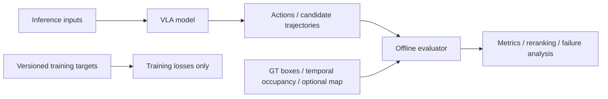
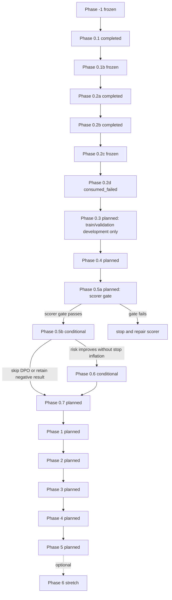

# Safety-Aware VLA for Autonomous Driving：完整项目执行计划

## 0. 文档说明与维护规则

### 0.1 文档职责

本文是项目阶段规格、依赖关系、信息合同与执行 Gate 的唯一主来源。其他长期文档各自只承担一种职责：

- `docs/progress.md`：记录已经确认的实际状态、指标、artifact 与 open questions；
- `AGENTS.md`：记录 agent 和开发者不得违反的仓库规则；
- `README.md`：负责外部项目介绍、能力边界和复现入口；
- `project_mvp_plan.md`：定义项目要做什么、按什么顺序做、满足什么条件才能继续。

实际进度变化时，先用真实执行证据更新 `docs/progress.md`，再同步本文的阶段状态。禁止在多个文件中维护互相冲突的阶段事实；若出现冲突，已核验的实际状态以 `docs/progress.md` 为准，阶段目标、Gate 和依赖以本文为准。

### 0.2 维护规则

- 只有代码、配置、测试、真实数据 smoke test、人工审核和持久化 artifact 共同支持的能力，才可标为 `completed` 或 `frozen`。
- 论文结果、模型官方能力和外部 benchmark 不得写成本项目结果。
- 尚未实现或未核验的入口、指标、资源开销和能力必须标为 `planned`、`conditional`、`stretch` 或“待验证”。
- 阶段状态、contract、rule 或 evaluation protocol 变化时，必须记录版本与 provenance；不得覆盖 frozen artifact。
- Phase 0.3 及后续阶段必须按第 5.2 节统一模板补全。本轮只建立章节骨架，不授权实现后续阶段代码或执行实验。

## 1. 项目使命、最终目标与非目标

### 1.1 项目使命

本项目研究 **Safety-Aware VLA for Autonomous Driving with BEV/OCC-aware Spatial Evaluation**：从可审计的 coarse meta-action MVP 出发，逐步建立能够利用时序多相机视觉、ego state、map/route 与几何表示，生成多模态未来轨迹并接受安全评估的自动驾驶 VLA。

### 1.2 Phase 0：coarse meta-action MVP

Phase 0 验证以下最小证据链：

```text
数据和标签是否可信
→ 视觉模型能否预测 coarse action
→ 安全 scorer 能否评价候选行为
→ reranker / preference learning 是否提供增益
```

固定六类 coarse action 为：

```text
keep
accelerate
decelerate
stop
left_lateral
right_lateral
```

六类动作是 **coarse behavior representation**，不是最终动作空间。`left_lateral` / `right_lateral` 只表示稳定的左右横向运动，不能直接解释为 turn、lane change 或其原因。coarse action 在长期系统中继续作为辅助监督、可解释输出、baseline 与 action-trajectory 一致性检查接口，不通过不断增加互斥类别来承担完整规划任务。

### 1.3 Phase 1—6：完整自动驾驶 VLA

长期主线为：

```text
temporal multi-camera images
+ current/past ego state
+ route / map context
        ↓
VLM semantic branch
+ BEV/OCC geometry branch
        ↓
multimodal fusion
        ↓
hierarchical action heads
+ multimodal candidate trajectories
        ↓
predicted occupancy / geometry scorer
        ↓
safety-aware trajectory reranker
        ↓
controller / simulator
```

- Phase 1 开始输出连续 future trajectory；
- Phase 2 引入 multi-camera 与 learned BEV/OCC geometry；
- Phase 3 引入 map、route 和 fine-grained maneuver；
- Phase 4 进入 quasi-closed-loop / closed-loop evaluation；
- Phase 5 处理 robustness、latency、fallback 与 efficiency；
- Phase 6 是 optional RL / world-model research extension，不阻塞完整项目的核心完成。

上述路线是目标架构，不代表相关模块已经实现。BEV/OCC geometry 可以是经验证的 learned spatial representation，不要求把完整 occupancy prediction 产品化为基础完成条件。

### 1.4 非目标

本项目的基础完成条件不包括：

- 量产级、实车或 real-time 部署；
- 以 RL 或 world model 作为必经路线；
- 完整 occupancy prediction 系统；
- 仅依靠更多 `stop` 预测获得表面上的安全指标改善；
- 将 oracle GT scorer 冒充在线 camera-only safety capability；
- 在没有 map、lane topology、route 或必要时序信息时，把 coarse lateral 标签解释为 turn 或 lane change。

## 2. MVP 和完整项目的成功定义

### 2.1 Coarse-action MVP success

Coarse-action MVP 必须同时满足：

- 数据、标签、split、预测和评测结果具备 sample-level provenance；
- train、validation、test 按 scene-level split，且经过无泄漏验证；
- Majority、ego-motion、VLM、LoRA/action adapter 与 reranker 使用统一 action schema、parser 和 evaluation protocol；
- 每种方法保存可回溯的 sample-level predictions，并报告 macro-F1、per-class F1、confusion matrix、class distribution、invalid output rate 与 parsing success rate；
- safety 改善不能仅来自 `stop` 增加，必须联合报告风险、`unnecessary_stop` 与 action quality；
- 最终结论基于新的 untouched evaluation protocol。Phase 0.2d 已消费的原 project test 不再具备这一资格。

### 2.2 Trajectory VLA success

Trajectory VLA 必须同时满足：

- 模型真实输出带坐标、时间、horizon 与 valid mask 合同的 future waypoints；
- 在同一协议下超过 constant-velocity 与 ego-history baselines；
- coarse/fine action 与 predicted trajectory 的语义一致性可度量；
- 多候选轨迹具有有效 diversity，而不是数值近似的重复候选；
- safety reranking 在规划性能与风险之间取得可验证改进，并报告失败案例与 trade-off。

### 2.3 Full project success

完整项目的核心完成要求包括：

- temporal multi-camera input；
- learned BEV/OCC geometry；
- map / route conditioning；
- hierarchical behavior heads；
- multimodal trajectory generation；
- quasi-closed-loop 或 closed-loop evaluation；
- robustness、latency 与 fallback evidence；
- 每项能力均有可定位的代码、配置、artifact 和指标证据。

RL、world model、完整 occupancy prediction 和实车部署均不是基础完成条件；对应工作只能在证据充分时作为 extension 报告。

## 3. 推理输入、训练 target 和 offline evaluator 的信息边界

### 3.1 Model inference inputs

经对应阶段 contract 批准后，模型推理输入可以包括：

```text
current / historical camera images
current / past ego state
driving instruction
route command
map / lane topology
predicted BEV / occupancy
```

具体传感器、历史长度、缺帧策略和坐标约定由阶段 contract 冻结。尚未进入对应阶段的输入不得提前接入并冒充当前能力。

### 3.2 Training targets

训练路径可使用与任务对应的监督 target：

```text
coarse meta-action
fine-grained actions
future ego trajectory
future waypoints
GT occupancy
consistency targets
```

Training target 必须与 inference input 分离；target 的存在不代表推理时可访问同源 GT 信息。

### 3.3 Offline evaluator inputs

Offline evaluator 可按阶段 contract 使用：

```text
GT current/future agent boxes
GT-derived temporal occupancy
ego pose
optional map
candidate action rollout
predicted candidate trajectories
```

这些输入只用于 oracle offline scoring、failure analysis、reranking 或 evaluator validation。在线能力必须另以 predicted geometry 与真实 inference path 验证。

### 3.4 永久禁止的信息泄漏

- future ego trajectory 不得进入模型推理；
- GT meta-action 不得进入模型推理；
- GT boxes、future agents 或 GT occupancy 不得进入模型 test-time inference；
- test labels 不得用于 prompt、threshold、candidate、model、architecture 或 checkpoint 选择；
- 不得以 GT ego trajectory 替代模型 candidate trajectory 进行 collision check；
- 不得将 oracle GT scorer 的结果表述为在线 camera-only safety capability。



## 4. 数据、坐标、时间、版本和 artifact 总合同

### 4.1 长期基础字段

Manifest family 的长期基础合同为：

```text
sample_token
scene_token
timestamp
sensor_paths
current_ego_pose
current_ego_motion
coordinate_metadata
history_valid_mask
future_ego_trajectory
future_waypoints
trajectory_valid_mask
nearby_agents
map_route_metadata
split
official_split
manifest_schema_version
```

字段按阶段逐步启用：当前已实现的 `cam_front_path` 是 single-camera `sensor_paths` 的现行字段；`history_valid_mask`、`future_waypoints`、`trajectory_valid_mask` 和 `map_route_metadata` 尚未全部进入当前 frozen schema，必须在使用它们的阶段提升 schema version 后加入。不得把长期合同字段误写为当前已完成能力。

### 4.2 版本化 targets 与实验字段

```text
meta_action
label_rule_version
fine_action_rule_version
safety_rule_version
raster_config_version
prompt_version
parser_version
model_revision
checkpoint_sha256
split_mapping_sha256
evaluation_protocol_version
```

基础字段与派生 target 必须分离。Schema 变化必须提升 `manifest_schema_version`；rule 变化必须提升对应 rule version 并重新生成受影响 target；coarse 与 fine labels、不同版本 labels 均不得静默混用。

### 4.3 坐标与时间合同

- 坐标数据必须记录 source frame、target frame、轴方向、单位和 transform 顺序；
- 时间数据必须记录 timestamp 单位、timestamp source、采样间隔、history/future horizon、tolerance 与缺帧策略；
- 当前 `current_ego_pose` / `current_ego_motion` 的 timestamp source 固定为 `CAM_FRONT_sample_data`；motion 只由 current/past pose 推导；
- future trajectory、waypoints、agents 与 occupancy 必须显式对齐离散时间步，不能只凭数组下标假设同步。

### 4.4 Split、provenance 与存储规则

- train、validation、test 必须按 scene-level split，禁止相邻帧跨 split；
- 数据、模型、配置、代码版本和结果必须具备 provenance 与必要 SHA-256；
- frozen artifact 不得覆盖、就地改写或以改名方式复用；
- 原始数据、派生数据、checkpoint、正式输出、日志和缓存不进入 Git；
- Git 只保存代码、配置模板、schema、允许公开的小型测试 fixture、测试和文档；
- 不可逆 evaluation 的 durable claim、访问状态、输出持久化状态与 rerun policy 必须单独记录。

## 5. 全局状态定义与统一执行规范

### 5.1 全局状态定义

| 状态 | 定义 |
|---|---|
| `completed` | 阶段目标和 Gate 已由可复现证据满足，但其输出仍可能在后续阶段被版本化扩展。 |
| `frozen` | 阶段已完成，关键 contract、rule、split 或 artifact 被锁定；后续不得静默修改。 |
| `active` | 当前正在执行，尚未满足全部 Gate。 |
| `blocked` | 前置条件或外部依赖未满足，当前不得继续。 |
| `planned` | 已进入路线图，但尚未开始实现或验收。 |
| `conditional` | 只有前序实验满足指定增益或质量 Gate 时才执行。 |
| `stretch` | 可选研究扩展，不阻塞核心项目完成。 |
| `retired` | 协议或方案已停止使用；保留历史证据，但不得作为当前有效方案。 |
| `consumed_failed` | 不可逆正式评估已访问 sealed evaluation data，但因执行或 artifact 持久化失败而没有形成可发布结果；该 evaluation source 仍视为已消费，永久不得重跑。 |

状态只描述证据与 Gate，不描述主观完成度。`completed` 不等于 `frozen`，`consumed_failed` 也绝不等于“未执行”。

### 5.2 Phase 0.3 及后续阶段统一模板

后续每个阶段必须严格包含：

```text
阶段状态
阶段目的
为什么需要
前置条件
本阶段不解决什么

输入
允许使用的数据
禁止使用的数据
字段和 artifact contract

详细执行步骤
涉及代码与配置
生成的本地 artifact
版本和 provenance

单元测试
contract / regression tests
真实数据 smoke test
人工审核

实验矩阵
评测指标
通过 Gate
失败分支
停止条件
不可逆操作与保护措施
进入下一阶段的条件

阶段学习目标
可形成的代码、图表、Demo 和简历证据
```

测试数量不能替代真实 producer artifact → consumer intake 的 shape 核验。不可逆操作前必须完成不访问 sealed data 的 full shadow execution，并验证 adapter、输出持久化与 rerun guard。

## 6. 完整项目阶段总览和依赖关系

### 6.1 阶段状态总表

| 阶段 | 目标 | 状态 | 主要输出 |
|---|---|---|---|
| Phase -1 | 数据闭环与 coarse label freeze | `frozen` | 数据对齐、标签、108-sample 人工审核、freeze gate |
| Phase 0.1 | manifest、split、metrics、Majority | `completed` | audited seed subset 与统一评测协议 |
| Phase 0.1b | trainval scale-up | `frozen` | 正式 manifest v1 与 scene mapping |
| Phase 0.2a | past-only ego-motion audit | `completed` | inference input audit |
| Phase 0.2b | rule candidate search | `completed` | validation candidate selection |
| Phase 0.2c | failure analysis 与 rule freeze | `frozen` | `phase0.2-ego-motion-rule-v0.1` |
| Phase 0.2d | sealed one-shot evaluation | `consumed_failed` | 无正式 test metrics；原 test 永久消费 |
| Phase 0.3 | Qwen3-VL zero/few-shot | `planned` | VLM baseline |
| Phase 0.4 | LoRA / action adapter | `planned` | supervised VLM |
| Phase 0.5a | geometric safety scorer | `planned` | oracle safety evaluator |
| Phase 0.5b | offline reranker | `conditional` | safety-aware selection |
| Phase 0.6 | preference audit / optional DPO | `conditional` | preference learning |
| Phase 0.7 | coarse MVP freeze | `planned` | MVP final report 与独立评估 |
| Phase 1 | temporal trajectory VLA | `planned` | future waypoints |
| Phase 2 | multi-camera BEV/OCC VLA | `planned` | learned geometry |
| Phase 3 | map / route / hierarchical behavior | `planned` | fine maneuver planning |
| Phase 4 | quasi/closed-loop evaluation | `planned` | simulation evidence |
| Phase 5 | robustness and efficiency | `planned` | deployability evidence |
| Phase 6 | RL / world model | `stretch` | optional research extension |

### 6.2 依赖关系与 Gate



Scorer gate 未通过时不得进入 reranker；reranker 未证明风险改善且不过度增加 `stop` 时不得进入 preference learning。DPO 可跳过，Phase 0.5b 的正结果或诚实负结果均可进入 Phase 0.7 做 coarse MVP freeze。Phase 6 不阻塞 Phase 5 后的核心完成判定。

## 7. Phase -1：数据闭环与 coarse label freeze 简要回顾

**状态：`frozen`。** Phase -1 建立并核验了：

```text
sample_token → CAM_FRONT
sample_token → future ego trajectory
sample_token → nearby 3D agents
→ one-page visualization
→ meta-action derivation
→ 108-sample manual audit
→ label regression freeze
→ real-data freeze gate
```

取得的核心结果是图像、3 秒 future trajectory 与 nearby agents 可在 sample level 对齐和可视化；六类 coarse meta-action 已派生，108 个样本覆盖六类 action 并完成人工审核，alignment 为 108/108；label regression 与 real-data freeze gate 均为 108/108。

本阶段冻结了六类 action schema、`label_rule_version=phase-1.6-meta-action-v0.2`、基于 `CAM_FRONT_sample_data` 的时间源、ego-frame 坐标约定和 audit provenance。`safety_rule_version=not_available` 是历史事实；Phase -1 没有完成 safety scorer，也没有训练模型。

## 8. Phase 0.1 / 0.1b 简要回顾

### 8.1 Phase 0.1：audited seed-subset 与统一评测协议

**状态：`completed`。** Phase 0.1 将 frozen labels 转为 `phase0_audited_seed_subset_v1`，建立固定 seed 的 scene-level split、统一六类 action schema、完整 manifest validator、Majority Baseline 与 unified metrics。协议要求 sample-level predictions、macro-F1、per-class F1、confusion matrix、class distribution 和 invalid prediction 可追溯，并验证 scene split 无泄漏。

### 8.2 Phase 0.1b：正式 trainval manifest v1

**状态：`frozen`。** Phase 0.1b 已从 mini smoke 数据扩展到完整 nuScenes trainval，冻结：

- `manifest_schema_version=phase0_trainval_dataset_manifest_v1`；
- `horizon_sec=3.0`、`sample_interval_sec=0.5`、`time_tolerance_sec=0.075`；
- `label_rule_version=phase-1.6-meta-action-v0.2`；
- `split_strategy_version=official_train_scene_label_stratified_v1`、`split_seed=20260710`；
- official train 的 700 scenes 按 scene-level stratified split 为 project train/validation `560/140`；official validation 的 150 scenes 固定为当时的 project test；
- 扫描 34,149 samples，纳入 21,646 条：train 14,253、validation 3,594、test 3,799；排除 12,503 条；
- 正式 manifest、mapping sidecar、内部 mapping 与 scene histogram 均有固定 SHA-256 和 provenance，且不得覆盖。

完整 validator、rare-class constraints、排除原因诊断及 train/validation 视觉审核已通过。Mini 此后只用于 smoke test、快速回归和小规模调试，不用于正式 LoRA/action adapter/DPO 结论。这里的原 project test 后来在 Phase 0.2d 被永久消费，不能继续作为 untouched evaluation source。

## 9. Phase 0.2a—0.2d 简要回顾

### 9.1 Phase 0.2a：current/past-only ego-motion audit

**状态：`completed`。** 输入合同只包含 speed、longitudinal acceleration、yaw rate、availability 与对应 past interval；禁止 future trajectory、derived meta-action 或 test labels 作为 baseline 输入。Train/validation/test 的 `full/partial/unavailable` 分别为 `13476/392/385`、`3401/99/94`、`3594/106/99`。该审计未使用 test label 做统计或调参。

### 9.2 Phase 0.2b：deterministic rule candidate search

**状态：`completed`。** 固定 625-candidate grid 只在 validation 上选择 deterministic rule candidate。入选阈值为：

```text
stop speed              = 0.2 m/s
lateral yaw rate        = 0.05 rad/s
accelerate acceleration = 0.5 m/s²
decelerate acceleration = 0.3 m/s²
```

Validation macro-F1 / accuracy 为 `0.615681 / 0.623817`；同协议 Majority Baseline 为 `0.087186 / 0.354201`。这些是参与 candidate selection 的 validation 结果，不是无偏 test 结果。

### 9.3 Phase 0.2c：failure analysis 与 rule freeze

**状态：`frozen`。** `phase0.2-ego-motion-rule-v0.1` 冻结为 `candidate-0293`，validation predictions 复现为 `3594/3594`。主要错误为 `keep → decelerate`（260）和 `decelerate → keep`（181）。Candidate、thresholds、rule version 与 failure analysis 已冻结；不得利用后续 evaluation 反馈修改这一版本。

### 9.4 Phase 0.2d：sealed one-shot evaluation

**状态：`consumed_failed`。** Sealed one-shot formal execution 已且仅已调用一次。Durable execution claim 写入后，执行访问了 test label/motion；随后在正式 test result 持久化前，于 `build_formal_outputs → build_validation_to_test_comparison` 失败。

失败原因是跨模块 artifact schema mismatch：正式 `validation_metrics.json` 使用嵌套 `metrics` 和顶层 `predicted_class_distribution`，consumer 当时却期望顶层扁平 metrics 和 `prediction_class_distribution`。执行 exit code 为 `1`，没有生成可发布的正式 test outputs 或正式 test metrics；rule 与 thresholds 也未按 test 信息修改。

不可逆边界如下：

- execution claim 状态为 `consumed_failed`，`rerun_permitted=false`；
- 原 project test 已永久消费，禁止重跑、恢复、重算、重新切分、改名复用或以任何方式重新取得结果；
- 该 split 不得再用于 prompt、threshold、candidate、model、architecture 或 checkpoint 选择；
- 后续 validation artifact adapter 和 producer-shape regression 已修复，但只适用于未来协议，不授权重跑本次 test；
- Phase 0.3 及后续阶段只能使用 train/validation 开发与模型选择；
- 最终无偏评价必须使用新的 external held-out dataset，或新的、从未访问过的 evaluation protocol。

因此 Phase 0.2d 不能写成 test completed，也不能报告任何正式 test performance。

## 10. Phase 0.3 及后续阶段章节骨架

以下章节仅建立完整项目计划的结构。每个阶段的详细步骤、代码/config contract、实验矩阵、Gate 和失败分支将在后续子任务按第 5.2 节模板补充。

### 10.1 Phase 0.3：Qwen3-VL zero-shot / few-shot baseline

- **阶段目标：** 在统一 coarse-action protocol 下建立 image 与获批 ego-state 输入的 Qwen3-VL zero/few-shot baseline。
- **状态：** `planned`。
- **前置阶段：** Phase 0.2d 边界已记录；开发仅使用 train/validation。
- **后续补充：** 详细执行规格将在后续子任务补充。

### 10.2 Phase 0.4：coarse meta-action LoRA / action adapter

- **阶段目标：** 在 frozen trainval contract 上建立 supervised coarse-action VLM。
- **状态：** `planned`。
- **前置阶段：** Phase 0.3 baseline 与协议 Gate。
- **后续补充：** 详细执行规格将在后续子任务补充。

### 10.3 Phase 0.5a：GT-derived geometric safety scorer

- **阶段目标：** 建立以 candidate rollout / predicted trajectory 和 GT geometry 为输入的 oracle offline safety evaluator。
- **状态：** `planned`。
- **前置阶段：** Phase 0.4 输出合同稳定。
- **后续补充：** 详细执行规格将在后续子任务补充。

### 10.4 Phase 0.5b：offline safety reranker

- **阶段目标：** 在固定 candidate set 上验证 safety-aware selection 是否真实降低风险且不依赖 stop inflation。
- **状态：** `conditional`。
- **前置阶段：** Phase 0.5a scorer gate 通过。
- **后续补充：** 详细执行规格将在后续子任务补充。

### 10.5 Phase 0.6：preference pair audit 与 optional DPO

- **阶段目标：** 在 reranker 有效时构建可审计 preference pairs，并条件性评估 coarse-action DPO。
- **状态：** `conditional`。
- **前置阶段：** Phase 0.5b 证明风险改善且不过度增加 `stop`。
- **后续补充：** 详细执行规格将在后续子任务补充。

### 10.6 Phase 0.7：coarse-action MVP freeze 与独立评估

- **阶段目标：** 冻结 coarse MVP 的协议、artifact、诚实结论与新的 untouched independent evaluation。
- **状态：** `planned`。
- **前置阶段：** Phase 0.5b 完成；Phase 0.6 可完成或按 Gate 跳过。
- **后续补充：** 详细执行规格将在后续子任务补充。

### 10.7 Phase 1：temporal single-camera trajectory VLA

- **阶段目标：** 引入 temporal single-camera context 并输出 continuous future waypoints 与多候选轨迹。
- **状态：** `planned`。
- **前置阶段：** Phase 0.7 coarse MVP freeze。
- **后续补充：** 详细执行规格将在后续子任务补充。

### 10.8 Phase 2：multi-camera BEV/OCC-aware VLA

- **阶段目标：** 引入 multi-camera 与 learned BEV/OCC geometry branch，服务于轨迹预测和安全评估。
- **状态：** `planned`。
- **前置阶段：** Phase 1 trajectory contract 与 baseline Gate。
- **后续补充：** 详细执行规格将在后续子任务补充。

### 10.9 Phase 3：map、route 与 hierarchical behavior

- **阶段目标：** 融合 map/route，建立 coarse-to-fine hierarchical behavior 与 trajectory planning。
- **状态：** `planned`。
- **前置阶段：** Phase 2 geometry contract 与消融证据。
- **后续补充：** 详细执行规格将在后续子任务补充。

### 10.10 Phase 4：quasi-closed-loop / closed-loop evaluation

- **阶段目标：** 在可核验 simulator/evaluator 中评估滚动决策、误差累积和交互风险。
- **状态：** `planned`。
- **前置阶段：** Phase 3 planning interface 稳定。
- **后续补充：** 详细执行规格将在后续子任务补充。

### 10.11 Phase 5：robustness、latency、fallback 与 efficiency

- **阶段目标：** 建立扰动鲁棒性、端到端 latency、fallback 和资源效率证据。
- **状态：** `planned`。
- **前置阶段：** Phase 4 evaluation loop 可复现。
- **后续补充：** 详细执行规格将在后续子任务补充。

### 10.12 Phase 6：optional RL 与 world model

- **阶段目标：** 条件性研究 RL 或 world model 是否在既有系统上提供额外收益。
- **状态：** `stretch`。
- **前置阶段：** Phase 5 核心项目证据完成；本阶段不阻塞核心完成。
- **后续补充：** 详细执行规格将在后续子任务补充。

### 10.13 最终实验矩阵、Demo 和 portfolio statement

- **阶段目标：** 汇总跨阶段可复现实验、代表性 Demo、失败边界与只基于本项目证据的 portfolio statement。
- **状态：** `planned`。
- **前置阶段：** 对应能力阶段完成并具有代码、配置、artifact 与指标证据。
- **后续补充：** 详细执行规格将在后续子任务补充。
