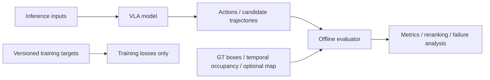

# Safety-Aware VLA for Autonomous Driving：完整项目执行计划

## 0. 文档说明与维护规则

### 0.1 文档职责

本文是项目阶段规格、依赖关系、信息合同与执行 Gate 的唯一主来源。其他长期文档各自只承担一种职责：

- `docs/progress.md`：记录已经确认的实际状态、指标、artifact 与 open questions；
- `AGENTS.md`：记录 agent 和开发者不得违反的仓库规则；
- `README.md`：负责外部项目介绍、能力边界和复现入口；
- `project_mvp_plan.md`：定义项目要做什么、按什么顺序做、满足什么条件才能继续。

实际进度变化时，先用真实执行证据更新 `docs/progress.md`，再同步本文的阶段状态。禁止在多个文件中维护互相冲突的阶段事实；若出现冲突，已核验的实际状态以 `docs/progress.md` 为准，阶段目标、Gate 和依赖以本文为准。

### 0.2 维护规则

- 只有代码、配置、测试、真实数据 smoke test、人工审核和持久化 artifact 共同支持的能力，才可标为 `completed` 或 `frozen`。
- 论文结果、模型官方能力和外部 benchmark 不得写成本项目结果。
- 尚未实现或未核验的入口、指标、资源开销和能力必须标为 `planned`、`conditional`、`stretch` 或“待验证”。
- 阶段状态、contract、rule 或 evaluation protocol 变化时，必须记录版本与 provenance；不得覆盖 frozen artifact。
- Phase 0.3 及后续阶段必须按第 5.2 节统一模板补全；尚未在本文展开的阶段只保留骨架，不得用概述冒充可执行规格。

## 1. 项目使命、最终目标与非目标

### 1.1 项目使命

本项目研究 **Safety-Aware VLA for Autonomous Driving with BEV/OCC-aware Spatial Evaluation**：从可审计的 coarse meta-action MVP 出发，逐步建立由历史 `CAM_FRONT` 时序语义、current/past ego state 与当前同步多相机几何表示共同驱动，生成连续未来轨迹并接受安全评估的自动驾驶 VLA。Map/route、多候选轨迹和 temporal multi-camera BEV 均在对应 optional 阶段单独评估，不作为核心主线的默认前提。

### 1.2 Phase 0：coarse meta-action MVP

Phase 0 验证以下最小证据链：

```text
数据和标签是否可信
→ 视觉模型能否预测 coarse action
→ 安全 scorer 能否评价候选行为
→ reranker / preference learning 是否提供增益
```

固定六类 coarse action 为：

```text
keep
accelerate
decelerate
stop
left_lateral
right_lateral
```

六类动作是 **coarse behavior representation**，不是最终动作空间。`left_lateral` / `right_lateral` 只表示稳定的左右横向运动，不能直接解释为 turn、lane change 或其原因。coarse action 在长期系统中继续作为辅助监督、可解释输出、baseline 与 action-trajectory 一致性检查接口，不通过不断增加互斥类别来承担完整规划任务。

### 1.3 核心实施原则：面向最终系统，而不是制作多个临时产品

从 Phase 0.3 开始，所有阶段都服务于同一个最终 VLA：

```text
historical CAM_FRONT frames
+ current/past ego state
→ Qwen3-VL / temporal semantic representation

current synchronized multi-camera images
+ camera intrinsics/extrinsics/timestamps
→ calibration-aware BEV representation
→ current occupancy auxiliary prediction

semantic representation
+ BEV geometry tokens
+ ego representation
        ↓
semantic-geometric fusion
        ↓
coarse action auxiliary head
+ continuous future waypoint head
        ↓
geometric / occupancy safety scorer
        ↓
trajectory selection
        ↓
quasi-closed-loop environment
        ↓
reinforcement fine-tuning
```

这一路线采用双路径、双时间尺度：Phase 0.4 负责历史 `CAM_FRONT` 的时序语义建模，Phase 0.5 只在核心范围内增加当前 anchor 附近的同步多相机 geometry input。各相机允许存在细微 timestamp 差异，但必须通过 calibration 与 ego pose 变换到统一 anchor ego frame；temporal six-camera BEV 仅作为 optional。这一范围仍同时证明时序语义理解和多相机空间建模，并避免把 Phase 0.5 扩张成独立的大型 BEV 项目。

后续不是先完成一个纯分类产品，再推倒重做一个轨迹产品，随后再重做一个 BEV 产品。Coarse action、continuous trajectory、BEV/OCC、safety scorer 和 reinforcement learning 是同一架构的不同模块：Phase 0.3 验证 VLM 接入，Phase 0.4 建立最终核心模型骨架，Phase 0.5—0.8 在该骨架上依次增加空间建模、安全约束、准闭环评测和 reinforcement fine-tuning。

阶段划分只用于控制调试范围、建立最少必要 baseline、完成模块级消融并确认每个模块是否有效。已完成模块应通过稳定接口继续复用，不做无必要的推倒重写；每个阶段必须交付可复用的数据、feature、model、evaluator 或 environment contract，而不是只交付一次性实验数字。全过程继续遵守 inference/GT information boundary、坐标与时间合同、scene-level split 和 train/validation/test 防泄漏规则。

### 1.4 最终 VLA 主路线

核心路线统一为：

```text
Phase 0.3  Qwen3-VL data interface and rapid visual baseline
→ Phase 0.4 temporal vision + ego state + continuous trajectory VLA core
→ Phase 0.5 BEV/OCC-aware semantic-geometric fusion
→ Phase 0.6 trajectory safety scorer and safety-aware selection
→ Phase 0.7 quasi-closed-loop evaluation and planning interface
→ Phase 0.8 reinforcement fine-tuning
→ Final robustness, latency, fallback, Demo and reproducibility evidence
```

Phase 0.3 是快速 baseline，不是长期主线终点；Phase 0.4 开始直接建设后续模块共用的最终模型。Phase 0.5—0.8 都扩展 Phase 0.4 的 shared driving representation 和 trajectory interface。RL 是核心阶段；world model 仍是 optional。完整 fine-grained maneuver taxonomy、learned 多候选轨迹生成、大规模 preference/DPO、完整 future occupancy prediction 和双仿真平台均不阻塞主线。

### 1.5 非目标

本项目的基础完成条件不包括：

- 量产级、实车或 real-time 部署；
- world model、复杂 DPO 或完整 fine-grained maneuver taxonomy；
- 同时完成 NAVSIM 与 Bench2Drive 两个平台；
- 完整 occupancy prediction 系统；
- 仅依靠更多 `stop` 预测获得表面上的安全指标改善；
- 将 oracle GT scorer 冒充在线 camera-only safety capability；
- 在没有 map、lane topology、route 或必要时序信息时，把 coarse lateral 标签解释为 turn 或 lane change。

## 2. MVP 和完整项目的成功定义

### 2.1 Coarse-action MVP success

Coarse-action MVP 必须同时满足：

- 数据、标签、split、预测和评测结果具备 sample-level provenance；
- train、validation、test 按 scene-level split，且经过无泄漏验证；
- Majority、ego-motion、VLM、LoRA/action adapter 与 reranker 使用统一 action schema、parser 和 evaluation protocol；
- 每种方法保存可回溯的 sample-level predictions，并报告 macro-F1、per-class F1、confusion matrix、class distribution、invalid output rate 与 parsing success rate；
- safety 改善不能仅来自 `stop` 增加，必须联合报告风险、`unnecessary_stop` 与 action quality；
- 最终结论基于新的 untouched evaluation protocol。Phase 0.2d 已消费的原 project test 不再具备这一资格。

### 2.2 Trajectory VLA success

Trajectory VLA 必须同时满足：

- 模型真实输出带坐标、时间、horizon 与 valid mask 合同的 future waypoints；
- 在同一协议下超过 constant-velocity 与 ego-history baselines；
- coarse action 与 predicted trajectory 的语义一致性可度量；
- safety reranking 在规划性能与风险之间取得可验证改进，并报告失败案例与 trade-off。

多候选轨迹若被启用，还必须验证有效 diversity；它不是第一版 trajectory VLA 的核心完成条件。

### 2.3 Full project success

完整项目的核心完成要求包括：

- historical `CAM_FRONT` 时序视觉和 current/past ego state 输入；
- 当前同步多相机图像、calibration 与统一 anchor ego frame 几何输入；
- VLM semantic representation；
- continuous future waypoint prediction；
- BEV/OCC-aware geometry representation；
- semantic-geometric feature fusion；
- trajectory safety scoring；
- quasi-closed-loop planning evaluation；
- reinforcement fine-tuning；
- robustness、latency 与 fallback evidence；
- 完整 Demo、可复现配置，以及每项能力可定位的代码、artifact 和指标证据。

完整 fine-grained maneuver taxonomy、learned 多候选轨迹生成、大规模 preference/DPO、完整 future occupancy prediction、Bench2Drive 与 NAVSIM 双平台和 world model 均为 optional；Phase 0.6 从单条 raw trajectory 确定性派生的 safety fallback candidate bank 属于核心 safety contract，不等同于 learned multimodal trajectory generation。实车部署不在本项目范围。RL 不属于 optional；它必须在 quasi-closed-loop reward 与保护边界建立后作为 Phase 0.8 完成并报告。

## 3. 推理输入、训练 target 和 offline evaluator 的信息边界

### 3.1 Model inference inputs

经对应阶段 contract 批准后，模型推理输入可以包括：

```text
historical CAM_FRONT frames
current synchronized multi-camera images
camera intrinsics / extrinsics / timestamps / availability mask
current / past ego state
driving instruction
route command
map / lane topology
```

具体传感器、历史长度、缺帧策略和坐标约定由阶段 contract 冻结。Phase 0.5 的 predicted BEV / occupancy 是模型内部 geometry representation 与下游输出，不是额外的外部 GT input；尚未进入对应阶段的输入不得提前接入并冒充当前能力。

### 3.2 Training targets

训练路径可使用与任务对应的监督 target：

```text
coarse meta-action
fine-grained actions
future ego trajectory
future waypoints
GT occupancy
consistency targets
```

Training target 必须与 inference input 分离；target 的存在不代表推理时可访问同源 GT 信息。

### 3.3 Offline evaluator inputs

Offline evaluator 可按阶段 contract 使用：

```text
GT current/future agent boxes
GT-derived temporal occupancy
ego pose
optional map
candidate action rollout
predicted candidate trajectories
```

这些输入只用于 oracle offline scoring、failure analysis、reranking 或 evaluator validation。在线能力必须另以 predicted geometry 与真实 inference path 验证。

### 3.4 永久禁止的信息泄漏

- future ego trajectory 不得进入模型推理；
- GT meta-action 不得进入模型推理；
- GT boxes、future agents 或 GT occupancy 不得进入模型 test-time inference；
- test labels 不得用于 prompt、threshold、candidate、model、architecture 或 checkpoint 选择；
- 不得以 GT ego trajectory 替代模型 candidate trajectory 进行 collision check；
- 不得将 oracle GT scorer 的结果表述为在线 camera-only safety capability。



## 4. 数据、坐标、时间、版本和 artifact 总合同

### 4.1 长期基础字段

Manifest family 的长期基础合同为：

```text
sample_token
scene_token
timestamp
sensor_paths
current_ego_pose
current_ego_motion
coordinate_metadata
history_valid_mask
future_ego_trajectory
future_waypoints
trajectory_valid_mask
nearby_agents
map_route_metadata
split
official_split
manifest_schema_version
```

字段按阶段逐步启用：当前已实现的 `cam_front_path` 是 single-camera `sensor_paths` 的现行字段；`history_valid_mask`、`future_waypoints`、`trajectory_valid_mask` 和 `map_route_metadata` 尚未全部进入当前 frozen schema，必须在使用它们的阶段提升 schema version 后加入。不得把长期合同字段误写为当前已完成能力。

### 4.2 版本化 targets 与实验字段

```text
meta_action
label_rule_version
fine_action_rule_version
safety_rule_version
raster_config_version
prompt_version
parser_version
model_revision
checkpoint_sha256
split_mapping_sha256
evaluation_protocol_version
```

基础字段与派生 target 必须分离。Schema 变化必须提升 `manifest_schema_version`；rule 变化必须提升对应 rule version 并重新生成受影响 target；coarse 与 fine labels、不同版本 labels 均不得静默混用。

### 4.3 坐标与时间合同

- 坐标数据必须记录 source frame、target frame、轴方向、单位和 transform 顺序；
- 时间数据必须记录 timestamp 单位、timestamp source、采样间隔、history/future horizon、tolerance 与缺帧策略；
- 当前 `current_ego_pose` / `current_ego_motion` 的 timestamp source 固定为 `CAM_FRONT_sample_data`；motion 只由 current/past pose 推导；
- future trajectory、waypoints、agents 与 occupancy 必须显式对齐离散时间步，不能只凭数组下标假设同步。

### 4.4 Split、provenance 与存储规则

- train、validation、test 必须按 scene-level split，禁止相邻帧跨 split；
- 数据、模型、配置、代码版本和结果必须具备 provenance 与必要 SHA-256；
- frozen artifact 不得覆盖、就地改写或以改名方式复用；
- 原始数据、派生数据、checkpoint、正式输出、日志和缓存不进入 Git；
- Git 只保存代码、配置模板、schema、允许公开的小型测试 fixture、测试和文档；
- 不可逆 evaluation 的 durable claim、访问状态、输出持久化状态与 rerun policy 必须单独记录。

## 5. 全局状态定义与统一执行规范

### 5.1 全局状态定义

| 状态 | 定义 |
|---|---|
| `completed` | 阶段目标和 Gate 已由可复现证据满足，但其输出仍可能在后续阶段被版本化扩展。 |
| `frozen` | 阶段已完成，关键 contract、rule、split 或 artifact 被锁定；后续不得静默修改。 |
| `active` | 当前正在执行，尚未满足全部 Gate。 |
| `blocked` | 前置条件或外部依赖未满足，当前不得继续。 |
| `planned` | 已进入路线图，但尚未开始实现或验收。 |
| `conditional` | 只有前序实验满足指定增益或质量 Gate 时才执行。 |
| `stretch` | 可选研究扩展，不阻塞核心项目完成。 |
| `retired` | 协议或方案已停止使用；保留历史证据，但不得作为当前有效方案。 |
| `consumed_failed` | 不可逆正式评估已访问 sealed evaluation data，但因执行或 artifact 持久化失败而没有形成可发布结果；该 evaluation source 仍视为已消费，永久不得重跑。 |

状态只描述证据与 Gate，不描述主观完成度。`completed` 不等于 `frozen`，`consumed_failed` 也绝不等于“未执行”。

### 5.2 Phase 0.3 及后续阶段统一模板

后续每个阶段必须严格包含：

```text
阶段状态
阶段目的
为什么需要
前置条件
本阶段不解决什么

输入
允许使用的数据
禁止使用的数据
字段和 artifact contract

详细执行步骤
涉及代码与配置
生成的本地 artifact
版本和 provenance

单元测试
contract / regression tests
真实数据 smoke test
人工审核

实验矩阵
评测指标
通过 Gate
失败分支
停止条件
不可逆操作与保护措施
进入下一阶段的条件

阶段学习目标
可形成的代码、图表、Demo 和简历证据
```

测试数量不能替代真实 producer artifact → consumer intake 的 shape 核验。不可逆操作前必须完成不访问 sealed data 的 full shadow execution，并验证 adapter、输出持久化与 rerun guard。

## 6. 完整项目阶段总览和依赖关系

### 6.1 阶段状态总表

| 阶段 | 目标 | 状态 | 主要输出 |
|---|---|---|---|
| Phase -1 | 数据闭环与 coarse label freeze | `frozen` | 数据对齐、标签、108-sample 人工审核、freeze gate |
| Phase 0.1 | manifest、split、metrics、Majority | `completed` | audited seed subset 与统一评测协议 |
| Phase 0.1b | trainval scale-up | `frozen` | 正式 manifest v1 与 scene mapping |
| Phase 0.2a | past-only ego-motion audit | `completed` | inference input audit |
| Phase 0.2b | rule candidate search | `completed` | validation candidate selection |
| Phase 0.2c | failure analysis 与 rule freeze | `frozen` | `phase0.2-ego-motion-rule-v0.1` |
| Phase 0.2d | sealed one-shot evaluation | `consumed_failed` | 无正式 test metrics；原 test 永久消费 |
| Phase 0.3 | Qwen3-VL 数据接口与快速视觉 baseline | `planned` | 可复用 VLM 接入层与视觉 baseline |
| Phase 0.4 | 时序视觉 + ego state + continuous trajectory | `planned` | 最终 VLA 核心模型骨架 |
| Phase 0.5 | BEV/OCC-aware semantic-geometric fusion | `planned` | multi-camera/calibration adapter、current occupancy、融合与 trajectory ablation |
| Phase 0.6 | trajectory safety scorer 与 safety-aware selection | `planned` | deterministic candidate bank、oracle/deployable scorer 与可审计 selector |
| Phase 0.7 | quasi-closed-loop evaluation 与 planning interface | `planned` | 平台兼容性结论、rollout/reward contract 与累计规划证据 |
| Phase 0.8 | reinforcement fine-tuning | `planned` | 基于准闭环 reward 的最终策略优化 |
| Final | robustness、latency、fallback、Demo 与复现 | `planned` | 完整工程与展示证据闭环 |

### 6.2 依赖关系与 Gate

```mermaid
flowchart TD
    Pm1["Phase -1 frozen"] --> P01["Phase 0.1 completed"]
    P01 --> P01b["Phase 0.1b frozen"]
    P01b --> P02a["Phase 0.2a completed"]
    P02a --> P02b["Phase 0.2b completed"]
    P02b --> P02c["Phase 0.2c frozen"]
    P02c --> P02d["Phase 0.2d consumed_failed"]
    P02d --> P03["Phase 0.3 rapid Qwen3-VL baseline<br/>train/validation only"]
    P03 --> P04["Phase 0.4 final VLA core<br/>temporal trajectory"]
    P04 --> P05["Phase 0.5 BEV/OCC fusion"]
    P05 --> P06["Phase 0.6 trajectory safety"]
    P06 --> P07["Phase 0.7 quasi-closed-loop"]
    P07 --> P08["Phase 0.8 RL"]
    P08 --> PF["Final engineering evaluation"]

    P03 -.-> OPrompt["optional bounded few-shot search"]
    P04 -.-> OMulti["optional multimodal trajectories"]
    P05 -.-> OTemporalBEV["optional temporal six-camera BEV"]
    P05 -.-> OFutureOcc["optional full future occupancy"]
    P06 -.-> ODPO["optional DPO"]
    P07 -.-> OPlatform["optional second simulation platform"]
    P08 -.-> OWorld["optional world model"]
```

Phase 0.3 的 baseline 结果无论强弱都必须诚实保留，但不把 prompt engineering 变成长期主线。Phase 0.4 建立唯一的最终 VLA core；Phase 0.5—0.8 必须复用其 feature 与 trajectory contract。Optional 分支只能旁路增加研究证据，不能阻塞主线；其中 DPO 不得替代 Phase 0.8 RL，world model 也不属于核心完成条件。

## 7. Phase -1：数据闭环与 coarse label freeze 简要回顾

**状态：`frozen`。** Phase -1 建立并核验了：

```text
sample_token → CAM_FRONT
sample_token → future ego trajectory
sample_token → nearby 3D agents
→ one-page visualization
→ meta-action derivation
→ 108-sample manual audit
→ label regression freeze
→ real-data freeze gate
```

取得的核心结果是图像、3 秒 future trajectory 与 nearby agents 可在 sample level 对齐和可视化；六类 coarse meta-action 已派生，108 个样本覆盖六类 action 并完成人工审核，alignment 为 108/108；label regression 与 real-data freeze gate 均为 108/108。

本阶段冻结了六类 action schema、`label_rule_version=phase-1.6-meta-action-v0.2`、基于 `CAM_FRONT_sample_data` 的时间源、ego-frame 坐标约定和 audit provenance。`safety_rule_version=not_available` 是历史事实；Phase -1 没有完成 safety scorer，也没有训练模型。

## 8. Phase 0.1 / 0.1b 简要回顾

### 8.1 Phase 0.1：audited seed-subset 与统一评测协议

**状态：`completed`。** Phase 0.1 将 frozen labels 转为 `phase0_audited_seed_subset_v1`，建立固定 seed 的 scene-level split、统一六类 action schema、完整 manifest validator、Majority Baseline 与 unified metrics。协议要求 sample-level predictions、macro-F1、per-class F1、confusion matrix、class distribution 和 invalid prediction 可追溯，并验证 scene split 无泄漏。

### 8.2 Phase 0.1b：正式 trainval manifest v1

**状态：`frozen`。** Phase 0.1b 已从 mini smoke 数据扩展到完整 nuScenes trainval，冻结：

- `manifest_schema_version=phase0_trainval_dataset_manifest_v1`；
- `horizon_sec=3.0`、`sample_interval_sec=0.5`、`time_tolerance_sec=0.075`；
- `label_rule_version=phase-1.6-meta-action-v0.2`；
- `split_strategy_version=official_train_scene_label_stratified_v1`、`split_seed=20260710`；
- official train 的 700 scenes 按 scene-level stratified split 为 project train/validation `560/140`；official validation 的 150 scenes 固定为当时的 project test；
- 扫描 34,149 samples，纳入 21,646 条：train 14,253、validation 3,594、test 3,799；排除 12,503 条；
- 正式 manifest、mapping sidecar、内部 mapping 与 scene histogram 均有固定 SHA-256 和 provenance，且不得覆盖。

完整 validator、rare-class constraints、排除原因诊断及 train/validation 视觉审核已通过。Mini 此后只用于 smoke test、快速回归和小规模调试，不用于正式 LoRA/action adapter/DPO 结论。这里的原 project test 后来在 Phase 0.2d 被永久消费，不能继续作为 untouched evaluation source。

## 9. Phase 0.2a—0.2d 简要回顾

### 9.1 Phase 0.2a：current/past-only ego-motion audit

**状态：`completed`。** 输入合同只包含 speed、longitudinal acceleration、yaw rate、availability 与对应 past interval；禁止 future trajectory、derived meta-action 或 test labels 作为 baseline 输入。Train/validation/test 的 `full/partial/unavailable` 分别为 `13476/392/385`、`3401/99/94`、`3594/106/99`。该审计未使用 test label 做统计或调参。

### 9.2 Phase 0.2b：deterministic rule candidate search

**状态：`completed`。** 固定 625-candidate grid 只在 validation 上选择 deterministic rule candidate。入选阈值为：

```text
stop speed              = 0.2 m/s
lateral yaw rate        = 0.05 rad/s
accelerate acceleration = 0.5 m/s²
decelerate acceleration = 0.3 m/s²
```

Validation macro-F1 / accuracy 为 `0.615681 / 0.623817`；同协议 Majority Baseline 为 `0.087186 / 0.354201`。这些是参与 candidate selection 的 validation 结果，不是无偏 test 结果。

### 9.3 Phase 0.2c：failure analysis 与 rule freeze

**状态：`frozen`。** `phase0.2-ego-motion-rule-v0.1` 冻结为 `candidate-0293`，validation predictions 复现为 `3594/3594`。主要错误为 `keep → decelerate`（260）和 `decelerate → keep`（181）。Candidate、thresholds、rule version 与 failure analysis 已冻结；不得利用后续 evaluation 反馈修改这一版本。

### 9.4 Phase 0.2d：sealed one-shot evaluation

**状态：`consumed_failed`。** Sealed one-shot formal execution 已且仅已调用一次。Durable execution claim 写入后，执行访问了 test label/motion；随后在正式 test result 持久化前，于 `build_formal_outputs → build_validation_to_test_comparison` 失败。

失败原因是跨模块 artifact schema mismatch：正式 `validation_metrics.json` 使用嵌套 `metrics` 和顶层 `predicted_class_distribution`，consumer 当时却期望顶层扁平 metrics 和 `prediction_class_distribution`。执行 exit code 为 `1`，没有生成可发布的正式 test outputs 或正式 test metrics；rule 与 thresholds 也未按 test 信息修改。

不可逆边界如下：

- execution claim 状态为 `consumed_failed`，`rerun_permitted=false`；
- 原 project test 已永久消费，禁止重跑、恢复、重算、重新切分、改名复用或以任何方式重新取得结果；
- 该 split 不得再用于 prompt、threshold、candidate、model、architecture 或 checkpoint 选择；
- 后续 validation artifact adapter 和 producer-shape regression 已修复，但只适用于未来协议，不授权重跑本次 test；
- Phase 0.3 及后续阶段只能使用 train/validation 开发与模型选择；
- 最终无偏评价必须使用新的 external held-out dataset，或新的、从未访问过的 evaluation protocol。

因此 Phase 0.2d 不能写成 test completed，也不能报告任何正式 test performance。

## 10. 面向最终 VLA 的执行阶段

### 10.1 Phase 0.3：Qwen3-VL 数据接口与快速视觉 baseline

> Phase 0.3 不是最终模型，也不是长时间 prompt engineering 阶段。它只负责验证 Qwen3-VL 能否正确读取项目数据、输出统一 action schema，并为 Phase 0.4 trajectory VLA 提供可复用的视觉语言模型接入层。

#### 10.1.1 阶段状态、目的与边界

- **阶段状态：** `planned`。
- **阶段目的：** 打通 frozen manifest → image/text processor → Qwen3-VL → strict action parser → sample-level prediction 的完整链路。
- **为什么需要：** 在引入时序和 trajectory head 前，先隔离数据加载、模型依赖、prompt serialization、generation 和输出解析问题，避免把接入错误误判为规划模型错误。
- **前置条件：** Phase 0.1b trainval manifest 与六类 schema 已冻结；Phase 0.2d 的 consumed-test 边界保持不变；开发只允许 train/validation。

本阶段验证：

- frozen manifest 中的 `CAM_FRONT` 图像能否正确加载；
- Qwen3-VL processor、tokenizer 与 model 能否在项目环境稳定运行；
- driving instruction 与 current/past ego-motion summary 如何确定性序列化；
- 生成结果能否被统一 action parser 严格解析；
- zero-shot 与轻量 LoRA 是否能形成可复现的快速视觉 baseline；
- VLM hidden states / visual tokens 是否能通过稳定 feature interface 供 Phase 0.4 复用。

本阶段不解决：

```text
continuous trajectory prediction
temporal multi-frame fusion
BEV/OCC
safety scorer
closed-loop evaluation
reinforcement learning
unbounded prompt search
large-scale DPO
```

#### 10.1.2 输入、允许数据与禁止数据

模型输入限定为：

```text
CAM_FRONT image
current/past ego-motion summary
fixed driving instruction template
```

`coarse meta-action target` 只用于 supervised LoRA target 或离线评测；train/validation split 用于训练、模型选择和报告。必须分别运行 `image-only` 与 `image + ego state` 两组独立实验，以判断 ego state 的增益。

禁止：

- future ego trajectory 作为模型输入或 prompt 内容；
- GT nearby agents、GT boxes 或 GT occupancy 作为模型输入；
- 已消费 test 的图像、motion、label 或派生统计；
- validation label 进入 prompt；
- 任何 future-derived 数值通过 ego-state serialization 间接泄漏。

#### 10.1.3 数据样本与 artifact contract

概念样本合同如下：

```json
{
  "sample_token": "...",
  "image_path": "...",
  "instruction": "根据前视图像和当前车辆状态判断驾驶行为。",
  "ego_state": {
    "speed_mps": 0.0,
    "longitudinal_acceleration_mps2": 0.0,
    "yaw_rate_radps": 0.0,
    "availability": "full"
  },
  "target_action": "keep"
}
```

该 JSON 只是计划中的字段合同示例，不代表仓库当前已有对应训练文件。`image_path` 必须由 manifest 相对路径和受控 data root 解析；`target_action` 永远不进入 inference prompt。Instruction template、ego-state serialization 与 sample adapter schema 必须分别版本化。

Model-ready record 和 sample-level prediction 至少保留：

```text
sample_token
split
source_manifest_schema_version
source_manifest_sha256
label_rule_version
input_variant
prompt_version
parser_version
model_revision
processor_revision
generation_config_sha256
target_action
raw_output
parsed_action
is_valid_output
```

VLM feature interface 必须记录 feature source、tensor shape、dtype、attention/valid mask、model/processor revision 与 extraction policy；不得假设未核验的 token 数或 hidden dimension。

#### 10.1.4 Prompt、generation 与输出合同

Prompt 只使用少量预定义模板，不进行无边界搜索。正式实验必须选择并冻结一种 canonical 输出格式，例如：

```text
ACTION: keep
```

或：

```json
{"action": "keep"}
```

合同要求：

- 输出 action 只能是 `keep / accelerate / decelerate / stop / left_lateral / right_lateral`；
- parser 只接受当前 `parser_version` 声明的严格格式，不通过模糊匹配猜测非法输出；
- invalid output 单独计数，并保留原始输出；
- prompt、parser 和 generation config 均版本化；
- temperature、top-p、max new tokens、sampling 开关和 stop conditions 必须进入配置；
- validation 可用于从预先声明的有限模板中选择一次正式方案，但不得以反复试探形成无边界 prompt search。

#### 10.1.5 详细执行步骤

##### Phase 0.3a：环境与模型预检

1. 在 `codex4vla_env` 检查 PyTorch、Transformers、图像 processor 与目标模型依赖。
2. 确认 model/processor revision、下载来源和许可证信息。
3. 根据真实硬件执行显存、内存、dtype 与 batch-size 预检，不提前承诺资源数字。
4. 只加载少量 train/validation 样本，不扫描或访问 test。
5. 验证单图输入与 instruction 文本输入。
6. 验证 raw generation、strict parsing 与 invalid-output 路径。
7. 保存 smoke-run metadata、依赖版本、硬件摘要与失败原因。

##### Phase 0.3b：dataset adapter

1. 从 frozen trainval manifest streaming 读取 train/validation sample。
2. 解析并校验相对 `CAM_FRONT` 路径。
3. 构造 image-only prompt。
4. 构造 image + ego-state prompt。
5. 为 `full / partial / unavailable` ego state 定义显式、确定性的文本格式。
6. 输出 model-ready records，不在 adapter 中执行模型推理。
7. 保留 `sample_token`、split、target、manifest 和 rule provenance。
8. 在读取入口设置 test split guard，并证明 adapter 不访问 test。

##### Phase 0.3c：zero-shot baseline

只运行有限、预定义的 prompt templates，至少比较：

```text
image-only
image + ego state
```

两组实验使用同一 model revision、generation config、parser 和 validation protocol，输出 sample-level predictions 与完整 action metrics。Zero-shot 较弱不触发无限 prompt 调参。

##### Phase 0.3d：轻量 LoRA smoke baseline

该子阶段不是最终模型训练，只验证：

- supervised conversation format 与 action target placement；
- label masking 只对 assistant target 计算监督；
- collator 和 processor 输出可组成 batch；
- LoRA injection points 与 trainable parameter report 可核验；
- loss 在小样本上下降，且少量样本可以 overfit；
- checkpoint 可以保存、加载并走通相同 parser 推理。

只使用小规模 train subset 和 validation smoke，不进行大规模超参数搜索，也不以它替代 Phase 0.4 trajectory model。

##### Phase 0.3e：failure analysis 与接口冻结

至少分析：

```text
visual ambiguity
class imbalance
output-format errors
model ignores ego state
keep / decelerate confusion
left / right lateral confusion
insufficient image evidence
```

最终冻结：

```text
model revision
processor revision
prompt schema and version
ego-state serialization
action output schema
parser version
dataset adapter interface
VLM feature interface
```

这些是 Phase 0.4 复用的 producer contracts。冻结前必须以真实 adapter record 和真实 processor output 核验 shape，不能手写猜测 consumer schema。

#### 10.1.6 涉及实现、配置、artifact 与 provenance

本阶段计划新增 dataset adapter、prompt/output contract、strict parser、Qwen inference/LoRA smoke entrypoint 及对应测试；具体文件名在实施子任务中确定，本文不把 planned 文件写成已存在入口。参数必须进入版本化配置，不散落在代码中。

本地 artifact 至少包括：environment preflight、model/processor metadata、adapter summary、prompt/parser/generation config、zero-shot predictions/metrics、LoRA smoke metadata/checkpoint provenance、failure cases 和 frozen interface receipt。模型权重、checkpoint、派生 records 和正式输出不进入 Git。

每个 artifact 至少记录 Git commit、manifest/schema/rule version、split mapping SHA-256、model/processor revision、prompt/parser version、config SHA-256、sample count、input variant 与生成时间。

#### 10.1.7 测试、真实数据 smoke test 与人工审核

自动测试至少覆盖：

- 相对图像路径解析和绝对路径泄漏拒绝；
- 六类合法 action 的 parser；
- 非法、额外文本和缺字段输出显式失败；
- test split guard；
- `partial / unavailable` ego-state serialization；
- sample-level prediction 字段完整性；
- processor input keys 与 tensor shape；
- deterministic generation config serialization；
- assistant target label masking；
- VLM feature interface contract。

真实数据 smoke test 只从 train/validation 各取少量样本，验证图像可读、prompt 可见、processor/model 可运行、输出可解析、结果可落盘和 rerun provenance 稳定。人工审核随机查看 image、prompt、GT action 与 prediction，确认 prompt 无 future 泄漏、ego state 单位正确、左右方向未在文本中写反。

#### 10.1.8 实验矩阵与指标

| 实验 | 输入 | 训练 | 作用 |
|---|---|---|---|
| Zero-shot A | image-only | 无 | 纯视觉快速参考 |
| Zero-shot B | image + ego state | 无 | 检查 ego state 增益 |
| LoRA smoke | image + ego state | 小规模 train subset | 验证 supervised 接口，不作最终性能结论 |

Zero-shot 正式 baseline 至少报告：

```text
macro-F1
per-class F1
accuracy
confusion matrix
invalid-output rate
action parsing success rate
target and predicted class distribution
sample-level predictions
```

LoRA smoke 额外报告训练/验证 sample count、loss 曲线、trainable parameter summary、overfit 结果和 checkpoint save/load 结果，但不得用 smoke 指标冒充正式训练结论。

#### 10.1.9 Gate、失败分支与停止条件

Phase 0.3 通过条件：

- Qwen 数据与模型链路可复现；
- strict action parser 稳定，invalid output 可审计；
- image-only 和 image + ego-state zero-shot baseline 完成；
- 轻量 LoRA smoke run 完成；
- dataset adapter 与 VLM feature interface 可供 Phase 0.4 使用；
- 所有 artifact 具有版本与 provenance；
- 没有访问已消费 test。

Zero-shot 不要求超过 frozen ego-motion rule；较弱结果不阻塞 Phase 0.4，但必须保留并分析。若 processor shape、图像路径、parser 或 label masking 未通过，停止模型扩展并先修复相应 contract。若硬件不支持目标配置，先缩小 batch、分辨率或可训练范围并重新做 resource preflight，不静默改用未经记录的模型。

本阶段没有不可逆 test 操作。任何脚本都必须默认拒绝原 project test；Phase 0.2d 的 claim、preflight 和 consumed artifact 不得读取、恢复或修改。

#### 10.1.10 阶段学习目标与证据

本阶段可展示：多模态数据适配、prompt/output protocol、VLM inference、LoRA 基础训练、invalid output handling、传统 rule 与 VLM 对照，以及 sample-level failure analysis。可交付的 Demo 是 `CAM_FRONT + optional ego-state text → raw output → strict parsed coarse action`，并展示输入边界、版本和代表性失败案例。

### 10.2 Phase 0.4：最终 VLA 核心——时序视觉、ego state 与连续轨迹预测

> Phase 0.4 不是新的临时版本，而是后续 BEV/OCC、安全 scorer、准闭环环境和 RL 共用的最终核心模型骨架。

#### 10.2.1 阶段状态、目的与边界

- **阶段状态：** `planned`。
- **阶段目的：** 从静态六分类升级为以 continuous future waypoints 为主要输出的 planning model，同时保留 coarse action auxiliary head。
- **为什么需要：** 单帧 coarse action 不能表达未来路径和累计规划误差；时序图像与 ego motion 是动态理解和轨迹预测的最小核心输入。
- **前置条件：** Phase 0.3 的 dataset adapter、model/processor revision、VLM feature interface、ego-state serialization 与 action parser 已冻结。

本阶段解决：

- 使用历史图像理解动态变化；
- 使用 current/past ego motion 提供运动状态；
- 输出固定 horizon 的 continuous future waypoints；
- 将 coarse action 保留为辅助监督与可解释输出；
- 建立 Phase 0.5 BEV tokens、Phase 0.6 scorer、Phase 0.7 environment 和 Phase 0.8 RL 可复用的 model/policy interface。

本阶段暂不要求：

```text
full multi-camera BEV
full occupancy prediction
complex map / route
multimodal candidate trajectories
DPO
world model
closed-loop RL
```

多候选轨迹是 optional；第一版以可靠单轨迹输出为主。模型 contract 必须预留 geometry tokens 和 policy optimization 接口，但不得把它们写成已经实现。

#### 10.2.2 最终核心架构

```text
historical CAM_FRONT frames
+ current/past ego state
        ↓
Qwen3-VL semantic / visual features
        ↓
temporal fusion
        ↓
shared driving representation
        ├── coarse meta-action auxiliary head
        └── continuous waypoint head
```

Phase 0.5 在 shared fusion 前或内部接入 BEV/OCC geometry tokens；Phase 0.6 消费 trajectory output；Phase 0.7 通过稳定 inference/planning interface 调用模型；Phase 0.8 在同一 policy/model 上执行 reinforcement fine-tuning。不得为这些阶段分别重建不兼容的 backbone 或 trajectory schema。

#### 10.2.3 输入、target 与张量合同

建议的模块边界为：

```text
historical_images:      [B, T_hist, 3, H, W]
ego_motion_history:     [B, T_hist, E]
history_valid_mask:     [B, T_hist]
future_waypoints:       [B, K, 2]
trajectory_valid_mask: [B, K]
coarse_action:          [B]
```

- `B`：batch size；
- `T_hist`：历史帧数；
- `E`：版本化 ego-motion feature dimension；
- `K`：future waypoint 数；
- `H, W`：processor 接收的图像尺寸。

`T_hist`、`H/W`、history interval、`K` 和 batch size 都是配置项，必须通过数据可用性与资源预检确定，不在计划中硬编码未经验证的最终值。Future waypoints 全部位于当前 ego frame，单位为米；轴方向、transform 顺序、采样间隔和 horizon 必须进入 temporal manifest contract。第一版优先继承现有 3 秒 future trajectory 语义，任何采样或 horizon 变化都必须提升版本。

Future waypoint 和 coarse action 只作为 target；模型输入只允许 current/past 图像和 ego state。缺失历史帧与 future target 分别由 `history_valid_mask` 和 `trajectory_valid_mask` 显式处理，loss 不得在 invalid position 上计算。

#### 10.2.4 Temporal dataset contract

时序数据构建依次执行：

1. 以当前 sample 为 anchor，沿同一 scene 的历史链查找 past samples。
2. 读取 historical `CAM_FRONT`，不跨 scene 补帧。
3. 记录每帧 sensor timestamp 与相对当前时刻的 time offset。
4. 将历史 ego state 对齐到对应图像的 `CAM_FRONT_sample_data` timestamp。
5. 检查 history 中是否存在 future timestamp、重复 token 或顺序反转。
6. 对历史不足样本应用单一、版本化策略并生成 `history_valid_mask`。
7. 复用 frozen future trajectory producer 生成 waypoint target，不另写猜测式轨迹解析器。
8. 根据 future availability 生成 `trajectory_valid_mask`。
9. 保持现有 scene-level train/validation mapping；原 test 永久拒绝读取。
10. 构建新的 temporal manifest schema version，不覆盖 Phase 0.1b frozen manifest。
11. 对随机 train/validation 样本生成时序与 waypoint 可视化。
12. 人工审核 past → current → future 的时间、坐标与左右方向。

历史不足策略必须在 shadow data 上比较：

```text
exclude sample
repeat earliest valid frame
zero / learned padding + valid mask
```

正式协议只能选择其中一种并版本化；不能按样本或实验临时切换。选择依据至少包括有效样本保留率、时间一致性、mask 正确性与 validation baseline，不使用 test。

Temporal manifest / batch 至少追溯：anchor token、ordered history tokens/paths/timestamps、ego motion values/availability、history mask、future waypoint source、trajectory mask、coordinate metadata、split、schema version、source manifest SHA-256 与 split mapping SHA-256。

#### 10.2.5 必做 baseline

| Baseline | 作用 |
|---|---|
| constant-position | 最弱静止参考，检查模型是否至少学会非零位移 |
| constant-velocity | 经典运动学参考，检查神经模型是否超过简单外推 |
| ego-history MLP | 隔离 ego motion 本身的预测能力，判断视觉是否带来增益 |
| single-frame visual trajectory head | 判断单帧视觉贡献，并作为时序增益对照 |
| temporal visual trajectory head | 判断历史图像中的动态信息是否有效 |
| temporal visual + ego trajectory head | 最终核心输入组合 |

所有 baseline 必须共享相同 waypoint target、mask、坐标、train/validation split 和 metrics。最少必要 baseline 先于复杂模型执行；若简单 baseline 异常，停止并检查数据合同。

#### 10.2.6 模型模块合同

##### Visual semantic encoder

```text
historical images
→ shared Qwen3-VL visual encoder
→ per-frame visual tokens
```

第一版复用 Phase 0.3 的 model/processor revision，优先冻结大部分 VLM，通过 LoRA 或上层 adapter 控制可训练范围，不从零训练视觉 backbone。每帧使用同一 encoder 和 extraction policy。

##### Temporal fusion

候选模块包括 temporal transformer、temporal attention pooling、GRU / lightweight sequence encoder。模块接口必须统一接收 per-frame features、relative timestamps 与 `history_valid_mask`。第一版默认优先实现结构简单、便于 shape/mask 调试的 lightweight temporal attention pooling；其他方案只作为后续消融，不同时并行实现全部候选。若 resource preflight 或 smoke evidence 否定默认方案，必须记录替换原因并提升 config/version。

##### Ego-state encoder

```text
speed
longitudinal acceleration
yaw rate
availability / valid mask
→ MLP projection
→ ego token / ego embedding
```

输入 normalization statistics 只从 train 计算并持久化；validation 只用于评估。Missing values 不得被无记录地替换为真实零运动。

##### Shared fusion

```text
temporal visual representation
+ ego representation
→ shared driving feature
```

Shared fusion 输出稳定 feature contract，包括 shape、dtype、mask、normalization 与 feature version。Phase 0.5 可将 geometry tokens 作为额外输入接入该模块，而不改写 Phase 0.4 trajectory target/output contract。

##### Output heads

```text
coarse action head:
shared feature → 6 logits

trajectory head:
shared feature → K × 2 waypoint coordinates
```

Trajectory 是主要任务；coarse action 是 auxiliary task。两个 head 必须能单独启停以完成消融，但共享相同 backbone/fusion contract。

#### 10.2.7 Training target、loss 与 consistency

基础训练目标为：

```text
L_total
= lambda_traj * L_trajectory
+ lambda_action * L_action
```

其中：

```text
L_trajectory = masked SmoothL1 / Huber waypoint regression
L_action     = 6-class cross entropy
```

正式实现时在 SmoothL1/Huber 的等价配置中选择并版本化一个方案。`L_trajectory` 只在 `trajectory_valid_mask` 为真处计算；`L_action` 使用 frozen coarse label。Loss weights、learning rate、early stopping 与 checkpoint selection 只用 train/validation 决定。

本阶段不把不可微 safety rule 写进 loss，也不把 action-trajectory consistency 直接加入训练。以下 consistency 先作为诊断指标：

```text
stop
→ terminal displacement should be small

left_lateral
→ terminal lateral displacement should be leftward

right_lateral
→ terminal lateral displacement should be rightward

accelerate
→ longitudinal progress / speed trend should increase

decelerate
→ longitudinal progress / speed trend should decrease
```

具体阈值必须由 train/validation protocol 版本化，不在计划中猜测。Action 与 trajectory 冲突时保留 sample-level failure case，不修改 GT label 来迁就模型输出。`L_consistency`、`L_occupancy` 和 RL objective 属于后续可接入目标，本阶段不得标为已实现。

#### 10.2.8 详细训练步骤

##### Phase 0.4a：temporal dataset contract

完成 temporal manifest、history/trajectory masks、时间/坐标 contract、真实 producer intake、随机可视化与人工审核。该子阶段未通过不得开始模型训练。

##### Phase 0.4b：trajectory baselines

先运行 constant-position、constant-velocity、ego-history MLP 和 single-frame visual trajectory head，确认 target、mask、metrics 与训练路径正确，再引入 temporal fusion。

##### Phase 0.4c：VLA core smoke training

使用小规模 train subset：

- 检查 model forward 和所有 tensor shapes；
- 检查 history/trajectory mask；
- 检查 loss 数值、梯度路径与 trainable parameters；
- 检查少量样本 overfit；
- 检查 checkpoint save/load；
- 检查 inference waypoint/action 输出与坐标反归一化。

##### Phase 0.4d：正式 train/validation training

- 使用正式 train split；
- 只根据 validation 选择 checkpoint 和超参数；
- 保存 model、optimizer、scheduler、normalization 与 training config；
- 记录 manifest、split、代码 commit、model/processor revision 与 checkpoint SHA-256；
- 保存训练曲线、sample-level validation predictions 和 failure cases；
- 不访问原 project test。

##### Phase 0.4e：消融与 failure analysis

至少比较：

```text
ego-only
single-frame image
single-frame image + ego
temporal image
temporal image + ego
temporal image + ego + action auxiliary
```

每项消融只改变一个模块，复用同一数据、trajectory head contract、训练预算和 validation protocol。分析直行、加减速、停止、横向运动、history partial/unavailable 和图像信息不足等 failure modes。

#### 10.2.9 配置、artifact 与 provenance

本阶段计划新增 temporal data builder/validator、trajectory baselines、模块化 VLA core、masked losses、metrics、visualization 与 tests；具体文件名和 CLI 由实施子任务确定，本文不声称它们已经存在。

本地 artifact 至少包括：temporal manifest/sidecar、contract validation receipt、normalization statistics、baseline predictions/metrics、training configs/curves、checkpoint provenance、sample-level action/trajectory predictions、ablation matrix、visualizations 和 failure cases。派生数据、checkpoint、日志和正式输出不进入 Git，frozen manifest 不得覆盖。

Artifact 至少记录 temporal schema/version、history policy、coordinate/time contract、source manifest/split SHA-256、model/processor/feature revision、config/Git SHA、checkpoint SHA-256、random seed、train/validation sample count 与 metric protocol version。

#### 10.2.10 指标、自动测试与人工审核

至少报告：

```text
ADE
FDE
per-horizon displacement error
terminal lateral error
trajectory valid rate
coarse action macro-F1
per-class F1
action-trajectory consistency rate
performance by action class
performance by speed range
performance by VRU presence
```

VRU presence 只作为 offline stratification metadata，不得进入模型输入。若本阶段尚无经过验证的 collision evaluator，不报告或推断 collision/safety 结果；正式 safety metrics 在 Phase 0.6 建立。

自动测试至少覆盖：

- historical sample retrieval 与禁止跨 scene；
- past/current/future 时间顺序；
- history mask 与 trajectory mask；
- current ego frame transform 和左右轴方向；
- waypoint shape、单位与 collator batch；
- model forward shapes 与 feature contract；
- masked loss 忽略 invalid positions；
- normalization 只由 train 生成；
- checkpoint save/load 与 deterministic small fixture；
- action/trajectory head 输出；
- test split guard。

真实数据 smoke test 只用 train/validation，覆盖 temporal record → batch → forward → loss → prediction → metrics → persistence 全链路。人工审核至少查看历史图像排列、当前帧、GT/predicted trajectory、coarse GT/prediction 与 consistency，覆盖典型直行、加减速、停止和左右横向运动样本。

#### 10.2.11 Gate、失败分支、停止条件与下一阶段

Phase 0.4 通过条件：

- temporal dataset、mask、坐标与时间 contract 完整且审核通过；
- 模型可稳定训练、保存、加载和推理；
- predicted trajectory 的 current ego frame 与单位正确；
- 正式模型超过 constant-position；
- 力争超过 constant-velocity 与 ego-history MLP，差异有完整 validation evidence；
- temporal input 对至少部分场景产生可解释增益；
- action auxiliary 不显著损害 trajectory metrics；
- 所有结果只来自 train/validation；
- model/feature/trajectory interface 可供 Phase 0.5—0.8 复用。

如果模型未超过 constant-position，停止后续扩展，优先检查坐标、normalization、mask、target 和 metric 实现。如果超过 constant-position 但未超过 constant-velocity 或 ego-history MLP，不得直接扩大模型或训练预算；先审计数据质量、时间对齐、视觉 feature 与消融。允许进入 Phase 0.5 的轻量 BEV/OCC 增益实验，但必须保留 Phase 0.4 负结果，且不能宣称 trajectory VLA success 已通过。

若 action auxiliary 损害 trajectory，保留 shared representation 与 trajectory head，降低权重或关闭 auxiliary 做消融，不删除 coarse contract。任何未来独立 evaluation 都必须使用新的 untouched protocol；本阶段没有访问或恢复 Phase 0.2d test 的权限。

#### 10.2.12 阶段学习目标与可交付证据

本阶段可展示：时序多模态数据构建、VLM feature extraction、ego-state fusion、trajectory regression、multi-task learning、mask/坐标处理、baseline 设计、消融实验与 failure analysis。

核心 Demo：

```text
historical CAM_FRONT sequence
+ current/past ego state
→ coarse action auxiliary output
+ 3-second future trajectory
→ GT / prediction comparison visualization
```

Demo 必须展示模型真实输入、target 与 offline metadata 的边界，并附带 config、checkpoint 和 sample provenance。

### 10.3 Phase 0.5：BEV/OCC-aware semantic-geometric fusion

> 本阶段不是为了单独复现一个大型 BEVFormer 或完整 occupancy network，而是为 Phase 0.4 的时序 VLA 加入 calibration-aware 多相机空间表示，使模型同时具有 VLM 语义特征和 BEV 几何特征，并验证这些几何特征是否改善连续轨迹规划。

#### 10.3.1 阶段状态、目的、必要性与边界

- **阶段状态：** `planned`。
- **阶段目的：** 在不改变 Phase 0.4 waypoint target、trajectory head 和输出合同的前提下，加入 current synchronized multi-camera geometry branch、current occupancy auxiliary supervision 与 semantic-geometric fusion。
- **核心成果：** `multi-camera/calibration adapter + BEV geometry representation + current occupancy auxiliary supervision + semantic-geometric fusion + trajectory ablation evidence`。
- **后续消费者：** Phase 0.6 只消费本阶段冻结的 predicted trajectory、predicted occupancy probabilities、BEV grid metadata 与模型 provenance；不得直接消费训练期 GT occupancy。

本阶段解决以下问题：

- 单前视相机视野有限，不能完整观察侧后方环境；
- VLM feature 擅长语义，但缺少显式、统一的 ego-centric 空间结构；
- 图像平面 feature 不便直接表达车辆、VRU 与 ego 的相对位置；
- Phase 0.6 safety scorer 需要稳定的 predicted geometry interface；
- 必须通过消融证明 BEV/OCC 对 planning 的实际作用，而不是只增加一个可视化模块。

本项目中各概念职责严格分离：

```text
BEV:
multi-camera visual features
→ unified ego-centric top-down spatial representation

Occupancy:
BEV feature map
→ per-class occupied probability on the current BEV grid

Trajectory head:
semantic-geometric representation
→ Phase 0.4 continuous future waypoints

Safety scorer:
predicted trajectory + predicted/oracle geometry
→ Phase 0.6 risk terms and selection evidence
```

BEV、occupancy、trajectory 与 safety score 不是同一概念。Occupancy 只是空间概率表示，不直接等于安全判断；Phase 0.5 不删除 trajectory head，也不提前实现 Phase 0.6 scorer。

本阶段不解决：

```text
full future occupancy prediction
large-scale from-scratch BEVFormer reproduction
SurroundOcc-scale 3D occupancy
map / route conditioning
fine-grained maneuver taxonomy
learned multi-candidate trajectory generation
closed-loop simulation
reinforcement learning
world model
```

这些能力不得成为 Phase 0.5 Gate。Temporal six-camera BEV、full future occupancy 和大型 pretrained BEVFormer-style integration 只可在核心 current-BEV 路径稳定后作为 optional。

#### 10.3.2 前置条件与双路径最终架构

进入 Phase 0.5 前要求：

- Phase 0.4 temporal dataset contract 已稳定；
- Phase 0.4 waypoint target、current ego coordinate frame、sampling interval、horizon、valid mask 与 metrics 已通过自动测试和人工审核；
- Phase 0.4 模型已走通 forward、training、checkpoint save/load 与 inference；
- Phase 0.4 semantic feature interface 已定义 shape、dtype、mask、normalization 与 feature version；
- Phase 0.4 trajectory head contract 不再随意变化；
- 原 project test 继续永久禁止访问；
- frozen train/validation scene mapping 保持不变。

若 Phase 0.4 尚未超过 constant-velocity 或 ego-history 等简单 baseline，可以继续做 geometry interface 与轻量增益验证，但必须保留这一负结果，不能写成 Phase 0.4 或 trajectory VLA success 已通过。

核心架构采用 historical semantic input + synchronized multi-camera geometry input：

```text
historical CAM_FRONT
→ Phase 0.4 semantic branch
→ temporal semantic tokens
                         \
                          → semantic-geometric fusion
                         /             │
current multi-camera                  ├── coarse action auxiliary head
+ calibration                        └── continuous waypoint head
→ geometry encoder
→ BEV feature map
├── geometry tokens
└── current occupancy auxiliary head
```

Phase 0.4 已负责 historical `CAM_FRONT` 与 ego history 的时序语义建模；Phase 0.5 的核心新增范围是当前 anchor 附近的同步多相机 geometry input。Phase 0.5 必须复用 Phase 0.4 的 semantic feature、coarse-action auxiliary head、continuous waypoint head 和完整 trajectory output contract，不得另起独立 BEV 产品或重写 Qwen/trajectory pipeline。

#### 10.3.3 输入、training target 与信息边界

模型推理可以使用：

```text
historical CAM_FRONT frames
current/past ego state
current multi-camera images
camera intrinsics
camera extrinsics
camera timestamps
camera availability mask
```

建议预检的 nuScenes camera set 为：

```text
CAM_FRONT
CAM_FRONT_LEFT
CAM_FRONT_RIGHT
CAM_BACK
CAM_BACK_LEFT
CAM_BACK_RIGHT
```

正式 camera set 必须由 nuScenes 实际记录、时间对齐质量、资源和缺失率预检确定，不得假定每个样本六相机始终完整。任何降级 camera set 或 missing-camera policy 都必须显式配置、版本化并通过 validation；不能按样本静默改变 camera order。

Training-only targets 可以包括：

```text
future waypoints
coarse meta-action
GT current 3D annotations
GT-derived current BEV occupancy
```

Future waypoints 和 coarse action 继续沿用 Phase 0.4 target contract。GT current 3D annotations 只用于生成 occupancy target、offline geometry audit 与 evaluation reference；GT occupancy 是 training-only target 和 offline evaluation reference，只进入 occupancy loss 和离线指标，不进入模型 inference input 或 fusion feature。

永久禁止：

- GT boxes、GT occupancy raster、future agents 或 future occupancy 作为模型输入；
- future ego trajectory 或 future waypoints 作为模型输入；
- `nearby_agents` 字段直接输入 geometry branch；
- 已消费 test 的图像、calibration、ego state、label、target 或统计；
- validation GT occupancy 进入训练或 train-derived class statistics；
- 用 future annotation 填充 current occupancy；
- 将 GT-derived occupancy 写成 camera-only prediction；
- 将 oracle geometry 指标写成本阶段在线能力。

#### 10.3.4 Multi-camera、anchor frame 与 calibration contract

正式协议必须选择单一 anchor：

```text
anchor timestamp:
current CAM_FRONT sample_data timestamp

anchor frame:
current ego frame at anchor timestamp
```

该选择是第一版建议；实施时仍需通过实际数据预检冻结版本。所有相机图像、camera ray、annotation box、BEV target 与 trajectory visualization 最终必须通过明确的 camera-to-anchor-ego transform 对齐到同一 anchor ego frame。

nuScenes 各相机的 `sample_data` timestamp 可能存在细微差异。每个相机必须保留自身 timestamp 与 offset，并显式执行：

```text
camera sensor frame
→ ego frame at camera timestamp
→ global frame
→ anchor ego frame
```

概念变换链为：

```text
T_anchor_ego_from_camera
=
T_anchor_ego_from_global
× T_global_from_ego_at_camera_time
× T_ego_from_camera
```

实现时必须依据仓库统一 quaternion convention 核对矩阵方向，不得只复制 calibrated sensor extrinsic 并假定全部相机同一时刻。Translation 单位为米；rotation convention、矩阵乘法方向、source/target frame、camera timestamp offset 和 interpolation/nearest-pose policy 必须写入 contract。超过正式 tolerance 的 camera 必须设为 invalid 或按冻结策略排除，不能静默使用；不得跨 scene 寻找替代图像。

建议张量合同：

```text
multi_camera_images:       [B, N_cam, 3, H_img, W_img]
camera_intrinsics:         [B, N_cam, 3, 3]
camera_to_anchor_ego:      [B, N_cam, 4, 4]
camera_valid_mask:         [B, N_cam]
camera_time_offsets_sec:   [B, N_cam]
bev_features:              [B, D_bev, H_bev, W_bev]
occupancy_target:          [B, C_occ, H_bev, W_bev]
occupancy_valid_mask:      [B, H_bev, W_bev]
geometry_tokens:           [B, N_bev, D_fusion]
```

- `N_cam`：正式 camera 数量与固定顺序；
- `H_img/W_img`：processor 后图像尺寸；
- `H_bev/W_bev`：BEV grid 尺寸；
- `C_occ`：occupancy 类别通道数；
- `N_bev`：保留或压缩后的 geometry token 数；
- `D_fusion`：投影到 fusion space 后的维度。

图像分辨率、BEV resolution、depth bins、feature dimension、batch size 和 dtype 必须经过 compatibility/resource preflight 再进入配置；本文不硬编码未经实测的数值。

#### 10.3.5 BEV grid 与 GT current occupancy contract

所有 BEV artifact 必须记录：

```text
x_range_m
y_range_m
resolution_m_per_cell
H_bev
W_bev
origin
x_axis_direction
y_axis_direction
anchor_frame
rasterization_policy
class_mapping_version
raster_config_version
```

Contract 必须明确前后/左右轴方向、ego 在网格中的位置、cell 边界的 inclusive/exclusive 规则、超出范围对象的处理、oriented box 与 grid 相交的 rasterization 规则、类别重叠时的 channel 语义，以及 unknown/ignored 区域的处理。任何 BEV 配置变化必须提升 `raster_config_version`，不得覆盖旧 target、cache 或评测结果。

核心 occupancy target 只描述当前 anchor 时刻的动态对象占用，第一版建议通道为：

```text
vehicle
VRU
```

VRU 至少覆盖可核验的 pedestrian 与 bicycle/cyclist 类别映射。Future occupancy、static obstacle、drivable area 和 lane topology 不作为本阶段核心 target；零背景也不得自动解释为已确认 free space，除非后续 contract 对可观测区域与 free/unknown 语义另有严格定义。

GT current occupancy producer 依次执行：

1. 读取 current sample annotations，并核验 annotation 与 anchor 的时间语义。
2. 将 global oriented 3D boxes 转换到 anchor ego frame。
3. 按 frozen class mapping 归入 vehicle、VRU 或 ignored。
4. 过滤正式 BEV range 外对象，同时记录过滤统计。
5. 将 box ground footprint 按 frozen policy rasterize 到独立通道。
6. 生成 `occupancy_valid_mask`，明确 unknown/ignored cell 语义。
7. 记录类别映射、ignored 类别、object count 与 occupied-cell statistics。
8. 输出 GT occupancy visualization，并与相机投影和原始 boxes 交叉核验。
9. 对真实 train/validation 样本进行人工审核。
10. 冻结 class mapping、grid metadata 与 `raster_config_version`。

Producer 不得用 future annotation、prediction 或 CAM_FRONT 可见性修改 current GT raster；不得忽略相机视野外但处于 BEV range 内的对象；不得在没有 map contract 时生成 drivable-area target。

#### 10.3.6 Geometry encoder 选择与资源控制

正式实现只选择一个主线 geometry encoder，不同时大规模实现多个方案。

**Candidate A：lightweight calibration-aware view transformer。** LSS-style 或等价方法将 multi-camera image features 与 intrinsics/extrinsics 经 depth-aware/calibration-aware view transform 投影到 BEV。优点是几何链条清晰、易于解释并可深度整合；风险是 depth、voxel pooling、显存和 custom CUDA 依赖。

**Candidate B：compatible pretrained BEV encoder。** 使用 compatible pretrained multi-camera BEV model，经 frozen 或 partially frozen feature extractor 与 project adapter 输出 BEV feature。优点是降低从零训练成本并快速验证 fusion；风险是许可证、依赖、preprocessing、checkpoint 与坐标定义不兼容，且外部模型结果不能冒充本项目训练结果。

正式选择前只做有限 compatibility spike，核对：

```text
license and redistribution limits
repository maintenance
nuScenes compatibility
Python / PyTorch / CUDA compatibility
custom operator requirements
memory requirement
checkpoint availability
feature extraction stability
output tensor shape
output coordinate definition
```

Selection gate 只允许冻结一个主线 encoder 与选择理由；另一个保留为 optional。不得为迁就外部代码修改 Phase 0.4 frozen trajectory contract。若 Mac 本地不能完成训练，可将正式训练标记为需要受控 GPU 环境，但 multi-camera/calibration、raster、tensor 和 consumer contracts 及其测试仍必须能在本地核验。

资源友好的训练顺序为：

1. 冻结 Phase 0.4 VLM 大部分参数并复用 semantic feature interface。
2. 首先冻结或轻量训练 geometry image backbone。
3. 优先训练 BEV adapter、occupancy head、fusion module 与既有 output heads。
4. 完成 synthetic tests、real-data smoke 和 small-subset overfit 后再决定有限解冻。
5. 允许缓存 frozen image/BEV features，但 cache 必须版本化。
6. 降低 image/BEV resolution、batch size 或 dtype 必须作为显式配置和 artifact provenance，不能静默发生。
7. 不以从零训练大型 backbone 作为 Gate。

Feature cache 至少记录：

```text
source sample_token
camera set and order
camera timestamps
camera/calibration version
model and processor revision
preprocessing version
feature extraction policy
feature shape and dtype
cache schema version
```

#### 10.3.7 模型模块与 semantic-geometric fusion

**Semantic branch** 直接复用 Phase 0.4：

```text
historical CAM_FRONT
+ current/past ego state
→ temporal semantic representation
```

Phase 0.5 不重新设计 waypoint target、不重写完整 Qwen pipeline，也不改变 Phase 0.4 action/trajectory output schema。

**Geometry branch：**

```text
current multi-camera images
+ intrinsics/extrinsics/timestamps
+ camera valid mask
→ geometry encoder
→ bev_features [B, D_bev, H_bev, W_bev]
```

**Current occupancy auxiliary head：**

```text
BEV feature map
→ lightweight occupancy decoder
→ occupancy_logits [B, C_occ, H_bev, W_bev]
```

GT occupancy 只进入 masked occupancy loss，不进入 semantic-geometric fusion。Inference 输出 occupancy probabilities，并保留 threshold/config provenance；threshold 只由 validation 选择。

**Geometry tokenization：**

```text
BEV feature map
→ flatten / pooling / token reduction
→ geometry tokens
→ projection to D_fusion
```

Token reduction 必须保留 BEV positional information。第一版只选择一种 2D learned、coordinate-aware 或 fixed sinusoidal grid embedding；不得同时实现全部方案，也不得把全局平均池化作为唯一正式 geometry representation。

**Semantic-geometric fusion：** 第一版优先采用便于 shape、mask 与 attention 调试的轻量 fusion transformer：

```text
temporal semantic token(s)
+ ego token
+ projected geometry tokens
+ camera/BEV masks
+ positional embeddings
→ 1–2 layer fusion transformer
→ shared driving representation
```

具体 layer 数、token 数和 hidden dimension 由资源预检与真实 feature intake 冻结。简单 concat/pooling 可作为 baseline，但正式模型必须保留可定位的空间结构。Fusion 输出继续接入 Phase 0.4 的 coarse action auxiliary head 与 continuous waypoint head；trajectory output contract、坐标、horizon、mask 与 serialization 保持不变。

#### 10.3.8 Training objective 与梯度边界

基础 joint loss 为：

```text
L_total
= lambda_traj * L_trajectory
+ lambda_action * L_action
+ lambda_occ * L_occupancy
```

其中：

```text
L_trajectory:
Phase 0.4 masked waypoint regression

L_action:
frozen 6-class auxiliary classification

L_occupancy:
current vehicle/VRU occupancy supervision
```

第一版独立多通道 occupancy 可以使用 class-balanced `BCEWithLogits`，并将 Dice/overlap-oriented term 保留为 validation-controlled optional。`occupancy_valid_mask` 外不计算 loss；class weights 和 normalization 只由 train 统计；occupancy threshold、`lambda_occ`、checkpoint 与 optional overlap term 只由 validation 选择；validation target 不参与梯度；GT occupancy 不进入 inference。

本阶段不加入 safety loss、collision penalty、RL objective 或 DPO loss。若 occupancy 指标提升但 trajectory 明显退化，不得仅按 occupancy 选择 checkpoint，也不得把 occupancy improvement 写成 planning improvement。

#### 10.3.9 详细子阶段

##### Phase 0.5a：范围、依赖与资源预检

1. 核对 Phase 0.4 semantic feature、trajectory output 与 checkpoint contract。
2. 核对正式 camera set、calibration、timestamp 与 ego-pose 数据可用性。
3. 核对本地验证环境和受控训练环境资源。
4. 对 Candidate A/B 做有限 compatibility spike。
5. 选择一个正式 geometry encoder 并记录理由。
6. 冻结 camera set/order、anchor、timestamp tolerance、BEV grid 与资源策略。
7. 只输出计划内 contract/provenance，不训练正式模型。

##### Phase 0.5b：multi-camera adapter 与 calibration audit

1. 从 manifest/nuScenes tables 读取 current multi-camera records。
2. 读取各 camera timestamp、intrinsics、calibrated sensor extrinsics 与对应 ego pose。
3. 构造 `camera_to_anchor_ego` 变换和 `camera_time_offsets_sec`。
4. 生成固定 camera order 与 `camera_valid_mask`。
5. 检查 timestamp tolerance、scene boundary 和 missing-camera policy。
6. 输出 multi-camera/calibration audit artifact。
7. 用人工构造 3D point、identity transform 与真实 box 做投影检查。
8. 人工审核 multi-camera 图像、camera order、timestamp offsets 与 anchor-BEV 对齐。

##### Phase 0.5c：GT current occupancy producer

1. 定义 vehicle/VRU/ignored class mapping。
2. 定义 BEV grid、axis、origin、boundary 与 rasterization semantics。
3. 将 current annotations 转换到 anchor ego frame。
4. Rasterize oriented footprints，生成 channels 与 valid mask。
5. 统计 object/class/occupied-cell distribution。
6. 编写 synthetic geometry/raster tests。
7. 生成真实 train/validation GT occupancy visualization。
8. 完成人工审核并冻结 `raster_config_version`。

##### Phase 0.5d：geometry-only 与 occupancy baseline

先隔离 geometry branch：

```text
multi-camera
→ BEV encoder
→ occupancy head
```

同时建立 occupancy class-prior/all-background reference 与 geometry + ego trajectory baseline。验证 BEV feature shape、occupancy loss 下降、小样本 overfit、current occupancy prediction 超过 trivial reference、geometry-only trajectory 正常训练，以及 geometry branch 脱离 semantic branch 时仍可独立测试。

##### Phase 0.5e：semantic-geometric fusion smoke training

1. 加载并冻结或受控训练 Phase 0.4 semantic branch。
2. 接入 geometry tokens、positional embedding 与 mask。
3. 核对 projection、token scale、normalization 和 fusion attention。
4. 核对 action、trajectory、occupancy 三个输出合同。
5. 核对三项 loss 与各模块梯度路径。
6. 核对 checkpoint save/load 与相同输入下的 inference。
7. 完成 small-subset overfit。
8. 证明 inference path 不读取 GT occupancy、GT boxes 或 `nearby_agents`。

##### Phase 0.5f：正式 train/validation training

- 只使用正式 train 训练；
- 只用 validation 选择 checkpoint、loss weights、threshold 和有限超参数；
- 记录 geometry encoder、VLM、fusion 与 heads 的 frozen/trainable 参数；
- 保存 model/config、normalization、raster config、camera contract 与 checkpoint provenance；
- 不访问原 project test；
- 不以 occupancy 指标单独选择严重损害 trajectory 的 checkpoint。

##### Phase 0.5g：消融、failure analysis 与接口冻结

必须比较：

```text
Phase 0.4 temporal semantic + ego
multi-camera image pooling + ego
BEV geometry + ego
semantic + BEV geometry
semantic + BEV geometry + occupancy auxiliary
```

`multi-camera image pooling` 是非几何多相机对照；`BEV geometry + ego` 隔离 geometry branch；`semantic + BEV` 检验融合增益；`+ occupancy auxiliary` 检验 occupancy supervision 是否改善 geometry representation 或 trajectory。每项消融只改变声明的模块，复用同一 data contract、trajectory head、training budget 与 validation protocol。

最终冻结供 Phase 0.6 使用的接口：

```text
predicted trajectory and valid mask
predicted occupancy probabilities
BEV grid metadata
geometry feature version
occupancy threshold/config
model/checkpoint provenance
```

#### 10.3.10 Artifact、版本与 provenance

本阶段计划实现 multi-camera/calibration adapter、occupancy target producer、geometry encoder adapter、occupancy head、fusion module、loss/metrics、visualization 与 tests；具体文件名和 CLI 在实施子任务中确定，本文不把 planned 入口写成已经存在。

本地 artifact 至少包括：camera/calibration audit、anchor/timestamp receipt、BEV grid/raster config、GT occupancy statistics/visualizations、encoder compatibility report、feature-cache manifest（如启用）、training config/curves、checkpoint provenance、sample-level trajectory/action/occupancy predictions、ablation matrix 与 failure cases。派生数据、cache、checkpoint、日志和正式输出不进入 Git。

Artifact 至少记录 Git/config SHA、source manifest/schema/split mapping SHA、camera set/order、anchor/tolerance/calibration version、raster config/class mapping version、model/processor/geometry encoder revision、feature/fusion version、checkpoint SHA、random seed、train/validation sample count 与 metric protocol version。

#### 10.3.11 实验指标、分组分析与资源证据

Trajectory 继续报告：

```text
ADE
FDE
per-horizon displacement error
terminal lateral error
trajectory valid rate
action-trajectory consistency
```

Action 继续报告：

```text
macro-F1
per-class F1
confusion matrix
class distribution
```

Occupancy 至少报告：

```text
vehicle IoU
VRU IoU
macro occupancy IoU
per-channel precision / recall / F1
occupied-cell rate
false-positive occupancy rate
```

不能只报告总体 accuracy，因为背景 grid 占比可能很高。Trajectory 和 occupancy 至少按 `VRU present/absent`、nearby-agent density、camera availability、ego speed range、coarse action class、straight/lateral movement 分组；day/night 仅在字段可靠且经过审计时使用。

资源指标记录 trainable parameters、peak memory、training step time、inference latency 与 feature-cache size（如使用）。所有数字必须真实测量后填写，本文不预设性能、显存或 latency。

#### 10.3.12 自动测试、真实数据 smoke 与人工审核

Calibration tests 至少覆盖：

- intrinsics shape、有限值和 camera order；
- quaternion/rotation matrix 合法性；
- camera → ego-at-camera-time → global → anchor ego transform；
- identity/synthetic transform 与 known 3D point projection；
- 左右 camera 方向不反转；
- timestamp offset、tolerance 与 `camera_valid_mask`；
- scene boundary guard。

Raster tests 至少覆盖：

- axis-aligned 与 rotated box；
- grid boundary、partially outside 与 empty scene；
- vehicle/VRU channel mapping、overlap 和 ignored class；
- deterministic raster output 与 `occupancy_valid_mask`。

Model/contract tests 至少覆盖：

- multi-camera batch、BEV feature、geometry-token 与 occupancy-logit shape；
- camera/BEV mask 和 positional information；
- masked occupancy loss；
- semantic-geometric fusion forward 与梯度；
- Phase 0.4 action/trajectory output contract 不变；
- checkpoint save/load；
- inference path 不要求 GT occupancy；
- test split guard。

真实数据 smoke 只使用 train/validation，必须走通：

```text
multi-camera records
→ calibration transforms
→ GT current occupancy target
→ geometry encoder
→ occupancy prediction
→ semantic-geometric fusion
→ trajectory/action prediction
→ metrics and artifact persistence
```

人工审核至少检查六相机是否属于同一 anchor 附近、camera order 与 timestamp offsets、3D box 到图像投影、GT/predicted occupancy、GT trajectory、Phase 0.4 prediction、Phase 0.5 fused prediction，以及 VRU、密集车辆和左右横向运动场景。GT occupancy 与 GT trajectory 必须在可视化中明确标为 training/evaluation target。

#### 10.3.13 Gate、失败分支与停止条件

Phase 0.5 通过条件：

- multi-camera/calibration contract 通过自动测试和人工审核；
- anchor、BEV grid 与 current occupancy target 正确且版本化；
- geometry encoder 稳定输出 BEV features；
- occupancy model 超过 trivial all-background/class-prior reference；
- fusion model 可稳定训练、保存、加载和推理；
- fused trajectory 不出现坐标、方向、mask 或数值异常；
- 所有训练、checkpoint selection、ablation 与报告只使用 train/validation；
- Phase 0.6 可消费稳定的 predicted trajectory、predicted occupancy 与 BEV metadata；
- inference 不读取 GT occupancy、GT boxes、future agents 或已消费 test。

理想增益是 `semantic + BEV` 在整体或关键安全场景上优于 Phase 0.4，且 occupancy auxiliary 对 geometry 或 trajectory 有可解释帮助；这不是预设事实，必须由 validation ablation 证明。

失败分支：

- **Calibration/raster 错误：** 停止训练，先修复坐标、时间、class mapping 与 target producer。
- **Occupancy 不超过 trivial baseline：** 停止 joint training，审计背景不平衡、raster、mask、loss 与 encoder。
- **Occupancy 有效但 trajectory 无提升：** 允许进入 Phase 0.6，但必须保留“BEV 未改善当前 open-loop trajectory”的负结果，以 Phase 0.4 trajectory 为对照，并只把 predicted occupancy 表述为候选 safety geometry interface。
- **Fusion 导致 trajectory 明显退化：** 回退到简单 fusion baseline，检查 token scale、normalization、mask 与 loss weighting；不得删除不利对照。
- **Phase 0.4 未超过简单 baseline：** 只可报告 geometry interface 与增量消融，不得宣称 final trajectory core 已成功。
- **资源不足：** 依次尝试 freeze backbone、cache frozen features、降低 image/BEV resolution、减小 batch、gradient accumulation 与受控外部 GPU；不得静默改变数据、坐标或 target contract。

任何使用新 untouched evaluation protocol 的不可逆评估必须单独建立 contract、shadow execution、durable claim 与 rerun guard；Phase 0.5 本身不授权访问、恢复或重跑 Phase 0.2d consumed test。

#### 10.3.14 阶段学习目标、Demo 与面试证据

本阶段可证明：nuScenes multi-camera 数据理解、camera calibration、异步多相机 ego-motion compensation、camera-to-BEV geometry、occupancy target construction、BEV feature learning、VLM semantic 与 geometry feature fusion、multi-task learning、资源控制、消融和 failure analysis。

阶段 Demo：

```text
historical CAM_FRONT
+ current six-camera images
+ current/past ego state
→ temporal semantic features
+ BEV geometry
→ current occupancy prediction
→ coarse action
+ 3-second future trajectory
```

Demo 至少显示六相机缩略图、current GT occupancy（明确为 training/evaluation target）、predicted occupancy、GT trajectory（明确为 target）、Phase 0.4 trajectory、Phase 0.5 fused trajectory、action prediction 与输入/输出版本信息。GT occupancy 或 GT boxes 不得显示为模型在线输入。

### 10.4 Phase 0.6：trajectory safety scorer 与 safety-aware selection

> Phase 0.6 不是另起一个 safety model 项目，而是在 Phase 0.4/0.5 同一 VLA policy 的真实预测轨迹之后增加确定性候选、双 scorer 与可审计 selector：oracle scorer 只用于离线校准和上界，deployable scorer 才代表可部署信息边界。

#### 10.4.1 阶段状态、目的、前置条件与主链路

- **阶段状态：** `planned`。
- **阶段目的：** 对 Phase 0.4/0.5 生成的 raw trajectory 及其确定性 fallback candidates 分解风险、进度、舒适性和 policy deviation，在不改写候选轨迹的前提下选择一条输出，并验证风险下降是否以过度停车或明显进度损失为代价。
- **前置条件：** Phase 0.4 trajectory coordinate/time/mask contract 已冻结；Phase 0.5 predicted occupancy probabilities、BEV grid metadata、threshold/config 与 model/checkpoint provenance 已通过 Gate；oracle 与 deployable 信息边界已冻结。
- **后续消费者：** Phase 0.7 必须调用同一 policy、candidate generator、deployable scorer 和 selector；Phase 0.8 在 Phase 0.7 冻结的 rollout/reward contract 上 fine-tune 同一 policy，不重建另一套 safety pipeline。

完整顺序固定为：

```text
Phase 0.4 / 0.5 policy raw trajectory
→ Phase 0.6 raw + deterministic fallback candidate bank
→ oracle offline scorer calibration and deployable predicted-geometry scoring
→ deterministic safety-aware selection
→ Phase 0.7 same policy + same selector quasi-closed-loop rollout
→ Phase 0.8 same policy reinforcement fine-tuning
```

本阶段不训练新的端到端 safety model，不生成 learned multimodal trajectories，不把 GT future geometry 送入在线选择，不实现 controller/simulator，也不展开 DPO 或 RL。DPO 继续为 optional；核心交付是可审计的 trajectory-level safety layer。

#### 10.4.2 Candidate bank 与张量合同

每个 raw trajectory 至少确定性派生以下候选类型：

```text
raw policy trajectory
mild speed reduction
strong speed reduction
controlled braking
stationary / emergency fallback
```

候选数量、速度缩放比例、制动 profile、stationary 判定和 emergency margin 必须进入版本化配置，不在计划中硬编码最终数值。候选生成器只能使用 raw trajectory、其 valid mask、current ego state 和已冻结的 kinematic config；不得读取 GT future trajectory、GT future agents、oracle score 或 test feedback。所有候选必须保持 raw trajectory 的 current ego frame、单位、horizon 和 waypoint sampling contract。

批量接口为：

```text
candidate_trajectories: [B, M, K, 2]
candidate_valid_masks:  [B, M, K]
candidate_types:        [B, M]
candidate_metadata:     [B, M]
selected_index:         [B]
selected_trajectory:    [B, K, 2]
selected_valid_mask:    [B, K]
```

- `M` 是配置决定的固定 candidate bank 大小，必须包含 raw candidate 和至少一种可停止 fallback；
- `candidate_metadata` 至少记录 source raw prediction、生成参数、fallback severity、generator version 与 rejection reason；
- 候选顺序固定并版本化，`selected_index` 必须能唯一回溯到 candidate type 和全部 component score；
- selector 只能选择候选，不能在 scoring 后再次平滑、裁剪、插值或修改轨迹；任何轨迹变换都必须发生在 candidate generation 阶段并留下 provenance。

#### 10.4.3 Kinematic validation 与 invalid candidate policy

每条候选在评分前必须验证：

- waypoint、导出速度、加速度、jerk 与 curvature 均为 finite；
- timestamp、sampling interval、horizon 和 valid mask 一致；
- 速度、加速度、jerk、curvature、lateral acceleration 与 reverse motion 满足版本化 feasibility bounds；
- 有效点数量足以计算所需项，invalid tail 不得作为零坐标参与评分；
- raw trajectory 与派生候选均没有坐标系、轴方向或单位漂移。

Invalid candidate 必须被拒绝或赋予确定性高代价，并保存具体原因；不得 clamp、修正或推断非法值。若 raw candidate invalid，selector 只能从通过验证的 fallback 中选择；若所有候选 invalid，必须返回显式 failure/fallback state，不能伪造正常 selected trajectory。

#### 10.4.4 Ego footprint 与几何冲突语义

风险计算必须使用沿候选轨迹 rollout 的 oriented ego footprint，而不是把 waypoint 当作无面积的点。Footprint contract 至少记录 vehicle length/width、reference point、front/rear offset、safety margin、heading derivation、orientation convention 与 footprint version。若 waypoint 不直接提供 heading，必须采用单一、经 synthetic test 验证的导出策略，并对低速或重复点定义稳定行为。

车辆与 VRU 使用独立 margin；VRU margin 可以更保守，但必须由 validation 与安全审计选择并版本化。Oriented overlap、clearance 和 near-miss 都必须尊重同一 BEV axis、cell boundary 和时间对齐合同。没有 map/route contract 时，不得凭空报告 off-road、lane 或 traffic-rule violation。

#### 10.4.5 Oracle temporal-geometry scorer

Oracle scorer 是 offline evaluator 和校准上界，只允许使用 validation 上的 GT current/future boxes 或由其构建的 temporal occupancy；它不属于模型 inference path，也不能写成 camera-only 安全能力。建议的 temporal geometry 形状为：

```text
oracle_temporal_geometry: [B, T_score, C, H_bev, W_bev]
```

Oracle contract 必须版本化：score horizon、time interval/tolerance、vehicle/VRU class mapping、box interpolation 或 nearest-time policy、missing-frame policy、BEV grid/raster config、unknown/ignored semantics 与 source provenance。时间不满足 tolerance、future annotation 缺失或 transform 不可靠时必须标为 unavailable，不能用当前 box 静态复制冒充真实 future geometry。

Oracle risk decomposition 至少包括：

```text
vehicle collision / overlap
VRU collision / overlap
vehicle minimum clearance
VRU minimum clearance
near-miss indicator / severity
time-to-collision or time-to-conflict
```

Collision、clearance、near-miss 与 TTC 的阈值、聚合和 invalid behavior 只由 train/validation synthetic/real audit 确认。Oracle selected result 只能作为 upper-bound reference，不得进入 deployable result 或 Phase 0.7 online selection。

#### 10.4.6 Deployable predicted-geometry scorer

Deployable scorer 的输入严格限制为：

```text
current predicted occupancy probabilities
BEV grid metadata
candidate trajectories and masks
current ego state
ego footprint contract
```

它不读取 GT boxes、GT occupancy、future agents、future occupancy、future ego trajectory 或 test labels。由于 Phase 0.5 核心只预测 current occupancy，本阶段不得将其描述为未来 occupancy prediction；正式做法是在候选时间轴上采用版本化、保守且随时间增长的 uncertainty inflation / occupancy dilation，表达感知与运动未知性，而不是伪造未来对象轨迹。

Predicted occupancy 的概率必须保留，不能先硬阈值化后丢失概率信息。Deployable risk 至少包括沿 oriented footprint 的 integrated occupancy probability、maximum footprint risk、predicted clearance、time-weighted risk、VRU-weighted risk 与 inflation 后 conflict indicator。Occupancy threshold 可以服务离散审计指标，但 total cost 应保留概率风险项；dilation radius、time weighting、VRU weighting 与 aggregation 全部只用 validation 选择并进入 scorer version。

如果 Phase 0.5 predicted occupancy artifact 缺失、字段/版本不符、概率非法或 BEV metadata 不匹配，deployable selection 必须 fail closed；允许独立完成 oracle scorer 开发和审计，但不得以 GT geometry 替代 deployable input 后继续宣称在线 selector 可用。

#### 10.4.7 Oracle 与 deployable scorer 校准

同一 validation candidate bank 上必须比较：

```text
candidate rank agreement
unsafe-candidate recall
safe-candidate precision
vehicle-conflict recall
VRU-conflict recall
false-alarm rate
final selection agreement
```

校准优先保证 unsafe recall，尤其是 VRU conflict recall，同时显式报告 false alarm、过度保守和 rank disagreement。不得只报告平均相关性，也不得用 oracle-selected trajectory 代替 predicted-selected trajectory 形成项目最终结论。阈值、权重和 inflation policy 只能在 validation 上冻结；新的 untouched evaluation protocol 需另行建立后才能用于最终泛化结论。

#### 10.4.8 Risk、comfort、progress、deviation 与 fallback cost

每条候选保存以下独立 component，不得只持久化 total score：

```text
J_risk
J_comfort
J_progress
J_policy_deviation
J_fallback_severity
```

- `J_risk`：由 oracle 或 deployable backend 产生的 collision、VRU、clearance、near-miss、TTC 与 occupancy probability 风险分解；
- `J_comfort`：速度、加速度、jerk、curvature 与 lateral acceleration 的平滑性/边界代价；
- `J_progress`：terminal progress、path progress、低速和 stopped duration，防止总是停车获得伪安全；
- `J_policy_deviation`：候选相对 raw policy 的 waypoint、terminal position、heading 与 progress reduction；
- `J_fallback_severity`：对 mild reduction、strong reduction、controlled braking 与 emergency/stationary 的有序惩罚。

`unnecessary_stop` 必须定义为：selector 选择最终导致停车的 controlled-braking、stationary 或 emergency fallback，但同一样本的 raw candidate 在 oracle temporal geometry 下没有超过冻结冲突阈值。具体停车速度、持续时间和冲突阈值只用 validation 冻结。该指标仅用于 validation/offline audit；它不要求推断 reason 与 action 的对应关系，也不得在 deployable inference 时读取 oracle。若 oracle geometry unavailable，该样本的 `unnecessary_stop` 必须标为 unavailable，不能推断为 false。

#### 10.4.9 Total cost 与确定性 selection

正式选择目标为：

```text
J_total = w_risk      * J_risk
        + w_comfort   * J_comfort
        + w_progress  * J_progress
        + w_deviation * J_policy_deviation
        + w_fallback  * J_fallback_severity
```

权重、component normalization、阈值和 backend version 只用 train-derived statistics 与 validation 选择；不得根据 test 或未来正式 evaluation 调整。Selector 取有限候选中的最小可行 `J_total`，使用冻结的 deterministic tie-break order；risk/feasibility 优先级、浮点 tolerance 与完全相同分数时的候选顺序必须进入 selector version。

输出至少包括 selected index/trajectory/mask、candidate types、所有 component/total scores、oracle/deployable backend 标识、selection reason、fallback state、invalid/rejected candidates、scorer/selector/candidate-generator version 和完整 provenance。`selection reason` 必须来自有限、版本化 reason taxonomy，不能由自由文本覆盖真实分项。

#### 10.4.10 详细子阶段

##### Phase 0.6a：contract 与 synthetic geometry

冻结 candidate、mask、footprint、score decomposition、selector output 与 version contract；用直行、横向、制动、静止、旋转 box、VRU、边界相切、空场景、invalid candidate 等人工案例验证几何和确定性。

##### Phase 0.6b：oracle temporal geometry

建立 GT boxes → temporal geometry producer，核对时间、坐标、类别、插值/缺帧与 BEV grid，完成真实 train/validation 可视化和人工审核；oracle artifact 与 inference artifact 必须物理和语义分离。

##### Phase 0.6c：oracle scorer baseline

在固定 candidate bank 上完成 oracle risk decomposition、raw-vs-fallback 比较、threshold audit 与 oracle-selected upper bound，报告 collision、near-miss、VRU、clearance、TTC、progress、comfort 与 unnecessary-stop。

##### Phase 0.6d：deployable scorer

接入 Phase 0.5 current predicted occupancy probabilities，冻结 uncertainty inflation 与概率风险聚合；比较 oracle/deployable rank、unsafe recall、false alarm 与 selection agreement。

##### Phase 0.6e：safety-aware selector

加入 progress、comfort、policy deviation 与 fallback severity，冻结 normalization、weights、tie-break 和 invalid policy；完成同输入重复运行一致性与 sample-level selection reason 审核。

##### Phase 0.6f：消融、failure analysis 与接口冻结

至少比较：

```text
Phase 0.4 raw trajectory
Phase 0.5 raw fused trajectory
oracle-selected candidates (upper bound only)
deployable predicted-geometry selected candidates
risk-only selection
risk + progress selection
risk + progress + comfort + policy-deviation selection
```

每项消融共享相同 candidate bank、footprint、validation samples 和 metric protocol。最终冻结供 Phase 0.7 使用的 raw trajectory、candidate bank、selected trajectory、fallback state、risk decomposition、candidate-generator version、deployable scorer version 与 selector version。

#### 10.4.11 指标、分组与 baseline

Planning quality 继续报告 ADE、FDE、per-horizon error、valid rate、terminal progress 与 action-trajectory consistency。Oracle safety 至少报告 collision/near-miss、vehicle/VRU violation、minimum clearance、TTC 和 oracle unsafe rate。Deployable scorer 至少报告 unsafe recall、safe precision、vehicle/VRU recall、false alarm、rank/selection agreement 与 calibration by risk bin。

Selector behavior 至少报告 risk reduction、selected candidate distribution、raw retention rate、fallback rate/severity、unnecessary-stop rate、progress loss、comfort/jerk、policy deviation、invalid/rejected rate 和 reason distribution。所有指标必须按 VRU presence、nearby-agent density、speed range、coarse action、occupancy quality 与 raw/fallback candidate type 分组；安全提升若主要来自 stationary/emergency 增加，必须明确判为失败模式。

#### 10.4.12 自动测试、真实数据 smoke 与人工审核

自动测试至少覆盖：candidate shape/order/version、速度缩放与制动终点、mask 传播、finite/kinematic validation、oriented footprint、vehicle/VRU overlap、clearance、TTC、时间对齐、probability-preserving risk、uncertainty inflation、component normalization、deterministic tie-break、invalid/all-invalid behavior、selector 不修改候选、GT 信息隔离和 test guard。

真实数据 smoke 只使用 train/validation，必须走通：

```text
Phase 0.4 / 0.5 prediction artifact
→ contract validation
→ deterministic candidate bank
→ oracle and deployable scoring
→ safety-aware selection
→ component metrics and sample-level persistence
```

人工审核至少覆盖 raw safe/raw unsafe、车辆/VRU conflict、near miss、低速拥堵、横向运动、急刹、stationary fallback、predicted/oracle disagreement、false alarm、unnecessary stop 与 all-invalid failure。可视化必须区分 raw/selected trajectory、GT oracle geometry 与 predicted occupancy，不能把 oracle 图层画成在线输入。

#### 10.4.13 Gate、失败分支与停止条件

Phase 0.6 通过条件：

- candidate/footprint/time/coordinate contract 通过 synthetic、real-data smoke 和人工审核；
- oracle scorer 对人工构造冲突与真实抽检表现正确；
- deployable scorer 在 validation 达到冻结的 unsafe/VRU recall Gate，且 false alarm 有明确上限；
- predicted-selected trajectory 相对 Phase 0.5 raw trajectory 降低风险，同时没有超过 Gate 的 unnecessary stop、progress loss、comfort degradation 或 invalid rate；
- selector 确定性、可复现，且每次选择都能回溯到 component scores、reason 与版本；
- inference path 不读取 GT geometry、future agents、future occupancy 或 test；
- Phase 0.7 handoff contract 已冻结。

失败分支：

- **Candidate/kinematic contract 错误：** 停止 scoring，先修复坐标、时间、mask、footprint 或 feasibility。
- **Oracle scorer 错误：** 停止 deployable calibration，先修复 temporal geometry、class mapping 与 synthetic cases。
- **Predicted occupancy 无效或缺失：** 阻塞 deployable selector；oracle audit 可以继续，但不能用 GT 替代在线输入。
- **Unsafe recall 不足：** 回到 Phase 0.5 occupancy quality、inflation 或 scorer calibration；不得降低安全 Gate 以换取通过。
- **风险下降依赖过度停车：** 调整 validation-only progress/deviation/fallback cost，重新报告全量 trade-off；若仍失败，保留 raw policy 并阻塞 Phase 0.7 selected rollout。
- **Comfort/feasibility 退化：** 修复 candidate generator 或 selector weights；不得让 scorer 在选择后修改轨迹。

本阶段不访问或恢复 Phase 0.2d consumed test；任何未来不可逆 evaluation 必须另建 untouched protocol、shadow execution、durable claim 和 rerun guard。

#### 10.4.14 阶段学习目标、Demo 与面试证据

本阶段可证明：trajectory rollout geometry、oriented footprint collision checking、oracle/deployable information boundary、probabilistic occupancy risk、deterministic fallback generation、多目标 selection、calibration、safety-progress-comfort trade-off、failure analysis 与可追溯 artifact 设计。

阶段 Demo：

```text
raw VLA trajectory
→ deterministic candidate bank
→ predicted occupancy risk heatmap
→ per-candidate risk / progress / comfort / deviation
→ selected trajectory and fallback reason
→ oracle overlay for offline audit only
```

Demo 必须同时展示 raw 与 selected trajectory、候选类型、component scores、predicted/oracle disagreement 和 unnecessary-stop 案例，不得只展示成功样本或把 oracle-selected upper bound 当成 deployable 结果。

### 10.5 Phase 0.7：quasi-closed-loop evaluation 与 planning interface

> 本阶段不声称真实 closed-loop 或完全 reactive simulation；它将 Phase 0.4—0.6 的同一 policy 与 selector 放入可复现的 quasi-closed-loop protocol，观察滚动执行、累计误差、安全、fallback 和进度，并冻结 Phase 0.8 可直接消费的 environment/reward/baseline/rollback contract。

#### 10.5.1 阶段状态、目的、边界与核心流程

- **阶段状态：** `planned`。
- **阶段目的：** 将同一 VLA policy、Phase 0.5 perception/geometry 输出和 Phase 0.6 deployable selector 接入一个版本化环境与 planning adapter，比较 raw policy 和 safety-selected policy 在相同 scenarios 下的滚动表现。
- **前置条件：** Phase 0.6 candidate、deployable scorer、selector、fallback 和 output contract 通过 Gate；Phase 0.4/0.5 model checkpoint 与 inference interface 已冻结。
- **核心边界：** 本阶段不把 logged replay 写成 fully reactive closed loop，不要求实现低层车辆控制，不同时建设两个平台，不使用 GT future geometry 驱动在线 selector，也不展开 Phase 0.8 的 RL 算法。

核心流程为：

```text
environment observation
→ sensor / dataset adapter
→ Phase 0.5 VLA policy
→ raw trajectory
→ Phase 0.6 candidate bank + deployable scorer + selector
→ selected trajectory
→ planning interface
→ rollout state + reward components + metrics
→ next observation
```

Raw rollout 与 selected rollout 必须使用相同 model checkpoint、observation history、scenario、initial state、step budget、timeout 和 environment version；唯一允许的差异是 Phase 0.6 selection 是否启用。

#### 10.5.2 平台选择、compatibility spike 与唯一 fallback

主平台优先级为 **NAVSIM-compatible quasi-closed-loop protocol**，但必须先完成有限 compatibility spike，不能因名称相近而预设兼容。Spike 必须检查：

```text
license and data access
camera set and temporal history
ego-state fields
trajectory coordinate frame
horizon and sampling interval
map / route availability
metric and submission API
runtime and hardware requirements
official split semantics
reproducible scenario reset
```

结论只能是 `compatible`、`compatible_with_adapter` 或 `blocked`。若 NAVSIM-compatible 路径满足许可证、数据、sensor、trajectory、metric API 和资源 Gate，则冻结它为唯一主平台；若被阻塞，则冻结 **controlled logged-replay quasi-closed-loop** 为唯一 fallback。Fallback 必须使用独立名称、版本与限制说明，不能称为 NAVSIM，也不能声称环境会对 ego action 做完全 reactive response。

同一轮只允许选择一个主 protocol。Bench2Drive/CARLA 作为 optional second platform，不是本阶段 Gate；若未来接入，必须独立记录 simulator、map、controller 与 scenario version，不能与主平台结果混算。

#### 10.5.3 Cross-domain dataset 与 adaptation contract

若主平台不是 nuScenes domain，必须把 source-domain 与 platform-domain 数据明确分离：

```text
source train / source validation
platform train / platform dev
platform official test (sealed or unavailable until separately authorized)
```

不得复用含义不同的 `train/validation/test` 名称假装同一 split，也不得用 platform dev 结果回写 nuScenes split。Adapter artifact 至少记录 source/platform dataset version、scene/scenario IDs、split mapping、sensor availability、camera order、history policy、ego-state mapping、trajectory transform、coordinate/time contract 与 provenance。

跨域仍使用同一 Phase 0.4/0.5 model architecture。Sensor adapter 负责缺失/额外相机、图像预处理、timestamps 与 history mask；trajectory adapter 负责 source/target frame、axis、unit、horizon 和 sampling interval。Normalization statistics 只从 platform train 计算，platform dev 只用于选择 adapter/checkpoint；official test 在单独 sealed protocol 前继续禁止。

若 zero-transfer 明显失败，可以在 platform train 上进行可选的 supervised LoRA、adapter 或 trajectory-head adaptation，再用 platform dev 选择 checkpoint。必须同时保存 source checkpoint、adapted checkpoint、训练数据版本和 domain-drop evidence；不得把 adaptation 结果描述为原 nuScenes model 的直接泛化能力。

#### 10.5.4 Planning interface

核心 planning interface 只消费本次实验启用的 trajectory 与 valid mask（raw baseline 或 Phase 0.6 selected trajectory），并输出平台要求的 trajectory/planning representation；两者必须经过同一个 adapter。它负责：

- source → target coordinate transform 与 axis/unit conversion；
- horizon 检查、时间重采样和 interpolation policy；
- valid mask、minimum valid horizon 与 invalid fallback；
- speed/acceleration/jerk/curvature feasibility validation；
- 平台 submission/rollout schema serialization；
- source/target frame、time interval、interpolation、heading/velocity derivation、validity rule 与 adapter version 的持久化。

若平台原生接受 trajectory，本阶段不实现核心 PID/MPC 或 steering/throttle controller。PID/MPC 只在未来 CARLA/Bench2Drive 等要求低层控制的平台作为 optional adapter，并须独立测试；不得让 controller 误差污染当前 trajectory-policy 结论。

#### 10.5.5 Rollout contract 与可复现协议

每个 rollout 至少保存：

```text
environment and dataset version
scenario / route identifier
initial state and random seed
observation and history references
raw trajectory and mask
candidate bank and selected trajectory
fallback / invalid state
planning-adapter output
next state / observation reference
per-step reward components
per-step and episode metrics
termination / timeout / failure reason
model, scorer, selector and adapter provenance
```

正式 protocol 必须冻结 rollout horizon、planning frequency、observation history、random seed policy、scenario subset、episode step limit、timeout、failure handling、reset semantics 和 metric version。Raw/selected/baseline 方法使用相同 scenarios、初始状态、seeds、timeouts、retries 与 failure accounting；不得只对失败方法重跑或过滤失败 episode。

Logged-replay fallback 必须明确哪些 observation 来自固定日志、ego rollout 如何传播、其他 agents 是否不响应以及何时因偏离日志支持域而终止。它只能证明受控 quasi-closed-loop 下的累计行为，不代表 fully reactive traffic interaction。

#### 10.5.6 必做 baseline 与公平对照

至少比较：

| Baseline | 作用 |
|---|---|
| stop / constant-position | 检查安全或 reward 是否偏好不动 |
| constant-velocity | 检查环境、坐标与 progress metric 是否合理 |
| Phase 0.4 raw policy | 时序语义 trajectory core 对照 |
| Phase 0.5 raw policy | semantic-geometric fusion 对照 |
| Phase 0.5 raw without selector | 隔离 Phase 0.6 selection 增益 |
| Phase 0.6 deployable-selected policy | 主 safety-aware rollout |

若存在 platform-domain supervised adaptation，raw 与 selected 对照必须共享同一 adapted checkpoint；source-only 与 adapted checkpoint 另作 cross-domain 消融，不能混入 selector 消融。

#### 10.5.7 Quasi-closed-loop 指标与报告

指标至少包括：

```text
route / longitudinal progress
time-to-collision or time-to-conflict
collision and near-collision
VRU conflict
drivable-area / route adherence (only when map contract exists)
speed, acceleration, jerk and lateral acceleration
kinematic feasibility
planning frequency / latency / throughput
fallback and emergency-stop rate
invalid prediction / adapter failure rate
timeout and early-termination rate
scenario success rate
```

ADE/FDE 继续作为 trajectory diagnostic，但不能作为唯一 planning metric。每项指标至少报告 mean、median、tail/quantile、scenario category 与 failure-reason breakdown；collision、drivable-area、route 或 success 等指标只有在平台 contract 和实现经过审核后才能报告。任何安全结论必须同时报告 progress、comfort、fallback 和 timeout，不能用静止或提前终止换取表面安全。

#### 10.5.8 Reward decomposition 与 metric separation

Phase 0.7 reward 只用于准闭环分析并为 Phase 0.8 冻结接口，基础分解为：

```text
R_total = R_progress
        + R_safety
        + R_comfort
        + R_route
        + R_invalid
        + R_fallback
```

- `R_progress`：有效前进、route completion 或平台正式 progress；
- `R_safety`：collision、near-conflict、TTC/clearance 与 VRU 风险；
- `R_comfort`：速度、加速度、jerk、curvature/lateral acceleration；
- `R_route`：仅在可靠 map/route contract 存在时使用；
- `R_invalid`：invalid prediction、planning adapter failure、out-of-support 和 timeout；
- `R_fallback`：fallback severity、repeated fallback 与 emergency/stationary 使用。

所有原始 component、归一化值、权重与 total reward 必须逐 step 保存。Reward scale、clip/normalization、discount、aggregation 与 terminal reward 只用 platform train/dev 审核和冻结；official metrics 必须与自定义 reward 分开保存和报告，不能用调过的 reward 取代平台原始指标。

#### 10.5.9 Reward-hacking 与退化行为审计

必须主动检查：

- always stop 或长期低速换取低风险；
- 主动触发 early termination 缩短风险暴露；
- 重复 fallback/emergency 避免正常规划；
- 偏离 route 或驶出日志支持域逃避冲突；
- 产生 invalid prediction 触发过于宽松的 safe default；
- 利用 timeout、reset、missing metric 或 reward clipping 漏洞。

每种模式必须有检测指标、sample/episode-level 证据、稳定 failure label，以及修正后的 reward/Gate 或明确阻塞结论。修正 reward 时必须提升 reward version，并在同一 baseline matrix 上重跑 train/dev；不得删除原始失败结果。Always-stop baseline 若接近或超过主模型 total reward，reward contract 直接判定失败。

#### 10.5.10 详细子阶段

##### Phase 0.7a：platform compatibility 与 protocol selection

完成 NAVSIM-compatible spike，输出逐项 `compatible/with_adapter/blocked` 结论；只冻结 NAVSIM-compatible 主路径或 controlled logged-replay fallback 之一，以及 environment/dataset/scenario/metric version。

##### Phase 0.7b：dataset、sensor 与 cross-domain adapter

建立 sensor/history/ego-state/split contract；若跨域，先做 zero-transfer，再按 Gate 决定是否进行 platform-train supervised adaptation，完整保存 source/adapted provenance 与 domain-drop。

##### Phase 0.7c：planning interface

完成 trajectory coordinate/time/resampling/validity/feasibility adapter、invalid fallback 与 deterministic serialization；用 synthetic trajectory 和平台最小 fixture 验证 round-trip。

##### Phase 0.7d：raw-policy rollout baseline

在固定 scenarios 上运行 stop、constant-velocity、Phase 0.4 raw 与 Phase 0.5 raw，冻结 episode execution、failure accounting、metrics、latency 和 artifact persistence。

##### Phase 0.7e：selected-policy rollout

接入 Phase 0.6 candidate/scorer/selector，使用与 raw rollout 完全相同的 scenarios、seeds、timeouts 和 checkpoint，比较累计风险、progress、comfort、fallback 与 invalid behavior。

##### Phase 0.7f：reward、failure 与 hacking audit

审计 component scale、always-stop/slow/early-termination/repeated-fallback 等退化行为；冻结 reward version、weights、termination、failure taxonomy 和 rollback threshold。

##### Phase 0.7g：Phase 0.8 readiness 与接口冻结

冻结 environment、dataset/sensor、planning adapter、rollout、scenario suite、reward、supervised-fine-tuning（SFT）baseline、selector baseline、rollback 和 metric contracts；生成不访问 sealed official test 的 readiness receipt。Phase 0.8 未通过该 receipt 不得开始。

#### 10.5.11 自动测试、integration smoke 与人工审核

自动测试至少覆盖：sensor/history mapping、source/target coordinates、resampling、mask、heading/velocity derivation、invalid fallback、environment reset、seed determinism、episode timeout、termination/failure reason、raw-vs-selected fairness、reward components/aggregation、always-stop penalty、repeated fallback、artifact serialization、GT inference isolation 与 official-test guard。

Integration smoke 只使用允许的 platform train/dev 或 controlled replay scenarios，必须走通：

```text
observation
→ sensor adapter
→ same VLA policy
→ raw / selected trajectory
→ planning adapter
→ rollout transition
→ reward components + metrics
→ next observation / termination
→ episode artifact persistence
```

人工审核至少覆盖坐标/重采样、累计 drift、raw/selected divergence、vehicle/VRU conflict、进度不足、comfort 退化、fallback chain、invalid prediction、timeout、early termination、route deviation（若可用）与 domain-shift failure。审核界面必须区分模型输入、平台 observation、offline GT/metric 信息和 reward-only signals。

#### 10.5.12 Gate、失败分支与 rollback

Phase 0.7 通过条件：

- 唯一主 platform/protocol 已通过兼容性、许可证、资源和 split audit；
- sensor/dataset/planning/rollout contract 通过自动测试与人工审核；
- raw 与 selected rollout 在同一 scenarios、seeds、timeouts 和 checkpoint 上可复现；
- Phase 0.6 selected policy 相对 Phase 0.5 raw baseline 改善冻结的 safety metrics，且没有超过 Gate 的 progress、comfort、fallback、invalid 或 timeout 退化；
- reward component scale 合理，always-stop、长期低速、early termination 和 repeated fallback 均不能获得虚假优势；
- failure taxonomy、rollback threshold 与 baseline artifacts 完整；
- official test 未被访问，Phase 0.8 readiness receipt 通过。

失败分支与 rollback：

- **NAVSIM compatibility blocked：** 冻结 controlled logged-replay fallback，诚实限制结论，不同时启动第二主平台。
- **Cross-domain collapse：** 保留 source-only 负结果；只在 platform train 做受控 supervised adaptation，若 dev 仍失败则阻塞正式 rollout。
- **Planning adapter 错误：** 停止环境比较，先修复坐标、时间、resampling、mask 与 feasibility。
- **Selector 累计退化：** 回滚到冻结的 Phase 0.5 raw policy baseline，保留 Phase 0.6 offline evidence，不以新权重覆盖失败 artifact。
- **Reward hacking：** 判定 reward contract 失败，提升版本并重跑全部 baseline 后再评估 Gate。
- **环境不稳定或不可复现：** 阻塞 Phase 0.8，不以更多 seeds 掩盖 protocol bug。

#### 10.5.13 Phase 0.8 handoff contract

Phase 0.7 必须为 Phase 0.8 冻结：

```text
environment / platform version
dataset and sensor-adapter version
planning-interface version
rollout horizon, frequency and reset semantics
scenario suite and seed policy
reward definition, component weights and normalization
termination, timeout and failure taxonomy
fallback and invalid-action policy
supervised VLA checkpoint / baseline
Phase 0.6 selector checkpoint/config baseline
rollback checkpoint and thresholds
offline and quasi-closed-loop metric protocol
readiness receipt and provenance
```

任何 reward、termination、fallback、scenario 或 metric 变化都必须提升对应版本，并在同一 train/dev baseline matrix 上重新验证。Phase 0.8 只能消费这一稳定 contract；本节不预先选择 policy-gradient、actor-critic、offline RL 或其他算法，也不把 planned RL 指标写成事实。

#### 10.5.14 阶段学习目标、Demo 与面试证据

本阶段可证明：simulation/platform compatibility analysis、cross-domain sensor adaptation、trajectory planning interface、reproducible rollout protocol、baseline fairness、reward engineering、reward-hacking audit、fallback/rollback 和从 supervised VLA 到 RL 的稳定接口设计。

阶段 Demo：

```text
same scenario and observation history
→ Phase 0.5 raw trajectory rollout
versus
→ Phase 0.6 selected trajectory rollout
→ cumulative progress / safety / comfort / fallback timeline
```

Demo 必须展示平台与 protocol 名称、是否 reactive、scenario/seed、raw/selected checkpoint、planning adapter version、per-step reward/metrics、termination reason 和失败案例。不得把 controlled logged replay 或非响应交通参与者称为真实 closed-loop。

### 10.6 Phase 0.8：reinforcement fine-tuning

- **阶段目标：** 使用 Phase 0.7 的准闭环 reward 和 safety feedback 优化 Phase 0.4 起建立的同一最终 VLA policy。
- **状态：** `planned`，属于核心主线而非 `optional` 或 `stretch`。
- **前置阶段：** Phase 0.7 environment、reward、fallback、offline/online metric 与 rollback contract 通过 Gate。
- **后续补充：** 详细执行规格将在后续子任务补充；world model 仍为 optional。

### 10.7 Final：robustness、latency、fallback、Demo 与复现证据

- **阶段目标：** 汇总核心路线的 robustness、latency、fallback、完整 Demo、复现实验矩阵和诚实 portfolio statement。
- **状态：** `planned`。
- **前置阶段：** Phase 0.8 完成并具有可核查的训练、准闭环与安全证据。
- **后续补充：** 详细执行规格将在后续子任务补充；实车和量产部署不属于项目目标。

## 11. Optional 项目清单

Optional 项目只能在对应主线模块稳定后评估，不得挤占核心 Gate，也不得把未完成的 optional 能力写入主线结论。

| Optional 项目 | 何时考虑 | 为什么不是主线必做 |
|---|---|---|
| few-shot prompt 深度搜索 | zero-shot 输出格式仍不稳定时 | 面试与工程价值低于 trajectory core |
| DPO | safety pairs 已稳定时 | Phase 0.8 RL 已是主线 |
| learned multi-candidate trajectory generation | deterministic fallback bank 已稳定后 | Phase 0.6 核心只要求可审计的 deterministic candidates；learned diversity 训练与评测成本更高 |
| fine-grained maneuver taxonomy | map/route 数据稳定后 | 标注与协议成本高 |
| temporal six-camera BEV | current synchronized multi-camera BEV 稳定后 | 核心路线已由 historical semantic branch 提供时序信息 |
| full future occupancy | current occupancy 与 Phase 0.6 safety interface 有效后 | 算力、时序标注和评测成本高 |
| large pretrained BEVFormer-style model | lightweight/formal geometry encoder 完成后 | 外部依赖与兼容成本高，不阻塞核心 fusion |
| from-scratch large occupancy model | 核心 Phase 0.5 完成后仍有明确研究需求时 | 非面试主线，不阻塞项目完成 |
| drivable-area/map occupancy | map/route contract 建立后 | 当前阶段没有 map/route target contract |
| map/route safety terms 与 traffic-rule scorer | map/route 与规则 contract 通过审核后 | 无可靠 map/route 时不能定义这些安全项 |
| CARLA / Bench2Drive second platform | NAVSIM-compatible 或 controlled replay 主协议完成后 | 双平台、仿真依赖和结果对齐成本高 |
| PID / MPC low-level controller | 选定平台明确要求 control command 时 | trajectory-native 主接口不需要低层控制 |
| fully reactive simulation | quasi-closed-loop protocol 稳定后 | 环境、agent response 与 scenario 成本显著更高 |
| world model | RL 与准闭环 policy 稳定后 | 研究扩展，不是核心 Gate |
| 实车部署 | 不在本项目范围 | 风险与资源不匹配 |
