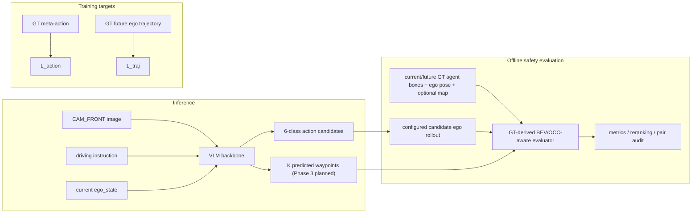

# 融合 BEV/OCC-aware 空间评估的 Safety-Aware VLA：分阶段项目计划

**项目定位：** Safety-Aware VLA for Autonomous Driving with BEV/OCC-aware Spatial Evaluation。项目从 single-camera、open-loop、6 类 meta-action VLA 起步；BEV/OCC-aware layer 是 GT-derived 的离线空间评估层，不是完整 occupancy prediction 网络，也不代表闭环控制或量产部署。

固定 action schema：

```text
keep
accelerate
decelerate
stop
left_lateral
right_lateral
```

## 1. 信息边界与总体数据流

### 1.1 Inference inputs

推理时模型只可使用：

- `CAM_FRONT` image；
- driving instruction；
- current `ego_state`，可包含当前速度、加速度、yaw rate。

推理时不得使用 future ego trajectory、GT meta-action、GT BEV/OCC raster、未来 GT agents 或 test labels。



`GT meta-action` 与 GT future trajectory 仅是训练 target；GT agents、ego pose 和 optional map 仅进入离线 evaluator。模型 backbone、action candidate generator 和推理输入之间不接收任何 future 或 GT safety 信息。

### 1.2 Sample-level reproducibility contract

每条样本或派生产物都必须可回溯：

```text
sample_token
scene_token
timestamp
cam_front_path
current_ego_state
future_ego_trajectory
nearby_agents
meta_action
label_rule_version
safety_rule_version
split
```

安全评估、rollout 或 preference 产物还必须记录 `raster_config_version`、坐标系/单位/transform 顺序、候选 action 或 trajectory、时间步、`motion_assumption`（如有）、分项 safety cost 与触发对象。不同版本不得静默混用。

## 2. 为什么保留 meta-action

meta-action 将连续 ego trajectory 转换成 VLA 可学习、人工可审核的动作语义，使首版先成为可控的 6 类分类任务；它支持 class distribution、confusion matrix、per-class F1 和 failure case analysis，也是 action reranker 与 chosen/rejected preference pairs 的固定比较单位。Phase 3 中它是 trajectory head 的辅助监督和一致性约束，不是先预测 action 再套固定轨迹模板；若跳过它直接回归 trajectory，会同时提高数据对齐、标签噪声、碰撞评测和调试风险。

## 3. BEV/OCC-aware temporal spatial evaluation

### 3.1 表征与信息来源

计划中的 evaluator 使用 ego-frame temporal occupancy：

```text
occupancy[T, C, H, W]
```

- `T`：离散时间步，与 candidate rollout 或 predicted trajectory 的 horizon 对齐；
- `C`：至少 vehicle 与 VRU 类别通道；可验证时再细分 pedestrian/cyclist，并可加入 drivable/non-drivable channel；
- `H, W`：配置化的 BEV 网格大小与分辨率。

当前 agent boxes 只能构造 current occupancy。future occupancy 优先由后续 nuScenes annotations 在对应未来时间步构造；若暂时只能使用 constant-velocity 或 static-agent fallback，必须在产物中记录 `motion_assumption`、参数和版本。static occupancy 只是评估近似，不能描述为真实 future occupancy prediction。

### 3.2 Candidate rollout 与 collision check

```text
meta-action
→ configured short-horizon ego rollout
→ temporal occupancy collision / near-miss evaluation
```

candidate rollout 只用于 offline 候选动作比较，不冒充真实车辆动力学、在线规划器或闭环控制。每个 rollout 必须记录 action 参数、时间步、source/target frame、轴方向、单位、horizon 与规则版本；collision/near-miss check 必须使用 candidate ego rollout 或模型 predicted trajectory，不能直接用 GT ego trajectory 代替候选行为。

### 3.3 能力边界

Phase 1 不训练 BEVFormer、OccNet、SurroundOcc 或完整 occupancy network。GT-derived evaluator 只负责 offline metrics、reranking、preference pair construction、failure analysis 和可视化；这使项目既保留 VLA 的输入/输出主线，也能以可验证的 occupancy-style 空间接口对齐 BEV/OCC 岗位关键词。

## 4. Phase -1：数据闭环与标签核验（当前）

| 项目 | 定义 |
|---|---|
| 输入 | nuScenes `sample_token`、`CAM_FRONT`、future ego trajectory、nearby 3D agents、人工审核记录 |
| 输出 | one-page visualization、版本化 meta-action、审核证据、待冻结 manifest 前置检查 |
| 核心脚本（已存在） | `data/inspect_nuscenes_sample.py`、`data/derive_meta_action.py`、`data/verify_labels.py`、`data/select_manual_review_samples.py` |
| 核心测试（已存在） | `tests/test_inspect_nuscenes_sample.py`、`tests/test_verify_labels.py`、`tests/test_meta_action.py`、`tests/test_phase_1_7_manual_audit.py` |

已确认事实：`CAM_FRONT`、future ego trajectory 与 nearby agents 已可读取并可视化；已派生 6 类 meta-action；108 个样本已人工审核，且 6 类 action 已有审核覆盖。VRU presence 是本阶段 gate 的必需覆盖维度，需与规则冻结一并核验。当前 `safety_rule_version=not_available`，因此本阶段不把 collision、near miss、safe/unsafe 或 `safety_score_reasonable` 作为审核完成条件。

**Gate：** 图像、future trajectory 与 nearby agents 对齐；6 类 meta-action、VRU presence 和 action boundary cases 已覆盖；`label_rule_version` 已修订并冻结；manifest audit 前置检查可核验。未通过前不进入 Phase 0，也不训练模型。

## 5. Phase 0：VLA-L0 meta-action baseline（planned）

| 项目 | 定义 |
|---|---|
| 输入 | Inference-time `CAM_FRONT`、instruction、可选 current/past ego state；冻结后的 scene-level split |
| 输出 | sample-level predictions、macro-F1、per-class F1、confusion matrix、class distribution、invalid output rate、failure cases |
| 核心脚本/测试 | planned：manifest audit、baseline runner、action parser、split-leakage test 与 baseline metric test |

严格顺序：冻结数据版本与 `label_rule_version` → scene-level train/val/test split → manifest audit（image / trajectory / agents / meta-action / review status）→ A majority → B current ego-state rule baseline → C image-only VLM → D image + current ego-state VLM → E LoRA/action adapter。

label derivation 可以使用 future ego trajectory；rule-based baseline 只能使用 inference-time current/past ego state，禁止读取 future ego trajectory、derived meta-action 或任何 test label。所有方案共享同一固定 test split 与 action vocabulary；few-shot examples 不得来自 test scene。Phase 0 不做 DPO，也不训练 trajectory head。

**Gate：** 五类对照可在同一协议下比较，并能从 sample-level 输出追溯。majority accuracy 高但 macro-F1 低时先诊断类别失衡；rule baseline 优于视觉模型时先评估视觉增益；LoRA 无提升时先复核数据和标签，不扩容训练。

## 6. Phase 1：BEV/OCC-aware spatial safety layer（planned）

| 项目 | 定义 |
|---|---|
| 输入 | current/future GT agent boxes、ego pose、optional map、candidate action rollout 或 predicted trajectory |
| 输出 | `occupancy[T,C,H,W]`、collision/near-miss、VRU risk、optional off-road risk、分项 safety cost、可视化 |
| 核心脚本/测试 | planned：BEV raster builder、temporal collision evaluator、rollout module；合成 collision/near-miss/VRU/off-road test |

**Gate：** evaluator 在确定性合成案例上可复现；真实样本的对象、时间步和坐标可回溯；future occupancy 的 annotation 或 fallback 假设完整记录；collision、near-miss、safe/unsafe 与 scorer reasonableness 的人工审核从本阶段开始。若 map 数据链路不可验证，off-road 项保持 optional。

## 7. Phase 2：offline reranker 与 preference learning（planned）

| 项目 | 定义 |
|---|---|
| 输入 | Phase 0 action candidates 与模型分数；Phase 1 的 BEV/OCC-aware safety cost |
| 输出 | 同一 candidate set 上的 rerank 前后指标、chosen/rejected pairs、pair audit |
| 核心脚本/测试 | planned：reranker、pair builder、candidate-set consistency test、pair audit test |

reranker 以 candidate rollout 的 temporal occupancy 评估比较候选；所有风险结果同时报告 action macro-F1、collision/near-miss、VRU violation、optional off-road、infeasibility、harsh action/jerk 和 `unnecessary_stop`。chosen 必须更安全且符合场景/轨迹约束，rejected 必须存在可解释风险；每个 pair 记录 margin、完整 cost、版本与审核状态。

DPO 为 conditional milestone：仅在数据版本冻结、baseline 可复现、evaluator 可解释、reranker 通过同一 candidate set 对照、pair audit 通过且停止条件明确后才评估；若 DPO 不优于 reranker，则保留 reranker，GRPO 与闭环 RL 不作预设承诺。

## 8. Phase 3：Waypoint-level / trajectory-level VLA（planned）

共享 VLM backbone 在相同 inference inputs 上同时输出 action head 与 K-waypoint trajectory head；action 是辅助监督与语义解释层，trajectory 才是更接近 planning 的输出。

默认训练目标为：

```text
L_total = L_action + lambda * L_traj + gamma * L_consistency
```

`L_consistency` 约束动作与轨迹语义，例如 `stop` 不应对应明显持续前进的 trajectory。Phase 1 的 safety scorer 默认只用于 offline metrics、reranking、pair construction 与 failure analysis；只有真实实现并验证 differentiable soft occupancy 或 distance-field surrogate 后，才可额外引入可反向传播的 `beta * L_safety`，并必须单独报告其实现、梯度路径和消融。

| 项目 | 定义 |
|---|---|
| 输入 | 与 Phase 0 相同的 inference-time image / instruction / current ego state |
| target | GT meta-action、GT future ego trajectory |
| 输出 | 6 类 action、K predicted waypoints、trajectory metrics 与 consistency analysis |
| 核心脚本/测试 | planned：shared-head model、trajectory metric evaluator、action-trajectory consistency test |

**Gate：** waypoint target、坐标变换、horizon、轨迹 metrics、collision evaluation 与对照实验均真实实现并验证后，才能报告 trajectory-level 结果。

## 9. Phase 4：optional enhancements

multi-camera、map/lane topology/route command、temporal context、以及预训练 BEVFormer/OccNet/SurroundOcc 的受控复现实验均为 optional/stretch，不阻塞前述 MVP gate，也不得写作已完成能力。

## 10. 实验表模板

### Data statistics

| Split | Samples | Six-action distribution | VRU presence | Boundary cases | Rule version |
|---|---:|---|---:|---:|---|
| Train / Val / Test | — | — | — | — | — |

### Action baseline

| Method | Inputs | Macro-F1 | Per-class F1 | Invalid output | Notes |
|---|---|---:|---|---:|---|
| Majority / ego-state rule / image-only VLM / image+ego VLM / LoRA | — | — | — | — | — |

### Safety / reranker

| Method | Candidate set | Collision | VRU | Off-road | Unnecessary stop | Macro-F1 |
|---|---|---:|---:|---:|---:|---:|
| Base / reranked / DPO conditional | — | — | — | — | — | — |

### Trajectory metrics

| Method | ADE/FDE or configured metric | Collision / near-miss | Consistency | Notes |
|---|---:|---:|---:|---|
| Trajectory head (planned) | — | — | — | — |

### Failure cases

| Error type | Representative `sample_token` | Root cause | Evidence / limitation |
|---|---|---|---|
| label / action / safety / trajectory | — | — | — |

## 11. 风险、Demo 与简历边界

| 风险 | 验证与处置 |
|---|---|
| future/GT leakage | 固定 inference contract；对 baseline 输入做字段审计 |
| future occupancy 不可得 | 优先 annotations；fallback 记录 `motion_assumption`，不冒充预测 |
| safety 偏向 `stop` | reranker 同时报 `unnecessary_stop` 与 macro-F1 |
| 单帧 lateral 不足 | 保留单帧基线；Phase 4 再做时序/地图对照 |

最小 demo（Phase 1 后）展示 `CAM_FRONT`、inference inputs、GT action/trajectory（明确为 target）、候选 action rollout、temporal occupancy、碰撞触发对象、rerank 前后行为与版本信息；不得把 GT target 显示为模型推理输入。

简历中当前只能写已完成的 `CAM_FRONT` / future ego trajectory / nearby agents 对齐、meta-action derivation、108 样本人工审核及已存在脚本和测试。BEV/OCC-aware evaluator、reranker、DPO、trajectory head 与 occupancy prediction 必须标为 planned，直至有对应代码、配置和可核查结果。

## 12. 当前下一步

当前仍在 Phase -1：根据已审核的边界案例修订并冻结 `label_rule_version`，完成 manifest audit 前置检查，再决定是否打开 Phase 0 gate。本计划修订不授权训练、DPO、完整 occupancy network 或 trajectory-level 模型实施。
