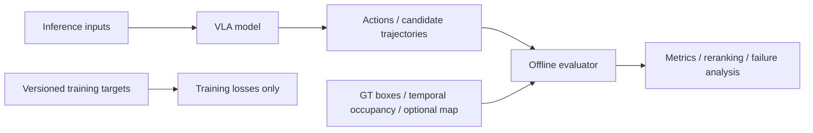
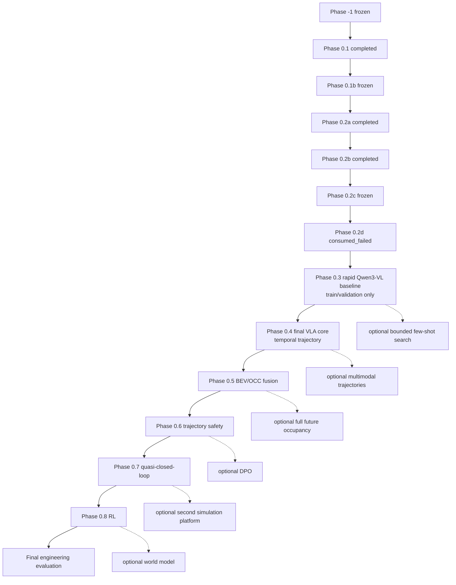

# Safety-Aware VLA for Autonomous Driving：完整项目执行计划

## 0. 文档说明与维护规则

### 0.1 文档职责

本文是项目阶段规格、依赖关系、信息合同与执行 Gate 的唯一主来源。其他长期文档各自只承担一种职责：

- `docs/progress.md`：记录已经确认的实际状态、指标、artifact 与 open questions；
- `AGENTS.md`：记录 agent 和开发者不得违反的仓库规则；
- `README.md`：负责外部项目介绍、能力边界和复现入口；
- `project_mvp_plan.md`：定义项目要做什么、按什么顺序做、满足什么条件才能继续。

实际进度变化时，先用真实执行证据更新 `docs/progress.md`，再同步本文的阶段状态。禁止在多个文件中维护互相冲突的阶段事实；若出现冲突，已核验的实际状态以 `docs/progress.md` 为准，阶段目标、Gate 和依赖以本文为准。

### 0.2 维护规则

- 只有代码、配置、测试、真实数据 smoke test、人工审核和持久化 artifact 共同支持的能力，才可标为 `completed` 或 `frozen`。
- 论文结果、模型官方能力和外部 benchmark 不得写成本项目结果。
- 尚未实现或未核验的入口、指标、资源开销和能力必须标为 `planned`、`conditional`、`stretch` 或“待验证”。
- 阶段状态、contract、rule 或 evaluation protocol 变化时，必须记录版本与 provenance；不得覆盖 frozen artifact。
- Phase 0.3 及后续阶段必须按第 5.2 节统一模板补全；尚未在本文展开的阶段只保留骨架，不得用概述冒充可执行规格。

## 1. 项目使命、最终目标与非目标

### 1.1 项目使命

本项目研究 **Safety-Aware VLA for Autonomous Driving with BEV/OCC-aware Spatial Evaluation**：从可审计的 coarse meta-action MVP 出发，逐步建立能够利用时序多相机视觉、ego state、map/route 与几何表示，生成多模态未来轨迹并接受安全评估的自动驾驶 VLA。

### 1.2 Phase 0：coarse meta-action MVP

Phase 0 验证以下最小证据链：

```text
数据和标签是否可信
→ 视觉模型能否预测 coarse action
→ 安全 scorer 能否评价候选行为
→ reranker / preference learning 是否提供增益
```

固定六类 coarse action 为：

```text
keep
accelerate
decelerate
stop
left_lateral
right_lateral
```

六类动作是 **coarse behavior representation**，不是最终动作空间。`left_lateral` / `right_lateral` 只表示稳定的左右横向运动，不能直接解释为 turn、lane change 或其原因。coarse action 在长期系统中继续作为辅助监督、可解释输出、baseline 与 action-trajectory 一致性检查接口，不通过不断增加互斥类别来承担完整规划任务。

### 1.3 核心实施原则：面向最终系统，而不是制作多个临时产品

从 Phase 0.3 开始，所有阶段都服务于同一个最终 VLA：

```text
historical camera images
+ current/past ego state
+ optional multi-camera calibration
        ↓
VLM semantic branch
+ BEV/OCC geometry branch
        ↓
temporal semantic-geometric fusion
        ↓
coarse action auxiliary head
+ continuous future waypoint head
        ↓
geometric / occupancy safety scorer
        ↓
trajectory selection
        ↓
quasi-closed-loop environment
        ↓
reinforcement fine-tuning
```

后续不是先完成一个纯分类产品，再推倒重做一个轨迹产品，随后再重做一个 BEV 产品。Coarse action、continuous trajectory、BEV/OCC、safety scorer 和 reinforcement learning 是同一架构的不同模块：Phase 0.3 验证 VLM 接入，Phase 0.4 建立最终核心模型骨架，Phase 0.5—0.8 在该骨架上依次增加空间建模、安全约束、准闭环评测和 reinforcement fine-tuning。

阶段划分只用于控制调试范围、建立最少必要 baseline、完成模块级消融并确认每个模块是否有效。已完成模块应通过稳定接口继续复用，不做无必要的推倒重写；每个阶段必须交付可复用的数据、feature、model、evaluator 或 environment contract，而不是只交付一次性实验数字。全过程继续遵守 inference/GT information boundary、坐标与时间合同、scene-level split 和 train/validation/test 防泄漏规则。

### 1.4 最终 VLA 主路线

核心路线统一为：

```text
Phase 0.3  Qwen3-VL data interface and rapid visual baseline
→ Phase 0.4 temporal vision + ego state + continuous trajectory VLA core
→ Phase 0.5 BEV/OCC-aware semantic-geometric fusion
→ Phase 0.6 trajectory safety scorer and safety-aware selection
→ Phase 0.7 quasi-closed-loop evaluation and controller/interface
→ Phase 0.8 reinforcement fine-tuning
→ Final robustness, latency, fallback, Demo and reproducibility evidence
```

Phase 0.3 是快速 baseline，不是长期主线终点；Phase 0.4 开始直接建设后续模块共用的最终模型。Phase 0.5—0.8 都扩展 Phase 0.4 的 shared driving representation 和 trajectory interface。RL 是核心阶段；world model 仍是 optional。完整 fine-grained maneuver taxonomy、多候选轨迹、大规模 preference/DPO、完整 future occupancy prediction 和双仿真平台均不阻塞主线。

### 1.5 非目标

本项目的基础完成条件不包括：

- 量产级、实车或 real-time 部署；
- world model、复杂 DPO 或完整 fine-grained maneuver taxonomy；
- 同时完成 NAVSIM 与 Bench2Drive 两个平台；
- 完整 occupancy prediction 系统；
- 仅依靠更多 `stop` 预测获得表面上的安全指标改善；
- 将 oracle GT scorer 冒充在线 camera-only safety capability；
- 在没有 map、lane topology、route 或必要时序信息时，把 coarse lateral 标签解释为 turn 或 lane change。

## 2. MVP 和完整项目的成功定义

### 2.1 Coarse-action MVP success

Coarse-action MVP 必须同时满足：

- 数据、标签、split、预测和评测结果具备 sample-level provenance；
- train、validation、test 按 scene-level split，且经过无泄漏验证；
- Majority、ego-motion、VLM、LoRA/action adapter 与 reranker 使用统一 action schema、parser 和 evaluation protocol；
- 每种方法保存可回溯的 sample-level predictions，并报告 macro-F1、per-class F1、confusion matrix、class distribution、invalid output rate 与 parsing success rate；
- safety 改善不能仅来自 `stop` 增加，必须联合报告风险、`unnecessary_stop` 与 action quality；
- 最终结论基于新的 untouched evaluation protocol。Phase 0.2d 已消费的原 project test 不再具备这一资格。

### 2.2 Trajectory VLA success

Trajectory VLA 必须同时满足：

- 模型真实输出带坐标、时间、horizon 与 valid mask 合同的 future waypoints；
- 在同一协议下超过 constant-velocity 与 ego-history baselines；
- coarse action 与 predicted trajectory 的语义一致性可度量；
- safety reranking 在规划性能与风险之间取得可验证改进，并报告失败案例与 trade-off。

多候选轨迹若被启用，还必须验证有效 diversity；它不是第一版 trajectory VLA 的核心完成条件。

### 2.3 Full project success

完整项目的核心完成要求包括：

- 时序视觉和 current/past ego state 输入；
- VLM semantic representation；
- continuous future waypoint prediction；
- BEV/OCC-aware geometry representation；
- semantic-geometric feature fusion；
- trajectory safety scoring；
- quasi-closed-loop planning evaluation；
- reinforcement fine-tuning；
- robustness、latency 与 fallback evidence；
- 完整 Demo、可复现配置，以及每项能力可定位的代码、artifact 和指标证据。

完整 fine-grained maneuver taxonomy、多候选轨迹生成、大规模 preference/DPO、完整 future occupancy prediction、Bench2Drive 与 NAVSIM 双平台和 world model 均为 optional；实车部署不在本项目范围。RL 不属于 optional；它必须在 quasi-closed-loop reward 与保护边界建立后作为 Phase 0.8 完成并报告。

## 3. 推理输入、训练 target 和 offline evaluator 的信息边界

### 3.1 Model inference inputs

经对应阶段 contract 批准后，模型推理输入可以包括：

```text
current / historical camera images
current / past ego state
driving instruction
route command
map / lane topology
predicted BEV / occupancy
```

具体传感器、历史长度、缺帧策略和坐标约定由阶段 contract 冻结。尚未进入对应阶段的输入不得提前接入并冒充当前能力。

### 3.2 Training targets

训练路径可使用与任务对应的监督 target：

```text
coarse meta-action
fine-grained actions
future ego trajectory
future waypoints
GT occupancy
consistency targets
```

Training target 必须与 inference input 分离；target 的存在不代表推理时可访问同源 GT 信息。

### 3.3 Offline evaluator inputs

Offline evaluator 可按阶段 contract 使用：

```text
GT current/future agent boxes
GT-derived temporal occupancy
ego pose
optional map
candidate action rollout
predicted candidate trajectories
```

这些输入只用于 oracle offline scoring、failure analysis、reranking 或 evaluator validation。在线能力必须另以 predicted geometry 与真实 inference path 验证。

### 3.4 永久禁止的信息泄漏

- future ego trajectory 不得进入模型推理；
- GT meta-action 不得进入模型推理；
- GT boxes、future agents 或 GT occupancy 不得进入模型 test-time inference；
- test labels 不得用于 prompt、threshold、candidate、model、architecture 或 checkpoint 选择；
- 不得以 GT ego trajectory 替代模型 candidate trajectory 进行 collision check；
- 不得将 oracle GT scorer 的结果表述为在线 camera-only safety capability。



## 4. 数据、坐标、时间、版本和 artifact 总合同

### 4.1 长期基础字段

Manifest family 的长期基础合同为：

```text
sample_token
scene_token
timestamp
sensor_paths
current_ego_pose
current_ego_motion
coordinate_metadata
history_valid_mask
future_ego_trajectory
future_waypoints
trajectory_valid_mask
nearby_agents
map_route_metadata
split
official_split
manifest_schema_version
```

字段按阶段逐步启用：当前已实现的 `cam_front_path` 是 single-camera `sensor_paths` 的现行字段；`history_valid_mask`、`future_waypoints`、`trajectory_valid_mask` 和 `map_route_metadata` 尚未全部进入当前 frozen schema，必须在使用它们的阶段提升 schema version 后加入。不得把长期合同字段误写为当前已完成能力。

### 4.2 版本化 targets 与实验字段

```text
meta_action
label_rule_version
fine_action_rule_version
safety_rule_version
raster_config_version
prompt_version
parser_version
model_revision
checkpoint_sha256
split_mapping_sha256
evaluation_protocol_version
```

基础字段与派生 target 必须分离。Schema 变化必须提升 `manifest_schema_version`；rule 变化必须提升对应 rule version 并重新生成受影响 target；coarse 与 fine labels、不同版本 labels 均不得静默混用。

### 4.3 坐标与时间合同

- 坐标数据必须记录 source frame、target frame、轴方向、单位和 transform 顺序；
- 时间数据必须记录 timestamp 单位、timestamp source、采样间隔、history/future horizon、tolerance 与缺帧策略；
- 当前 `current_ego_pose` / `current_ego_motion` 的 timestamp source 固定为 `CAM_FRONT_sample_data`；motion 只由 current/past pose 推导；
- future trajectory、waypoints、agents 与 occupancy 必须显式对齐离散时间步，不能只凭数组下标假设同步。

### 4.4 Split、provenance 与存储规则

- train、validation、test 必须按 scene-level split，禁止相邻帧跨 split；
- 数据、模型、配置、代码版本和结果必须具备 provenance 与必要 SHA-256；
- frozen artifact 不得覆盖、就地改写或以改名方式复用；
- 原始数据、派生数据、checkpoint、正式输出、日志和缓存不进入 Git；
- Git 只保存代码、配置模板、schema、允许公开的小型测试 fixture、测试和文档；
- 不可逆 evaluation 的 durable claim、访问状态、输出持久化状态与 rerun policy 必须单独记录。

## 5. 全局状态定义与统一执行规范

### 5.1 全局状态定义

| 状态 | 定义 |
|---|---|
| `completed` | 阶段目标和 Gate 已由可复现证据满足，但其输出仍可能在后续阶段被版本化扩展。 |
| `frozen` | 阶段已完成，关键 contract、rule、split 或 artifact 被锁定；后续不得静默修改。 |
| `active` | 当前正在执行，尚未满足全部 Gate。 |
| `blocked` | 前置条件或外部依赖未满足，当前不得继续。 |
| `planned` | 已进入路线图，但尚未开始实现或验收。 |
| `conditional` | 只有前序实验满足指定增益或质量 Gate 时才执行。 |
| `stretch` | 可选研究扩展，不阻塞核心项目完成。 |
| `retired` | 协议或方案已停止使用；保留历史证据，但不得作为当前有效方案。 |
| `consumed_failed` | 不可逆正式评估已访问 sealed evaluation data，但因执行或 artifact 持久化失败而没有形成可发布结果；该 evaluation source 仍视为已消费，永久不得重跑。 |

状态只描述证据与 Gate，不描述主观完成度。`completed` 不等于 `frozen`，`consumed_failed` 也绝不等于“未执行”。

### 5.2 Phase 0.3 及后续阶段统一模板

后续每个阶段必须严格包含：

```text
阶段状态
阶段目的
为什么需要
前置条件
本阶段不解决什么

输入
允许使用的数据
禁止使用的数据
字段和 artifact contract

详细执行步骤
涉及代码与配置
生成的本地 artifact
版本和 provenance

单元测试
contract / regression tests
真实数据 smoke test
人工审核

实验矩阵
评测指标
通过 Gate
失败分支
停止条件
不可逆操作与保护措施
进入下一阶段的条件

阶段学习目标
可形成的代码、图表、Demo 和简历证据
```

测试数量不能替代真实 producer artifact → consumer intake 的 shape 核验。不可逆操作前必须完成不访问 sealed data 的 full shadow execution，并验证 adapter、输出持久化与 rerun guard。

## 6. 完整项目阶段总览和依赖关系

### 6.1 阶段状态总表

| 阶段 | 目标 | 状态 | 主要输出 |
|---|---|---|---|
| Phase -1 | 数据闭环与 coarse label freeze | `frozen` | 数据对齐、标签、108-sample 人工审核、freeze gate |
| Phase 0.1 | manifest、split、metrics、Majority | `completed` | audited seed subset 与统一评测协议 |
| Phase 0.1b | trainval scale-up | `frozen` | 正式 manifest v1 与 scene mapping |
| Phase 0.2a | past-only ego-motion audit | `completed` | inference input audit |
| Phase 0.2b | rule candidate search | `completed` | validation candidate selection |
| Phase 0.2c | failure analysis 与 rule freeze | `frozen` | `phase0.2-ego-motion-rule-v0.1` |
| Phase 0.2d | sealed one-shot evaluation | `consumed_failed` | 无正式 test metrics；原 test 永久消费 |
| Phase 0.3 | Qwen3-VL 数据接口与快速视觉 baseline | `planned` | 可复用 VLM 接入层与视觉 baseline |
| Phase 0.4 | 时序视觉 + ego state + continuous trajectory | `planned` | 最终 VLA 核心模型骨架 |
| Phase 0.5 | BEV/OCC-aware semantic-geometric fusion | `planned` | 空间表示与融合接口 |
| Phase 0.6 | trajectory safety scorer 与 safety-aware selection | `planned` | 显式安全评价与轨迹选择 |
| Phase 0.7 | quasi-closed-loop evaluation 与 controller/interface | `planned` | 累计规划表现与环境接口证据 |
| Phase 0.8 | reinforcement fine-tuning | `planned` | 基于准闭环 reward 的最终策略优化 |
| Final | robustness、latency、fallback、Demo 与复现 | `planned` | 完整工程与展示证据闭环 |

### 6.2 依赖关系与 Gate



Phase 0.3 的 baseline 结果无论强弱都必须诚实保留，但不把 prompt engineering 变成长期主线。Phase 0.4 建立唯一的最终 VLA core；Phase 0.5—0.8 必须复用其 feature 与 trajectory contract。Optional 分支只能旁路增加研究证据，不能阻塞主线；其中 DPO 不得替代 Phase 0.8 RL，world model 也不属于核心完成条件。

## 7. Phase -1：数据闭环与 coarse label freeze 简要回顾

**状态：`frozen`。** Phase -1 建立并核验了：

```text
sample_token → CAM_FRONT
sample_token → future ego trajectory
sample_token → nearby 3D agents
→ one-page visualization
→ meta-action derivation
→ 108-sample manual audit
→ label regression freeze
→ real-data freeze gate
```

取得的核心结果是图像、3 秒 future trajectory 与 nearby agents 可在 sample level 对齐和可视化；六类 coarse meta-action 已派生，108 个样本覆盖六类 action 并完成人工审核，alignment 为 108/108；label regression 与 real-data freeze gate 均为 108/108。

本阶段冻结了六类 action schema、`label_rule_version=phase-1.6-meta-action-v0.2`、基于 `CAM_FRONT_sample_data` 的时间源、ego-frame 坐标约定和 audit provenance。`safety_rule_version=not_available` 是历史事实；Phase -1 没有完成 safety scorer，也没有训练模型。

## 8. Phase 0.1 / 0.1b 简要回顾

### 8.1 Phase 0.1：audited seed-subset 与统一评测协议

**状态：`completed`。** Phase 0.1 将 frozen labels 转为 `phase0_audited_seed_subset_v1`，建立固定 seed 的 scene-level split、统一六类 action schema、完整 manifest validator、Majority Baseline 与 unified metrics。协议要求 sample-level predictions、macro-F1、per-class F1、confusion matrix、class distribution 和 invalid prediction 可追溯，并验证 scene split 无泄漏。

### 8.2 Phase 0.1b：正式 trainval manifest v1

**状态：`frozen`。** Phase 0.1b 已从 mini smoke 数据扩展到完整 nuScenes trainval，冻结：

- `manifest_schema_version=phase0_trainval_dataset_manifest_v1`；
- `horizon_sec=3.0`、`sample_interval_sec=0.5`、`time_tolerance_sec=0.075`；
- `label_rule_version=phase-1.6-meta-action-v0.2`；
- `split_strategy_version=official_train_scene_label_stratified_v1`、`split_seed=20260710`；
- official train 的 700 scenes 按 scene-level stratified split 为 project train/validation `560/140`；official validation 的 150 scenes 固定为当时的 project test；
- 扫描 34,149 samples，纳入 21,646 条：train 14,253、validation 3,594、test 3,799；排除 12,503 条；
- 正式 manifest、mapping sidecar、内部 mapping 与 scene histogram 均有固定 SHA-256 和 provenance，且不得覆盖。

完整 validator、rare-class constraints、排除原因诊断及 train/validation 视觉审核已通过。Mini 此后只用于 smoke test、快速回归和小规模调试，不用于正式 LoRA/action adapter/DPO 结论。这里的原 project test 后来在 Phase 0.2d 被永久消费，不能继续作为 untouched evaluation source。

## 9. Phase 0.2a—0.2d 简要回顾

### 9.1 Phase 0.2a：current/past-only ego-motion audit

**状态：`completed`。** 输入合同只包含 speed、longitudinal acceleration、yaw rate、availability 与对应 past interval；禁止 future trajectory、derived meta-action 或 test labels 作为 baseline 输入。Train/validation/test 的 `full/partial/unavailable` 分别为 `13476/392/385`、`3401/99/94`、`3594/106/99`。该审计未使用 test label 做统计或调参。

### 9.2 Phase 0.2b：deterministic rule candidate search

**状态：`completed`。** 固定 625-candidate grid 只在 validation 上选择 deterministic rule candidate。入选阈值为：

```text
stop speed              = 0.2 m/s
lateral yaw rate        = 0.05 rad/s
accelerate acceleration = 0.5 m/s²
decelerate acceleration = 0.3 m/s²
```

Validation macro-F1 / accuracy 为 `0.615681 / 0.623817`；同协议 Majority Baseline 为 `0.087186 / 0.354201`。这些是参与 candidate selection 的 validation 结果，不是无偏 test 结果。

### 9.3 Phase 0.2c：failure analysis 与 rule freeze

**状态：`frozen`。** `phase0.2-ego-motion-rule-v0.1` 冻结为 `candidate-0293`，validation predictions 复现为 `3594/3594`。主要错误为 `keep → decelerate`（260）和 `decelerate → keep`（181）。Candidate、thresholds、rule version 与 failure analysis 已冻结；不得利用后续 evaluation 反馈修改这一版本。

### 9.4 Phase 0.2d：sealed one-shot evaluation

**状态：`consumed_failed`。** Sealed one-shot formal execution 已且仅已调用一次。Durable execution claim 写入后，执行访问了 test label/motion；随后在正式 test result 持久化前，于 `build_formal_outputs → build_validation_to_test_comparison` 失败。

失败原因是跨模块 artifact schema mismatch：正式 `validation_metrics.json` 使用嵌套 `metrics` 和顶层 `predicted_class_distribution`，consumer 当时却期望顶层扁平 metrics 和 `prediction_class_distribution`。执行 exit code 为 `1`，没有生成可发布的正式 test outputs 或正式 test metrics；rule 与 thresholds 也未按 test 信息修改。

不可逆边界如下：

- execution claim 状态为 `consumed_failed`，`rerun_permitted=false`；
- 原 project test 已永久消费，禁止重跑、恢复、重算、重新切分、改名复用或以任何方式重新取得结果；
- 该 split 不得再用于 prompt、threshold、candidate、model、architecture 或 checkpoint 选择；
- 后续 validation artifact adapter 和 producer-shape regression 已修复，但只适用于未来协议，不授权重跑本次 test；
- Phase 0.3 及后续阶段只能使用 train/validation 开发与模型选择；
- 最终无偏评价必须使用新的 external held-out dataset，或新的、从未访问过的 evaluation protocol。

因此 Phase 0.2d 不能写成 test completed，也不能报告任何正式 test performance。

## 10. 面向最终 VLA 的执行阶段

### 10.1 Phase 0.3：Qwen3-VL 数据接口与快速视觉 baseline

> Phase 0.3 不是最终模型，也不是长时间 prompt engineering 阶段。它只负责验证 Qwen3-VL 能否正确读取项目数据、输出统一 action schema，并为 Phase 0.4 trajectory VLA 提供可复用的视觉语言模型接入层。

#### 10.1.1 阶段状态、目的与边界

- **阶段状态：** `planned`。
- **阶段目的：** 打通 frozen manifest → image/text processor → Qwen3-VL → strict action parser → sample-level prediction 的完整链路。
- **为什么需要：** 在引入时序和 trajectory head 前，先隔离数据加载、模型依赖、prompt serialization、generation 和输出解析问题，避免把接入错误误判为规划模型错误。
- **前置条件：** Phase 0.1b trainval manifest 与六类 schema 已冻结；Phase 0.2d 的 consumed-test 边界保持不变；开发只允许 train/validation。

本阶段验证：

- frozen manifest 中的 `CAM_FRONT` 图像能否正确加载；
- Qwen3-VL processor、tokenizer 与 model 能否在项目环境稳定运行；
- driving instruction 与 current/past ego-motion summary 如何确定性序列化；
- 生成结果能否被统一 action parser 严格解析；
- zero-shot 与轻量 LoRA 是否能形成可复现的快速视觉 baseline；
- VLM hidden states / visual tokens 是否能通过稳定 feature interface 供 Phase 0.4 复用。

本阶段不解决：

```text
continuous trajectory prediction
temporal multi-frame fusion
BEV/OCC
safety scorer
closed-loop evaluation
reinforcement learning
unbounded prompt search
large-scale DPO
```

#### 10.1.2 输入、允许数据与禁止数据

模型输入限定为：

```text
CAM_FRONT image
current/past ego-motion summary
fixed driving instruction template
```

`coarse meta-action target` 只用于 supervised LoRA target 或离线评测；train/validation split 用于训练、模型选择和报告。必须分别运行 `image-only` 与 `image + ego state` 两组独立实验，以判断 ego state 的增益。

禁止：

- future ego trajectory 作为模型输入或 prompt 内容；
- GT nearby agents、GT boxes 或 GT occupancy 作为模型输入；
- 已消费 test 的图像、motion、label 或派生统计；
- validation label 进入 prompt；
- 任何 future-derived 数值通过 ego-state serialization 间接泄漏。

#### 10.1.3 数据样本与 artifact contract

概念样本合同如下：

```json
{
  "sample_token": "...",
  "image_path": "...",
  "instruction": "根据前视图像和当前车辆状态判断驾驶行为。",
  "ego_state": {
    "speed_mps": 0.0,
    "longitudinal_acceleration_mps2": 0.0,
    "yaw_rate_radps": 0.0,
    "availability": "full"
  },
  "target_action": "keep"
}
```

该 JSON 只是计划中的字段合同示例，不代表仓库当前已有对应训练文件。`image_path` 必须由 manifest 相对路径和受控 data root 解析；`target_action` 永远不进入 inference prompt。Instruction template、ego-state serialization 与 sample adapter schema 必须分别版本化。

Model-ready record 和 sample-level prediction 至少保留：

```text
sample_token
split
source_manifest_schema_version
source_manifest_sha256
label_rule_version
input_variant
prompt_version
parser_version
model_revision
processor_revision
generation_config_sha256
target_action
raw_output
parsed_action
is_valid_output
```

VLM feature interface 必须记录 feature source、tensor shape、dtype、attention/valid mask、model/processor revision 与 extraction policy；不得假设未核验的 token 数或 hidden dimension。

#### 10.1.4 Prompt、generation 与输出合同

Prompt 只使用少量预定义模板，不进行无边界搜索。正式实验必须选择并冻结一种 canonical 输出格式，例如：

```text
ACTION: keep
```

或：

```json
{"action": "keep"}
```

合同要求：

- 输出 action 只能是 `keep / accelerate / decelerate / stop / left_lateral / right_lateral`；
- parser 只接受当前 `parser_version` 声明的严格格式，不通过模糊匹配猜测非法输出；
- invalid output 单独计数，并保留原始输出；
- prompt、parser 和 generation config 均版本化；
- temperature、top-p、max new tokens、sampling 开关和 stop conditions 必须进入配置；
- validation 可用于从预先声明的有限模板中选择一次正式方案，但不得以反复试探形成无边界 prompt search。

#### 10.1.5 详细执行步骤

##### Phase 0.3a：环境与模型预检

1. 在 `codex4vla_env` 检查 PyTorch、Transformers、图像 processor 与目标模型依赖。
2. 确认 model/processor revision、下载来源和许可证信息。
3. 根据真实硬件执行显存、内存、dtype 与 batch-size 预检，不提前承诺资源数字。
4. 只加载少量 train/validation 样本，不扫描或访问 test。
5. 验证单图输入与 instruction 文本输入。
6. 验证 raw generation、strict parsing 与 invalid-output 路径。
7. 保存 smoke-run metadata、依赖版本、硬件摘要与失败原因。

##### Phase 0.3b：dataset adapter

1. 从 frozen trainval manifest streaming 读取 train/validation sample。
2. 解析并校验相对 `CAM_FRONT` 路径。
3. 构造 image-only prompt。
4. 构造 image + ego-state prompt。
5. 为 `full / partial / unavailable` ego state 定义显式、确定性的文本格式。
6. 输出 model-ready records，不在 adapter 中执行模型推理。
7. 保留 `sample_token`、split、target、manifest 和 rule provenance。
8. 在读取入口设置 test split guard，并证明 adapter 不访问 test。

##### Phase 0.3c：zero-shot baseline

只运行有限、预定义的 prompt templates，至少比较：

```text
image-only
image + ego state
```

两组实验使用同一 model revision、generation config、parser 和 validation protocol，输出 sample-level predictions 与完整 action metrics。Zero-shot 较弱不触发无限 prompt 调参。

##### Phase 0.3d：轻量 LoRA smoke baseline

该子阶段不是最终模型训练，只验证：

- supervised conversation format 与 action target placement；
- label masking 只对 assistant target 计算监督；
- collator 和 processor 输出可组成 batch；
- LoRA injection points 与 trainable parameter report 可核验；
- loss 在小样本上下降，且少量样本可以 overfit；
- checkpoint 可以保存、加载并走通相同 parser 推理。

只使用小规模 train subset 和 validation smoke，不进行大规模超参数搜索，也不以它替代 Phase 0.4 trajectory model。

##### Phase 0.3e：failure analysis 与接口冻结

至少分析：

```text
visual ambiguity
class imbalance
output-format errors
model ignores ego state
keep / decelerate confusion
left / right lateral confusion
insufficient image evidence
```

最终冻结：

```text
model revision
processor revision
prompt schema and version
ego-state serialization
action output schema
parser version
dataset adapter interface
VLM feature interface
```

这些是 Phase 0.4 复用的 producer contracts。冻结前必须以真实 adapter record 和真实 processor output 核验 shape，不能手写猜测 consumer schema。

#### 10.1.6 涉及实现、配置、artifact 与 provenance

本阶段计划新增 dataset adapter、prompt/output contract、strict parser、Qwen inference/LoRA smoke entrypoint 及对应测试；具体文件名在实施子任务中确定，本文不把 planned 文件写成已存在入口。参数必须进入版本化配置，不散落在代码中。

本地 artifact 至少包括：environment preflight、model/processor metadata、adapter summary、prompt/parser/generation config、zero-shot predictions/metrics、LoRA smoke metadata/checkpoint provenance、failure cases 和 frozen interface receipt。模型权重、checkpoint、派生 records 和正式输出不进入 Git。

每个 artifact 至少记录 Git commit、manifest/schema/rule version、split mapping SHA-256、model/processor revision、prompt/parser version、config SHA-256、sample count、input variant 与生成时间。

#### 10.1.7 测试、真实数据 smoke test 与人工审核

自动测试至少覆盖：

- 相对图像路径解析和绝对路径泄漏拒绝；
- 六类合法 action 的 parser；
- 非法、额外文本和缺字段输出显式失败；
- test split guard；
- `partial / unavailable` ego-state serialization；
- sample-level prediction 字段完整性；
- processor input keys 与 tensor shape；
- deterministic generation config serialization；
- assistant target label masking；
- VLM feature interface contract。

真实数据 smoke test 只从 train/validation 各取少量样本，验证图像可读、prompt 可见、processor/model 可运行、输出可解析、结果可落盘和 rerun provenance 稳定。人工审核随机查看 image、prompt、GT action 与 prediction，确认 prompt 无 future 泄漏、ego state 单位正确、左右方向未在文本中写反。

#### 10.1.8 实验矩阵与指标

| 实验 | 输入 | 训练 | 作用 |
|---|---|---|---|
| Zero-shot A | image-only | 无 | 纯视觉快速参考 |
| Zero-shot B | image + ego state | 无 | 检查 ego state 增益 |
| LoRA smoke | image + ego state | 小规模 train subset | 验证 supervised 接口，不作最终性能结论 |

Zero-shot 正式 baseline 至少报告：

```text
macro-F1
per-class F1
accuracy
confusion matrix
invalid-output rate
action parsing success rate
target and predicted class distribution
sample-level predictions
```

LoRA smoke 额外报告训练/验证 sample count、loss 曲线、trainable parameter summary、overfit 结果和 checkpoint save/load 结果，但不得用 smoke 指标冒充正式训练结论。

#### 10.1.9 Gate、失败分支与停止条件

Phase 0.3 通过条件：

- Qwen 数据与模型链路可复现；
- strict action parser 稳定，invalid output 可审计；
- image-only 和 image + ego-state zero-shot baseline 完成；
- 轻量 LoRA smoke run 完成；
- dataset adapter 与 VLM feature interface 可供 Phase 0.4 使用；
- 所有 artifact 具有版本与 provenance；
- 没有访问已消费 test。

Zero-shot 不要求超过 frozen ego-motion rule；较弱结果不阻塞 Phase 0.4，但必须保留并分析。若 processor shape、图像路径、parser 或 label masking 未通过，停止模型扩展并先修复相应 contract。若硬件不支持目标配置，先缩小 batch、分辨率或可训练范围并重新做 resource preflight，不静默改用未经记录的模型。

本阶段没有不可逆 test 操作。任何脚本都必须默认拒绝原 project test；Phase 0.2d 的 claim、preflight 和 consumed artifact 不得读取、恢复或修改。

#### 10.1.10 阶段学习目标与证据

本阶段可展示：多模态数据适配、prompt/output protocol、VLM inference、LoRA 基础训练、invalid output handling、传统 rule 与 VLM 对照，以及 sample-level failure analysis。可交付的 Demo 是 `CAM_FRONT + optional ego-state text → raw output → strict parsed coarse action`，并展示输入边界、版本和代表性失败案例。

### 10.2 Phase 0.4：最终 VLA 核心——时序视觉、ego state 与连续轨迹预测

> Phase 0.4 不是新的临时版本，而是后续 BEV/OCC、安全 scorer、准闭环环境和 RL 共用的最终核心模型骨架。

#### 10.2.1 阶段状态、目的与边界

- **阶段状态：** `planned`。
- **阶段目的：** 从静态六分类升级为以 continuous future waypoints 为主要输出的 planning model，同时保留 coarse action auxiliary head。
- **为什么需要：** 单帧 coarse action 不能表达未来路径和累计规划误差；时序图像与 ego motion 是动态理解和轨迹预测的最小核心输入。
- **前置条件：** Phase 0.3 的 dataset adapter、model/processor revision、VLM feature interface、ego-state serialization 与 action parser 已冻结。

本阶段解决：

- 使用历史图像理解动态变化；
- 使用 current/past ego motion 提供运动状态；
- 输出固定 horizon 的 continuous future waypoints；
- 将 coarse action 保留为辅助监督与可解释输出；
- 建立 Phase 0.5 BEV tokens、Phase 0.6 scorer、Phase 0.7 environment 和 Phase 0.8 RL 可复用的 model/policy interface。

本阶段暂不要求：

```text
full multi-camera BEV
full occupancy prediction
complex map / route
multimodal candidate trajectories
DPO
world model
closed-loop RL
```

多候选轨迹是 optional；第一版以可靠单轨迹输出为主。模型 contract 必须预留 geometry tokens 和 policy optimization 接口，但不得把它们写成已经实现。

#### 10.2.2 最终核心架构

```text
historical CAM_FRONT frames
+ current/past ego state
        ↓
Qwen3-VL semantic / visual features
        ↓
temporal fusion
        ↓
shared driving representation
        ├── coarse meta-action auxiliary head
        └── continuous waypoint head
```

Phase 0.5 在 shared fusion 前或内部接入 BEV/OCC geometry tokens；Phase 0.6 消费 trajectory output；Phase 0.7 通过稳定 inference/controller interface 调用模型；Phase 0.8 在同一 policy/model 上执行 reinforcement fine-tuning。不得为这些阶段分别重建不兼容的 backbone 或 trajectory schema。

#### 10.2.3 输入、target 与张量合同

建议的模块边界为：

```text
historical_images:      [B, T_hist, 3, H, W]
ego_motion_history:     [B, T_hist, E]
history_valid_mask:     [B, T_hist]
future_waypoints:       [B, K, 2]
trajectory_valid_mask: [B, K]
coarse_action:          [B]
```

- `B`：batch size；
- `T_hist`：历史帧数；
- `E`：版本化 ego-motion feature dimension；
- `K`：future waypoint 数；
- `H, W`：processor 接收的图像尺寸。

`T_hist`、`H/W`、history interval、`K` 和 batch size 都是配置项，必须通过数据可用性与资源预检确定，不在计划中硬编码未经验证的最终值。Future waypoints 全部位于当前 ego frame，单位为米；轴方向、transform 顺序、采样间隔和 horizon 必须进入 temporal manifest contract。第一版优先继承现有 3 秒 future trajectory 语义，任何采样或 horizon 变化都必须提升版本。

Future waypoint 和 coarse action 只作为 target；模型输入只允许 current/past 图像和 ego state。缺失历史帧与 future target 分别由 `history_valid_mask` 和 `trajectory_valid_mask` 显式处理，loss 不得在 invalid position 上计算。

#### 10.2.4 Temporal dataset contract

时序数据构建依次执行：

1. 以当前 sample 为 anchor，沿同一 scene 的历史链查找 past samples。
2. 读取 historical `CAM_FRONT`，不跨 scene 补帧。
3. 记录每帧 sensor timestamp 与相对当前时刻的 time offset。
4. 将历史 ego state 对齐到对应图像的 `CAM_FRONT_sample_data` timestamp。
5. 检查 history 中是否存在 future timestamp、重复 token 或顺序反转。
6. 对历史不足样本应用单一、版本化策略并生成 `history_valid_mask`。
7. 复用 frozen future trajectory producer 生成 waypoint target，不另写猜测式轨迹解析器。
8. 根据 future availability 生成 `trajectory_valid_mask`。
9. 保持现有 scene-level train/validation mapping；原 test 永久拒绝读取。
10. 构建新的 temporal manifest schema version，不覆盖 Phase 0.1b frozen manifest。
11. 对随机 train/validation 样本生成时序与 waypoint 可视化。
12. 人工审核 past → current → future 的时间、坐标与左右方向。

历史不足策略必须在 shadow data 上比较：

```text
exclude sample
repeat earliest valid frame
zero / learned padding + valid mask
```

正式协议只能选择其中一种并版本化；不能按样本或实验临时切换。选择依据至少包括有效样本保留率、时间一致性、mask 正确性与 validation baseline，不使用 test。

Temporal manifest / batch 至少追溯：anchor token、ordered history tokens/paths/timestamps、ego motion values/availability、history mask、future waypoint source、trajectory mask、coordinate metadata、split、schema version、source manifest SHA-256 与 split mapping SHA-256。

#### 10.2.5 必做 baseline

| Baseline | 作用 |
|---|---|
| constant-position | 最弱静止参考，检查模型是否至少学会非零位移 |
| constant-velocity | 经典运动学参考，检查神经模型是否超过简单外推 |
| ego-history MLP | 隔离 ego motion 本身的预测能力，判断视觉是否带来增益 |
| single-frame visual trajectory head | 判断单帧视觉贡献，并作为时序增益对照 |
| temporal visual trajectory head | 判断历史图像中的动态信息是否有效 |
| temporal visual + ego trajectory head | 最终核心输入组合 |

所有 baseline 必须共享相同 waypoint target、mask、坐标、train/validation split 和 metrics。最少必要 baseline 先于复杂模型执行；若简单 baseline 异常，停止并检查数据合同。

#### 10.2.6 模型模块合同

##### Visual semantic encoder

```text
historical images
→ shared Qwen3-VL visual encoder
→ per-frame visual tokens
```

第一版复用 Phase 0.3 的 model/processor revision，优先冻结大部分 VLM，通过 LoRA 或上层 adapter 控制可训练范围，不从零训练视觉 backbone。每帧使用同一 encoder 和 extraction policy。

##### Temporal fusion

候选模块包括 temporal transformer、temporal attention pooling、GRU / lightweight sequence encoder。模块接口必须统一接收 per-frame features、relative timestamps 与 `history_valid_mask`。第一版默认优先实现结构简单、便于 shape/mask 调试的 lightweight temporal attention pooling；其他方案只作为后续消融，不同时并行实现全部候选。若 resource preflight 或 smoke evidence 否定默认方案，必须记录替换原因并提升 config/version。

##### Ego-state encoder

```text
speed
longitudinal acceleration
yaw rate
availability / valid mask
→ MLP projection
→ ego token / ego embedding
```

输入 normalization statistics 只从 train 计算并持久化；validation 只用于评估。Missing values 不得被无记录地替换为真实零运动。

##### Shared fusion

```text
temporal visual representation
+ ego representation
→ shared driving feature
```

Shared fusion 输出稳定 feature contract，包括 shape、dtype、mask、normalization 与 feature version。Phase 0.5 可将 geometry tokens 作为额外输入接入该模块，而不改写 Phase 0.4 trajectory target/output contract。

##### Output heads

```text
coarse action head:
shared feature → 6 logits

trajectory head:
shared feature → K × 2 waypoint coordinates
```

Trajectory 是主要任务；coarse action 是 auxiliary task。两个 head 必须能单独启停以完成消融，但共享相同 backbone/fusion contract。

#### 10.2.7 Training target、loss 与 consistency

基础训练目标为：

```text
L_total
= lambda_traj * L_trajectory
+ lambda_action * L_action
```

其中：

```text
L_trajectory = masked SmoothL1 / Huber waypoint regression
L_action     = 6-class cross entropy
```

正式实现时在 SmoothL1/Huber 的等价配置中选择并版本化一个方案。`L_trajectory` 只在 `trajectory_valid_mask` 为真处计算；`L_action` 使用 frozen coarse label。Loss weights、learning rate、early stopping 与 checkpoint selection 只用 train/validation 决定。

本阶段不把不可微 safety rule 写进 loss，也不把 action-trajectory consistency 直接加入训练。以下 consistency 先作为诊断指标：

```text
stop
→ terminal displacement should be small

left_lateral
→ terminal lateral displacement should be leftward

right_lateral
→ terminal lateral displacement should be rightward

accelerate
→ longitudinal progress / speed trend should increase

decelerate
→ longitudinal progress / speed trend should decrease
```

具体阈值必须由 train/validation protocol 版本化，不在计划中猜测。Action 与 trajectory 冲突时保留 sample-level failure case，不修改 GT label 来迁就模型输出。`L_consistency`、`L_occupancy` 和 RL objective 属于后续可接入目标，本阶段不得标为已实现。

#### 10.2.8 详细训练步骤

##### Phase 0.4a：temporal dataset contract

完成 temporal manifest、history/trajectory masks、时间/坐标 contract、真实 producer intake、随机可视化与人工审核。该子阶段未通过不得开始模型训练。

##### Phase 0.4b：trajectory baselines

先运行 constant-position、constant-velocity、ego-history MLP 和 single-frame visual trajectory head，确认 target、mask、metrics 与训练路径正确，再引入 temporal fusion。

##### Phase 0.4c：VLA core smoke training

使用小规模 train subset：

- 检查 model forward 和所有 tensor shapes；
- 检查 history/trajectory mask；
- 检查 loss 数值、梯度路径与 trainable parameters；
- 检查少量样本 overfit；
- 检查 checkpoint save/load；
- 检查 inference waypoint/action 输出与坐标反归一化。

##### Phase 0.4d：正式 train/validation training

- 使用正式 train split；
- 只根据 validation 选择 checkpoint 和超参数；
- 保存 model、optimizer、scheduler、normalization 与 training config；
- 记录 manifest、split、代码 commit、model/processor revision 与 checkpoint SHA-256；
- 保存训练曲线、sample-level validation predictions 和 failure cases；
- 不访问原 project test。

##### Phase 0.4e：消融与 failure analysis

至少比较：

```text
ego-only
single-frame image
single-frame image + ego
temporal image
temporal image + ego
temporal image + ego + action auxiliary
```

每项消融只改变一个模块，复用同一数据、trajectory head contract、训练预算和 validation protocol。分析直行、加减速、停止、横向运动、history partial/unavailable 和图像信息不足等 failure modes。

#### 10.2.9 配置、artifact 与 provenance

本阶段计划新增 temporal data builder/validator、trajectory baselines、模块化 VLA core、masked losses、metrics、visualization 与 tests；具体文件名和 CLI 由实施子任务确定，本文不声称它们已经存在。

本地 artifact 至少包括：temporal manifest/sidecar、contract validation receipt、normalization statistics、baseline predictions/metrics、training configs/curves、checkpoint provenance、sample-level action/trajectory predictions、ablation matrix、visualizations 和 failure cases。派生数据、checkpoint、日志和正式输出不进入 Git，frozen manifest 不得覆盖。

Artifact 至少记录 temporal schema/version、history policy、coordinate/time contract、source manifest/split SHA-256、model/processor/feature revision、config/Git SHA、checkpoint SHA-256、random seed、train/validation sample count 与 metric protocol version。

#### 10.2.10 指标、自动测试与人工审核

至少报告：

```text
ADE
FDE
per-horizon displacement error
terminal lateral error
trajectory valid rate
coarse action macro-F1
per-class F1
action-trajectory consistency rate
performance by action class
performance by speed range
performance by VRU presence
```

VRU presence 只作为 offline stratification metadata，不得进入模型输入。若本阶段尚无经过验证的 collision evaluator，不报告或推断 collision/safety 结果；正式 safety metrics 在 Phase 0.6 建立。

自动测试至少覆盖：

- historical sample retrieval 与禁止跨 scene；
- past/current/future 时间顺序；
- history mask 与 trajectory mask；
- current ego frame transform 和左右轴方向；
- waypoint shape、单位与 collator batch；
- model forward shapes 与 feature contract；
- masked loss 忽略 invalid positions；
- normalization 只由 train 生成；
- checkpoint save/load 与 deterministic small fixture；
- action/trajectory head 输出；
- test split guard。

真实数据 smoke test 只用 train/validation，覆盖 temporal record → batch → forward → loss → prediction → metrics → persistence 全链路。人工审核至少查看历史图像排列、当前帧、GT/predicted trajectory、coarse GT/prediction 与 consistency，覆盖典型直行、加减速、停止和左右横向运动样本。

#### 10.2.11 Gate、失败分支、停止条件与下一阶段

Phase 0.4 通过条件：

- temporal dataset、mask、坐标与时间 contract 完整且审核通过；
- 模型可稳定训练、保存、加载和推理；
- predicted trajectory 的 current ego frame 与单位正确；
- 正式模型超过 constant-position；
- 力争超过 constant-velocity 与 ego-history MLP，差异有完整 validation evidence；
- temporal input 对至少部分场景产生可解释增益；
- action auxiliary 不显著损害 trajectory metrics；
- 所有结果只来自 train/validation；
- model/feature/trajectory interface 可供 Phase 0.5—0.8 复用。

如果模型未超过 constant-position，停止后续扩展，优先检查坐标、normalization、mask、target 和 metric 实现。如果超过 constant-position 但未超过 constant-velocity 或 ego-history MLP，不得直接扩大模型或训练预算；先审计数据质量、时间对齐、视觉 feature 与消融。允许进入 Phase 0.5 的轻量 BEV/OCC 增益实验，但必须保留 Phase 0.4 负结果，且不能宣称 trajectory VLA success 已通过。

若 action auxiliary 损害 trajectory，保留 shared representation 与 trajectory head，降低权重或关闭 auxiliary 做消融，不删除 coarse contract。任何未来独立 evaluation 都必须使用新的 untouched protocol；本阶段没有访问或恢复 Phase 0.2d test 的权限。

#### 10.2.12 阶段学习目标与可交付证据

本阶段可展示：时序多模态数据构建、VLM feature extraction、ego-state fusion、trajectory regression、multi-task learning、mask/坐标处理、baseline 设计、消融实验与 failure analysis。

核心 Demo：

```text
historical CAM_FRONT sequence
+ current/past ego state
→ coarse action auxiliary output
+ 3-second future trajectory
→ GT / prediction comparison visualization
```

Demo 必须展示模型真实输入、target 与 offline metadata 的边界，并附带 config、checkpoint 和 sample provenance。

### 10.3 Phase 0.5：BEV/OCC-aware semantic-geometric fusion

- **阶段目标：** 在 Phase 0.4 shared driving representation 中加入可学习的 BEV/OCC-aware geometry representation 与 semantic-geometric fusion。
- **状态：** `planned`。
- **前置阶段：** Phase 0.4 temporal/trajectory contract 稳定，并保留完整 baseline 与负结果。
- **后续补充：** 详细执行规格将在后续子任务补充；本轮不定义具体 BEV/OCC 网络、loss 或数据步骤。

### 10.4 Phase 0.6：trajectory safety scorer 与 safety-aware selection

- **阶段目标：** 对 Phase 0.4/0.5 predicted trajectory 建立显式 safety scoring 与可审计 selection，在规划质量与风险之间验证增益。
- **状态：** `planned`。
- **前置阶段：** Phase 0.5 geometry interface 通过 Gate，且 inference input 与 oracle offline evaluator 边界已冻结。
- **后续补充：** 详细执行规格将在后续子任务补充；DPO 保持 optional，不在本轮展开。

### 10.5 Phase 0.7：quasi-closed-loop evaluation 与 controller/interface

- **阶段目标：** 将同一 VLA policy 接入可复现的 controller/environment interface，评估滚动规划与累计误差。
- **状态：** `planned`。
- **前置阶段：** Phase 0.6 trajectory/safety output contract 稳定。
- **后续补充：** 详细执行规格将在后续子任务补充；本轮不选择或实现仿真平台。

### 10.6 Phase 0.8：reinforcement fine-tuning

- **阶段目标：** 使用 Phase 0.7 的准闭环 reward 和 safety feedback 优化 Phase 0.4 起建立的同一最终 VLA policy。
- **状态：** `planned`，属于核心主线而非 `optional` 或 `stretch`。
- **前置阶段：** Phase 0.7 environment、reward、fallback、offline/online metric 与 rollback contract 通过 Gate。
- **后续补充：** 详细执行规格将在后续子任务补充；world model 仍为 optional。

### 10.7 Final：robustness、latency、fallback、Demo 与复现证据

- **阶段目标：** 汇总核心路线的 robustness、latency、fallback、完整 Demo、复现实验矩阵和诚实 portfolio statement。
- **状态：** `planned`。
- **前置阶段：** Phase 0.8 完成并具有可核查的训练、准闭环与安全证据。
- **后续补充：** 详细执行规格将在后续子任务补充；实车和量产部署不属于项目目标。

## 11. Optional 项目清单

Optional 项目只能在对应主线模块稳定后评估，不得挤占核心 Gate，也不得把未完成的 optional 能力写入主线结论。

| Optional 项目 | 何时考虑 | 为什么不是主线必做 |
|---|---|---|
| few-shot prompt 深度搜索 | zero-shot 输出格式仍不稳定时 | 面试与工程价值低于 trajectory core |
| DPO | safety pairs 已稳定时 | Phase 0.8 RL 已是主线 |
| 多候选轨迹 | 单轨迹模型稳定后 | 第一版调试和评测成本高 |
| fine-grained maneuver taxonomy | map/route 数据稳定后 | 标注与协议成本高 |
| 完整 future occupancy prediction | current BEV/OCC fusion 已证明有效后 | 算力和工程成本高 |
| Bench2Drive | NAVSIM 或其他准闭环主平台完成后 | 双平台成本高 |
| world model | RL 与准闭环 policy 稳定后 | 研究扩展，不是核心 Gate |
| 实车部署 | 不在本项目范围 | 风险与资源不匹配 |
